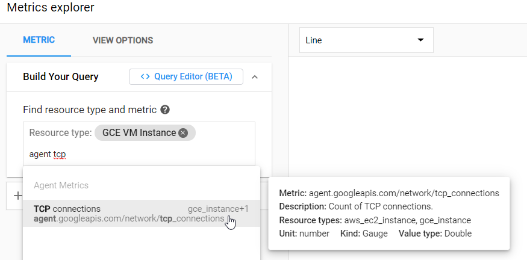

Only a few metrics are available by default on GKE nodes. You can deploy a Cloud Monitoring agent to expose additional metrics for added visibility into the health of your GKE nodes.

## Objectives

Expose additional host metrics using the Cloud Monitoring agent on GKE nodes.

Host metrics available by default:

* CPU usage
* Disk I/O
* Network traffic

Metrics added with the Cloud Monitoring agent:

* CPU load
* CPU steal
* Memory usage
* Swap usage
* Disk usage
* Open TCP connections
* Processes

For details about the metrics exposed by the Cloud Monitoring agent, see [Agent metrics](https://cloud.google.com/monitoring/api/metrics_agent).

Even more metrics can be added by customizing
[`collectd.conf`](https://github.com/GoogleCloudPlatform/community/blob/master/tutorials/gke-node-agent-metrics-cloud-monitoring/collectd.conf) to meet your
needs.

## Before you begin

1. Create a Google Cloud project and GKE cluster, as shown in [this quickstart tutorial](https://cloud.google.com/kubernetes-engine/docs/quickstart).
1. Install the [Google Cloud SDK](https://cloud.google.com/sdk/).
1. Clone this repository:

        git clone https://github.com/GoogleCloudPlatform/community.git

    The files for this tutorial are in the `/tutorials/gke-node-agent-metrics-cloud-monitoring` directory.

## Build the container iamge

1. Update `cloudbuild.yaml` by replacing the following values:

    * `[PROJECT_ID]` is your Google Cloud project ID.
    * `[IMAGE_NAME]` is the name of the container image.

1. Build the container image with Cloud Build:

        gcloud builds submit --config cloudbuild.yaml .

    When the build finishes, the image will be published to Container Registry.

## Deploy the daemonset

1. Update `agent.yaml` by replacing the following values:

    * `[PROJECT_ID]` is your Google Cloud project ID
    * `[IMAGE_NAME]` is the name of the container image that you used when building the container image.

1. Deploy:

        kubectl apply -f agent.yaml

1. Check that the daemonset deployed and is ready:

        kubectl get ds

    The output should be similar to:

        NAME           DESIRED   CURRENT   READY   UP-TO-DATE   AVAILABLE   NODE SELECTOR   AGE
        [IMAGE_NAME]   1         1         1       1            1           <none>          29s

    Where the name will be the name given to your container image.

## (optional) Customize the Cloud Monitoring agent

* Edit `collectd.conf` to expose additional metrics.
* Rebuild the container image and redeploy the daemonset. Add in any new dependencies that may be required for metric collection.

## Viewing the metrics

After deploying the daemonset, the additional metrics should begin to flow to Cloud Monitoring automatically. Click on the "Monitoring" link from the Google Cloud Console menu found in the top left corner of the interface. If this is the first time you've used Cloud Monitoring, it may take a few seconds to setup the workspace.

One way of examining metrics is using the Metrics Explorer, which is accessible from the side menu within Cloud Monitoring interface. Since the new metrics being collected are GKE node metrics, they will be visible for the GCE VM instance resource type with the metric names beginning with "agent.googleapis.com", as is shown in the image below from the Metrics Explorer.

Taking a more detailed look at the node itself within Cloud Monitoring, you will be able to see the additional metrics graphed within the VM instance dashboard agent tab. This view is accessible by clicking on "Dashboards" from the side menu, followed by "GCE VM Instances", and finally clicking the instance you're interested in viewing metrics for.

## Cleanup

1. Delete the daemonset:

        kubectl delete ds [IMAGE_NAME]

1. Delete the cluster you created from the *Before you begin* section:

        gcloud container clusters delete [CLUSTER_NAME]
