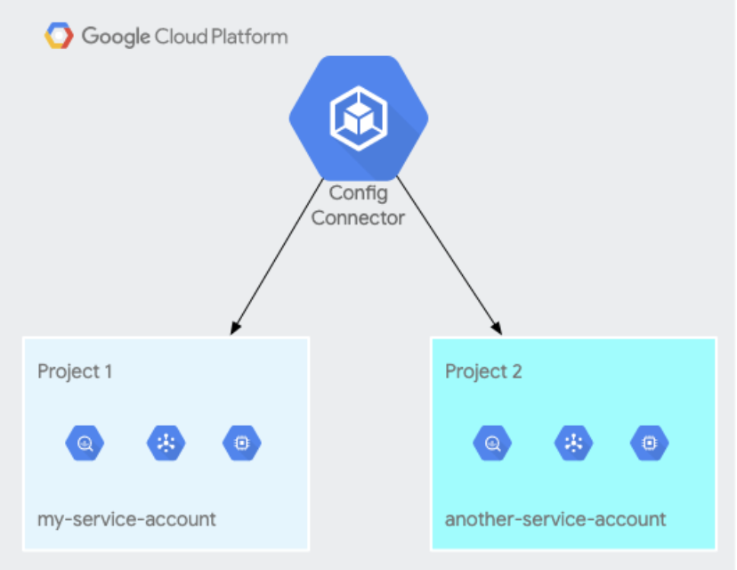

Nardos Megersa | Strategic Cloud Engineer | Google <br/>
Casey Tin | Cloud Technical Resident | Google

<p style="background-color:#CAFACA;"><i>Contributed by Google employees.</i></p>

This guide walks the reader through an end-to-end workflow of provisioning and managing Google Cloud resources using the following tools:

* [**Kubernetes Config Connector (KCC)**](https://cloud.google.com/config-connector/docs/overview): to manage Google Cloud infrastructure
* [**Config Sync**](https://cloud.google.com/kubernetes-engine/docs/add-on/config-sync/config-sync-overview): to synchronize declarative Config Connector infrastructure configurations from a Git repository
* [**OPA Gatekeeper**](https://github.com/open-policy-agent/gatekeeper): to create policies for GCP resources to ensure their compliance

**Although these tools are offered under the umbrella of Anthos Config Management for Anthos customers, they can be used independently.**

This style of managing resources is called GitOps and has several advantages:
* It allows for strict code reviews before changes are introduced to the live environment and leaves an audit trail to know exactly which commits caused a configuration change.
* Allows visibility into the resources running in live environment by just looking at a single source of truth that is the git repository
* Makes applying multiple configuration changes easy by simply committing code to a protected branch instead of writing scripts to run kubectl apply commands manually.
* Provides a strategy to roll back breaking changes and get the KCC cluster back into a good working state. After the resources are in a stable state users can then fix the problematic changes and apply these changes as new commits.
* Application developers may not be equipped to write complex IaC configurations and pipelines. With this approach they can simply use Git to modify and push changes. <br/><br/>


## Before you begin

This tutorial assumes that you already have a [Google Cloud account](https://console.cloud.google.com/freetrial). You should also ensure that the projects used in this tutorial are tied to a billing account, and that your `gcloud components` are updated to the latest version. <br/><br/>


## Objectives

You will use the following architecture as an example to:
* Install and set up Config Connector in namespaced mode 
* Install and set up the Config Sync operator
* Enforce constraint policies using OPA Gatekeeper

We will be implementing the following components:
* A source code repository where the infrastructure Kubernetes Config Connector manifest files will live
* A Google Kubernetes Engine cluster that will run Config Connector and Config Sync operators and OPA Gatekeeper
* Dev and prod namespaces for Config Connector resources
* Corresponding dev and prod Google Cloud Projects 

 <br/><br/>

## Config Connector

Kubernetes Config Connector (KCC) is a Kubernetes addon that allows users to manage Google Cloud infrastructure such as Cloud Storage, Cloud Pub/Sub or Cloud SQL through Kubernetes-style declarative APIs. Config Connector enables this by registering Custom Resource Definitions (CRDs) and controllers that actuate the desired declarative state into a series of API calls. This approach of managing infrastructure is ideal for the cloud-native teams who are familiar with Kubernetes tooling for deploying applications.

Follow the instructions below to install Config Connector in namespaced mode to allow the use of multiple service accounts that are bound to multiple Google Cloud projects as shown below in the diagram. This approach is recommended for users who want to manage resources in separate Google Cloud projects and securely isolate service accounts that manage the resources in each project.  



It is recommended that Config Connector is installed in a separate cluster inside a separate Google Cloud project which will be referred to as a Host Project. The other projects where resources are managed will be known as managed projects. 

This tutorial refers to the host project for Config Connector with the environment variable HOST_PROJECT_ID and two other projects that will be used as managed projects with variables DEV_PROJECT_ID and PROD_PROJECT_ID

1. Define the environment variables
```
export HOST_PROJECT_ID=<your-host-project-id>
export DEV_PROJECT_ID=<your-dev-project-id>
export PROD_PROJECT_ID=<your-prod-project-id>
export CLUSTER_NAME=kcc-host-cluster
export ZONE=us-east4-a
```

2. Enable the Kubernetes Engine API
```
gcloud services enable container.googleapis.com --project $HOST_PROJECT_ID
```

3. Create a Google Kubernetes Engine cluster in the host project that will serve as a host cluster for provisioning GCP resources
```
gcloud beta container clusters create ${CLUSTER_NAME} --project=$HOST_PROJECT_ID --zone=${ZONE} --machine-type=e2-standard-4 \
--workload-pool=${HOST_PROJECT_ID}.svc.id.goog
```

4. Get cluster credentials
```
gcloud container clusters get-credentials $CLUSTER_NAME --zone $ZONE --project $HOST_PROJECT_ID
```

5. Download the Kubernetes Config Connector operator file
```
gsutil cp gs://configconnector-operator/latest/release-bundle.tar.gz release-bundle.tar.gz
```

6. Extract the tar file
```
tar zxvf release-bundle.tar.gz
```

7. Install the operator
```
kubectl apply -f operator-system/configconnector-operator.yaml
```

8. Create a ConfigConnector configuration to run in namespaced mode
```
#configconnector.yaml

apiVersion: core.cnrm.cloud.google.com/v1beta1
kind: ConfigConnector
metadata:
  name: configconnector.core.cnrm.cloud.google.com
spec:
 mode: namespaced
```
```
kubectl apply -f configconnector.yaml
```
1.  Create dedicated Kubernetes namespaces for each environment where resources will live
```
kubectl create namespace kcc-tutorial-dev
kubectl create namespace kcc-tutorial-prod
```    
10. Annotate the namespaces so that resources are created in the correct GCP project
```
kubectl annotate namespace \
kcc-tutorial-dev cnrm.cloud.google.com/project-id=$DEV_PROJECT_ID

kubectl annotate namespace \
kcc-tutorial-prod cnrm.cloud.google.com/project-id=$PROD_PROJECT_ID
```
11. Create a dedicated IAM service account for each environment in the host project for workload identity and to be able to create resources in GCP.
```
gcloud iam service-accounts create kcc-tutorial-dev --project=$HOST_PROJECT_ID

gcloud iam service-accounts create kcc-tutorial-prod --project=$HOST_PROJECT_ID
``` 
12. Give the service accounts created above elevated permissions in their respective projects to be able to manage resources.
```
gcloud projects add-iam-policy-binding $DEV_PROJECT_ID \
--member="serviceAccount:kcc-tutorial-dev@${HOST_PROJECT_ID}.iam.gserviceaccount.com" --role="roles/editor" 

gcloud projects add-iam-policy-binding $PROD_PROJECT_ID \
--member="serviceAccount:kcc-tutorial-prod@${HOST_PROJECT_ID}.iam.gserviceaccount.com" --role="roles/editor"
```
13. Create binding between GCP service accounts and Kubernetes service accounts through Workload Identity for both dev and prod Kubernetes service accounts
```
gcloud iam service-accounts add-iam-policy-binding \
kcc-tutorial-dev@${HOST_PROJECT_ID}.iam.gserviceaccount.com \
--member="serviceAccount:${HOST_PROJECT_ID}.svc.id.goog[cnrm-system/cnrm-controller-manager-kcc-tutorial-dev]" \
    --role="roles/iam.workloadIdentityUser" \
    --project=$HOST_PROJECT_ID

gcloud iam service-accounts add-iam-policy-binding \
kcc-tutorial-prod@${HOST_PROJECT_ID}.iam.gserviceaccount.com \
--member="serviceAccount:${HOST_PROJECT_ID}.svc.id.goog[cnrm-system/cnrm-controller-manager-kcc-tutorial-prod]" \
    --role="roles/iam.workloadIdentityUser" \
    --project=${HOST_PROJECT_ID}
```
14. Give IAM service accounts permission to publish Prometheus metrics to GCP Cloud Operations
```
gcloud projects add-iam-policy-binding $HOST_PROJECT_ID \
--member="serviceAccount:kcc-tutorial-dev@${HOST_PROJECT_ID}.iam.gserviceaccount.com" --role="roles/monitoring.metricWriter"

gcloud projects add-iam-policy-binding $HOST_PROJECT_ID \
--member="serviceAccount:kcc-tutorial-prod@$HOST_PROJECT_ID.iam.gserviceaccount.com" --role="roles/monitoring.metricWriter"
```
15. Create Config Connector Context for both dev and prod namespaces to configure Config Connector to watch the namespaces where resources are being deployed to.
```
# configconnectorcontext.yaml
cat <<EOF > configconnectorcontext.yaml

apiVersion: core.cnrm.cloud.google.com/v1beta1
kind: ConfigConnectorContext
metadata:
  name: configconnectorcontext.core.cnrm.cloud.google.com
  namespace: kcc-tutorial-dev
spec:
  googleServiceAccount: "kcc-tutorial-dev@${HOST_PROJECT_ID}.iam.gserviceaccount.com"

---

apiVersion: core.cnrm.cloud.google.com/v1beta1
kind: ConfigConnectorContext
metadata:
  name: configconnectorcontext.core.cnrm.cloud.google.com
  namespace: kcc-tutorial-prod
spec:
  googleServiceAccount: "kcc-tutorial-prod@${HOST_PROJECT_ID}.iam.gserviceaccount.com"
```
```
kubectl apply -f configconnectorcontext.yaml
```

16. Verify that Config Connector pods are running
```
kubectl wait -n cnrm-system --for=condition=Ready pod --all
```

Optionally, you can verify Config Connector is set up correctly by deploying a GCP resource (e.g Cloud Storage). <br /><br />

## Config Sync

Config Sync is a Kubernetes operator that allows managing of Kubernetes resources in a GitOps approach where the configurations are stored in the git repository and automatically pulled by the operator to be applied. The Config Sync operator custom controller monitors the Git repository and the state of the clusters, keeping them consistent for each Kubernetes object chosen. By default, Config Sync applies a configuration to each enrolled cluster and namespaces. However this scope can be limited using the ClusterSelector and NamespaceSelector configurations.

Follow the instructions below to manually install the Config Connector operator.  

1. Download the config sync operator yaml file
```
gsutil cp gs://config-management-release/released/latest/config-sync-operator.yaml config-sync-operator.yaml
```
2. Install the operator on the Config Sync cluster created previously
```
kubectl apply -f config-sync-operator.yaml
```
3. [Create a SSH key pair]("https://docs.github.com/en/github/authenticating-to-github/connecting-to-github-with-ssh/generating-a-new-ssh-key-and-adding-it-to-the-ssh-agent") and copy the file path to the private key

4. Create a Kubernetes secret in to store the private key for GitHub
```
kubectl create secret generic git-creds \
 --namespace=config-management-system \
 --from-file=ssh=</path/to/KEYPAIR_PRIVATE_KEY_FILENAME>
```
Note: After the Kubernetes secret is created make sure to delete the private key from the local disk or store it in a safe location

5. Add the SSH public key to the version control system you’re using. The process will depend on the version control system being used (e.g GitHub or GitLab)

6. Configure the operator by passing values for the repository information
```
# config-management.yaml

apiVersion: configmanagement.gke.io/v1
kind: ConfigManagement
metadata:
  name: config-management
spec:
  clusterName: kcc-host-cluster
  git:
    syncRepo: <GIT_REPOSITORY_URL>
    syncBranch: <BRANCH>
    secretType: ssh
    policyDir: <DIRECTORY>
```
Apply the configuration file
```
kubectl apply -f config-management.yaml
```
8. On your local machine, [install the nomos command line tool](https://cloud.google.com/kubernetes-engine/docs/add-on/config-sync/how-to/nomos-command#installing). This tool will allow users to interact with the Config Sync operator for checking syntax, initializing the directory structure and debugging any problems with the operator or cluster.  

9. Initialize a new Config Sync repo directory structure
```
nomos init
```

10. In the `namespaces` directory, create two sub-directories named `kcc-tutorial-dev` and `kcc-tutorial-prod`. These directory names must match the namespaces created in step 10 of the Config Connector set up.

11. Create configuration files for namespaces in `kcc-tutorial-dev` and `kcc-tutorial-prod`. Even though the namespaces are already created during the Config Connector set up, by creating namespace configuration in these directories, it will let Config Sync know that this is a namespace directory as opposed to an abstract namespace directory.
```
#namespaces/kcc-tutorial-dev/namespace.yaml

apiVersion: v1
kind: Namespace
metadata:
  name: kcc-tutorial-dev


#kcc-tutorial-prod/namespace.yaml

apiVersion: v1
kind: Namespace
metadata:
  name: kcc-tutorial-prod
```

12. Create GCP resources in the corresponding environment. For this example, you will create a Cloud SQL instance in the dev workspace. 
```
# namespaces/kcc-tutorial-dev/cloudsql.yaml

apiVersion: sql.cnrm.cloud.google.com/v1beta1
kind: SQLInstance
metadata:
  name: mysqlinstance-test
spec:
  databaseVersion: MYSQL_5_7
  region: us-east4
  settings:
    tier: db-f1-micro
```

13. Commit and push the code to the repository. This will trigger the Config Sync operator to pick up the changes and create the Kubernetes objects in the appropriate `kcc-tutorial-dev` namespace. Config Connector will then take the configuration and create a Cloud SQL instance in your GCP dev project. <br /><br />

## Policy Enforcement
