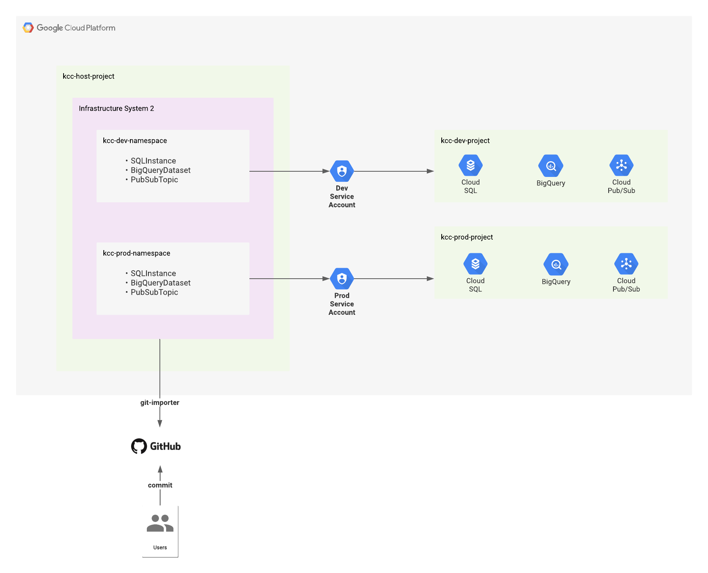

Nardos Megersa | Stratigic Cloud Engineer | Google

<i>Contributed by Google employees.</i>

This tutorial demonstrates the an end-to-end workflow of provisioning and managing Google Cloud resources using the following tools:

* **Kubernetes Config Connector(KCC)**: to manage Google Cloud infrastructure
* **Config Sync**: to synchronize declarative config connector infrastructure configurations from a Git repository
* **OPA Gatekeeper**: to create policies for GCP resources to ensure their compliance

**Although these tools are offered under the umbrella of Anthos Config Management for Anthos customers, they can be used independently.**

## Before you begin

This tutorial assumes that you already have a [Google Cloud account](https://console.cloud.google.com/freetrial).

## Objectives

You will use the following architecture as an example to:
* Install and set up Config Connector in namespaced mode 
* Install and set up the Config Sync operator
* Enforce constraint policies using OPA Gatekeeper

* A source code repository where the infrastructure Kubernetes Config Connector manifest files will live
* A Google Kubernetes Engine cluster that will run Config Connector and Config Sync operators and OPA Gatekeeper
* Dev and prod namespaces for Config Connector resources
* Corresponding dev and prod Google Cloud Projects 

