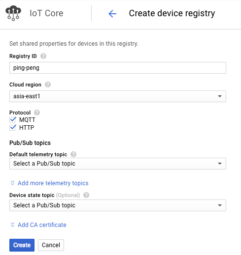
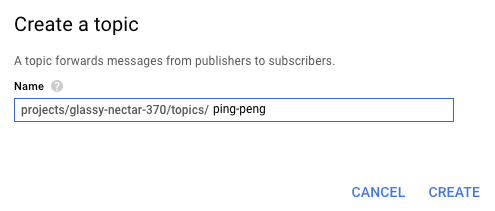

# Device to device demo

This example Google Cloud Function will relay all messages sent from a given
device to another device.

# Setup

## Create a Cloud IoT Core device registry



If you haven't created a PubSub topic that you want to use for telemetry,
create a new topic:



This topic will be used for your Google Cloud Function trigger.

# Deploying the Google Cloud Function

After you have a Google Cloud Device registry with associated PubSub topic,
you're ready to deploy the Cloud Function. The following syntax summarizes how
you can deploy the exported function, relayCloudIot, to Google Cloud Functions:

```
    gcloud functions deploy relayCloudIot \
        --runtime nodejs8 \
        --stage-bucket=gs://your-gcs-bucket \
        --trigger-topic=your-topic-id
```

The following example deploys this function for the `prep-gcp-home` GCS bucket
and `ping-peng` PubSub topic:

```
    gcloud functions deploy relayCloudIot \
        --runtime nodejs8 \
        --stage-bucket=gs://prep-gcp-home --trigger-topic=ping-peng
```

Now, Google Cloud Functions will forward device communcation using fields that
are passed from device telemetry messages.
