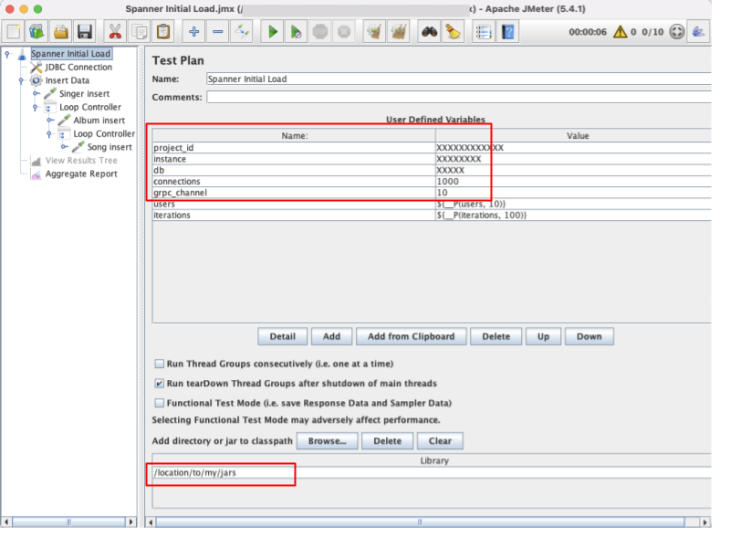
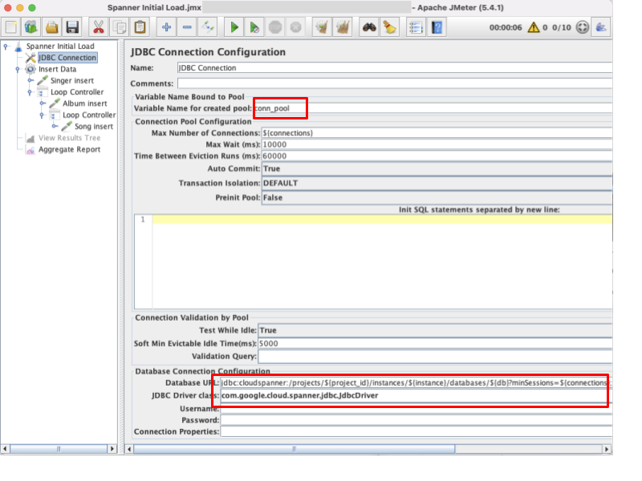
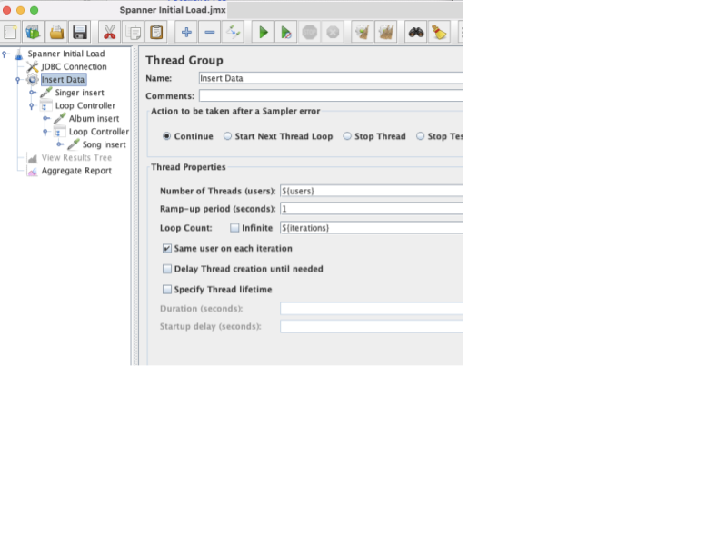
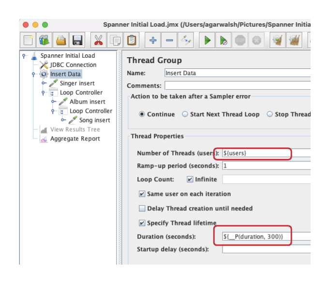
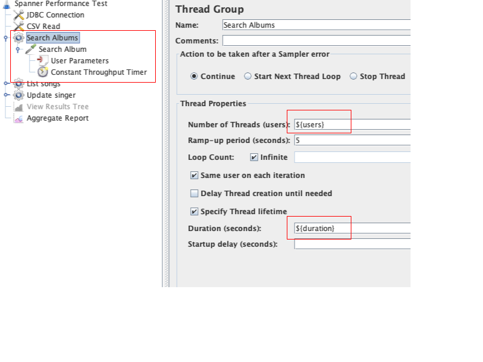
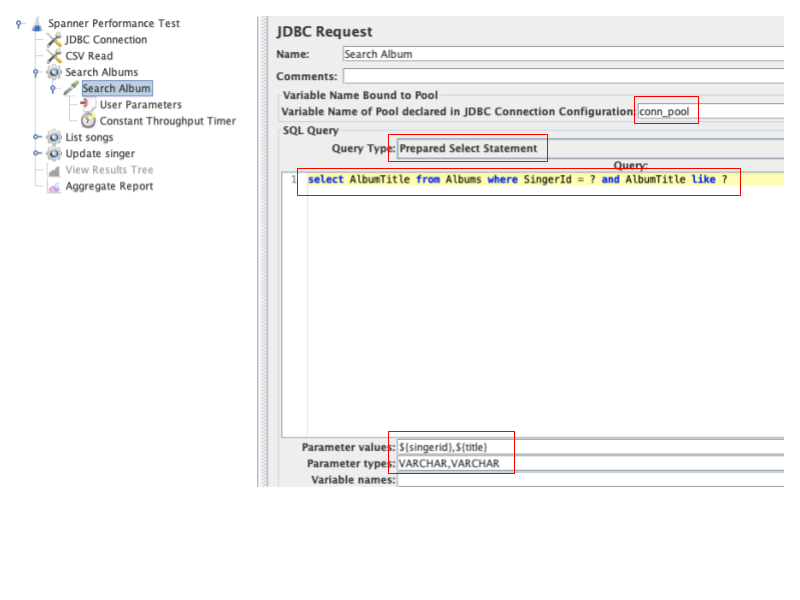
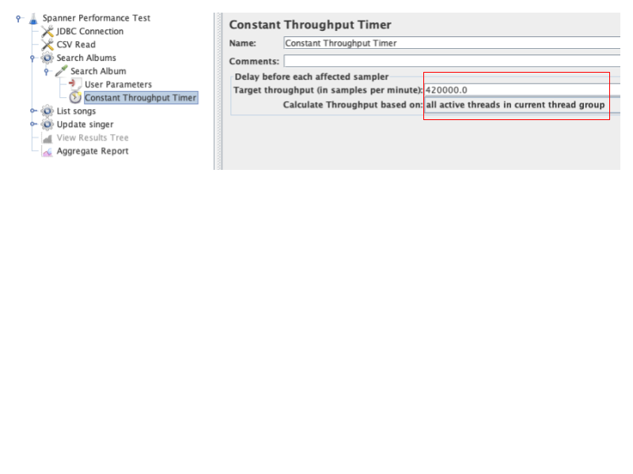
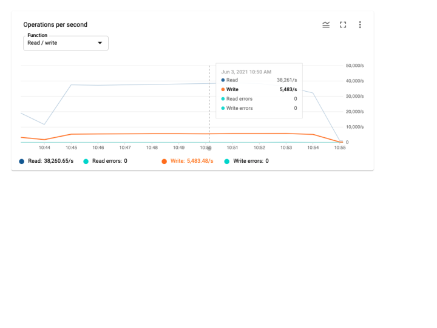
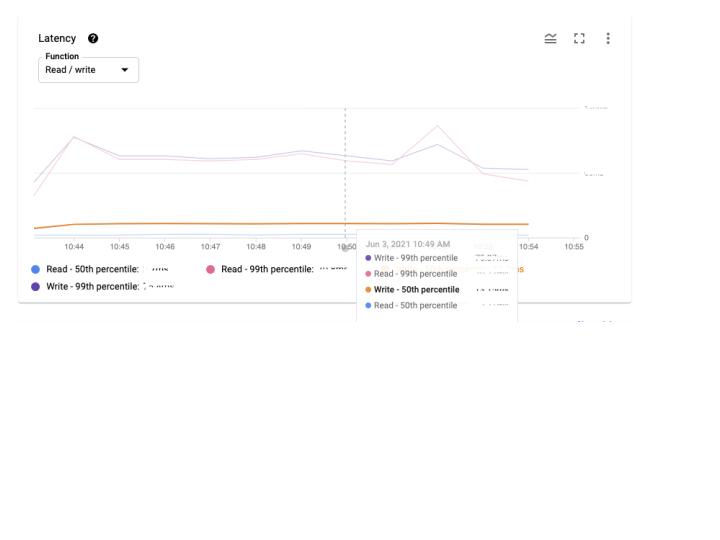
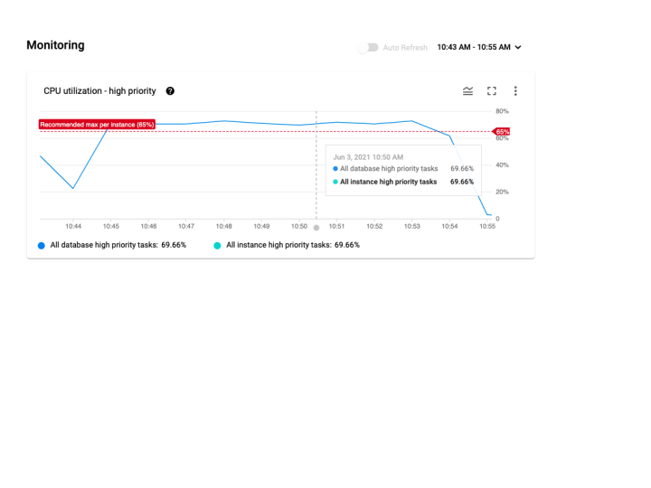

Shashank Agarwal, Ravinder Lota, Chritoph Bussler | Google Cloud Engineer(s) | Google

<i>Contributed by Google employees.</i>

Cloud Spanner is a fully managed, horizontally scalable, transactional and SQL compliant database as service. For more
key features read [here](https://cloud.google.com/spanner#section-2). However in order to evaluate Cloud Spanner’s cost
and latency, you might want to run performance tests before you start migration.

In this tutorial we do performance testing Cloud Spanner **before making application code changes and executing data
migration**.  
[Apache JMeter(TM)](https://jmeter.apache.org/) is a popular open source tool for load testing. It includes scriptable
Samplers in JSR223-compatible languages like Groovy and BeanShell. Using JDBC Sampler which can trigger queries and/or
simulate transactions on database(s). The core idea is to use JMeter as an application which is sending DML to the
database, thus performance testing it.

## Costs

This guide uses billable components of Google Cloud, including the following:

* Compute Engine (for running JMeter)
* Cloud Spanner

Use the [pricing calculator](https://cloud.google.com/products/calculator) to generate a cost estimate based on your
projected usage.

## Objectives

* Determine if Cloud Spanner is suitable for **an existing workload, before application code changes.**
* Enable you to write a performance test on Cloud Spanner using JMeter, for your workload. No generic performance
  benchmarks are discussed in this guide.
* Estimate the number of Cloud Spanner nodes needed (and therefore cost).
* Performance test the most frequent set of queries and transactions.
* Demonstrate the ability to scale horizontally.
* Better understand the optimizations needed for schema and sql queries.
* Determine latency of select, insert, update and delete with Cloud Spanner.

### Use Cases

Below are some possible use cases for doing JMeter based performance tests:

* You want to consolidate current multi-sharded RDBMS into Cloud Spanner.
* You have a spikey workload and you need an elastic database.
* You want to standardize on Cloud Spanner for different applications.

### Limitations

* You cannot test non-jdbc Cloud Spanner client side libraries (like python, r2dbc etc). Although you can bypass the
  client library using underlying [gRPC](https://cloud.google.com/spanner/docs/reference/rpc)
  or [REST](https://cloud.google.com/spanner/docs/reference/rest) apis, that is out of scope for this guide.
* You should not bypass application based performance tests later.
* You cannot test non-dml features like [mutations](https://cloud.google.com/spanner/docs/modify-mutation-api)
  , [parallel reads](https://cloud.google.com/spanner/docs/reads#read_data_in_parallel) (aka partitioned selects) etc
  using JDBC Sampler. In such a case you
  can [embed custom java code](https://stackoverflow.com/questions/21266923/using-a-jmeter-jdbc-connection-in-java-code)
  using JSR223 Sampler, that is out of scope for this guide.

This guide will demonstrate JMeter performance tests using an example Cloud Spanner schema.

## 1.1. What do you want to understand about Cloud Spanner performance?

Performance tests are executed to understand application behaviour with Spanner for speed, scalability and stability.
Following factors need to be considered to design and execute a test that can answer your specific questions.

### 1.1.1. Transactions per second (TPS)

TPS metrics should be based on your application workload requirements, mostly to support the peak load. example - 7K
reads/sec, 4K inserts/sec, 2K updates/sec, etc.  (overall TPS 13K/sec)

### 1.1.2. Query latency

Expected response time for different DMLs needs to be established as a success criteria. This can be either based on
your business SLAs or current DB response time in case of an existing application.

### 1.1.3. Sizing - Number of nodes

Sizing of the Spanner cluster depends on the data volume, TPS and latency requirements of application workload. In
addition, [CPU utilization](https://cloud.google.com/spanner/docs/cpu-utilization)
is another important factor to decide the optimal number of nodes. You can increase or decrease the initial cluster size
in order to maintain the recommended 45% CPU utilization for multi-region and 65% for regional deployment.

### 1.1.4. Test Cloud Spanner Autoscaler

[Cloud Spanner Autoscaler](https://github.com/cloudspannerecosystem/autoscaler) is a solution to elastically scalable
Cloud Spanner. Simulate spikey workload via JMeter tests in order to tune autoscaling scaling parameters.

# 2. Preparing for tests

Developing performance tests takes time and effort, hence planning ahead of time is important. Before you begin writing
tests following preparation needs to be made:

1. Identify top SQL queries, latency, frequency / hour and avg number of rows returned or updated for each. This
   information will also serve as a BASELINE for the current system.
3. Determine Cloud Spanner region / multi-region deployment. Ideally, load should be generated from Cloud Spanner’s
   leader region for minimum latency and best performance.
   Read [Demystifying Cloud Spanner multi-region configurations](https://cloud.google.com/blog/topics/developers-practitioners/demystifying-cloud-spanner-multi-region-configurations)
   for more details on various configurations of Cloud Spanner.
4. Guestimate range of Cloud Spanner nodes required for a given workload based on (step 1). It is recommended to have a
   minimum of 2 nodes for linear scaling.
   **Note**: Peak performance numbers
   of [regional performance](https://cloud.google.com/spanner/docs/instances#regional-performance)
   and [multi regional performance](https://cloud.google.com/spanner/docs/instances#multi-region-performance) are
   published. However it is based on a 1KB single row transaction with no secondary indexes.
4. [Request quota](https://cloud.google.com/spanner/quotas#increasing_your_quotas) - Request enough surplus quota for
   Cloud Spanner nodes on a given region / multi-region. It can take up to 1 business day. Although it depends on
   workload, asking for 100 nodes quota for a performance test can be reasonable.

# 3. Creating Cloud Spanner schema

Assuming you are migrating an existing application from a common RDBMS database(s) like MySQL, Postgresql, SQL Server or
Oracle etc. You will need to keep in
mind [schema design best practices](https://cloud.google.com/spanner/docs/schema-design) when modeling your schema.

Below is list of common items which you should keep in mind, but it not an exhaustive list:

1. Cloud Spanner needs primary keys to be generated from the application layer. Also, monotonically increasing PKs will
   introduce [hotspots](https://cloud.google.com/spanner/docs/schema-design#primary-key-prevent-hotspots).
   Hence, [using a UUID](https://cloud.google.com/spanner/docs/schema-design#uuid_primary_key) could be a fair
   alternative.
2. Use an interleaved table to improve performance where most (ex 90%+) of the access is using join to the parent
   table.   
   *Note: Interleaving must be created from the start. You cannot change table interleaving once the tables have been
   created*
3. Secondary indexes on monotonically increasing values may introduce hotspots. (ex: index on timestamp).
4. Secondary indexes can
   utilize [storing clauses](https://cloud.google.com/spanner/docs/secondary-indexes#storing-clause)
   to improve performance of certain queries.
5. Use STRING datatype if you need to have a
   [precision higher than NUMERIC](https://cloud.google.com/spanner/docs/storing-numeric-data#recommendation_store_arbitrary_precision_numbers_as_strings)
   data type.

For this guide I'm going to create database Singers with the schema as below.

    CREATE TABLE Singers (
      SingerId   STRING(36) NOT NULL,
      FirstName  STRING(1024),
      LastName   STRING(1024),
      SingerInfo BYTES(MAX),
    ) PRIMARY KEY (SingerId);
    
    CREATE TABLE Albums (
      SingerId     STRING(36) NOT NULL,
      AlbumId      STRING(36) NOT NULL,
      AlbumTitle   STRING(MAX),
    ) PRIMARY KEY (SingerId, AlbumId),
      INTERLEAVE IN PARENT Singers ON DELETE CASCADE;
    
    CREATE TABLE Songs (
      SingerId     STRING(36) NOT NULL,
      AlbumId      STRING(36) NOT NULL,
      TrackId      STRING(36) NOT NULL,
      SongName     STRING(MAX),
    ) PRIMARY KEY (SingerId, AlbumId, TrackId),
      INTERLEAVE IN PARENT Albums ON DELETE CASCADE;

# 4. Setup JMeter

JMeter provides a GUI for easy development of tests. Once tests are developed you should use the command line to execute
JMeter tests. You may create a VM (in the same region as Cloud Spanner’s Leader) with GUI enabled. Therefore the same VM
instance can be used for development and execution of tests.

**NOTE: You can use a local workstation for test development too. But, DO NOT use a local workstation for execution of
performance tests, due to potential network latency.**

## 4.1. Installation

1. Download and install [JMeter](https://jmeter.apache.org/download_jmeter.cgi) 5.3+ (and Java8+).
2. Install [maven](https://maven.apache.org/install.html) used to download Cloud Spanner client libraries.
3. Open terminal / command prompt and change directory (cd) to an empty directory, where you will keep JMeter
   dependencies.
4. Download Cloud Spanner JDBC library and dependencies using maven command as below.

   mvn dependency:get -Dartifact=com.google.cloud:google-cloud-spanner-jdbc:RELEASE -Dmaven.repo.local=.

5. Move (or Copy) all the downloaded jars into one single folder for JMeter to load in its classpath.

Sample linux command:

    find . -name *.jar -exec mv '{}' . \;

Sample windows command:

    for /r /Y %x in (*.jar) do copy "%x" .\

## 4.2. Setup authentication for JMeter

JMeter uses Cloud Spanner JDBC Client libraries to connect. It
supports [various authentication mechanisms](https://github.com/googleapis/google-cloud-java#authentication) including
service accounts etc. In this example we are going to use application default credentials to keep it simple. Detailed
steps are described [here](https://cloud.google.com/spanner/docs/getting-started/set-up).

In summary, you need to set up gcloud and execute the below command to store credentials locally.

    gcloud auth application-default login

# 5. JMeter basics

JMeter is a highly configurable tool and has various components to pick and choose. So in this section we try to provide
a basic overview of how to create a Jmeter test along with some minimal configurations you can use as a base for your
own tests.

## 5.1 JMeter test plan

JMeter has a hierarchical structure to the tests with a top node
called [test plan](https://jmeter.apache.org/usermanual/test_plan.html). It consists of one or more thread groups, logic
controllers, sample generating controllers, listeners, timers, assertions, and configuration elements. Since a Test Plan
is the top level configuration element, saving a Test Plan to disk will also save all nested objects and the resulting
file is saved with a .jmx file extension.

For simplicity, it's sufficient to have the top level Test Plan contain a single Thread Group, which in turn contains
one or more Samplers. There can be multiple Samplers (and other components) within a thread group, each will get
executed serially per thread.

Test plan (and/or Thread group) can also have config elements such as JDBC Connection, CSV Data Reader etc. Configs can
then be shared with child nodes.

>>>>>  gd2md-html alert: undefined internal link (link text: "Sample test plan link"). Did you generate a TOC?  (<a href="#">Back to top</a>)(<a href="#gdcalert2">Next alert</a>) >>>>> 

[Sample test plan link](#heading=h.v1r2n2peezpu)

## 5.2.  Configuring connection parameters

Within each JMeter test (screenshot below) you will need to provide connection parameters which will be used by the JDBC
library to connect to Cloud Spanner (next).

Following properties should be updated:

* project_id: GCP Project ID
* instance: Cloud Spanner Instance ID
* db: Cloud Spanner database Name
* connections: Cloud Spanner [sessions](https://cloud.google.com/spanner/docs/sessions). Ensure you should have 1
  session per thread (users * thread groups).
* grpc_channel: There can be a maximum of 100 sessions per grpc channel.

Following may not need to be changed. It will be passed from the command line. While default values shall be used when
tested from jmeter gui.

* users: Number of parallel threads per thread group, increasing stress on target.
* iterations: Number of times each thread should loop, extending duration of tests.

## 5.3. JDBC Connection Configuration

Above parameters will be utilized in JDBC Connection Configuration.  
Check complete list of jdbs properties 
[here](https://javadoc.io/doc/com.google.cloud/google-cloud-spanner-jdbc/latest/com/google/cloud/spanner/jdbc/JdbcDriver.html)

Connection pool variable name (conn_pool) will be used by JDBC Samplers to obtain connection and JDBC Connection URL as below:

    jdbc:cloudspanner:/projects/${project_id}/instances/${instance}/databases/${db}?minSessions=${connections};maxSessions=${connections};numChannels=${grpc_channel}

Also there can
be [additional configurations](https://cloud.google.com/spanner/docs/use-oss-jdbc#session_management_statements) such as
Read Only or Staleness etc which can be configured as needed.

## 5.4. Thread Groups

A Thread group represents a group of users, and the number of threads you assign a thread group is equivalent to the
number of users that you want querying Cloud Spanner. Example thread group configuration as below.

In case you want a thread group to execute for a given time duration, then you can change it as shown in screenshot
below. Where duration can be supplied as command line value with default of 5 mins.

## 5.5. JDBC Request Sampler

Using JDBC Sampler you can fire SQL Queries. Using Prepared Select or Prepared Update is recommended as it
is [more performant](https://cloud.google.com/spanner/docs/sql-best-practices#query-parameters) on Cloud Spanner.

## 5.6 Listeners

You can add an aggregate report (or other types of reports) after all the thread groups. This will show stats from
JMeter gui in real time for all the samplers. However, running performance tests in gui mode is not recommended as
JMeter gui can be slow. Hence, use it for test development purposes.

It is recommended to execute tests command line mode which generates html reports with the different JMeter reports.
More on this later.

# 6. Loading initial data into Cloud Spanner

Before you start doing performance tests, you will need to initialize the database with seed data. It is recommended to
load the volume of rows in each table, representative of current production data size.

Typically you can use dataflow jobs
for [Importing data from non-Cloud Spanner databases](https://cloud.google.com/spanner/docs/import-non-spanner)

However, sometimes you cannot do that because of schema changes with Cloud Spanner. Therefore an alternative could be to
mock seed data using JMeter.

**How much data should I load?**

Data loading prepares Cloud Spanner to create splits (shards) and distribute different nodes as leaders for each split.
More details about database splits
is [here](https://cloud.google.com/spanner/docs/schema-and-data-model#database-splits).

Volume of data depends on the SQL queries you want to do performance tests. Main focus is to load those tables which
will be used by read or write queries. Ideally it should be similar in volume as production data. In addition data might
need to be massaged to fit into potentially modified Cloud Spanner schema.

**How to reset my tests ?**

Ideally you should reset your database to the same seed data for comparison between multiple test executions. You can
use backup/restore (or export/import)  to initialize each run to the same initial dataset. The latter is better if
different configurations are tested.

## 6.1. Using JMeter to mock seed data

Sometimes it is non trivial to import existing data into Cloud Spanner due to various reasons like data massaging,
operations difficulties. Hence, mock data can be generated by writing insert queries in JMeter.

Below is an example Spanner-Initial-Load.jmx used to load sample schema. You will need to update 
[connection parameters](#connection) as discussed previously.

### [Spanner-Initial-Load.jmx](Spanner-Initial-Load.jmx)

The above test will generate random data hierarchically into Singer, Album and Song tables. Each Singer will get a
random number of Albums between 0-20. Similarly, 0-15 Songs per Album will get generated. Parallel threads (aka users)
will be used to insert data concurrently.

Executing the above jmeter test can be done using the command as below. Please make sure to update the connection
parameters and jdbc library path.

    jmeter -n -t Spanner-Initial-Load.jmx -l load-out.csv -Jusers=1000 -Jiterations=1000

**Note**: Watchout for [cpu utilization](https://cloud.google.com/spanner/docs/cpu-utilization#recommended-max) of Cloud
Spanner. Increase the number of nodes and jmeter’s parallel threads (users) to increase data generation rate. Increase
iterations count to longer execution time.  

Initial load should be done with randomly generated keys. Using monotonically increasing keys will lead to write 
hotspotting and cause a lengthy delay in populating the database.

# 7. Developing performance tests

Guidelines to develop performance tests:

1. Target to configure performance tests such that it generates transactions per second (TPS) similar to current
   database (baseline). Later in the execution phase, increase the number of users (load) to simulate scaling.
2. Prefer to have only one transaction per thread group. This will allow you to throttle load for that transaction
   independent of other transactions. A transaction could be composed of single or multiple sql queries. \
   For example, it is fine to have just a single select/insert/update query in a thread group. if that compares evenly
   with a transaction in your current database (baseline).
3. Determine the transactions per second (TPS) in the current database (baseline) for each DML operation and throttle
   load accordingly. In other words, sometimes even with one user in the thread group, there is far higher TPS than
   baseline. If so, then use [timers](https://jmeter.apache.org/usermanual/component_reference.html#timers) to introduce
   delay, as needed to tone down the TPS close to baseline.
4. Use [parameterized queries](https://cloud.google.com/spanner/docs/sql-best-practices#query-parameters) for better
   performance.
5. [Tune SQL Queries](https://cloud.google.com/spanner/docs/query-syntax) by adding relevant hints as needed.
    1. Cloud Spanner’s GCP Console UI can lead to longer query execution time, especially when result size is large.
       Therefore you can use [gcloud](https://cloud.google.com/sdk/gcloud/reference/spanner/databases/execute-sql)
       or [Spanner CLI](https://github.com/cloudspannerecosystem/spanner-cli) as alternatives to time sql queries
       accurately.
    2. Use [query execution plans](https://cloud.google.com/spanner/docs/query-execution-plans) to identify query
       bottlenecks and tune them accordingly.
    3. [Add indexes](https://cloud.google.com/spanner/docs/secondary-indexes) as needed to improve performance of select
       queries.
    4. Use [FORCE_INDEX hint](https://cloud.google.com/spanner/docs/query-syntax#table-hints) for all queries as it can
       take upto a few days before the query optimizer starts to automatically utilize the new index.
    5. Use GROUPBY_SCAN_OPTIMIZATION to make queries with GROUP BY faster.
    6. Use [join hints](https://cloud.google.com/spanner/docs/query-syntax#join-hints) to optimize join performance, as
       needed.
6. If needed, export query parameter values into a csv. Then
   use [csv config](https://jmeter.apache.org/usermanual/component_reference.html#CSV_Data_Set_Config) in JMeter to
   supply parameters from the csv file.

## 7.1. Sample JMeter Test for Singers schema

Let us assume the following baseline needs to be performance tested.

| Sno | Transactions | Baseline TPS |
| --- | ------------ | ------------ |
| 1. | select AlbumTitle from Albums where SingerId = ? and AlbumTitle like ? | 7000 |
| 2. | select SingerId, AlbumId, TrackId, SongName from Songs where SingerId = ? and AlbumId = ? order by SongName | 5000 |
| 3. | update Singers set SingerInfo = ? where SingerId = ? | 1000 |

Below is the Sample JMeter test to simulate the above load. You will need to update 
[connection parameters](#connection) as discussed previously.

### [Spanner-Perf-Test.jmx](Spanner-Perf-Test.jmx)

Note: It uses a csv config to get SingerId and AlbumId parameters, example top few lines as below.

    "singerid","albumid"
    "0002aad0-30e9-4eae-b1a0-952ebec9de76","328e1b6f-a449-42d1-bc8b-3d6ba2615d2f"
    "0002aad0-30e9-4eae-b1a0-952ebec9de76","43b1011e-d40d-480b-96a2-247636fc7c96"
    "0002aad0-30e9-4eae-b1a0-952ebec9de76","5c64c8f2-0fad-4fe7-9c3a-6e5925e3cbcd"

Above csv can be created using a sql query such as below. This is to randomly select data from the album table.

    SELECT SingerId,AlbumId FROM Albums TABLESAMPLE BERNOULLI (0.1 PERCENT) limit 10000;

Let's take a brief walkthrough of the test. As the below screenshot shows, there are three thread groups with the
transaction as defined previously.

The CSV Read' config reads data from a csv file which is being used in all the three thread groups. Since all the three
thread groups are very similar we will take a look at Search Albums.

It is configured to use users and duration parameters which can be passed by command line (if not then defaults will be
used). It contains one JDBC Sampler Search Album which depends on User Parameters and Timer.

Search Album jdbc sampler as above triggers sql query as screenshot above. It populates query parameters using 
variable(s) as below:

`${singerid} -- obtained from CSV Read`  
`${title} -- obtained from User Parameters`

Finally a timer is configured to throttle load to meet the requirement. It need to be supplied with transactions 
**per minute**, therefore 7K (TPS) * 60 = 420,000 (TPM)

# 8. Executing performance test

Guidelines for executing the tests, for best results:

1. Execute tests from the same Cloud Spanner region for a regional spanner and “leader” region for multi-region Cloud
   Spanner instances.
2. It is recommended to execute JMeter tests from command line / non-gui mode.
3. Run each test at least 3 times to even out random differences.
4. Warm up Cloud Spanner before running tests (as in production).
5. It is recommended to execute tests for long enough such that TPS is stable. It depends on the workload, for example
   having at least a 15 min test can ensure that enough ramp up time is available.
6. Scaling Cloud Spanner can take some time to stabilize. It is recommended to generate load on Cloud Spanner for faster
   stabilization.
7. Ensure that client machine running jmeter should have enough resources and is not maxing out. JMeter is a CPU
   intensive process.
8. Increase
   JMeter’s [jvm heap size](https://www.blazemeter.com/blog/9-easy-solutions-jmeter-load-test-%E2%80%9Cout-memory%E2%80%9D-failure)
   , if needed.
9. It is recommended to run multiple jmeter instances in parallel and/or
   use [remote testing](https://jmeter.apache.org/usermanual/remote-test.html) for horizontal scaling of JMeter. Often a
   single instance of JMeter is not able to produce enough load on a multi-node Cloud Spanner instance.
10. Ensure Cloud Spanner is not more
    than [recommended CPU threshold](https://cloud.google.com/spanner/docs/cpu-utilization#recommended-max), i.e.
    &lt;65% for regional and &lt;45% for multi regional.
11. Plan for long running tests (2 hours or more) to verify sustained performance. This is because Cloud Spanner can
    start [system tasks](https://cloud.google.com/spanner/docs/cpu-utilization#task-priority) which may have performance
    impact.

## 8.1. Sample test execution

For executing the test developed in the previous section, the following command needs to be executed. Number of users
and duration can be passed using the command line as needed.

    jmeter -n -t Spanner-Perf-Test.jmx -l test-out.csv -Jusers=100 -Jduration=900

[Optional] Once execution is complete it will generate a test-out.csv file with raw stats. If you want, you can execute
the below command
to [create a JMeter report from it](https://jmeter.apache.org/usermanual/generating-dashboard.html#report_only).

    jmeter -g test-out.csv -o <Path to output folder>

# 9. Collecting the performance test results

You will need to gather performance metrics after the test execution.

1. Validate that the test ran as per the requirements defined earlier in section 1.1 TPS and latency metrics will help
   identify optimization opportunities for query tuning and cluster sizing.
2. Compare results with the success criteria defined in section 1.1.

We suggest capturing these performance metrics from Spanner monitoring rather than JMeter report. JMeter provides this
information with added latency for each query execution depending on how busy the VM has been. Therefore it will not be
the true measure of Spanner response time.

Based on the success criteria we will be mostly interested in

1. Operations/sec (read/write).
2. Latency at 50th and 99th percentile for different types of operations.
3. CPU utilization

Spanner monitoring dashboard provides this information at minute level aggregate.  
For custom dashboards or metrics that are not available in standard dashboards you can
use [metrics explorer](https://cloud.google.com/spanner/docs/monitoring-cloud#create-charts).

**Operations/sec:**

Spanner dashboard provides information about the read & write operations executing on the spanner instance.
For example, the following chart shows a total TPS of 43744 per second for the selected duration.

**Latency:**

An example of read and write operations latency at 50th and 99th percentile is captured in the following chart.  
**Note:** You can also get **95th percentile** latency from [Cloud Monitoring](https://cloud.google.com/spanner/docs/monitoring-cloud)

*Latency metrics have been redacted in above screen shot.*

In addition you can use [introspection tools](https://cloud.google.com/spanner/docs/introspection) to investigate issues
with your database. Use query statistics to know which queries are expensive, run frequently or scan a lot of data. Read
statistics and Transaction statistics to investigate the most common and most resource-consuming read and writes.

Sometimes writes can be competing and can result in higher latency. You can check
the [lock statistics](https://cloud.google.com/spanner/docs/introspection/lock-statistics) to get clarity on wait time
and higher latency and
apply [best practice](https://cloud.google.com/spanner/docs/introspection/lock-statistics#applying_best_practices_to_reduce_lock_contention)
to reduce the lock time.

**CPU utilization:**

This metric is important to understand the CPU utilization throughout the test duration and provides information whether
the cluster is under-utilized or over-utilized.

This information can be used to further optimize the cluster size. More details on how to investigate high CPU
utilization can be found [here](https://cloud.google.com/spanner/docs/introspection/investigate-cpu-utilization).

## Cleaning up

To avoid incurring charges to your Google Cloud account for the resources used in this tutorial, you can delete the project:

1.  In the Cloud Console, go to the [Projects page](https://console.cloud.google.com/iam-admin/projects).
2.  In the project list, select the project that you want to delete and click **Delete**.
3.  In the dialog, type the project ID, and then click **Shut down** to delete the project.

## What's next
- [Cloud Spanner Schema and data model](https://cloud.google.com/spanner/docs/schema-and-data-model)
- [Schema design best practices](https://cloud.google.com/spanner/docs/schema-design)
- [Demystifying Cloud Spanner multi-region configurations](https://cloud.google.com/blog/topics/developers-practitioners/demystifying-cloud-spanner-multi-region-configurations)
- [Introspection Tools](https://cloud.google.com/spanner/docs/introspection)
- [Handling auto-incrementing keys data migration](https://cloud.google.com/community/tutorials/db-migration-spanner-handle-increasing-pks).
- Try out other Google Cloud features for yourself. Have a look at our [tutorials](https://cloud.google.com/docs/tutorials).