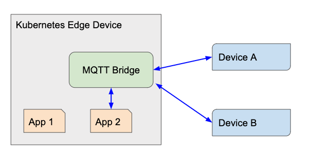
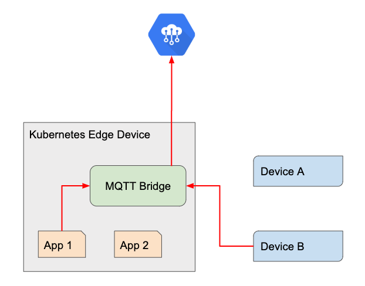
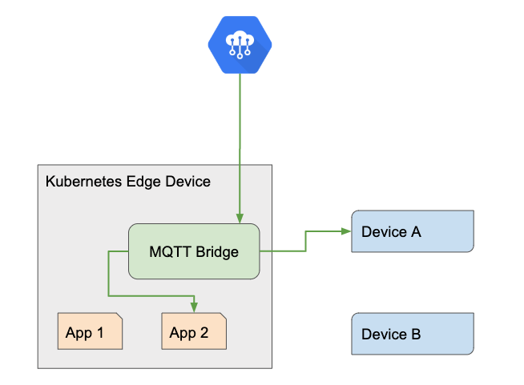

Preston Holmes | Solution Architect | Google

<!-- diagram sources: https://docs.google.com/presentation/d/1p2srfYUkqnXIKR4zGj099PIKOzz1RRi28eOcgIch1tc/edit#slide=id.p -->

## Introduction

This tutorial demonstrates how to deploy [Mosquitto](https://mosquitto.org/) MQTT broker to [Kubernetes](https://kubernetes.io/) using the broker's bridge feature to map a specific [MQTT](http://mqtt.org/) topic namespace to [Google Cloud IoT Core](https://cloud.google.com/iot-core/).

## Setup

### Clone the tutorial Repo
#### TODO update to prod

	git clone https://github.com/ptone/community.git
	cd community
	git checkout kube-mqtt
	cd tutorials/kube-mqtt

### Prerequisite: Kubernetes Cluster

It is assumed you have running Kubernetes cluster. This can be via [Minikube](https://kubernetes.io/docs/tutorials/hello-minikube/), [Google Kubernetes Engine](https://cloud.google.com/kubernetes-engine/), and so forth. For the tutorial, you can also use Kubernetes Engine clusters, however the context of this solution is based on non-cloud clusters in Edge environments.

You will also need a recent `kubectl` command (>=1.14) with [kustomize integration](https://kubernetes.io/blog/2019/03/25/kubernetes-1-14-release-announcement/). If you have an older version of kubectl, install a newer one from [here](https://kubernetes.io/docs/tasks/tools/install-kubectl/). Ensure that Kubectl is configured to talk to your cluster.

### Setting up the cloud environment

1.  Create a project in the [GCP Console][console].
1.  [Enable billing for your project](https://cloud.google.com/billing/docs/how-to/modify-project).
1.  Use [Cloud Shell][shell] or install the [Google Cloud SDK][sdk].

In this tutorial, you may open multiple shell tabs or sessions. You should set these environment variables in each one:

	# the project should already be set in cloud shell
	gcloud config set project <project-id>
	
	export PROJECT=$(gcloud config list project --format "value(core.project)" )
	export REGION=us-central1
	export REGISTRY=gadgets
	export DEVICE=bridge
	
	
[console]: https://console.cloud.google.com/
[shell]: https://cloud.google.com/shell/
[sdk]: https://cloud.google.com/sdk/

Enable APIs:
	
	gcloud services enable \
	cloudiot.googleapis.com \
	container.googleapis.com \
	containerregistry.googleapis.com \
	pubsub.googleapis.com \
	cloudbuild.googleapis.com
		
	
## Build the bridge manager container

For Mosquitto you will use the default published container from Docker. Note that you will need another container in the deployment which manages the credentials that allow the bridge to connect to Google Cloud.

	cd refresher-container
	gcloud builds submit --tag gcr.io/$PROJECT/refresher .

## Create Cloud resources:

### Create the device keys

The following commands create a public / private keypair; only transmit the public key and store the private key on the device.

	cd ../bridge
	openssl ecparam -genkey -name prime256v1 -noout -out ec_private.pem
	openssl ec -in ec_private.pem -pubout -out ec_public.pem

### Create IoT Core resources

The following commands will create the required IoT Core resources.

	gcloud pubsub topics create device-events
	gcloud pubsub subscriptions create debug --topic device-events
	
	gcloud iot registries create $REGISTRY \
	--region=$REGION \
	--event-notification-config topic=device-events
	
	gcloud iot devices create $DEVICE \
	--region $REGION \
	--registry $REGISTRY \
	--public-key path=ec_public.pem,type=es256-pem

This creates an IoT Core device called "bridge" that you will use to authenticate the bridge to IoT Core with.

The pubsub topics are used to verify that data is being bridged to cloud correctly.

## Deploy the bridge to Kubernetes

### Update project specific settings

Get the specific address for the bridge manager container:

	gcloud container images describe gcr.io/$PROJECT/refresher --format="value(image_summary.fully_qualified_digest)"

In the repo file `bridge/project-image.yaml`, add the output from the previous command as `image` .

If running the Kubernetes cluster outside the Cloud Project, make the images public:

	gsutil iam ch allUsers:objectViewer gs://artifacts.$PROJECT.appspot.com

Note this will make the container registry for the project public.

In production environments, you would provision the cluster with the required [image pull secrets](http://docs.heptio.com/content/private-registries/pr-gcr.html).

Edit PROJECT_ID value in `device-config.yaml`.

### Deploy

You are going to use the built-in version of [kustomize](https://kustomize.io/) in recent `kubectl` versions to deploy the solution to Kubernetes.

Make sure you are in the base directory for this tutorial: `community/tutorials/kube-mqtt`. More about the deployment is explained in the following section, for now, deploy the workload with:
	
	kubectl apply -k bridge/

## Understanding the bridge deployment

Lets explain a few parts of this deployment.
	
### Use of kustomize

The layout of this project uses a base folder which contains default resources including yaml files for a deployment with 2 containers and a service, as well as a kustomize-generated configmap.

The bridge folder in the repo acts as an overlay which:

 - merges the device private key file into a configmap defined in the base
 - patches a container image with a project specific address
 - adds project specific environment variables

By keeping these more variable parts in an overlay - the base might be managed centrally and shared among several different variants. For example, when following this tutorial you only need to change the project-id in the device-config.yaml file, but you might use different registries or device-id values if you changed those variables.

### Using a pod combining 3p image with a project custom image

The deployment defined in the base defines a pod that combines a stock Mosquitto image with a custom manager sidecar.  This pod demonstrates a couple interesting Kubernetes capabilities:

 - The different containers in the pod use a shared volume where the manager writes a config file which is read by Mosquitto container.
 - The pod has `shareProcessNamespace` enabled so that the refreshing managing container can restart a process in the stock container. This is done because the `remote_password` configuration value is an expiring JWT token per the auth design of IoT Core.

### The bridge configuration

In the template for the Mosquitto configuration is a section that contains directives on how to bridge the MQTT topics.  This is documented [here](https://mosquitto.org/man/mosquitto-conf-5.html). The topic routing takes the form of:

	topic pattern [[[ out | in | both ] qos-level] local-prefix remote-prefix]

In the configuration template a prefix of `gcp/` is used for any topic connected to IoT Core.

For "out" topics, those going from the bridge to the cloud, different routes are used for exact vs pattern matches:

	topic "" out 1 gcp/events /devices/CONFIG_DEVICE_ID/events
	topic "" out 1 gcp/state /devices/CONFIG_DEVICE_ID/state
	topic # out 1 gcp/events/ /devices/CONFIG_DEVICE_ID/events/

And a similar duplication is used for cloud topics the bridge subscribes to:

	topic "" in 1 gcp/config /devices/CONFIG_DEVICE_ID/config
	topic "" in 1 gcp/commands /devices/CONFIG_DEVICE_ID/commands
	topic # in 1 gcp/commands/ /devices/CONFIG_DEVICE_ID/commands/

## Test the Bridge

### Check that the bridge deployed

	kubectl wait --for=condition=Ready pod -l "app=iot-core-bridge"
	kubectl logs -f -l "app=iot-core-bridge" -c mosquitto

You may choose to keep the log open in a dedicated terminal, or close it after verifying there are no errors.

### Build the image for a cluster based MQTT client

It is assumed that the broker will be used inside the context of the cluster, as well as potentially by external local devices. For demo purposes you will use a simple MQTT CLI client.

	cd client
	gcloud builds submit --tag gcr.io/$PROJECT/mqtt-client .

### Run a couple instances of the client

You will want to start a couple terminal windows for each of these next steps, remember to set the environment variables from the setup section in each. In Cloud Shell you can open these by clicking the + icon to create a new tab.

	kubectl run client-a --rm -i --tty --image gcr.io/$PROJECT/mqtt-client --generator=run-pod/v1 -- /bin/sh
	
And in another window:

	kubectl run client-b --rm -i --tty --image gcr.io/$PROJECT/mqtt-client --generator=run-pod/v1 -- /bin/sh

### Local broker communication

In this pattern, clients can communicate on unbridged broker topics in a conventional way.

Note that the client can use the cluster local service name (mqtt-bridge) as the hostname.

In client "b" subscribe to a local only topic:

	sub -h mqtt-bridge -t "test/topic" -v

In client "a" publish to this topic:

	pub -h mqtt-bridge -m hello -t test/topic -d

You should see the message relayed by the broker.

### Send bridged telemetry to the Cloud

In client "a" publish to the bridged event topic:

	pub -h mqtt-bridge -m hello -t gcp/events -d
	
Verify the bridged message was published to cloud in another terminal (reminder, set the env variables in this terminal per the initial setup):

	gcloud pubsub subscriptions pull debug --auto-ack --limit=100 
	
### Send commands from the cloud to cluster-local clients

In both client windows, subscribe to bridged IoT commands topic:

	sub -h mqtt-bridge -t "gcp/commands/#" -v

Publish a command via IoT Core API:

	gcloud iot devices commands send --region=us-central1 \
	--registry=$REGISTRY \
	--device=$DEVICE \
	--command-data=hey \
	--subfolder=yoyo

You should see the command arrive at both clients.

### To connect a local MQTT client

If instead you want to connect a client outside the cluster, you can forward the MQTT port:

	kubectl port-forward svc/mqtt-bridge 1883:1883
	
Depending on the Kubernetes setup, you may choose to expose the MQTT service externally.

## Cleanup and Next Steps

To use kustomize to delete the resources in Kubernetes:

	kubectl delete -k bridge/
	
To delete the cloud resources, delete the tutorial cloud project.

Some areas this pattern can be extended:

 - Integrate the bridge with IoT Core's [Gateway Feature](https://cloud.google.com/iot/docs/how-tos/gateways/)
 - Add a form of device local auth via a custom Mosquitto auth layer
 - Add local TLS to MQTT broker

