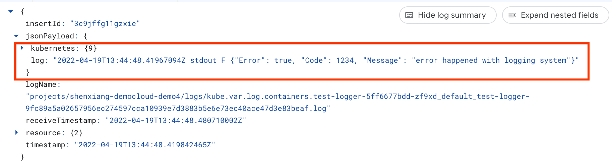
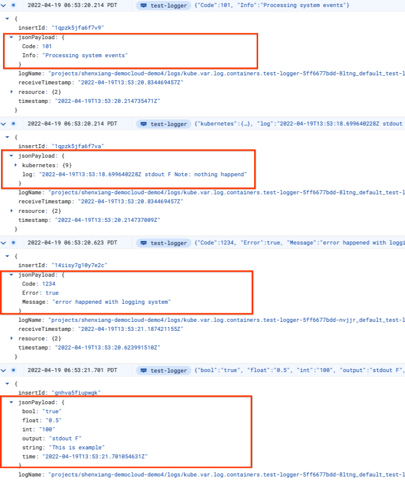

Xiang Shen | Solutions Architect | Google

<i>Contributed by Google employees.</i>

This tutorial describes customizing [Fluent Bit](https://fluentbit.io/) logging for a [Google Kubernetes Engine](https://cloud.google.com/kubernetes-engine)
cluster to transform unstructured logs to structured logs. In this tutorial, you learn how to host your own configurable Fluent Bit daemonset to send logs to Cloud Logging, instead of selecting the Cloud Logging option when creating the Google Kubernetes Engine (GKE) cluster, which does not allow configuration of the Fluent Bit daemon.

This tutorial assumes that you're familiar with [Kubernetes](https://kubernetes.io/docs/home/).

This tutorial applies to Linux nodes only.

Unless otherwise noted, you enter all commands for this tutorial in Cloud Shell.

## Objectives 

+   Deploy your own Fluent Bit daemonset on a Google Kubernetes Engine cluster, configured to log data to [Cloud Logging](https://cloud.google.com/logging).
+   Transform unstructured GKE log messages to structured ones.

## Costs

This tutorial uses billable components of Google Cloud, including a three-node [Google Kubernetes Engine](https://cloud.google.com/kubernetes-engine/pricing) 
cluster.

The [pricing calculator](https://cloud.google.com/products/calculator#id=38ec76f1-971f-41b5-8aec-a04e732129cc) estimates the cost of this environment at around 
$1.14 for 8 hours.

## Before you begin

1.  In the Cloud Console, on the [project selector page](https://console.cloud.google.com/projectselector2/home/dashboard), select or create a Cloud project.  

    **Note**: If you don't plan to keep the resources you create in this procedure, create a project instead of selecting an existing one. After you 
    finish this tutorial, you can delete the project, removing all resources associated with the project.  

1.  Make sure that billing is enabled for your Google Cloud project.

    [Learn how to confirm whether billing is enabled for your project.](https://cloud.google.com/billing/docs/how-to/modify-project)
    
1.  Enable the Google Kubernetes Engine, Compute Engine, and Container Registry APIs.

    [Enable the APIs.](https://console.cloud.google.com/flows/enableapi?apiid=container,compute.googleapis.com,containerregistry.googleapis.com)

## Initializing common variables

In this section, you define variables that control where elements of the infrastructure are deployed.

1.  [Open Cloud Shell](https://console.cloud.google.com/?cloudshell=true).

1.  Set the variables used by this tutorial:

        export region=us-east1
        export zone=${region}-b
        export project_id=[YOUR_PROJECT_ID]
        
    This tutorial uses the region `us-east-1`. If you change the region, make sure that the zone values reference your region.

1.  Set the default zone and project ID so that you don't have to specify these values in every subsequent command:

        gcloud config set compute/zone ${zone}
        gcloud config set project ${project_id}

## Creating the GKE cluster

1.  Clone the sample repository:

        git clone https://github.com/GoogleCloudPlatform/community.git

    The sample repository includes the Kubernetes manifests for the Fluent Bit daemonset and a test logging program that you deploy.

1.  Go to the directory for this tutorial in the cloned repository:

        cd community/tutorials/kubernetes-engine-convert-fluentbit

1.  Create the GKE cluster with system-only logging turned on:

        gcloud container clusters create custom-fluentbit \
        --zone $zone \
        --logging=SYSTEM \
        --tags=gke-cluster-with-customized-fluentbit \
        --scopes=logging-write,storage-rw

## Deploying the test logger application

By default, the sample application that you deploy continuously emits random logging statements. The Docker container is
built from the source code under the `test-logger` subdirectory.

1.  Build the `test-logger` container image:

        docker build -t test-logger test-logger

1.  Tag the container before pushing it to the registry:

        docker tag test-logger gcr.io/${project_id}/test-logger

1.  Push the container image:

        docker push gcr.io/${project_id}/test-logger

1.  Update the deployment file:

        envsubst < kubernetes/test-logger.yaml > kubernetes/test-logger-deploy.yaml

1.  Deploy the `test-logger` application to the GKE cluster:

        kubectl apply -f kubernetes/test-logger-deploy.yaml

1.  View the status of the `test-logger` pods:

        kubectl get pods

1.  Repeat this command until the output looks like the following, with all three `test-logger` pods running:

        NAME                           READY   STATUS    RESTARTS   AGE
        test-logger-58f7bfdb89-4d2b5   1/1     Running   0          28s
        test-logger-58f7bfdb89-qrlbl   1/1     Running   0          28s
        test-logger-58f7bfdb89-xfrkx   1/1     Running   0          28s

1. The test-logger pods will continuously print messages randomly selected from the following for demo purposes. You can find the source in the [logger.go](./test-logger/logger.go) file.

        
        {"Error": true, "Code": 1234, "Message": "error happened with logging system"}
	
        Another test {"Info": "Processing system events", "Code": 101} end
	
        data:100 0.5 true This is an example
	
        Note: nothing happened

1. To verify, you can pick one of the pods and use the command `kubectl logs` to view the logs. For example:

        kubectl logs test-logger-58f7bfdb89-4d2b5

## Deploying the Fluent Bit daemonset to your cluster

In this section, you configure and deploy your Fluent Bit daemonset.

Because you turned on system-only logging, a GKE-managed Fluentd daemonset is deployed that is responsible for system logging. The Kubernetes manifests for 
Fluent Bit that you deploy in this procedure are versions of the ones available from the Fluent Bit site for
[logging using Cloud Logging](https://docs.fluentbit.io/manual/installation/kubernetes/) and
[watching changes to Docker log files](https://kubernetes.io/docs/concepts/cluster-administration/logging/).

1.  Create the service account and the cluster role in a new `logging` namespace:

        kubectl apply -f ./kubernetes/fluentbit-rbac.yaml

1.  Deploy the Fluent Bit configuration:

        kubectl apply -f kubernetes/fluentbit-configmap.yaml

1.  Deploy the Fluent Bit daemonset:

        kubectl apply -f kubernetes/fluentbit-daemonset.yaml

1.  Check that the Fluent Bit pods have started:

        kubectl get pods --namespace=logging

1.  If they're running, you see output like the following:

        NAME               READY   STATUS    RESTARTS   AGE
        fluent-bit-246wz   1/1     Running   0          26s
        fluent-bit-6h6ww   1/1     Running   0          26s
        fluent-bit-zpp8q   1/1     Running   0          26s

    For details on configuring Fluent Bit for Kubernetes, see the [Fluent Bit manual]( https://docs.fluentbit.io/manual/installation/kubernetes).  

1.  Verify that you're seeing logs in Cloud Logging. In the console, on the left-hand side, select **Logging** > **Logs Explorer**, and then select
    **Kubernetes Container** as a resource type in the **Resource** list.
    
1.  Click **Run Query**.

1.  In the **Logs field explorer**, select **test-logger** for **CONTAINER_NAME** and you should see logs from our test containers. Expand one of the log entries, and you can see the log message from your container is stored as a string in the `log` field under `jsonPayload` regardless of its original format. Additional info such as timestamp is also added to the log field.

    

## Options to transform the logs

As you see earlier, the `log` field is a long string. You have multiple options to transform it to a json structure. Those options all involve using Fluent Bit [filters](https://docs.fluentbit.io/manual/pipeline/filters) and you also need some understanding of the format for your raw log messages.

### Use teh JSON filter

If your log messages are already in json format like the example in the previous screenshot, you can use the JSON filter to parse them and view them in `jsonPayload`. However, before you do that you need to have another pair of parser and filter to remove the extraneous data. For example, use the following parser to extract your log string:

        [PARSER]
            Name        containerd
            Format      regex
            Regex       ^(?<time>.+) (?<stream>stdout|stderr) [^ ]* (?<log>.*)$
            Time_Key    time
            Time_Format %Y-%m-%dT%H:%M:%S.%L%z

And use the following filters to transform the log messages:

        [FILTER]
            Name         parser
            Match        kube.*
            Key_Name     log
            Reserve_Data True
            Parser       containerd
        
        [FILTER]
            Name         parser
            Match        kube.*
            Key_Name     log
            Parser       json

You can view a complete example in [fluentbit-configmap-json.yaml](kubernetes/fluentbit-configmap-json.yaml).

### Use the Lua and JSON filter

Sometimes, your log strings have an embedded json structure or they are not well-formed in json. In that case, you can use the [Lua filter](https://docs.fluentbit.io/manual/pipeline/filters/lua), which allows you to modify the incoming records using custom [Lua](https://www.lua.org/) scripts.

For example, the following code will extract a string enclosed between `{` and `}` and use it to replace the original `log` field.

        function extract_json(tag, timestamp, record)
          record["log"] = string.gsub(record["log"], ".-%s*({.*}).*", "%1")
          return 2, timestamp, record
        end

If the code is executed on the `log` field for the following string

        Another test {"Info": "Processing system events"**, "Code": 101} end

the new `log` field will be the following: 

        {"Info": "Processing system events", "Code": 101}

Since the new string has a well-formed json format, you can use the json filter. For example:

        [FILTER]
            Name                parser
            Match               kube.*
            Key_Name            log
            Parser              json

With this transformation, you will see the logs for this message has the following structure in Cloud Logging:

        jsonPayload: {
          Code: 101
          Info: "Processing system events"
        }

### Use a custom filter with Regex

If your logs have a static format, you can create a custom [parser](https://docs.fluentbit.io/manual/pipeline/filters/parser) filter with regex. For example:

        [PARSER]
            Name my_paser
            Format regex
            Regex ^(?<time>.+) (?<output>.+ .+) data:(?<int>[^ ]+) (?<float>[^ ]+) (?<bool>[^ ]+) (?<string>.+)$

And you can use this parser in a filter:

        [FILTER]
            Name                parser
            Match               kube.*
            Key_Name            log
            Parser              my_paser

With this configuration, the following string:

        data:100 0.5 true This is example

will be transformed to:

        jsonPayload: {
          bool: "true"
          float: "0.5"
          int: "100"
          output: "stdout F"
          string: "This is example"
          time: "2022-04-19T13:53:21.701054631Z"
        }

### Combining filters

You can use multiple filters for different log messages. In the following section, you will use a new configuration with combined filters. Read the [fluentbit-configmap-updated.yaml](kubernetes/fluentbit-configmap-updated.yaml) for details.

## Updating the ConfigMap and Fluent Bit daemonset

In this section, you use a new ConfigMap for Fluent Bit to transform the sample log messages.

1.  Deploy the new version of the ConfigMap to your cluster:

        kubectl apply -f kubernetes/fluentbit-configmap-updated.yaml

1.  Roll out the new version of the daemonset:
        
        kubectl rollout restart  ds/fluent-bit --namespace=logging

1.  Roll out the update and wait for it to complete:

        kubectl rollout status ds/fluent-bit --namespace=logging

    When it completes, you should see the following message:

        daemon set "fluent-bit" successfully rolled out

1.  When the rollout is complete, refresh the Cloud Logging logs. If you expand the log entries, you should see the updated jsonPayload. For example:

    

As mentioned earlier, the relevant log messages are transformed to json. If log messages don't match in any filter, they will be left unchanged. For example, you can see the message `Note: nothing happened` is still kept in the `log` field without any changes.

## Cleaning up: deleting the GKE cluster

If you don't want to delete the whole project, run the following command to delete the GKE cluster:

    gcloud container clusters delete custom-fluentbit --zone us-east1-b

## What's next

+   Review [Fluent Bit](https://docs.fluentbit.io/manual/) documentation in more detail.
+   Review [Google Kubernetes Engine](https://cloud.google.com/kubernetes-engine) documentation in more detail.
+   Try out other Google Cloud features for yourself. Have a look at our [tutorials](https://cloud.google.com/docs/tutorials).
