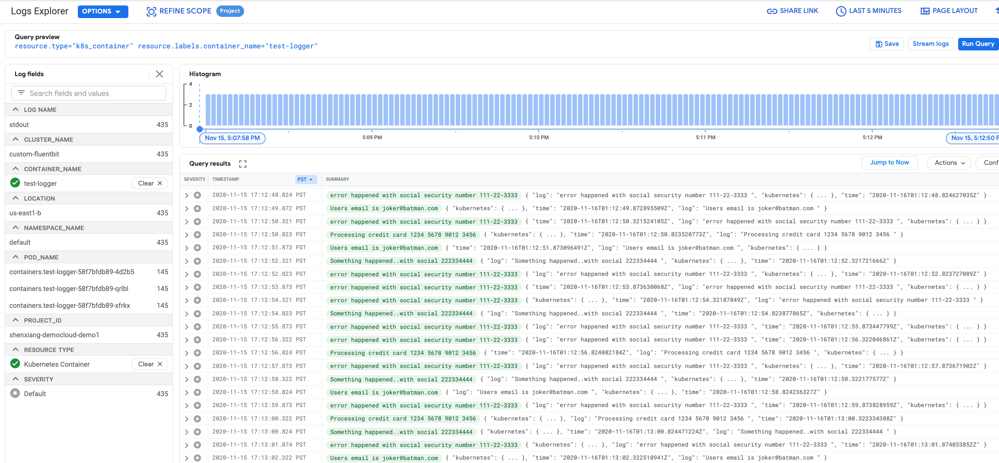
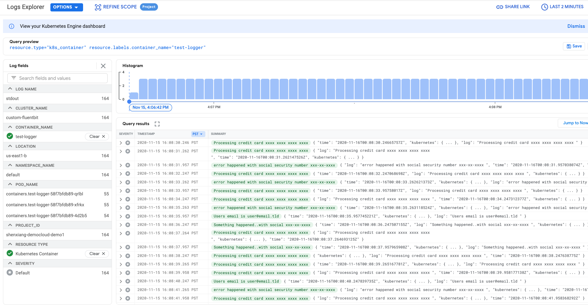

Xiang Shen | Solutions Architect | Google

<i>Contributed by Google employees.</i>

This tutorial describes how to customize [Fluent Bit](https://fluentbit.io/) logging for a [Google Kubernetes Engine](https://cloud.google.com/kubernetes-engine) cluster. You'll learn how to host your own configurable Fluent Bit daemonset to send logs to Cloud Logging, instead of selecting the cloud logging option when creating the Google Kubernetes Engine (GKE) cluster, which does not allow configuration of the Fluent Bit daemon.

## Objectives 

+   Deploy your own Fluent Bit daemonset on a Google Kubernetes Engine cluster, configured to log data to [Cloud Logging](https://cloud.google.com/logging). We assume that you are already familiar with [Kubernetes](https://kubernetes.io/docs/home/).
+   Customize GKE logging to remove sensitive data from the Cloud Logging logs.

## Costs

This tutorial uses billable components of Google Cloud, including:

+   A three-node [Google Kubernetes Engine](https://cloud.google.com/kubernetes-engine/pricing) cluster.

The [Pricing Calculator](https://cloud.google.com/products/calculator#id=38ec76f1-971f-41b5-8aec-a04e732129cc) estimates the cost of this environment at around $1.14 for 8 hours.

## Before you begin

1.  In the Cloud Console, on the project selector page, select or create a Cloud project.  
**Note**: If you don't plan to keep the resources that you create in this procedure, create a project instead of selecting an existing project. After you finish these steps, you can delete the project, removing all resources associated with the project.  
[Go to the project selector page](https://console.cloud.google.com/projectselector2/home/dashboard)
1.  Make sure that billing is enabled for your Google Cloud project. [Learn how to confirm billing is enabled for your project](https://cloud.google.com/billing/docs/how-to/modify-project)
1.  Enable the Google Kubernetes Engine, Compute Engine APIs.  
[Enable the APIs](https://console.cloud.google.com/flows/enableapi?apiid=container,compute.googleapis.com)

## Initializing common variables

You must define several variables that control where elements of the infrastructure are deployed.

1.  [Open Cloud Shell](https://console.cloud.google.com/?cloudshell=true) or make sure **gcloud** is installed and configured on your 
1.  Set the variables used by this tutorial. The tutorial sets the region to `us-east-1`. If you want to change the region, make sure that the zone values reference the region you specify.

        region=us-east1
        zone=${region}-b
        project_id=[YOUR_PROJECT_ID]

1.  Run the following commands to set the default zone and project ID so you don't have to specify these values in every subsequent command:

        gcloud config set compute/zone ${zone}
        gcloud config set project ${project_id}

## Creating the GKE cluster

Unless otherwise noted, you enter all the commands for this tutorial at the command line of your computer or in Cloud Shell.

1.  Clone the sample repository. The sample repository includes the Kubernetes manifests for the Fluent Bit daemonset and a test logging program that you will deploy:

        git clone https://github.com/GoogleCloudPlatform/community.git

1.  Change your working directory to the cloned repository:

        cd community/tutorials/kubernetes-engine-customize-fluentbit

1.  Create the GKE cluster with system-only logging turned on:

        gcloud beta container clusters create custom-fluentbit \
        --zone us-east1-b \
        --enable-logging-monitoring-system-only \
        --tags=gke-cluster-with-customized-fluentbit \
        --scopes=logging-write,storage-rw

## Deploying the test logger application

By default, the sample application that you deploy continuously emits random logging statements. The Docker container it uses is available at `gcr.io/cloud-solutions-images/test-logger`, and its source code is included in the `test-logger` subdirectory.

1.  Deploy the `test-logger` application to the GKE cluster:

        kubectl apply -f kubernetes/test-logger.yaml

1.  View the status of the `test-logger` pods:

        kubectl get pods

1.  Repeat this command until the output looks like the following, with all three `test-logger` pods running:

    <pre>
    NAME                           READY   STATUS    RESTARTS   AGE
    test-logger-58f7bfdb89-4d2b5   1/1     Running   0          28s
    test-logger-58f7bfdb89-qrlbl   1/1     Running   0          28s
    test-logger-58f7bfdb89-xfrkx   1/1     Running   0          28s
    </pre>

## Deploying the Fluent Bit daemonset to your cluster

Next you will configure and deploy your Fluent Bit daemonset.  
**Note:** Because you have turned on system-only logging, a GKE-managed Fluentd daemonset has been deployed that is responsible for system logging. The Kubernetes manifests for Fluent Bit that you deploy in this procedure are versions of the ones available from the Fluent Bit site for [logging using Cloud Logging](https://docs.fluentbit.io/manual/installation/kubernetes/) and [watching changes to Docker log files](https://kubernetes.io/docs/concepts/cluster-administration/logging/).

1.  Create the service account and the cluster role in a new namespace _logging_:

        kubectl apply -f ./kubernetes/fluentbit-rbac.yaml

1.  Deploy the Fluent Bit configuration:

        kubectl apply -f kubernetes/fluentbit-configmap.yaml

1.  Deploy the Fluent Bit daemonset:

        kubectl apply -f kubernetes/fluentbit-daemonset.yaml

1.  Check that the Fluent Bit pods have started:

        kubectl get pods --namespace=logging

1.  If they're running, you see output like the following:
    <pre>
    NAME               READY   STATUS    RESTARTS   AGE
    fluent-bit-246wz   1/1     Running   0          26s
    fluent-bit-6h6ww   1/1     Running   0          26s
    fluent-bit-zpp8q   1/1     Running   0          26s
    </pre>

    Additional details to configure Fluent Bit for Kubernetes can be found in the [Fluent Bit manual]( https://docs.fluentbit.io/manual/installation/kubernetes).  

1.  Verify that you're seeing logs in Logging. In the console, on the left-hand side, select **Logging** > **Logs Explorer** and then select **Kubernetes Container** as a resource type in the **Resource** list.
1.  Click **Run Query**.
1.  In the **Logs field explorer**, select **test-logger** for **CONTAINER_NAME**. After add the `log` field to the summary line, you can logs similar to the following:

## Filtering information from the logfile

The next step is to specify that Fluent Bit should filter certain data so that it is not logged. For this tutorial, you filter out the Social Security numbers, credit card numbers, and email addresses. To make this update, you change the daemonset to use a different ConfigMap that contains these filters. You use Kubernetes rolling updates feature and preserve the old version of the ConfigMap.

1.  Open the [kubernetes/fluentbit-configmap.yaml](./kubernetes/fluentbit-configmap.yaml) file in an editor.
1.  Uncomment the lines between and not including the lines `### sample log scrubbing filters` and `### end sample log scrubbing filters`.
1.  Change the name of the ConfigMap from `fluent-bit-config` to `fluent-bit-config-filtered` by editing the `metadata.name` field.
1.  Save and close the file.

## Updating the Fluent Bit daemonset to use the new configuration

Now you change `kubernetes/fluentbit-daemonset.yaml` to mount the ConfigMap `fluent-bit-config-filtered` instead of `fluent-bit-config`.

1.  Open the `kubernetes/fluentbit-daemonset.yaml` file in an editor.
1.  Change the name of the ConfigMap from `fluent-bit-config` to `fluent-bit-config-filtered` by editing the `configMap.name` field:  
[kubernetes/fluentbit-daemonset.yaml](./kubernetes/fluentbit-daemonset.yaml)
    <pre>
    - name: fluent-bit-etc
    configMap:
        name: fluent-bit-config
    </pre>
1.  Deploy the new version of the ConfigMap to your cluster:

        kubectl apply -f kubernetes/fluentbit-configmap.yaml

1.  Roll out the new version of the daemonset:
        
        kubectl apply -f kubernetes/fluentbit-daemonset.yaml

1.  Roll out the update and wait for it to complete:

        kubectl rollout status ds/fluent-bit --namespace=logging

    When it completes, you should see the follwoing message:
    <pre>
    daemon set "fluent-bit" successfully rolled out
    </pre>

1.  When the rollout is complete, refresh the Logging logs and make sure that the Social Security Number, credit card number, and email address data has been filtered out.

### Deleting the GKE cluster

If you don't want to delete the whole project, run the following command to delete the GKE cluster:

    gcloud container clusters delete custom-fluentbit --zone us-east1-b

## What's next

+   Review [Fluent Bit](https://docs.fluentbit.io/manual/) documentation in more detail.
+   Review [Google Kubernetes Engine](https://cloud.google.com/kubernetes-engine) documentation in more detail.
+   Try out other Google Cloud features for yourself. Have a look at our [tutorials](https://cloud.google.com/docs/tutorials).