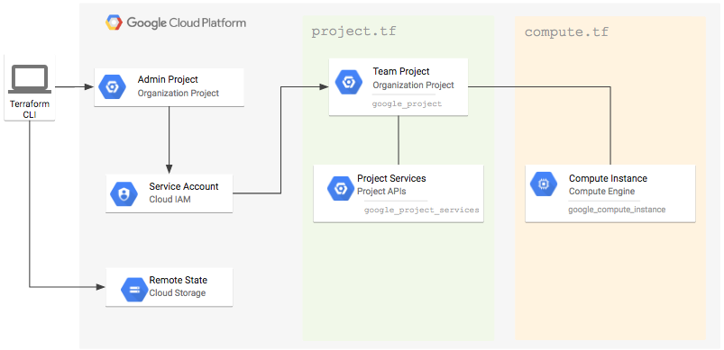

This tutorial demonstrates how to create and manage projects on Google Cloud Platform with Terraform. Terraform is a tool for building, changing, and versioning infrastructure safely and efficiently by defining your infrastructure as code. Terraform supports multiple cloud platforms and software applications. If you are familiar with [Deployment Manager](https://cloud.google.com/deployment-manager/docs/), [Cloud Formation](https://aws.amazon.com/cloudformation/), or [Heat Templates](https://wiki.openstack.org/wiki/Heat) for Google Cloud Platform, Amazon Web Services and OpenStack respectively; Terraform is similar to these tools but not limited to any particular platform or provider. 
 
Incremental changes made within your cloud project are difficult to track and recreate if needed later down the road. With Terraform, many of your resources like Projects, IAM policies, Networks, Compute Instances, and Container Engine Clusters can be managed and versioned and easily recreated for your organization or teams. The state that Terraform generates is saved to Google Cloud Storage (GCS) for persistence.

## Objectives

- Create a Terraform Admin Project for the service account and remote state bucket.
- Grant Organization-level permissions to the service account.
- Configure the remote state in GCS.
- Use Terraform to provision new project and instance in that project.
 
Architecture diagram for tutorial components:

**Figure 1.** *Architecture diagram for tutorial components*


## Before you begin

This tutorial assumes you already have a Cloud Platform account setup for your organization and that you are allowed to make organizational-level changes in the account. For details on creating and managing organizations, [click here](https://cloud.google.com/resource-manager/docs/creating-managing-organization#setting-up).
 
All changes are done with the Google [Cloud SDK](https://cloud.google.com/sdk/) command line `gcloud` tool. This tutorial assumes that you have this tool installed and authorized to work with your account per the [documentation](https://cloud.google.com/sdk/docs/authorizing).

## Costs

This tutorial uses billable components of GCP, including:
 
- Compute Engine
- Google Cloud Storage
 
Use the [Pricing Calculator](https://cloud.google.com/products/calculator/) to generate a cost estimate based on your projected usage.

## Setup the environment

Export the following variables to your environment for use throughout the tutorial.

```sh 
export TF_VAR_org_id=YOUR_ORG_ID
export TF_VAR_billing_account=YOUR_BILLING_ACCOUNT_ID
export TF_ADMIN=${USER}-terraform-admin
export TF_CREDS=~/.config/gcloud/terraform-admin.json
```
 
The org id and billing account id can be found using the following commands:
 
```sh
gcloud beta organizations list
gcloud alpha billing accounts list
```

## Create the Terraform admin project

Using an admin project for your Terraform service account keeps the resources needed for managing your projects separate from the actual projects you create.
 
Create a new project and link it to your billing account:

```sh
gcloud projects create ${TF_ADMIN} \
  --organization ${TF_VAR_org_id} \
  --set-as-default
 
gcloud alpha billing accounts projects link ${TF_ADMIN} \
  --account-id ${TF_VAR_billing_account}
```

## Create the Terraform service account
 
Create the service account in the Terraform Admin project and download the JSON credentials:

```sh
gcloud iam service-accounts create terraform \
  --display-name "Terraform admin account"
 
gcloud iam service-accounts keys create ${TF_CREDS} \
  --iam-account terraform@${TF_ADMIN}.iam.gserviceaccount.com
```

Grant the service account permission to view the admin project and manage GCS storage:

```sh
gcloud projects add-iam-policy-binding ${TF_ADMIN} \
  --member serviceAccount:terraform@${TF_ADMIN}.iam.gserviceaccount.com \
  --role roles/viewer
 
gcloud projects add-iam-policy-binding ${TF_ADMIN} \
  --member serviceAccount:terraform@${TF_ADMIN}.iam.gserviceaccount.com \
  --role roles/storage.admin
```

Any actions that Terraform performs requires that the API be enabled to do so. In this guide, Terraform requires the following:

```sh 
gcloud service-management enable cloudresourcemanager.googleapis.com
gcloud service-management enable cloudbilling.googleapis.com
gcloud service-management enable iam.googleapis.com
gcloud service-management enable compute-component.googleapis.com
```

### Add organization/folder-level permissions
 
Grant the service account permission to create projects and assign billing accounts:

```sh 
gcloud beta organizations add-iam-policy-binding ${TF_VAR_org_id} \
  --member serviceAccount:terraform@${TF_ADMIN}.iam.gserviceaccount.com \
  --role roles/resourcemanager.projectCreator
 
gcloud beta organizations add-iam-policy-binding ${TF_VAR_org_id} \
  --member serviceAccount:terraform@${TF_ADMIN}.iam.gserviceaccount.com \
  --role roles/billing.user
```

## Setup remote state in GCS

Create the remote backend bucket in GCS and the backend.tf file for storage of the terraform.tfstate file:

```sh
gsutil mb gs://${TF_BACKEND_BUCKET}
 
cat > backend.tf <<EOF
terraform {
 backend "gcs" {
   bucket = "${TF_ADMIN}"
   path   = "/"
 }
}
EOF
```
 
Next, initialized the backend:

```sh
terraform init
```

## Use Terraform to create a new project and compute instance
 
Create the `project.tf` file:

```sh
cat > project.tf <<EOF
variable "project_name" {}
variable "billing_account" {}
variable "org_id" {}
variable "region" {}
 
provider "google" {
 region = "${var.region}"
}
 
resource "random_id" "id" {
 byte_length = 4
 prefix      = "${var.project_name}-"
}
 
resource "google_project" "project" {
 name            = "${var.project_name}"
 project_id      = "${random_id.id.hex}"
 billing_account = "${var.billing_account}"
 org_id          = "${var.org_id}"
}
 
resource "google_project_services" "project" {
 project = "${google_project.project.project_id}"
 services = [
   "compute-component.googleapis.com"
 ]
}
 
output "project_id" {
 value = "${google_project.project.project_id}"
}
EOF
```

Terraform resources used:

- [`provider "google"`](https://www.terraform.io/docs/providers/google/index.html): The google cloud provider config. The credentials will be pulled from the `GOOGLE_CREDENTIALS` environment variable.
- [`resource "random_id"`](https://www.terraform.io/docs/providers/random/r/id.html): Project IDs must be unique, generate a random one prefixed by the desired project id. 
- [`resource "google_project"`](https://www.terraform.io/docs/providers/google/r/google_project.html): The new project to create, bound to the desired organization id and billing account.
- [`resource "google_project_services"`](https://www.terraform.io/docs/providers/google/r/google_project_services.html): Services and APIs enabled within the new project. Note that if you visit the web console after running terraform, additional APIs may be implicitly enabled and terraform would become out of sync. Re-running `terraform plan` will show you these changes before terraform attempts to disable the APIs that were implicitly enabled. You can also set the full set of expected APIs beforehand to avoid the synchronization issue. 
- [`output "project_id"`](https://www.terraform.io/intro/getting-started/outputs.html): The project id is randomly generated for uniqueness, use an output variable to display it after terraform runs for later reference. 
 
Create the `compute.tf` file:

```sh
cat > compute.tf <<EOF
data "google_compute_zones" "available" {}
 
resource "google_compute_instance" "default" {
 project = "${google_project_services.project.project}"
 zone = "${data.google_compute_zones.available.names[0]}"
 name = "tf-compute-1"
 machine_type = "n1-standard-1"
 disk {
   image = "ubuntu-1604-xenial-v20170328"
 }
 network_interface {
   network = "default"
   access_config {
   }
 }
}
 
output "instance_id" {
 value = "${google_compute_instance.default.self_link}"
}
EOF
```
 
Terraform resources used:

- [`data "google_compute_zones"`](https://www.terraform.io/docs/providers/google/d/google_compute_zones.html): Data resource used to lookup available compute zones, bound to the desired region, avoids hard-coding of zone names.
- [`resource "google_compute_instance"`](https://www.terraform.io/docs/providers/google/r/compute_instance.html): The compute instance bound to the newly created project. Note that the project is referenced from the `google_project_services.project` resource, this is to tell Terraform to create it after the Compute API has been enabled. Otherwise, Terraform would try to create both the project services and the instance at the same time and there would be a race condition for creating the instance after the Compute API is actually enabled.
- [`output "instance_id"`](https://www.terraform.io/intro/getting-started/outputs.html): The `self_link` is output to make it easier to ssh into the instance after Terraform completes.
 
Configure your environment for the Google Cloud Terraform provider:

```sh
export GOOGLE_CREDENTIALS=$(cat ${TF_CREDS})
export GOOGLE_PROJECT=${TF_ADMIN}
```
 
Set the name of the project you want to create and the region you want to create the resources in:

```sh
export TF_VAR_project_name=${USER}-test-compute
export TF_VAR_region=us-central1
```

Preview the Terraform changes:

```sh 
terraform plan
```
 
Apply the Terraform changes:

```sh
terraform apply
```
 
SSH into the instance created:

```sh
gcloud compute ssh $(terraform output | grep instance_id | cut -d = -f2)
```

## Cleaning up
First, destroy the resources created by terraform:

```sh 
terraform destroy
```
 
Next, delete the Terraform Admin project and all of its resources:

```sh
gcloud projects delete ${TF_ADMIN}
```
 
Finally, remove the Organization level IAM permissions for the service account:

```sh 
gcloud beta organizations delete-iam-policy-binding ${TF_VAR_org_id} \
  --member serviceAccount:terraform@${TF_ADMIN}.iam.gserviceaccount.com \
  --role roles/resourcemanager.projectCreator
 
gcloud beta organizations delete-iam-policy-binding ${TF_VAR_org_id} \
  --member serviceAccount:terraform@${TF_ADMIN}.iam.gserviceaccount.com \
  --role roles/billing.user
```
