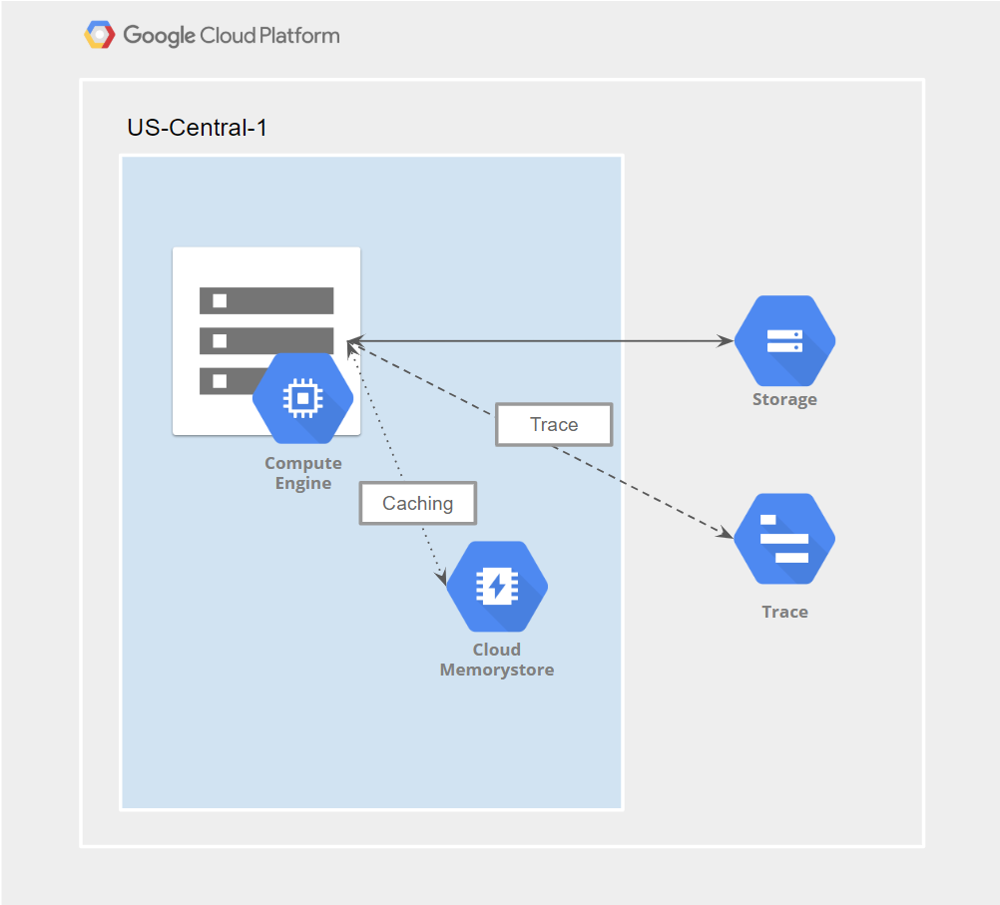
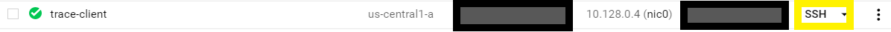
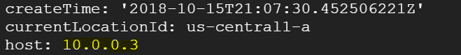
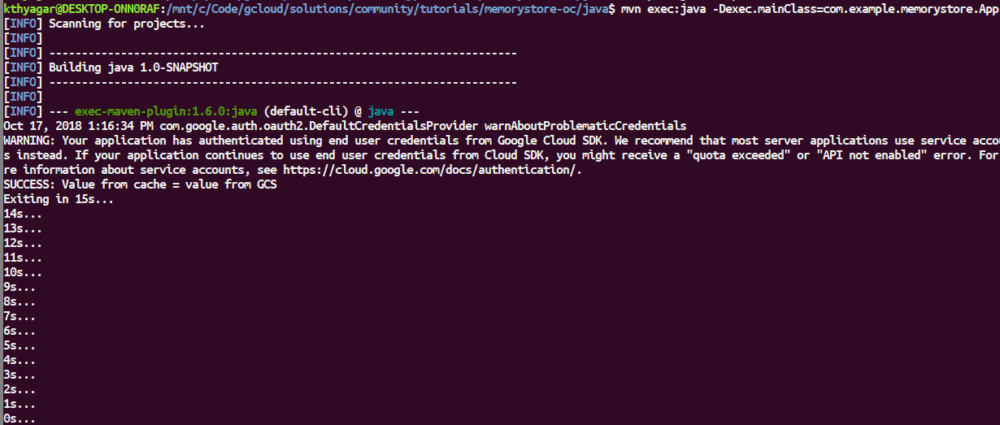
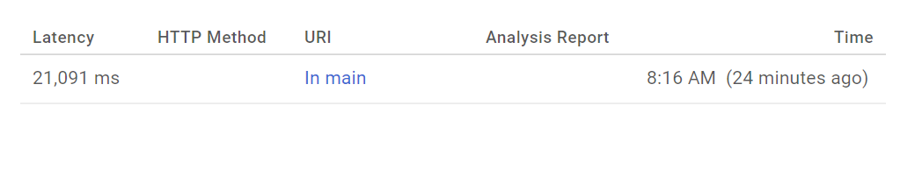
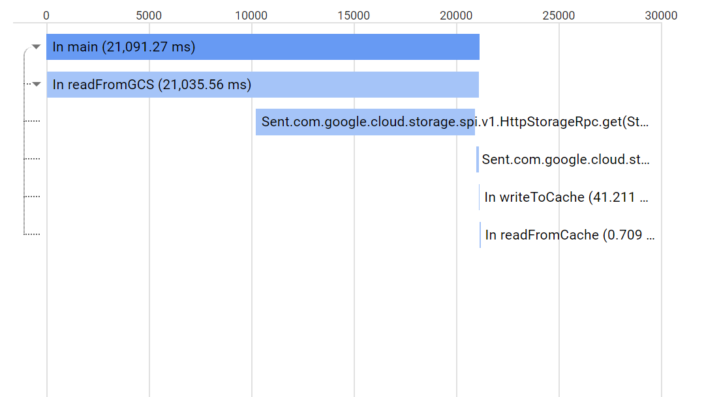

Client-side Tracing of Cloud Memorystore for Redis Workloads with OpenCensus
----------------------------------------------------------------------------

This tutorial shows how to implement client-side tracing in your Cloud Memorystore for Redis workloads using OpenCensus and Stackdriver. While Cloud Memorystore for Redis surfaces a number of helpful server-sidemetrics via Stackdriver, applications can realize added benefit from implementing client-side tracing. For instance, server-side metrics do not give you a window into the round-trip latency of calls made to your Redis endpoint and can only be surfaced using client-side tracing.

[Cloud Memorystore](https://cloud.google.com/memorystore/) for Redis provides a fully managed and Google-hosted Redis deployment for your caching needs.

[OpenCensus](https://opencensus.io) is an open source library that can be used to provide observability in your applications. It is vendor agnostic and integrates with a number of backends such as Prometheus and Zipkin. In this tutorial, we will use Stackdriver as the tracing backend.

### Objectives

*   Deploy a Cloud Memorystore for Redis instance.
*   Deploy a Google Compute Engine (GCE) VM for running an OpenCensus instrumented Java client.
*   Download, deploy and run instrumented Java client.
*   View OpenCensus traces in the Stackdriver Trace tool.

### Costs

This tutorial uses the following billable components of the Google Cloud Platform:

*   Google Compute Engine
*   Cloud Memorystore for Redis
*   Stackdriver
*   Google Cloud Storage

You can use the [Pricing Calculator](https://cloud.google.com/products/calculator/) to generate a cost estimate based on your projected usage.

New GCP users might be eligible for a [free trial](https://cloud.google.com/free/). We recommend that you deploy this tutorial into an ephemeral project, which can then be deleted once you’re done.

### Before you begin

Create a new project

1.  In the GCP Console, go to the [Manage resources page](https://console.cloud.google.com/cloud-resource-manager).
2.  Select a project, or click Create Project to create a new GCP project.
3.  In the dialog, name your project. Make a note of your generated project ID.
4.  Click Create to create a new project.

### Enable billing

*   Make sure that [billing is enabled for your project](https://cloud.google.com/billing/docs/how-to/modify-project).

### Initialize the environment

1.  Start a [Cloud Shell instance](https://console.cloud.google.com/home/dashboard?cloudshell%3Dtrue).

2.  In Cloud Shell, set the default Compute Engine zone to the zone where you are going to create your Cloud Dataproc clusters. This tutorial uses the us-central1-a zone in the us-central1 region.

```bash
$ export REGION=us-central1
$ export ZONE=us-central1-a
$ gcloud config set compute/zone $ZONE
```

3.  Enable the Google Compute Engine and Cloud Memorystore for Redis Admin APIs by running this command in Cloud Shell:

```bash
$ gcloud services enable compute.googleapis.com redis.googleapis.com
```

### Reference architecture

For simplicity, in this tutorial we’ll implement all of our client-side logic in a Java console application. For the caching tier, we’ll use Cloud Memorystore for Redis and for the database tier, we’ll use Google Cloud Storage. This will allow us to focus on the key aspects of client-side tracing without getting hung up on things like database deployments and related configuration.



### Application flow

The Java application running on the GCE VM will retrieve the simple JSON file (person.json) shown below

```json
{
 "FirstName": "John",
 "LastName": "Doe"
}
```

from GCS and cache it in Cloud Memorystore for Redis (created in the section below). Then application will then turn around and fetch it again from Cloud Memorystore for Redis.

Both the initial retrieval from GCS and the second retrieval from Cloud Memorystore for Redis will be instrumented with OpenCensus so we can inspect the latencies involved in those calls within Stackdriver Trace.

### Creating a Cloud Memorystore for Redis instance

In this section, you will create a new Cloud Memorystore for Redis instance that will be used later by our Java application.

In Cloud Shell, create a 1 GB Cloud Memorystore for Redis instance:

```bash
$ gcloud redis instances create cm-redis --size=1 --region=$REGION --zone=$ZONE
```

This command might take a few minutes to complete.

### Upload JSON object to GCS bucket

In this section, you will first create a GCS bucket and then upload the JSON file (person.json) for subsequent retrieval in the Java application below.

Run the following commands in Cloud Shell to create a bucket. Keep in mind that GCS bucket names have to be globally unique, so be sure to substitute ‘your-unique-bucket-name’ below with a unique name of your own.

```bash
$ export MYBUCKET=\[your-unique-bucket-name\]
$ gsutil mb gs://$MYBUCKET
```

Now upload a JSON file to the bucket you just created by running the following commands:

```bash
$ echo "{\\"FirstName\\": \\"John\\",\\"LastName\\": \\"Doe\\"}" >> person.json

$ gsutil cp person.json gs://$MYBUCKET/
```

The Java application you’ll deploy below will need this file.

### Creating and configuring a GCE VM

Create a Compute Engine VM by running the following command from Cloud Shell

gcloud compute instances create trace-client

And connect to the VM by navigating to the list of running VMs:

GCP Hamburger Menu > Compute Engine > VM Instances

And then, ssh into the VM by clicking on the SSH button (highlighted in yellow in the screenshot below):



Once logged into the VM, run the following command to install the redis-cli, git, the Java 8 JDK and maven:

```bash
$ sudo apt-get install redis-tools git openjdk-8-jdk maven -y
```

Run the following command within the trace-client VM to ensure that you can reach the Cloud Memorystore for Redis instance you created earlier:

```bash
$ redis-cli -h \[ip-address-of-redis-instance\] PING
```

You should get a response from the redis server:

```bash
$ PONG
```

---

*Note:* To get the IP Address of your Cloud Memorystore for Redis instance, run the following commands from Cloud Shell and use the value listed next to the label titled ‘host’ (see screenshot below).

```bash
$ export $REGION=us-central1
$ gcloud redis instances describe cm-redis --region=$REGION
```



Make a note of the IP address as you’ll need it below when updating the Java code.

---

### Deploying the Java application

In this section, you’ll download the Java application containing the instrumented code, make the necessary modifications to reflect your environment and then run it.

If you’re not already logged into the trace-client VM you created in the previous section, do so by following the steps described in the previous section.

Once you’ve logged in, clone the source repository for this tutorial

```bash
$ git clone https://github.com/karthitect/community.git
```

You will now update the Java application with some configuration specific to your project. First, navigate to the folder containing the Java source

```bash
$ cd community/tutorials/memorystore-oc/java/
```

Then open up the Java source using your favorite terminal editor, such as nano or vi

```bash
$ nano src/main/java/com/example/memorystore/App.java
```

Near the top of the file, you’ll need to edit 3 of the following 4 Java String constants to reflect your environment

```java
...

public class App {

    private static final String PROJECT_ID = "[YOUR PROJECT ID]";
    private static final String GCS_BUCKET_NAME = "[YOUR BUCKET NAME]";
    private static final String GCS_OBJECT_NAME = "person.json";
    private static final String REDIS_HOST = "[YOUR REDIS HOST]";

...
```

*   PROJECT\_ID- Your GCP Project ID. See [here](https://cloud.google.com/resource-manager/docs/creating-managing-projects%23identifying_projects) for information on locating your Project ID.
*   GCS\_BUCKET\_NAME- This is the GCS bucket you created in the section above titled: Upload JSON object to GCS bucket.
*   REDIS\_HOST - The IP Address of the Cloud MemoryStore for Redis instance you created above. See the section above for details on how to get the IP address of the Cloud Memorystore for Redis instance.

Now save the file and exit (using Ctrl+O and then Ctrl+X, if you’re using nano). Before we run the program, let’s explore the key parts of the code to see how it’s instrumented.

Here’s the relevant part of the main function:

```java
public static void main(String\[\] args) throws IOException, InterruptedException {
   configureOpenCensusExporters();

   // initialize jedis pool
   jedisPool = new JedisPool(REDIS\_HOST);

   try (Scope ss = tracer.spanBuilder("In main").startScopedSpan()) {

       // do initial read from GCS
       String jsonPayloadFromGCS = readFromGCS();

       // now write to Redis
       writeToCache(jsonPayloadFromGCS);

       // read from Redis
       String jsonPayloadFromCache = readFromCache();

       if (jsonPayloadFromCache.equals(jsonPayloadFromGCS)) {
           System.out.println("SUCCESS: Value from cache = value from GCS");
       } else {
           System.out.println("ERROR: Value from cache != value from GCS");
       }
   }

...
```

Notice the try block with the call to spanBuilder. This illustrates how the program uses OpenCensus to perform tracing. The entire call chain starting with main function is instrumented in this way.

The program also configures Stackdriver Trace as the tracing backend:

```java
private static void configureOpenCensusExporters() throws IOException {
   TraceConfig traceConfig = Tracing.getTraceConfig();

   // For demo purposes, let's always sample.
   traceConfig.updateActiveTraceParams(
       traceConfig.getActiveTraceParams().toBuilder().setSampler(Samplers.alwaysSample()).build());

   // Create the Stackdriver trace exporter
   StackdriverTraceExporter.createAndRegister(
       StackdriverTraceConfiguration.builder()
           .setProjectId(PROJECT\_ID)
           .build());
}
```

Note: For more information on OpenCensus, visit [https://opencensus.io/](https://opencensus.io/).

Now run the following maven commands to build and run the program

```bash
$ mvn package -DskipTests

$ mvn exec:java -Dexec.mainClass=com.example.memorystore.App
```

You should see output similar to the following:

```bash
SUCCESS: Value from cache = value from GCS
Existing in 15s...
14s...
13s...
12s...
11s...
10s...
...
```

### Viewing traces in Stackdriver Trace UI

After running the program, navigate to the Cloud Trace console under Stackdriver as shown below



Click on Trace List and you should see a table similar to the following



Recognize the “In main” string? This is from the code you just edited. If you click the “In main” string, you’ll be taken to a drill down view that shows more information about the call chain - along with other useful information such as call latencies.



As you would expect, the latency for calls to Cloud Memorystore for Redis is much lower than that for calls to GCS.

### Cleaning up

Since this tutorial uses multiple GCP components, please be sure to delete the associated resources once you are done.

### Next steps

What you saw in this tutorial is just the tip of the iceberg when it comes to the instrumentation possibilities with OpenCensus. Please visit [https://opencensus.io](https://opencensus.io) for more details on how to implement observability in your applications.