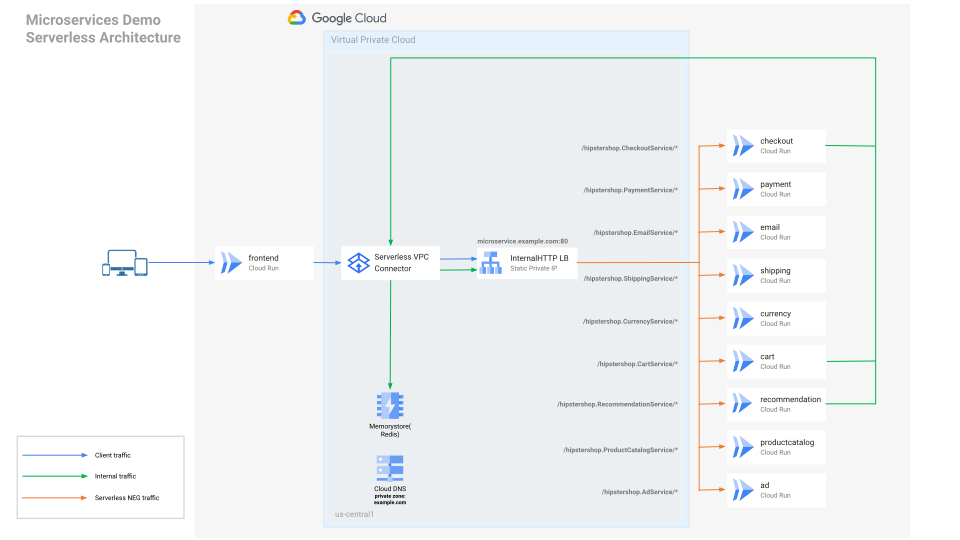

Xiang Shen | Solutions Architect | Google

<p style="background-color:#CAFACA;"><i>Contributed by Google employees.</i></p>

[Online Boutique](https://onlineboutique.dev/) is a cloud-native microservices demo application. The application is a web-based e-commerce app where users can browse items, add them to the cart, and purchase them. It consists of 11 containerized microservices that are designed to run on Kubernetes. For more information, please read its original [GitHub repo](https://github.com/GoogleCloudPlatform/microservices-demo). 

This document describes the steps to migrate the application from Kubernetes to Cloud Run. If you prefer a more automated way, you can use the typescript code [here](https://github.com/shenxiang-demo/microservices-demo/tree/pulumi-cloudrun-one-ilb/serverless).

The following diagram shows the high-level architecture of this solution:




## Objectives

- Minimize code changes to lower the migration effort
- Ensure the internal microservices are private and keep the network traffic inside the Google network
- Use the managed service Memorystore(Redis) for caching
- Use a Cloud DNS private zone for service discovery

## Costs

This tutorial uses billable components of Google Cloud, including the following:

-  [Cloud Run](https://cloud.google.com/run/pricing)
-  [HTTP Internal Load Balancer](https://cloud.google.com/vpc/network-pricing#lb)
-  [Cloud DNS](https://cloud.google.com/vpc/network-pricing#dns-pricing)
-  [MemoryStore(Redis)](https://cloud.google.com/memorystore/docs/redis/pricing)
-  [Serverless VCP Access connector](https://cloud.google.com/vpc/pricing#serverless-vpc-pricing)

Use the [pricing calculator](https://cloud.google.com/products/calculator) to generate a cost estimate based on your projected usage.

## Before you begin

For this tutorial, you need a Google Cloud [project](https://cloud.google.com/resource-manager/docs/cloud-platform-resource-hierarchy#projects). You can create a 
new project or select a project that you have already created. When you finish this tutorial, you can avoid continued billing by deleting the resources that you
created. To make cleanup easiest, you may want to create a new project for this tutorial, so that you can delete the project when you're done. For details, see
the  "Cleaning up" section at the end of the tutorial.

1.  [Select or create a Google Cloud project.](https://console.cloud.google.com/projectselector2/home/dashboard)

1.  [Enable billing for your project.](https://support.google.com/cloud/answer/6293499#enable-billing)

1.  Make sure that you have either a project [owner or editor role](https://cloud.google.com/iam/docs/understanding-roles#primitive_roles), or sufficient 
    permissions to use the needed services.

## Using Cloud Shell

This tutorial uses the following tool packages:

* [`gcloud`](https://cloud.google.com/sdk/gcloud)
* [`python3`](https://www.python.org)

Because [Cloud Shell](https://cloud.google.com/shell) automatically includes these packages, we recommend that you run the commands in this tutorial in Cloud
Shell, so that you don't need to install these packages locally.

## Preparing your environment

### Get the sample code

The sample code for this tutorial is in this
[Community GitHub repository](https://github.com/shenxiang-demo/community/blob/migrate-microsvc-gke-cloudrun/tutorials/migrate-microservices-gke-cloudrun).

1.  Clone the repository:

        git clone -b migrate-microsvc-gke-cloudrun https://github.com/shenxiang-demo/community.git

1.  Go to the tutorial directory:

        cd community/tutorials/migrate-microservices-gke-cloudrun

## Implementation steps

### Set the environment variables
    export PROJECT_ID=<YOUR GCP PROJECT ID>
    export REGION=us-central1
    export VPC_CONNECTOR=example-connector
    export VPC_NAME=example-microservice-vpc

    gcloud config set compute/region ${REGION}
    gcloud config set run/region ${REGION}

### Enable Google Cloud services  
    gcloud services enable compute.googleapis.com \
        containerregistry.googleapis.com \
        run.googleapis.com \
        dns.googleapis.com \
        vpcaccess.googleapis.com \
        redis.googleapis.com \
        monitoring.googleapis.com \
        cloudtrace.googleapis.com \
        cloudprofiler.googleapis.com

### Create a new custom VPC
    gcloud compute networks create ${VPC_NAME} \
        --subnet-mode=custom

### Create a managed DNS private zone 
    gcloud dns managed-zones create example-private-zone \
        --description="zone for service discovery" \
        --dns-name=example.com \
        --networks=${VPC_NAME} \
        --visibility=private

### Create a subnet for internal load balancers
    gcloud compute networks subnets create example-lb-subnet \
        --network=${VPC_NAME} \
        --range=10.1.2.0/24 \
        --region=${REGION}

### Reserve a static private IP from the subnet for the internal load balancer
    gcloud compute addresses create example-internal-lb-ip \
        --region ${REGION} --subnet example-lb-subnet 

### Get the IP and register an `A` record in the private DNS zone
    LB_IP=$(gcloud compute addresses describe example-internal-lb-ip --format="value(address)")

    gcloud dns record-sets transaction start \
        --zone=example-private-zone

    gcloud dns record-sets transaction add $LB_IP \
        --name=microservice.example.com \
        --ttl=30 \
        --type=A \
        --zone=private-example-zone

    gcloud dns record-sets transaction execute \
        --zone=example-private-zone

### Create a [proxy-only subnet](https://cloud.google.com/load-balancing/docs/l7-internal#proxy-only_subnet) for internal load balancers

    gcloud compute networks subnets create example-proxy-only-subnet \
        --purpose=REGIONAL_MANAGED_PROXY \
        --role=ACTIVE \
        --region=${REGION} \
        --network=${VPC_NAME} \
        --range=10.129.0.0/23

### Create a Serverless VPC Access connector
    gcloud compute networks vpc-access connectors create ${VPC_CONNECTOR} \
        --network ${VPC_NAME} \
        --region ${REGION} \
        --range 10.128.0.0/28

### Create a Redis instance & register it in the private DNS zone
    gcloud redis instances create example-redis --size=1 \
        --region=${REGION} --network=${VPC_NAME}
   
    REDIS_IP=$(gcloud redis instances describe example-redis --region=us-central1 --format="value(host)")

    gcloud dns record-sets transaction start \
        --zone=example-private-zone

    gcloud dns record-sets transaction add $REDIS_IP \
        --name=redis.example.com \
        --ttl=30 \
        --type=A \
        --zone=example-private-zone

    gcloud dns record-sets transaction execute \
        --zone=example-private-zone

### Create the deployment YAML files based on the Kubernetes manifest

The application uses a YAML [manifest file](https://github.com/GoogleCloudPlatform/microservices-demo/blob/main/release/kubernetes-manifests.yaml) to deploy on Kubernetes.

The following is a snippet used to deploy the `emailservice`:

```yaml
apiVersion: apps/v1
kind: Deployment
metadata:
  name: emailservice
spec:
  selector:
    matchLabels:
      app: emailservice
  template:
    metadata:
      labels:
        app: emailservice
    spec:
      serviceAccountName: default
      terminationGracePeriodSeconds: 5
      securityContext:
        fsGroup: 1000
        runAsGroup: 1000
        runAsNonRoot: true
        runAsUser: 1000
      containers:
      - name: server
        securityContext:
          allowPrivilegeEscalation: false
          capabilities:
            drop:
              - all
          privileged: false
          readOnlyRootFilesystem: true
        image: gcr.io/google-samples/microservices-demo/emailservice:v0.3.9
        ports:
        - containerPort: 8080
        env:
        - name: PORT
          value: "8080"
        - name: DISABLE_TRACING
          value: "1"
        - name: DISABLE_PROFILER
          value: "1"
        readinessProbe:
          periodSeconds: 5
          exec:
            command: ["/bin/grpc_health_probe", "-addr=:8080"]
        livenessProbe:
          periodSeconds: 5
          exec:
            command: ["/bin/grpc_health_probe", "-addr=:8080"]
        resources:
          requests:
            cpu: 100m
            memory: 64Mi
          limits:
            cpu: 200m
            memory: 128Mi
```

We want to extract related information and use it to deploy the Cloud Run services.

To save some manual work, you can run the Python script [get_svc.py](./get_svc.py) under this directory using the steps below:

    python3 -mvenv venv
    source venv/bin/activate
    pip install -r ./requirements.txt

    python ./get_svc.py

After the commands complete successfully, you should have the YAML files under the `output` directory for Cloud Run.

For example, the `emailservice.yaml` looks like the following:

```yaml
apiVersion: serving.knative.dev/v1
kind: Service
metadata:
  annotations:
    run.googleapis.com/ingress: internal
    run.googleapis.com/ingress-status: internal
  name: emailservice
spec:
  template:
    metadata:
      annotations:
        run.googleapis.com/vpc-access-connector: example-connector
        run.googleapis.com/vpc-access-egress: all-traffic
    spec:
      containers:
      - name: server
        image: gcr.io/google-samples/microservices-demo/emailservice:v0.3.9
        ports:
        - containerPort:  8080
          name: h2c
        env: [{'name': 'DISABLE_TRACING', 'value': '1'}, {'name': 'DISABLE_PROFILER', 'value': '1'}]
```

### Deploy the Cloud Run services

    for i in output/*; do gcloud run services replace $i --async; done

Use the following command or go to [the Cloud Run console](https://console.cloud.google.com/run) to verify the services have been deployed successfully and the URLs exist:

    gcloud run services list


### Create a serverless NEG and backend service for each service
    for fn in $(cd output; ls *); do
        svc=${fn%.yaml}
        if [ svc != "frontend" ]; then
            gcloud compute network-endpoint-groups create ${svc}-neg\
                --region=${REGION} \
                --network-endpoint-type=serverless  \
                --cloud-run-service=${svc}
            gcloud compute backend-services create ${svc}-backend-svc \
                --load-balancing-scheme=INTERNAL_MANAGED \
                --protocol=HTTP \
                --region=${REGION}   
            gcloud compute backend-services add-backend ${svc}-backend-svc \
                --region=${REGION} \
                --network-endpoint-group=${svc}-neg \
                --network-endpoint-group-region=${REGION}
        fi       
        gcloud run services add-iam-policy-binding ${svc} \
            --member="allUsers" \
            --role="roles/run.invoker"
    done

### Create a URL map for the internal load balancer

    envsubst < url-maps-template.yaml > url-maps.yaml 

If you don't have `envsubst` installed, you can open the `url-map-template.py` file, update the variables, and save it as `url-maps.py`.

    gcloud compute url-maps import example-url-maps \
        --source=./url-maps.yaml \
        --region=${REGION}

### Create a target proxy
    gcloud compute target-http-proxies create example-target-proxy \
        --url-map=example-url-maps \
        --region=${REGION}

   
### Create a forward rule   
    gcloud compute forwarding-rules create example-http-forward \
        --load-balancing-scheme=INTERNAL_MANAGED \
        --network=${VPC_NAME} \
        --subnet=example-lb-subnet \
        --address=${LB_IP} \
        --target-http-proxy=example-target-proxy \
        --target-http-proxy-region=${REGION} \
        --region=${REGION} \
        --ports=80

## Verify the result

1.  Retrieve the `frontend` service URL:

        gcloud run services describe frontend \
            --region us-central1 --format="value(status.url)"

1.  Open the URL in your web browser.

Alternatively, you can go to the [Cloud Run console](https://console.cloud.google.com/run), open the `frontend` service, and click the URL to open the application.

You should be able to see the page like the following:


## Cleaning up

To avoid incurring charges to your Google Cloud account for the resources used in this tutorial, you can delete the resources that you created. You can either 
delete the entire project or delete individual resources.

Deleting a project has the following effects:

* Everything in the project is deleted. If you used an existing project for this tutorial, when you delete it, you also delete any other work you've done in the
  project.
* Custom project IDs are lost. When you created this project, you might have created a custom project ID that you want to use in the future. To preserve the URLs
  that use the project ID, delete selected resources inside the project instead of deleting the whole project.

If you plan to explore multiple tutorials, reusing projects can help you to avoid exceeding project quota limits.

### Delete the project

The easiest way to eliminate billing is to delete the project you created for the tutorial. 

1.  In the Cloud Console, go to the [**Manage resources** page](https://console.cloud.google.com/iam-admin/projects).  
1.  In the project list, select the project that you want to delete and then click **Delete**.
1.  In the dialog, type the project ID and then click **Shut down** to delete the project.

### Delete the resources

If you don't want to delete the project, you can delete the provisioned resources using the following commands. You need to ensure the environment variables are set and the `output` directory with the services YAML files exist.

    gcloud compute forwarding-rules delete example-http-forward

    gcloud compute target-http-proxies delete example-target-proxy \
        --region=${REGION}

    gcloud compute url-maps delete example-url-maps \
        --region=${REGION}

    for fn in $(cd output; ls *); do
        svc=${fn%.yaml}
        if [ svc != "frontend" ]; then              
        gcloud compute backend-services remove-backend ${svc}-backend-svc \
                --region=${REGION} \
                --network-endpoint-group-region=${REGION} \
                --network-endpoint-group=${svc}-neg \
                --quiet
        gcloud compute backend-services delete ${svc}-backend-svc \
                --region=${REGION} --quiet
        gcloud compute network-endpoint-groups delete ${svc}-neg \
                --region=${REGION} --quiet
        fi
    done

    for fn in $(cd output; ls *); do
        svc=${fn%.yaml}
        gcloud run services delete ${svc} --async --quiet
    done

    gcloud redis instances delete example-redis \
        --region=${REGION} 

    gcloud compute networks vpc-access connectors delete ${VPC_CONNECTOR} \
        --region ${REGION} 

    gcloud compute addresses delete example-internal-lb-ip \
        --region ${REGION} 

    gcloud dns record-sets delete \
        redis.example.com \
        --zone=example-private-zone \
        --type=A

    gcloud dns record-sets delete \
        microservice.example.com \
        --zone=example-private-zone \
        --type=A

    gcloud dns managed-zones delete example-private-zone

    gcloud compute networks subnets delete example-proxy-only-subnet \
        --region=${REGION}

    gcloud compute networks subnets delete example-lb-subnet \
        --region=${REGION}

    gcloud compute networks delete ${VPC_NAME}


## What's next

-  Learn more about the application at [its GitHub repository](https://github.com/GoogleCloudPlatform/microservices-demo).
-  Learn more about [setting up an internal HTTP(S) load balancer with Cloud Run](https://cloud.google.com/load-balancing/docs/l7-internal/setting-up-l7-internal-serverless).
-  Try out other Google Cloud features for yourself. Have a look at those [tutorials](https://cloud.google.com/docs/tutorials).
