## Overview

In this tutorial, we will demonstrate how easy it is to use machine learning to gain additional insights from a batch of 
photos that have no prior metadata attached. By using this workflow, we will be able to quickly build a descriptive 
metadata MongoDB database on Atlas that can be used for a variety of business use cases.

### Objectives

* Create and configure a MongoDB Atlas free tier cluster on Google Cloud Platform (GCP).
* Configure a GCP account.
* Configure a Node.js application on a Compute Engine Debian virtual machine to use the Vision API (labels, landmarks,
  and safe search).
* Start a batch process from a web-enabled client terminal.
* Verify new metadata in the GCP Console and in the MongoDB Atlas database.

## Part 1: Create and configure a MongoDB Atlas free tier cluster on GCP

1.  Go to [MongoDB Atlas](https://www.mongodb.com/cloud/atlas) and either sign in to your existing account or 
    click **Try Free** to create a new account. 

1.  Click **Build a Cluster**.

1.  In the **Cloud Provider & Region** section, choose **Google Cloud Platform** and select the region for your
    Atlas cluster. To minimize latency, choose a region close to your end user. For this tutorial, choose a region
    with the **Free Tier Available** label.

    The examples in this tutorial use Iowa (us-central1) in North America.

1.  In the **Cluster Tier** section, accept the default **M0** tier.

1.  Click **Create Cluster** at the bottom of the page.

    The creation of the cluster may take several minutes. While the cluster is being created, you can continue with the
    next setup steps.

1.  Click **Database Access** under the **Security** heading in the menu on the left side of the page. 

1.  Click the **Add New User** button in top-right corner of the page.

1.  Enter a username and password. For this tutorial, use the username `mdbadmin`. Record your username and password
    in a safe location for reference later.
    
1.  In the **User Privileges** section of the **Add New User** dialog box, select **Atlas admin**.

1.  Click the **Add User** button to complete this section.

1.  Click **Network Access** under the **Security** heading in the menu on the left side of the page. 

1.  Click the **Add IP Address** button in top-right corner of the page.

1.  Select **Allow Access from Anywhere** and click **Confirm**.

    Note: When actually putting something into production, you should narrow the scope of where your database
    can be accessed by specifying an IP address or CIDR block.

1.  Click **Clusters** under the **Atlas** heading in the menu on the left side of the page. 

1.  Click the **Connect** button.

1.  In the dialog box that opens, click **Connect Your Application**.

1.  In the **Driver** menu, select **Node.js**.

1.  In the **Version** menu, choose **2.2.12 or later**.

1.  Click the **Copy** button to copy the connection string, and save it in a text file. Later in this tutorial, you
    will use this connection string in a Node.js application to connect to MongoDB Atlas.

1.  Click **Close**.

## Part 2: Configure your Google Cloud Platform Account

1.  If you have a Google Account, go to the [GCP Console](https://console.cloud.google.com/) and log in.

    If you don't have a Google Account, [create a free trial account](https://console.cloud.google.com/freetrial).

1.  In the [GCP Console](https://console.cloud.google.com/), click the project selector in the top left.

1.  In the top right corner of the dialog box that appears, click **New Project**.

1.  In the **Project name** field, enter `mongodb-vision-demo`, and click **Create**.

1.  If the new project name isn't shown in the project selector in the top left of the GCP Console, click the project
    selector and select the new project in the dialog box that opens.

## Part 3: Configure a Node.js application on a Compute Engine Debian virtual machine

1. Create a Debian Linux GCE VM instance using the instructions given here [link](https://www.google.com/url?q=https://cloud.google.com/compute/docs/quickstart-linux&sa=D&ust=1560383195254000)

    NOTE:  When creating your instance, please be sure to enable “Allow full access to all Cloud APIs” under “Access scopes”

    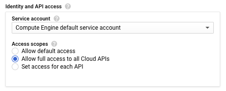

2. In the search box at the top, enter “Firewall” and select the matching suggestion”Firewall rules”under “VPC network”

    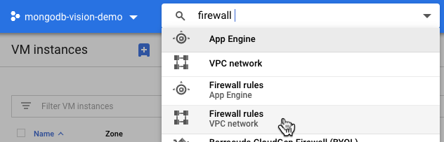

3.  Click “Create Firewall Rule” at the top to create a new rule to open up the needed port for our new server

    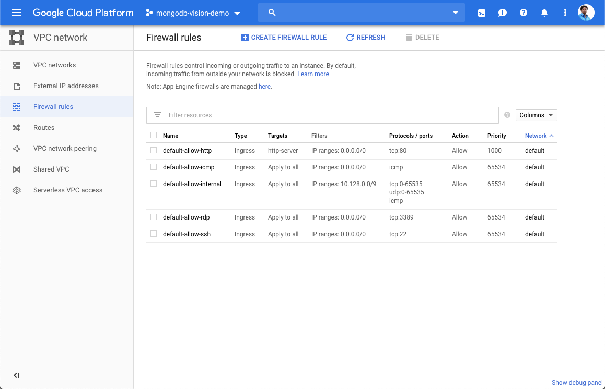

4.  Enter the following details and click “Create”:

        Name: port8080
        Targets: All instances in the network
        Source IP ranges:   [your specific source IP / range]  For testing, you can enter your IP using the Google search “what is my ip”.
        Protocols and ports:  
            tcp: 8080
        
    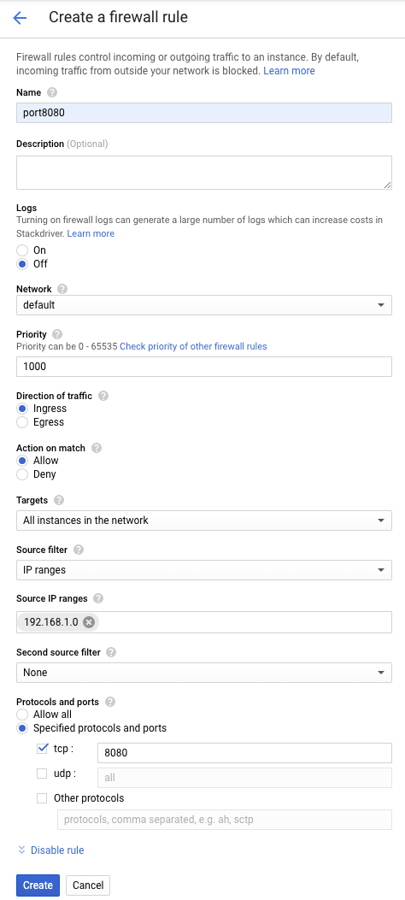

5.  In the search field up top, enter “compute engine” and select the suggestion:

    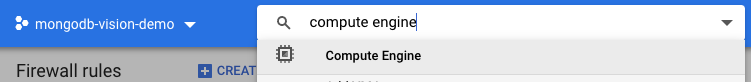

6.  After your instance is created, SSH to your instance by clicking on the SSH button of your instance.

    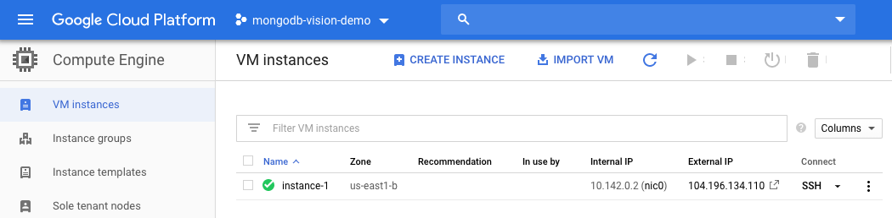

7.  You should see a CloudShell window similar to this open...

    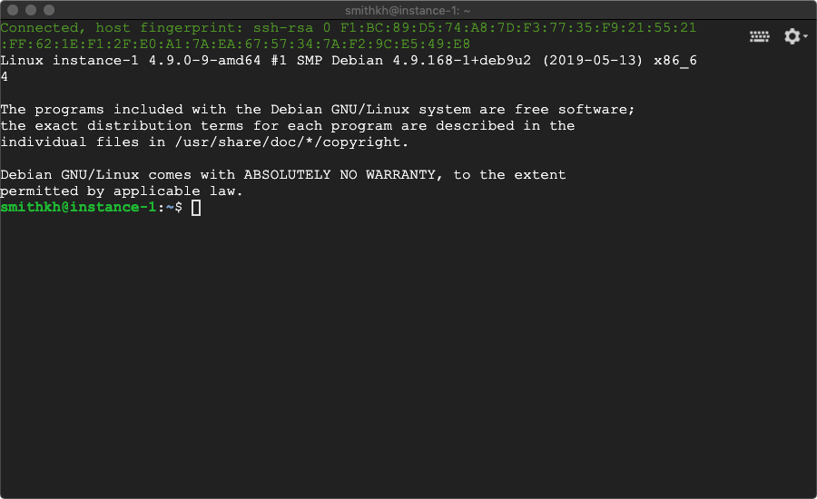

8.  Install Node JS and Express by executing following commands:

        sudo apt-get update
        sudo apt-get install -y nodejs
        sudo apt-get install npm
        curl -sL https://deb.nodesource.com/setup_8.x | sudo -E bash -
        sudo apt-get install -y build-essential
        npm install nconf
        npm install express --save
        npm install mongodb@2.2.33 --save

9.  Install vision library:

        npm install --save @google-cloud/vision
   
10. Install storage library:

        npm install --save @google-cloud/storage

11. Enable cloud vision API:

        gcloud services enable vision.googleapis.com

12. Create bucket with a name for your project.  Replace [bucketname] with your unique name.  Note buckets have to have a globally unique name to be accepted:

        gsutil mb gs://[bucketname]

        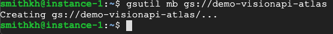        

13. Make bucket public:

        gsutil defacl set public-read gs://[bucketname]

        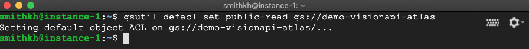   

14. Let's switch back to the console and navigate to our new Google Cloud Storage bucket, by entering “Storage” in the search query and selecting the recommendation.  
    Please verify your new bucket exists and select it
    
    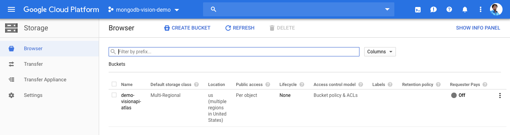

15. Once selected, you can drag and drop a few sample images for our demo server to process:   

    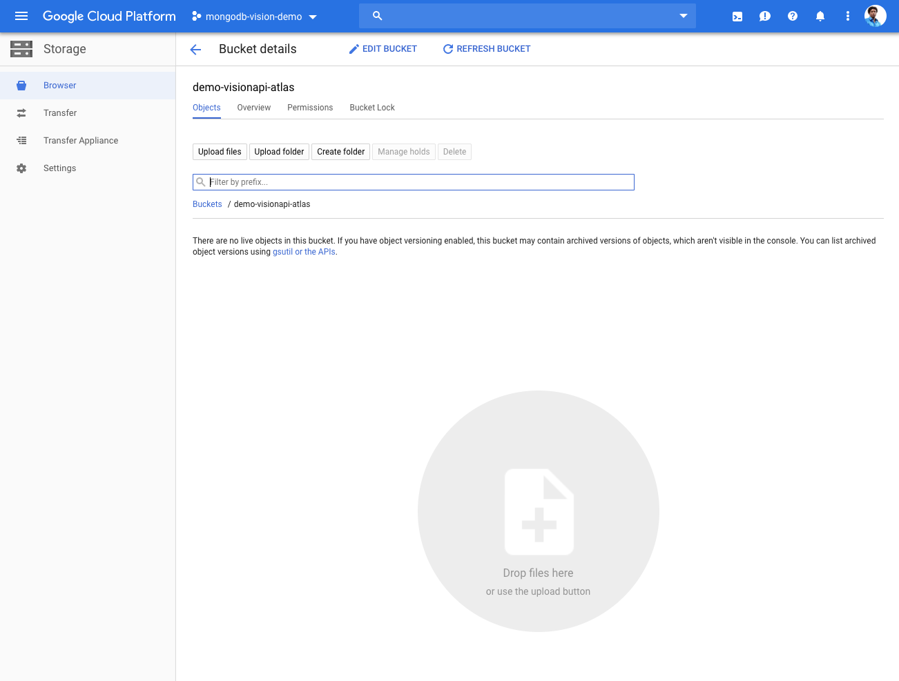

    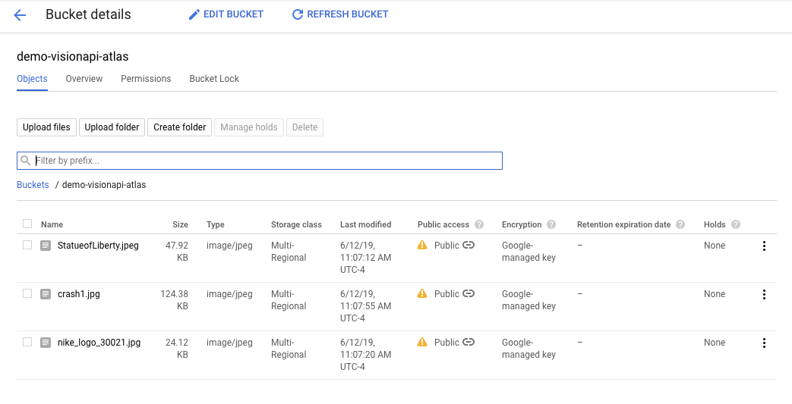    

16. Switch back to your SSH window and lets create a folder named: “nodejs-express-mongodb”:

        mkdir nodejs-express-mongodb

17. Change directory to this folder:

        cd nodejs-express-mongodb

18. Preparing the app

        1.  Initialize a package.json file with the following command:

                npm init

                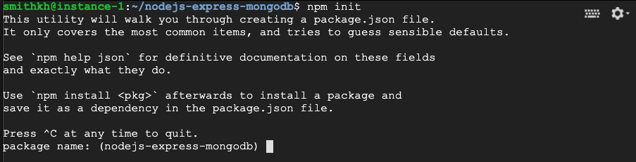

            Setup a new node project. You can press enter to accept the default settings, but when you get to entry point, type in “server.js” 

                

            Enter “yes” when prompted and press enter

        2.  We need to create a public folder for our server and select it, by entering the following commands:

                mkdir public
                cd public

                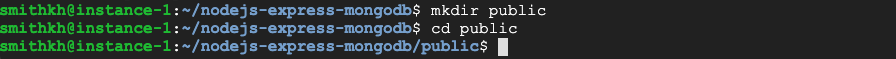

        3.  Let’s create the client side file using the following command and copying the following script content into the editor. Save the file using Ctrl + X:

                nano client.js

                        ****************************************

                        console.log('Client-side code running');

                        const button = document.getElementById('myButton');

                        button.addEventListener('click', function(e) {

                          console.log('Vision API Trigger button  was clicked');

                          fetch('/clicked', {method: 'POST'})

                            .then(function(response) {

                              if(response.ok) {

                                console.log('Label was recorded');

                                return;

                              }

                              throw new Error('Request failed.');

                            })

                            .catch(function(error) {

                              console.log(error);

                            });

                        });

                        setInterval(function() {

                          fetch('/clicks', {method: 'GET'})

                            .then(function(response) {

                              if(response.ok) return response.json();

                              throw new Error('Request failed.');

                            })

                            .then(function(data) {

                              document.getElementById('counter').innerHTML = `Number of total files processed ${data.length}`;

                            })

                            .catch(function(error) {

                              console.log(error);

                            });

                        }, 1000);
                        ****************************************

        4.  Let’s create the web server home page using the following command and entering the following script content into the editor. Save the file using Ctrl + X:

                nano index.html

                         ****************************************
                        <!DOCTYPE HTML>

                        <html>

                        <head>

                            <title>Gaining ML insight with Google Vision API and MongoDB Atlas</title>

                        </head>

                        <body>

                        

                         <meta charset='utf-8'><meta charset="utf-8"><b style="font-weight:normal;">

DEMO: Gaining ML insight with Google Vision API and MongoDB on Google Cloud</b>

    

                           

                            <button id="myButton">Trigger batch Vision API job!</button>

                          

                          </body>

                              

                        </html>
                         ****************************************

        5.  Navigate back to your “nodejs-express-mongodb” folder and let’s create the server side file with the following commands and script contents. Save the file using Ctrl + X :

        NOTE:  See the sections where you need to enter your GCS bucket name previously created and your Atlas Connection string. Do not forget to edit your connection string with your DB password.  

                cd ..
                nano server.js                      

                        ****************************************
                        console.log('Server-side code running');

                        const express = require('express');

                        const MongoClient = require('mongodb').MongoClient;

                        const app = express();

                        const gcpbucket = 'gs://[INSERT YOUR GCS BUCKET NAME]';

                        var strOutput;

                        var strOutput2;

                        var strOutput3;

                        // serve files from the public directory

                        app.use(express.static('public'));

                        // connect to the db and start the express server

                        let db;

                        // Replace the URL below with the URL for your database

                        const url =  '[INSERT YOUR MONGODB ATLAS CONNECTION STRING]';

                        MongoClient.connect(url,(err, database) => {

                          if(err) {

                            return console.log(err);

                          }

                          console.log('Successfully connected to MongoDB Atlas');

                          db = database;

                          // start the express web server listening on 8080

                          app.listen(8080, () => {

                            console.log('listening on 8080');

                            console.log('Input GCP bucket is set to ' + gcpbucket);

                          });

                        });

                        // serve the homepage

                        app.get('/', (req, res) => {

                          res.sendFile(__dirname + '/index.html');

                        });

                          // add a document to the DB collection recording the click event

                           app.post('/clicked', (req, res) => {

                           listFiles(gcpbucket);  

                          res.sendStatus(201);

                         

                        });

                        // get the click data from the database

                        app.get('/clicks', (req, res) => {

                          db.collection('clicks').find().toArray((err, result) => {

                            if (err) return console.log(err);

                            res.send(result);

                          });

                        });

                        async function detectLandmark(fileName3) {

                          // [START vision_landmarks_detection]

                          // Imports the Google Cloud client library

                          const vision = require('@google-cloud/vision').v1p1beta1;

                          // Creates a client

                          const client = new vision.ImageAnnotatorClient();

                           // Performs safe search detection on the local file

                          const [result] = await client.landmarkDetection(fileName3);

                          const landmarks = result.landmarkAnnotations;

                          console.log(fileName3);

                          console.log('Landmarks:');

                          strOutput3 = fileName3  + "  " + '\n' ;

                          landmarks.forEach(landmark => {

                          console.log(landmark);

                          strOutput3 =  strOutput3 + "  " + "Description:" + landmark.description + "  " + "Score: " + landmark.score + "  " + '\n';

                           });

                          const click3 = {visionAPIResult: strOutput3};

                          console.log(click3);

                        db.collection('Landmarks').save(click3, (err, result) => {

                            if (err) {

                              return console.log(err);

                            }

                            console.log('Vision API Landmarks added to MongoDB Atlas Cluster');

                          //  res.sendStatus(201);

                            });

                          // [END vision_landmarks_detection]

                        }

                        async function detectSafeSearch(fileName2) {

                          // [START vision_safe_search_detection]

                          // Imports the Google Cloud client library

                          const vision = require('@google-cloud/vision').v1p1beta1;

                          // Creates a client

                          const client = new vision.ImageAnnotatorClient();

                           // Performs safe search detection on the local file

                          const [result] = await client.safeSearchDetection(fileName2);

                          const detections = result.safeSearchAnnotation;

                          console.log(fileName2);

                          console.log('Safe search:');

                          console.log(`Adult: ${detections.adult}`);

                          console.log(`Medical: ${detections.medical}`);

                          console.log(`Spoof: ${detections.spoof}`);

                          console.log(`Violence: ${detections.violence}`);

                          console.log(`Racy: ${detections.racy}`);

                          strOutput2 = fileName2  + "  " + '\n' ;

                          strOutput2 = strOutput2 + "  " + "Adult:"  + detections.adult + "  " + '\n' + "  " + "Medical:" + detections.medical + "  " + '\n' + "  " + "Spoof:" + detections.spoof + "  " + '\n' + "  " + "Violence:" + detections.violence + "  " + '\n' + "  " + "Racy:" + detections.racy + "  " + '\n';

                         

                          const click2 = {visionAPIResult: strOutput2};

                          console.log(click2);

                        db.collection('SafeSearch').save(click2, (err, result) => {

                            if (err) {

                              return console.log(err);

                            }

                            console.log('Vision API SafeSearch labels added to MongoDB Atlas Cluster');

                          //  res.sendStatus(201);

                            });

                          // [END vision_safe_search_detection]

                        }

                        async function detectFulltext(fileName) {

                        // Imports the Google Cloud client library

                        const vision = require('@google-cloud/vision');

                         

                        // Creates a client

                        const client = new vision.ImageAnnotatorClient();

                         

                        // Performs label detection on the image file

                          const [result] = await client.labelDetection(fileName);

                          const labels = result.labelAnnotations;

                          console.log(fileName);

                          strOutput = fileName + "  " + '\n' ;

                         

                          labels.forEach(label => {

                          console.log(label.description);

                          console.log(label.score);

                          strOutput = strOutput + label.description + "  " + label.score + "  " + '\n';

                          });

                           const click = {visionAPIResult: strOutput};

                           console.log(click);

                          // console.log(db);

                           db.collection('Labels').save(click, (err, result) => {

                            if (err) {

                              return console.log(err);

                            }

                            console.log('Vision API output labels  added to MongoDB Atlas Cluster');

                          //  res.sendStatus(201);

                            });

                        }

                           

                        async function listFiles(bucketName) {

                        // Imports the Google Cloud client library

                        const {Storage} = require('@google-cloud/storage');

                        // Creates a client

                        const storage = new Storage();

                        // Lists files in the bucket

                        const [files] = await storage.bucket(bucketName).getFiles();

                        console.log('Files:');

                        files.forEach(file => {

                        // Performs label detection on the image file

                        var  fileName = file.name;

                          detectFulltext(bucketName + '/'  + fileName);

                          // Performs Safe Search on the image file

                        var  fileName2 = file.name;

                          detectSafeSearch(bucketName + '/'  + fileName2);

                           // Performs Landmarks on the image file

                        var  fileName3 = file.name;

                          detectLandmark(bucketName + '/'  + fileName3);

                        });

                        }
                        ****************************************

19. Running our app. From nodejs-express-mongodb directory run server.js

    node server.js

    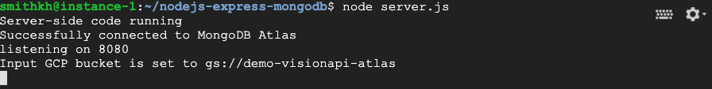

## Part 4: Kick off the batch process from any web-enabled client terminal

1.  Switch back to the console view to look at  “VM Instances” under “Compute Engine”.  Our external IP address is listed next to our instance.

    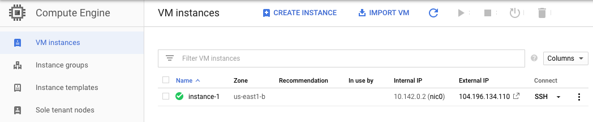

2.  Use a web-enabled client terminal to visit your new application using the external  URL in the previous step and specify port 8080.   You should see a webpage similar to this:

    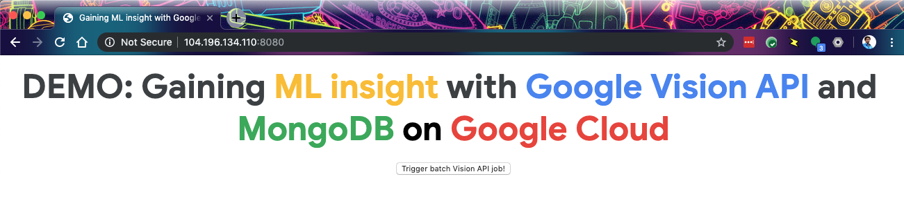

## Part 5: Verify our new metadata in both the conole and in our MongoDB Atlas database

1.  While monitoring your SSH console window, click on the “Trigger batch Vision API job” button to kick off our job.  If correct, you should see a flurry of results as it combs through your GCS bucket for images within seconds.  Here is an example when done:

    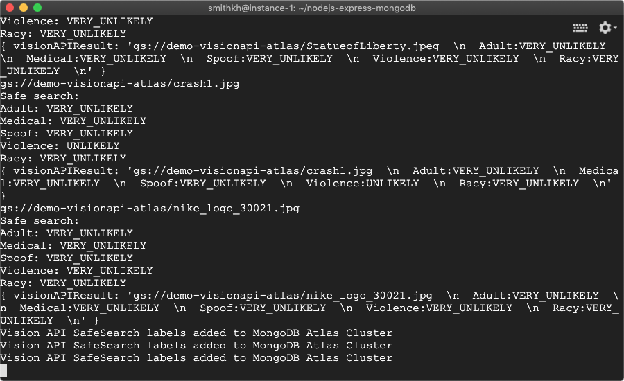

2.  Let’s switch over to our MongoDB Atlas cluster and verify our results.  Success!  Enjoy your new ML keywords!

    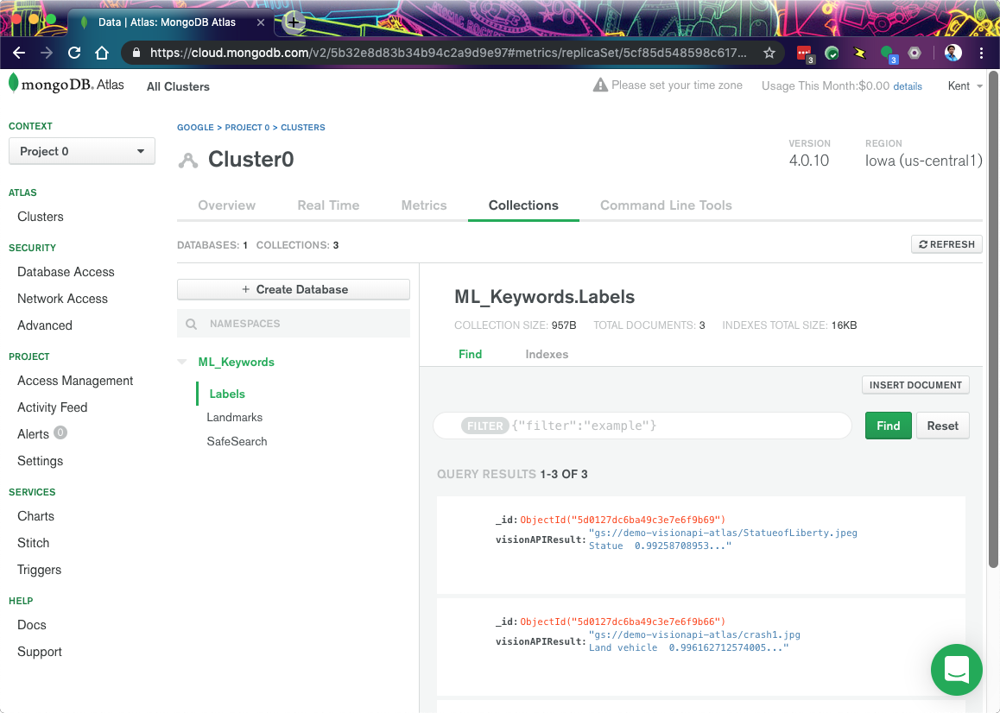
