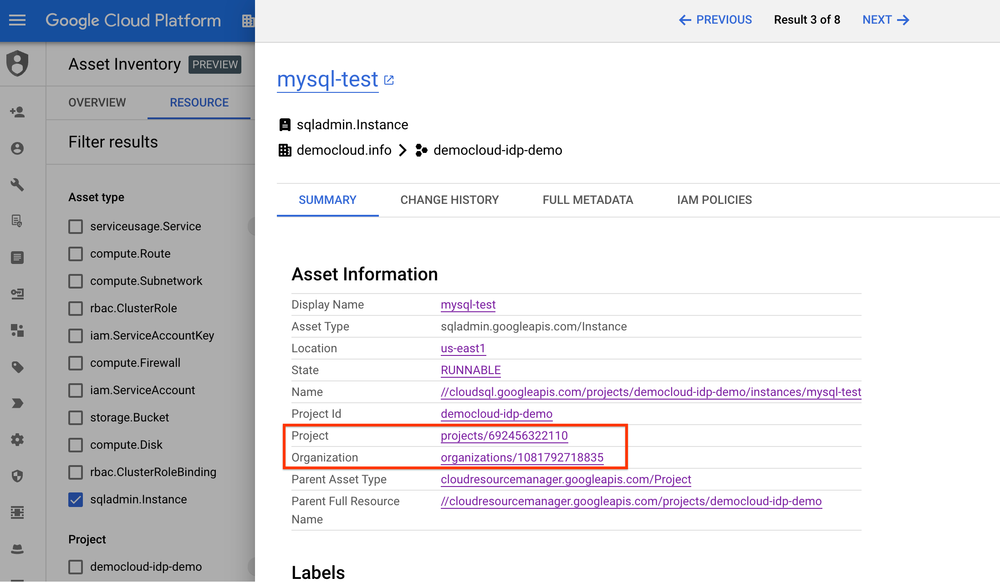
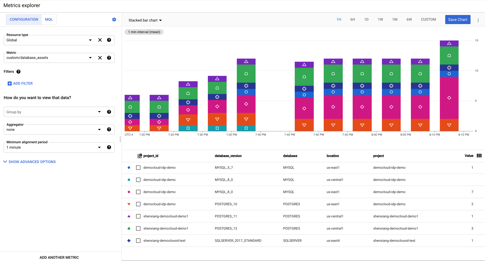

Xiang Shen | Solutions Architect | Google

<i>Contributed by Google employees.</i>

While there are quite a few metrics you can use to [monitor Cloud SQL](https://cloud.google.com/monitoring/api/metrics_gcp#gcp-cloudsql), no out-of-box solution lets you view your database footprint directly in Cloud Monitoring. This tutorial describes how to use inventory data from [Cloud Asset Inventory](https://cloud.google.com/asset-inventory) to create a custom metric for Cloud SQL in [Cloud Monitoring](https://cloud.google.com/monitoring) and visualize it. 

## Objectives 

+   Create a serverless system to ingest data from Asset Inventory.
+   Visualize ingested metrics data in Cloud Monitoring.

## Costs

This tutorial uses billable components of Google Cloud, including the following:

+   [Cloud Run](https://cloud.google.com/run/pricing)
+   [Cloud Scheduler](https://cloud.google.com/scheduler/pricing)
+   [Chargeable external metrics](https://cloud.google.com/stackdriver/pricing#metrics-chargeable)

To generate a cost estimate based on your projected usage, use the
[pricing calculator](https://cloud.google.com/products/calculator#id=38ec76f1-971f-41b5-8aec-a04e732129cc).

## Before you begin

For this tutorial, you need a Google Cloud [project](https://cloud.google.com/resource-manager/docs/cloud-platform-resource-hierarchy#projects). You can create a
new project or select a project that you have already created. When you finish this tutorial, you can avoid continued billing by deleting the resources that you
created. To make cleanup easiest, you may want to create a new project for this tutorial, so that you can delete the project when you're done. For details, see
the "Cleaning up" section at the end of the tutorial.

1.  [Select or create a Google Cloud project.](https://cloud.console.google.com/projectselector2/home/dashboard)
1.  [Enable billing for your project.](https://support.google.com/cloud/answer/6293499#enable-billing)
1.  Make sure that you have either a project [owner or editor role](https://cloud.google.com/iam/docs/understanding-roles#primitive_roles), or sufficient 
    permissions to use the services listed above.

This tutorial uses the [gcloud](https://cloud.google.com/sdk/gcloud) command-line tool. 
Because [Cloud Shell](https://cloud.google.com/shell) includes it already, we recommend that you run the commands in this tutorial in Cloud Shell, so that 
you don't need to install the tool locally.  

## Prepare your environment

### Set common variables  

You need to define several variables that control where elements of the infrastructure are deployed.

1.  In Cloud Shell, set the region, zone, and project ID:

        REGION=us-central1
        ZONE=${REGION}-b
        PROJECT_ID=[YOUR_PROJECT_ID]
   
    Replace `[YOUR_PROJECT_ID]` with your project ID. This tutorial uses the region `us-central1`. If you want to change the region, check that the zone 
    values are appropriate for the region that you specify.
   
1.  Enable all necessary services:

        gcloud services enable run.googleapis.com
        gcloud services enable monitoring.googleapis.com
        gcloud services enable logging.googleapis.com
        gcloud services enable cloudbuild.googleapis.com
        gcloud services enable cloudscheduler.googleapis.com
        gcloud services enable containerregistry.googleapis.com
        gcloud services enable cloudasset.googleapis.com

1.  Set the zone and project ID so that you don't have to specify these values in subsequent commands:

        gcloud config set project ${PROJECT_ID}
        gcloud config set compute/zone ${ZONE}
        gcloud config set run/platform managed
        gcloud config set run/region ${REGION}

### Get the sample code

The sample code for this tutorial is in the Google Cloud Community GitHub repository.

1.  Clone the repository:

        git clone https://github.com/GoogleCloudPlatform/community.git

1.  Go to the tutorial directory:

        cd community/tutorials/monitoring-data-asset-inventory

## Ingest data into Cloud Monitoring using a Cloud Scheduler job

1.  In this tutorial, you will gather all Cloud SQL instances in your organization and you need the corresponding permissions. You can use the following command to find your organization id. If you don't have the necessary organization permissions, you can change the scope to a folder or a project. 

        gcloud organizations list

1.  Granting the compute service account permissions to use Asset Inventory and Cloud Monitoring:

        ORGANIZATION_ID=[organization-id]
        PROJECT_NUMBER=$(gcloud projects describe ${PROJECT_ID} --format="value(project_number)")

        gcloud organizations add-iam-policy-binding $ORGANIZATION_ID \
        --member="serviceAccount:${PROJECT_NUMBER}-compute@developer.gserviceaccount.com" \
        --role='roles/cloudasset.viewer'

        gcloud organizations add-iam-policy-binding $ORGANIZATION_ID \
        --member="serviceAccount:${PROJECT_NUMBER}-compute@developer.gserviceaccount.com" \
        --role='roles/monitoring.metricWriter'
    
    Replace `[organization-id]` to your organization id.

1.  Creating a service account for Cloud Scheduler:

        gcloud iam service-accounts create cloud-scheduler-run \
          --display-name "Demo account"

1.  Create the container image:

        gcloud builds submit --tag gcr.io/${PROJECT_ID}/monitoring-cloudsql-asset

    You can read the source file `main.py` for more details.

1.  Deploy to Cloud Run:

        gcloud run deploy --image gcr.io/${PROJECT_ID}/monitoring-cloudsql-asset \
          --platform managed \
          --region ${REGION} \
          --timeout 10m \
          --no-allow-unauthenticated \
          --set-env-vars "SCOPE_ID=organizations/$ORGANIZATION_ID"

    The above command is using your organization as the scope. The scope can be a project, a folder, or an organization. For example, `projects/123456789012` is a project scope id, and `organizations/1010202030304` is an organization scope id.
    One way to get the info is to view the asset summary, for instance:
    
1.  When you are prompted for the service name, press Enter to accept the default name `monitoring-cloudsql-asset`.

    Deployment can take a few minutes. When the deployment is complete, the command line displays the service URL.

1.  For Cloud Run, give your service account permission to invoke your service:

        gcloud run services add-iam-policy-binding monitoring-cloudsql-asset \
          --platform=managed \
          --region=${REGION} \
          --member=serviceAccount:cloud-scheduler-run@${PROJECT_ID}.iam.gserviceaccount.com \
          --role=roles/run.invoker

1.  If you have never used App Engine, create an App Engine app:

        gcloud app create --region=$REGION
        
    Cloud Scheduler depends on App Engine.

1.  Create the Cloud Scheduler job:

        gcloud scheduler jobs create http monitoring-cloudsql-asset \
          --schedule "*/5 * * * *" \
          --http-method=POST \
          --uri=$(gcloud run services describe monitoring-cloudsql-asset --format="value(status.url)") \
          --oidc-service-account-email=cloud-scheduler-run@${PROJECT_ID}.iam.gserviceaccount.com

    This example creates a Cloud Scheduler job that runs every five minutes. You can change the schedule based on your needs and data granularity.

## View metrics in Cloud Monitoring

In this section, you configure Cloud Monitoring and create a chart for the custom metric. 

### Run the Cloud Scheduler job

If you don't want to wait for the Cloud Scheduler to invoke your Cloud Run instance and want to view the results faster, you can run the following command to invoke the job:

    gcloud scheduler jobs run monitoring-cloudsql-asset

### Create a monitoring chart

1.  In the [Cloud Console](https://console.cloud.google.com/), select your Google Cloud project.
1.  Go to the [Cloud Monitoring **Metrics explorer** page](https://console.cloud.google.com/monitoring/metrics-explorer).
1.  In the **Find resource type and metric** field, enter `database_assets`.
1.  Select the metric that starts with `custom.googleapis.com/database_asset`.

    You might need to refresh the page to see the metric name.

1.  For the resource type, enter `Global` and select the **Global** resource type.
1.  From the menu above the chart, choose **Stacked bar chart**.

    Within a few minutes, you should have a chart like the following:

    

1.  Click the **Save chart** button.
1.  Name the chart.
1.  In the **Dashboard** menu, select **New dashboard**.
4.  Enter the dashboard name `Demo dashboard` and click **Save**.

    There is now a new chart in this dashboard. You can find the dashboard from Cloud Monitoring.

__Note:__ this tutorial assumes you already have Cloud SQL instances running in the scope (project/folder/organization). If you don't have any, you will not see data in the chart. You can follow the steps in the [Cloud SQL doc](https://cloud.google.com/sql/docs/mysql/create-instance) to create database instances.

## Cleaning up

### Delete the project

The easiest way to eliminate billing is to delete the project you created for the tutorial.  

1.  In the Cloud Console, go to the [**Manage resources**](https://console.cloud.google.com/iam-admin/projects) page.
1.  In the project list, select the project that you want to delete and then click **Delete**
1.  In the dialog, type the project ID and then click **Shut down** to delete the project.

### Delete the individual resources

If you don't want to delete the whole project, you can delete the individual resources.

1.  Run the following commands to delete the respective resources: 

        gcloud scheduler jobs delete monitoring-cloudsql-asset

        gcloud run services delete monitoring-cloudsql-asset --region ${REGION}

        gcloud iam service-accounts delete cloud-scheduler-run@${PROJECT_ID}.iam.gserviceaccount.com

        gcloud organizations remove-iam-policy-binding $ORGANIZATION_ID \
        --member="serviceAccount:${PROJECT_NUMBER}-compute@developer.gserviceaccount.com" \
        --role='roles/cloudasset.viewer'

        gcloud organizations remove-iam-policy-binding $ORGANIZATION_ID \
        --member="serviceAccount:${PROJECT_NUMBER}-compute@developer.gserviceaccount.com" \
        --role='roles/monitoring.metricWriter'

1.  Go to the [Container Registry page](https://console.cloud.google.com/gcr/), and remove all of the images that you created. 

1.  Go to the [Cloud Monitoring dashboards page](https://console.cloud.google.com/monitoring/dashboards), and delete the dashboard that you created.

## What's next

+   Learn about [running Cloud Run services on a schedule](https://cloud.google.com/run/docs/triggering/using-scheduler).
+   Learn about [creating custom metrics](https://cloud.google.com/monitoring/custom-metrics/creating-metrics). 
+   Learn about [using Cloud Monitoring dashboards and charts](https://cloud.google.com/monitoring/dashboards).
+   Try out other Google Cloud features for yourself. Have a look at our [tutorials](https://cloud.google.com/docs/tutorials).
