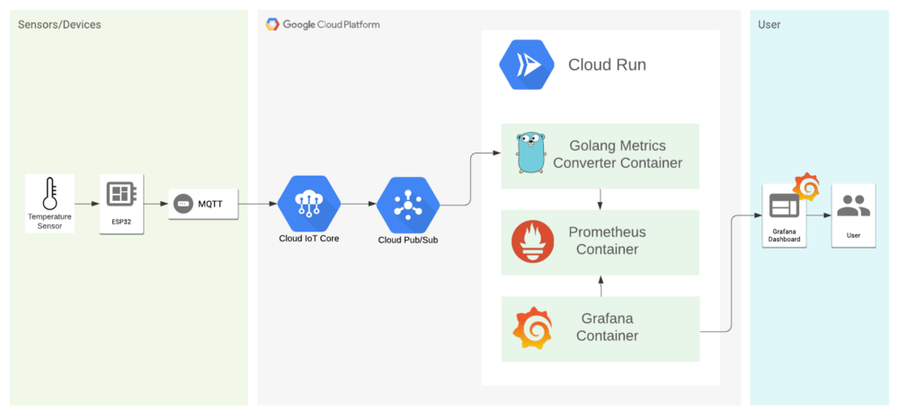
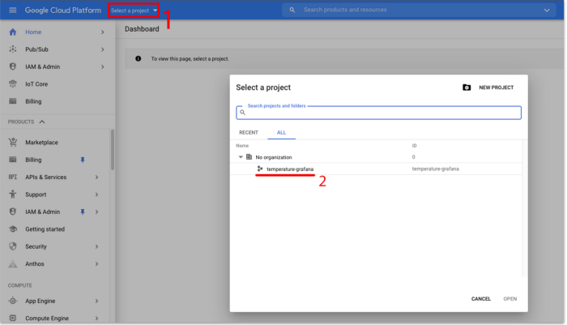
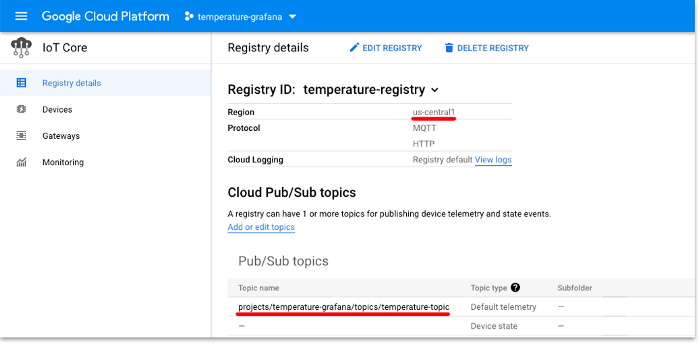
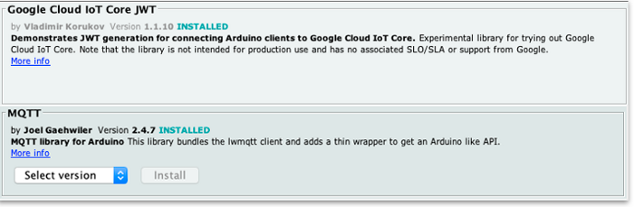
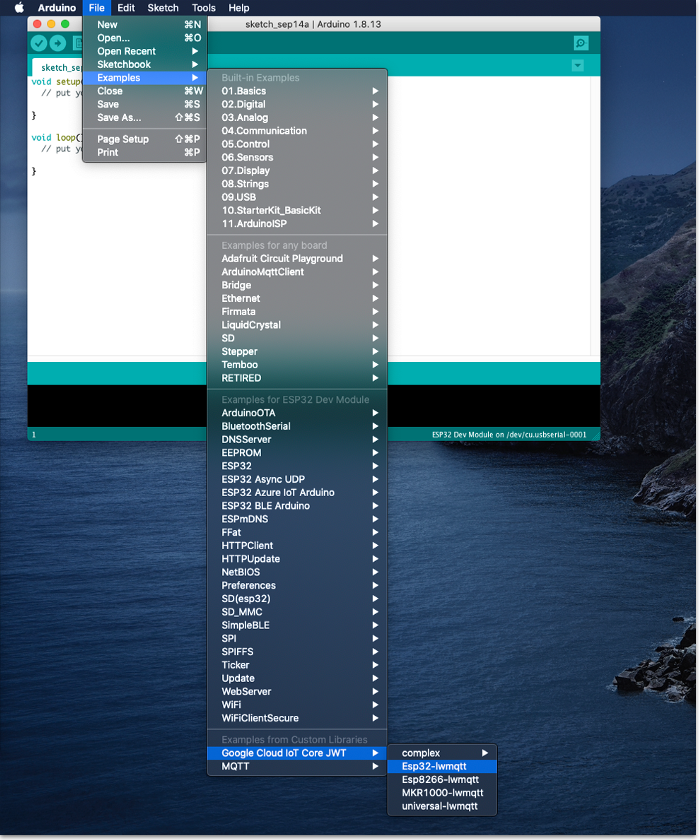
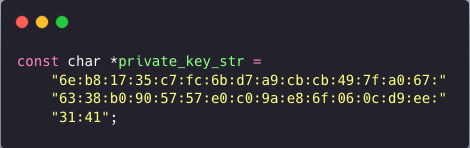

In this tutorial, we’ll be setting up a monitoring environment for IoT devices with an Arduino based board (ESP32), Grafana, and Google Cloud Platform tools.

## Objectives

*   Send temperature data from ESP32 built-in sensor to a temperature topic.
*   Create a Cloud Pub/Sub queue to receive that data.
*   Host a Golang service, Prometheus and Grafana container on Cloud Run.
*   Collect that temperature data, send to Prometheus and show on Grafana.
*   Create a Grafana dashboard.

## Costs

This tutorial uses billable components of Google Cloud, including the following:

*   [Cloud Run](https://cloud.google.com/run)
*   [Pub/Sub Queue](https://cloud.google.com/pubsub)
*   [IoT Core](https://cloud.google.com/solutions/iot)
*   [ESP32 Board](https://www.espressif.com/en/products/socs/esp32)

This tutorial should not generate any usage that would not be covered by the [free tier](https://cloud.google.com/free/), but you can use the [Pricing Calculator](https://cloud.google.com/products/calculator/) to generate a cost estimate based on your projected production usage.

## Before you begin

This tutorial assumes that you're using an Unix operating system.

I’ll use the [Google Cloud CLI](https://cloud.google.com/sdk/install) to set up our environment but feel free to use the web console.

## Getting started

First, let’s take a look into our infrastructure:



We’re using the built-in temperature sensor from ESP32 to sent data every 5 seconds to a pub/sub service in GCP. This data will be processed by a Go service and sent to Prometheus, and we’re using Grafana to visualize this data.

Grafana is a visualization tool. Prometheus is a data source for Grafana that collects the data in time series and displays in a way that Grafana understands. Since Prometheus can’t collect data directly to pub/sub, we need a third service to send it to Prometheus.

I made a [Github repository](https://github.com/leozz37/iot-monitoring-gcp-grafana) with all the codes used and instructions in this article, fell free to check it out.

So let’s get our hands dirty!

## Getting started with Google Cloud Platform

On Google Cloud, we’ll be using Core IoT to manage our devices, pub/sub as messaging system and Google Run to host our containers.

First, let’s set up our project. You’ll need a Google account and a credit card, but don’t worry you won’t be charged for anything (if you don’t do some heavy work), your free trial lasts for 3 months and you have US$300 to spend in any Google Cloud service. But you can always keep an eye on your billing board to not have any surprises on your credit card.

To make things easier, you can export this environment variables and just paste the commands from this tutorial (choose your own names):

```bash
export PROJECT_ID=
export REGION=
export TOPIC_ID=
export SUBSCRIPTION=
export REGISTRY=
export DEVICE_ID=
export USER_NAME=
export IMAGE_NAME=
export SERVICE_NAME=
```

> The export command should look like this:
>
> `export PROJECT_ID=temperature-grafana`

To start, log in with your Google account on CLI, create a project, and select the project created. Open a terminal and type the following commands:

```bash
$ gcloud auth login

$ gcloud projects create $PROJECT_ID

$ gcloud config set project $PROJECT_ID
```

You can check your project dashboard, and if everything goes well, you should see your project there.



Now let's enable pub/sub and IoT Core services in our project. But before that, you'll need to enable the billing into your project. To do that, run the following command and continue to the browser and link a profile:

```bash
$ open "https://console.cloud.google.com/billing/linkedaccount?project=$PROJECT_ID"

$ gcloud services enable cloudiot.googleapis.com pubsub.googleapis.com
```

We also need to permit IoT Core to publish into pub/sub service. Since IoT Core is responsible for our devices, and they don’t need to subscribe to any topic, we’re giving them just the publishing role.

```bash
$ gcloud projects add-iam-policy-binding $PROJECT_ID \
    --member=serviceAccount:cloud-iot@system.gserviceaccount.com \
    --role=roles/pubsub.publisher
```

Choose a region [here](https://cloud.google.com/compute/docs/regions-zones/). I’m using us-central1, but pick the one that better suits you. We also need a pub/sub topic, a subscription, and a registry.

On MQTT, pub/sub works like an Instagram/Twitter hashtag, where you can publish a post using a hashtag and who is following (or subscribed) to that hashtag, we'll see your post. The same works for MQTT, but the hashtag is the topic, the photo is the message and the people following that topic is the subscription.

A registry is like a bucket for our IoT devices. It allows us to group devices and set properties that they all share, such as connection protocol, data storage location, and Cloud pub/sub topics.

Follow these commands:

```bash
$ gcloud pubsub topics create $TOPIC_ID

$ gcloud pubsub subscriptions create --topic $TOPIC_ID $SUBSCRIPTION

$ gcloud iot registries create $REGISTRY \
    --region=$REGION \
    --event-notification-config=topic=temperature-topic \
    --enable-mqtt-config --enable-http-config
```

You can check your [registries](https://console.cloud.google.com/iot/registries), and if everything goes well, you should see your registry with your topic and subscription there.



## Setting up ESP32

We’ll be using the Espressif micro-controller ESP32 for its WiFi and a built-in temperature sensor. Also, I’m using the Arduino IDE, so make sure you have it installed and set up for ESP32 usage, if you need some help you can follow this [tutorial](https://randomnerdtutorials.com/installing-the-esp32-board-in-arduino-ide-windows-instructions/).

We need to generate an Elliptic Curve (EC) ES256 private/public key pair for our device authentication. Make sure to generate them into a “safe place”:

```bash
$ openssl ecparam -genkey -name prime256v1 -noout -out ec_private.pem

$ openssl ec -in ec_private.pem -pubout -out ec_public.pem
```

Now we have to register our device into Core IoT, so run the following commands:

```bash
$ gcloud iot devices create $DEVICE_ID \
    --region=$REGION \
    --registry=$REGISTRY \
    --public-key="path=./ec_public.pem,type=es256"
```

Install “Google Cloud IoT Core JWT” and lwmMQTT from Joel Garhwller libraries on your Arduino IDE. They’re responsible for connecting, authenticating, and sending messages to GCP.



Now let's use the library code example for ESP32-lwmqtt:



On ciotc_config.h, set your WiFi network and credentials:

```cpp
// Wifi network details
const char *ssid = "SSID";
const char *password = "PASSWORD";// Cloud iot details
const char *project_id = "project-id";
const char *location = "us-central1";
const char *registry_id = "my-registry";
const char *device_id = "my-esp32-device";
```

To get your private_key_str, run the following command at the same directory where you saved your public/private keys and paste the "priv" it into the code:

```bash
$ openssl ec -in ec_private.pem -noout -text
````

PS: The key length should be 32 pairs of hex digits. If your private key is bigger, remove the “00:” and if its smaller add “00:”. It should look like this:



You’ll need to set up your root_cert as well. Do the same steps as previously:

```bash
$ openssl s_client -showcerts -connect mqtt.googleapis.com:8883
```


Break the tutorial body into as many sections and subsections as needed, with concise headings.

### Use short numbered lists for procedures

Use numbered lists of steps for procedures. Each action that the reader must take should be its own step. Start each step with the action, such as *Click*, 
*Run*, or *Enter*.

Keep procedures to 7 steps or less, if possible. If a procedure is longer than 7 steps, consider how it might be separated into sub-procedures, each in its
own subsection.

### Provide context, but don't overdo the screenshots

Provide context and explain what's going on.

Use screenshots only when they help the reader. Don't provide a screenshot for every step.

Help the reader to recognize what success looks like along the way. For example, describing the result of a step helps the reader to feel like they're doing
it right and helps them know things are working so far.

## Cleaning up

Tell the reader how to shut down what they built to avoid incurring further costs.

### Example: Cleaning up

To avoid incurring charges to your Google Cloud account for the resources used in this tutorial, you can delete the project.

Deleting a project has the following consequences:

- If you used an existing project, you'll also delete any other work that you've done in the project.
- You can't reuse the project ID of a deleted project. If you created a custom project ID that you plan to use in the
  future, delete the resources inside the project instead. This ensures that URLs that use the project ID, such as
  an `appspot.com` URL, remain available.

To delete a project, do the following:

1.  In the Cloud Console, go to the [Projects page](https://console.cloud.google.com/iam-admin/projects).
1.  In the project list, select the project you want to delete and click **Delete project**.
1.  In the dialog, type the project ID, and then click **Shut down** to delete the project.

    

## What's next

Tell the reader what they should read or watch next if they're interested in learning more.

### Example: What's next

- Watch this tutorial's [Google Cloud Level Up episode on YouTube](https://youtu.be/uBzp5xGSZ6o).
- Learn more about [AI on Google Cloud](https://cloud.google.com/solutions/ai/).
- Learn more about [Cloud developer tools](https://cloud.google.com/products/tools).
- Try out other Google Cloud features for yourself. Have a look at our [tutorials](https://cloud.google.com/docs/tutorials).
