# Set up a Pi-Hole Ad Blocking VPN Server with a static Anycast IP on Google Cloud's Always Free Usage Tier
## Configure Full Tunnel or Split Tunnel OpenVPN connections from your Android, iOS, macOS, & Windows devices


The goal of this guide is to enable you to safely and privately use the Internet on your phones, tablets, and computers with a self-run VPN Server in the cloud. It can be run at no cost to you; shields you from intrusive advertisements; and blocks your ISP, cell phone company, public WiFi hotspot provider, and apps/websites from gaining insight into your usage activity.


Run your own privacy-first ad blocking service within the **[Free Usage Tier](https://cloud.google.com/free/)** on Google Cloud. **This guide gets you set up with a Google Cloud account, and walks you through setting up a full tunnel (all traffic) or split tunnel (DNS traffic only) VPN connection on your Android & iOS devices, and computers.**

Both Full Tunnel and Split Tunnel VPN connections provide DNS based ad-blocking over an encrypted connection to the cloud. The differences are:

- A Split Tunnel VPN allows you to interact with devices on your Local Network (such as a Chromecast or Roku).
- A Full Tunnel VPN can help bypass misconfigured proxies on corporate WiFi networks, and protects you from Man-In-The-Middle SSL proxies.

| Tunnel Type | Data Usage | Server CPU Load | Security | Ad Blocking |
| -- | -- | -- | -- | -- |
| full | +10% overhead for vpn | moderate | 100% encryption | yes
| split | just kilobytes per day | very low | dns encryption only | yes

The technical merits of major choices in this guide are outlined in [REASONS.md](./REASONS.md).

---


# Google Cloud Login and Account Creation

Go to https://cloud.google.com and click **Console** at the top right if you have previously used Google's Cloud Services, or click **Try Free** if it's your first time.

 ### Account Creation
 - **Step 1 of 2** <br> Agree to the terms and continue. <br>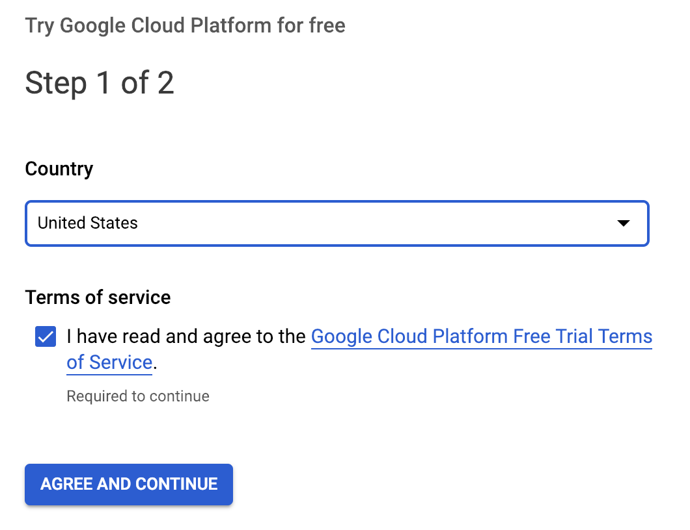
 - **Step 2 of 2** <br> Set up a payments profile and continue <br>
 ### Project & Compute Engine Creation
 - Click the Hamburger Menu at the top left: <br>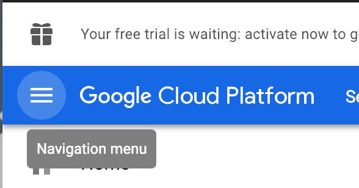
 - Click **Compute Engine**: <br>
 - Select **VM instances**: <br>
 - Create a Project if you don't already have one: <br>
- Enable billing for this Project if you haven't already: <br>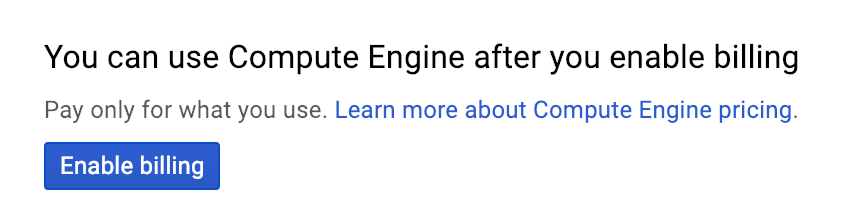
- Compute Engine will begin initializing: <br>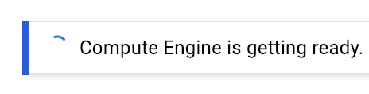


# Compute Engine Virtual Machine Setup

- Create a Virtual Machine instance on Compute Engine: <br>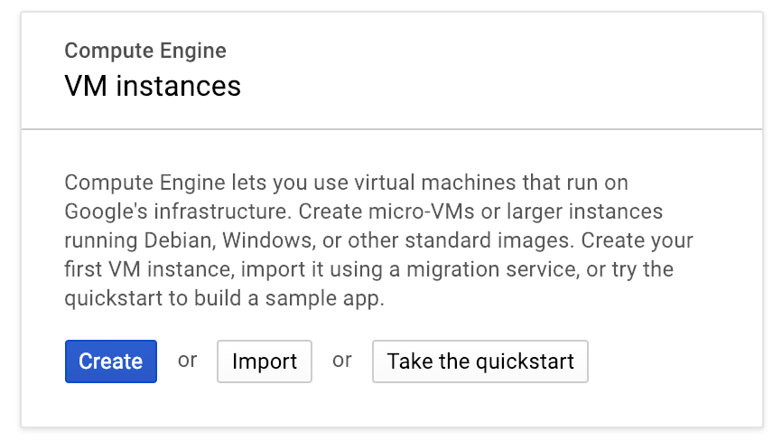
- Customize the instance: <br>
- Name your Virtual Machine **pi-hole**. <br>Your Region selection should be any US region only (excluding Northern Virginia [us-east4]). I have used **us-east1** and the **us-east1-b** zone because it is closest to me. <br>Choose a **micro** Machine Type in the dropdown. <br>Change the **Boot Disk** to be **30GB** if you plan on keeping your DNS lookup records for any reason, otherwise the default **10GB** disk allocation is adequate. <br>**Allow HTTP traffic** in the Firewall (add a checkmark).
<br>**Allow HTTPS traffic** in the Firewall (add a checkmark). <br>
- Expand **Management, Security, disks, networking, sole tenancy** and click the **Network** tab. Click the Pencil icon under **Network Interfaces**. <br>
- The External IP Address should not be Ephemeral. Choose **Create IP Address** to Reserve a New Static IP Address <br>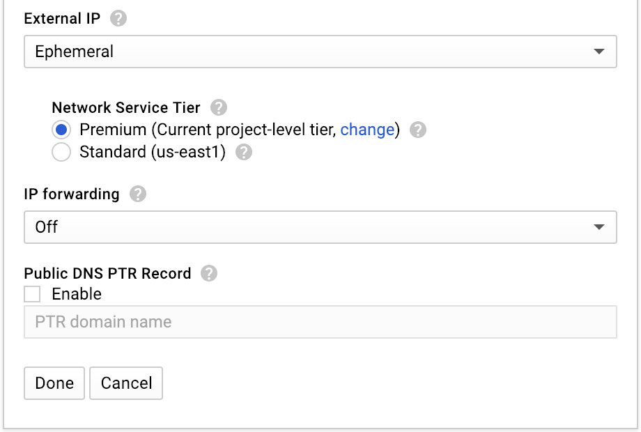 <br>
- You can log into your Virtual Machine via SSH in a Browser by clicking the SSH button. Make note of your External IP (it will be different from the screenshot below).<br>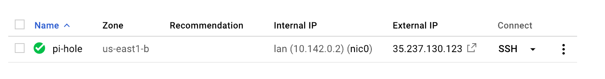
- Click the Hamburger Menu at the top left, click **VPC Network** and click **Firewall Rules**. <br> <br>Click **Create Firewall Rule** at the top center of the page. The name of your rule should be `allow-openvpn`, change the **Targets** dropdown to **All instances in the network**. The **Source IP Ranges** should be `0.0.0.0/0`. The **udp** checkbox should be selected, and the port number next to it should be changed from `all` to `1194`. Then click the **Create** button. You can disable the `default-allow-rdp` rule which Google set up with a default action of Allow, but because our server does not run any service on Port 3389 it is harmless to leave this rule alone. Do not disable the **default-allow-ssh** firewall rule, or you will disable the browser-based SSH from within the Google Cloud Console.


# Debian Update & Upgrade

Once you log into your Virtual Machine via SSH, you want to update and upgrade it.

Ensure you have elevated root privileges by running this command in the bash shell:

```
sudo su
```

Update and upgrade by running this command in the bash shell:

```
apt-get update && apt-get upgrade -y
```


# Pi-Hole Installation

Pi-Hole is a DNS based adblocker.

Ensure you have elevated root privileges by running this command in the bash shell:

```
sudo su
```

Install Pi-Hole by running this command in the bash shell:

```
curl -sSL https://install.pi-hole.net | bash
```

You will flow into a series of prompts in a blue screen.

- Choose OK or answer positively for all the prompts until the "Select Protocols" question appears. IPv6 needs to be deselected as shown below: <br>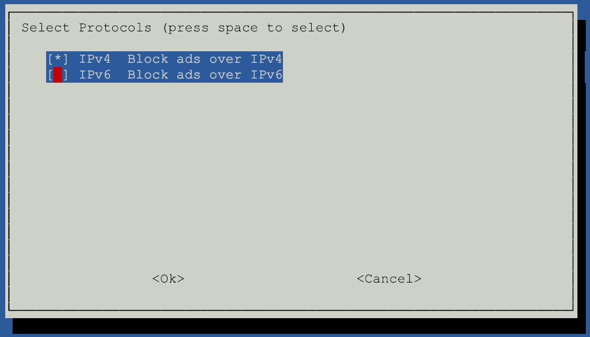

- Choose OK or answer positively for all the other prompts.

Set a strong password that you will remember for the Web Interface

```
pihole -a -p
```

- Log into the web interface using the External IP that you noted down earlier at<br> `http://your-external-ip/admin/settings.php?tab=dns`

- Click **Settings**, and navigate to **DNS**. <br>Set your **Interface Listening Behavior** to **Listen on All Interfaces** on this page: <br>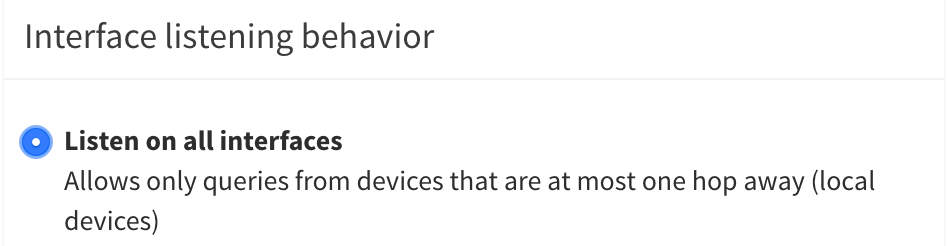

- Click the **Save** Button at the bottom of the page.

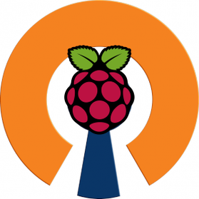

# PiVPN Installation

PiVPN is an OpenVPN setup and configuration tool.

Ensure you have elevated root privileges by running this command in the bash shell:

```
sudo su
```

Install PiVPN by running this command in the bash shell:

```
curl -L https://install.pivpn.io | bash
```

You will flow into a series of prompts in a blue screen. All of the default values are appropriate.

- Choose OK or answer positively for all the prompts until you have to choose an upstream DNS provider. The default answer is Google. Choose **Custom** and set an IP Address of **10.8.0.1** <br>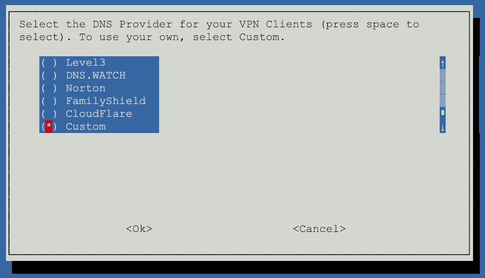<br>

The default answer to reboot is **No** at the end of the installer. It is fine to say **No**, we have a few more things to edit while we're logged in as root.


# OpenVPN Configuration

Ensure you have elevated root privileges by running this command in the bash shell:

```
sudo su
```

Get into the openvpn directory by running this command in the bash shell:

```
cd /etc/openvpn
```

## Server Configuration for VPN over UDP on Port 1194

Edit **server.conf**. I use **nano** to edit by running this command in the bash shell:

```
nano server.conf
```

Comment out the line which reads `push "redirect-gateway def1"` so it reads as follows:

> ```
> # push "redirect-gateway def1"
> ```

The longer the keep-alive interval the longer it will take either end of the openvpn connection to detect whether the connection is no longer alive. Because mobile devices often lose connectivity and regain it, lower values are desirable.

Comment out `keepalive 1800 3600` and add `keepalive 10 60` below it, so it appears as follows:

> ```
> # keepalive 1800 3600
> keepalive 10 60
> ```

Comment out the line which reads `cipher AES-256-CBC` and add `cipher AES-128-GCM` below it, so it reads as follows:

> ```
> # cipher AES-256-CBC
> cipher AES-128-GCM
> ```

At the bottom of the file add the following lines:

> ```
> # performance stuff
> fast-io
> compress lz4-v2
> push "compress lz4-v2"
> ```

Press `CTRL` `O` to bring up the save prompt at the bottom of Nano, press **Enter** to save. Then press `CTRL` `X` to exit

## Server Configuration for VPN over TCP on Port 443

Ensure you have elevated root privileges by running this command in the bash shell:

```
sudo su
```

Get into the openvpn directory by running this command in the bash shell:

```
cd /etc/openvpn
```

To accept incoming OpenVPN connections over TCP on port 443 we need a separate configuration file. We can clone our existing configuration as a starting point, by running this command in the bash shell:

```
cp server.conf server_tcp443.conf
```

Edit **/etc/iptables/rules.v4**. I use **nano** to edit by running this command in the bash shell:

```
nano /etc/iptables/rules.v4
```

Add the correct routing rule (the second line)

```
> -A POSTROUTING -s 10.8.0.0/24 -o eth0 -j MASQUERADE
> -A POSTROUTING -s 10.9.0.0/24 -o eth0 -j MASQUERADE
```

Press `CTRL` `O` to bring up the save prompt at the bottom of Nano, press **Enter** to save. Then press `CTRL` `X` to exit

Edit **server_tcp443.conf**. I use **nano** to edit by running this command in the bash shell:

```
nano server_tcp443.conf
```

Replace the `proto udp` and `port 1194` lines with:

> ```
> proto tcp
> port 443
> ```

Edit the `server 10.8.0.0 255.255.255.0` line to reflect an IP address of **10.9.0.0**, so it reads as follows:

> ```
> server 10.9.0.0 255.255.255.0
> ```

Edit the `push "dhcp-option DNS 10.8.0.1"` line to reflect an IP address of **10.9.0.1**, so it reads as follows:

> ```
> push "dhcp-option DNS 10.9.0.1"
> ```

Comment out `keepalive 10 60` and add `keepalive 10 120` below it, so it appears as follows:

> ```
> # keepalive 10 60
> keepalive 10 120
> ```

Comment out `fast-io` so it looks like this:

> ```
> # fast-io
> ```

Press `CTRL` `O` to bring up the save prompt at the bottom of Nano, press **Enter** to save. Then press `CTRL` `X` to exit

Add the OpenVPN service on Port 443 by running this command in your bash shell:

```
systemctl enable openvpn@server_tcp443.service
```

## Finalize VPN Confgurations on Server

Reboot the server by running this command in your bash shell:

```
shutdown -r now
```


# Managing the PiVPN

Connect to the Pi-Hole server and set up an OpenVPN Client Profile. (You do not need to have elevated root privileges to do this.)

```
pivpn add nopass
```

Give your client profile a name. I like to use an alphanumeric string composed of the user's first name, and their device's make and model (no spaces and no special characters).

> ## NOTE
> Make a new client profile for every device. DO NOT share a client profile between two different devices.

This command will output a success message which looks like this:

  > ```
  > ========================================================
  > Done! mypixel3xl.ovpn successfully created!
  > mypixel3xl.ovpn was copied to:
  >   /home/myusername/ovpns
  > for easy transfer. Please use this profile only on one
  > device and create additional profiles for other devices.
  > ========================================================
  > ```

To get the **mypixel3xl.ovpn** file to your phone it is easiest to maximize your SSH window and print the file to the terminal window, to copy & paste the output:

```
cat ~/ovpns/mypixel3xl.ovpn
```

Press `CTRL` `-` until the screen zooms out to a point where you can see the entire ovpn file printed on the screen. The first line will have the word `client` and the last line is `</tls-crypt>`. Highlighting this entire chunk with a mouse will cause a scissor icon to appear in the middle of your SSH window, this means this selection has been copied to your clipboard.

## Saving a Split Tunnel VPN Client Profile for UDP VPN Connections on Port 1194

Paste this into your favorite Text Editor and save the file with a name that is clear: **mypixel3xl-udp-1194-split-tunnel.ovpn**

Around Line 12, edit the line which reads `cipher AES-256-CBC` and change it to read:

> ```
> cipher AES-128-GCM
> ```

## Saving a Full Tunnel VPN Client Profile for UDP VPN Connections on Port 1194

Copy the contents of **mypixel3xl-udp-1194-split-tunnel.ovpn** and paste it into your favorite Text Editor, save the file with a name that is clear: **mypixel3xl-udp-1194-full-tunnel.ovpn**

Below `cipher AES-128-GCM` add this line:

> ```
> redirect-gateway def1
> ```

## Saving a Split Tunnel VPN Client Profile for TCP VPN Connections on Port 443

Copy the contents of **mypixel3xl-udp-1194-split-tunnel.ovpn** and paste it into your favorite Text Editor, save the file with a name that is clear: **mypixel3xl-tcp-443-split-tunnel.ovpn**

Change `proto udp` on Line 3 to `proto tcp`

> ```
> proto tcp
> ```

Change the `1194` at the end of Line 4 to `443`, do not change the IP address on this line (it is your Google Compute Engine Virtual Machine's external IP address):

> ```
> remote YOUR-EXTERNAL-IP-IS-HERE-LEAVE-THIS-AS-IT-IS 443
> ```


## Saving a Full Tunnel VPN Client Profile for TCP VPN Connections on Port 443

Copy the contents of **mypixel3xl-tcp-443-split-tunnel.ovpn** and paste it into your favorite Text Editor, save the file with a name that is clear: **mypixel3xl-tcp-443-full-tunnel.ovpn**

Below `cipher AES-128-GCM` add this line:

> ```
> redirect-gateway def1
> ```

## Make these .ovpn files available on your phone or tablet

E-mail these files to yourself, upload in Google Drive, or use whatever secure method you prefer to transfer this file to your device. It is safe to download this file to your device.

> ## WARNING
> Anyone that gets one of these **.ovpn** files can connect to your server.

# Full & Split Tunnel VPN on Android & iOS Devices


## "OpenVPN for Android" on Android for Split Tunnel VPN

This is open source software.

<a href="https://f-droid.org/repository/browse/?fdid=de.blinkt.openvpn" target="_blank">
</a>
<a href="https://play.google.com/store/apps/details?id=de.blinkt.openvpn" target="_blank">
</a>

Install the "OpenVPN for Android" application on your Android device.

When the "OpenVPN for Android" opens you are in the **Profiles** Tab. You will have to perform the following steps for **mypixel3xl-udp-1194-split-tunnel.ovpn**, and again for **mypixel3xl-tcp-443-split-tunnel.ovpn**
- Import your Profile, click the `+` at the top right. <br>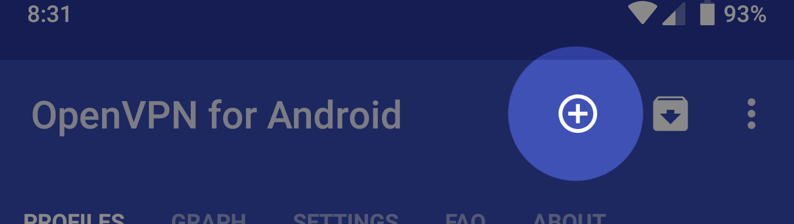
- Then click **Import** at the bottom left of the modal that appears.
- Click the Hamburger Menu at the top left to choose **Google Drive**, or your **Downloads** folder, depending on what method you used to get the **.ovpn** file to your phone.
- Click the pencil icon next to the VPN profile you imported. <br>
  - Click the **Server List** Tab.
    - **Connect Timeout** should be **60** for UDP VPN Profiles and **120** for TCP VPN Profiles.
  - Click the **IP AND DNS** Tab.
    - **No local binding** should be enabled
    - **Override DNS Settings by Server** should be enabled
      - **searchDomain** should be empty
      - **DNS Server** should be **10.8.0.1**
      - **Backup DNS Server** should be empty
  - Click the **Routing** Tab.
    - **Bypass VPN for local networks** should be enabled.
    - **Block IPv6 (or IPv4) if not used by the VPN** should be enabled.
    - Click **Excluded Networks** under IPv4 and add this:
      ```
      10.0.0.8/8 172.16.0.0/12 192.168.0.0/16
      ```
  - Under the **Authentication/Encryption** Tab
    - The **Encryption Cipher** should be `AES-128-GCM`
  - Under the **Allowed Apps** Tab
    - the **Carrier Services**, **Cloud Print**, **Drive**, **Duo**, **Gmail**, **Google Play Services**, **Google Play Store**, **Messages**, **Phone**, **Phone and Messaging Storage** and **Phone Services** apps should have a checkmark.

- Click the back button a couple times until you are at the **Profiles** Tab again.

Click the **Settings** Tab:
- **OpenVPN 3 Core** should have a checkmark
- click **Default VPN** and choose the VPN you have imported
- **Connect on Boot** should have a checkmark
- **Pause VPN connection after screen off** should be enabled if you wish to save your battery and reduce data usage, and only want to block things while you're actively using your phone.

Click the back button a couple times until you are at the **Profiles** Tab again.
- Clicking the name of the VPN profile you imported should trigger a connection.


## "OpenVPN Connect" on Android for Full Tunnel VPN

This is open source software.

<a href="https://play.google.com/store/apps/details?id=net.openvpn.openvpn" target="_blank">
</a>

Install the "OpenVPN Connect" application on your Android device.

Download the **mypixel3xl-udp-1194-full-tunnel.ovpn** and **mypixel3xl-tcp-443-full-tunnel.ovpn** files from your E-mail or your Google Drive to your Android Phone or Tablet. These files will be saved to your device's "Download" folder by default.

When the "OpenVPN Connect" application opens up, in its home screen you will see 3 options, **Private Tunnel**, **Access Server**, and **OVPN Profile**. Click on **OVPN Profile**.

Import and Add an **.ovpn** client profile by tapping your **.ovpn** filename, and then tapping **Import** on the top right, and then tapping **Add**. If you have already imported a client profile already, you can import more client profiles by pressing the `+` button at the bottom right.

Click the Hamburger Menu at the top left and click **Settings**
- Under **IPv6**, the **IPv4 Only Tunnel** button should be selected. (The default selection is **No Preference**)
- Under **Connection Timeout**, the **Continuously Retry** option should be selected. (The default selection is **1 Min**)
- Under **Compression**, the **Downlink Only** button should be selected. (The default selection is **Full**)
- Under **DNS Fallback** the checkbox should be deselected/empty. (By default the checkbox is ticked)

Click **Save** at the top right.


## "OpenVPN Connect" on iOS for Full & Split Tunnel VPN

This is open source software.

<a href="https://itunes.apple.com/us/app/openvpn-connect/id590379981?mt=8" target="_blank">
</a>

Install the "OpenVPN Connect" application on your iOS device.

Import and Add all of your **.ovpn** files using one of the following two methods:

1. Using iTunes Sync, select your device, go to OpenVPN under the **apps** tab, and drop your **.ovpn** files into the file sharing window.
2. Using Google Drive or your e-mail you can open the **.ovpn** files with OpenVPN.

Click the Hamburger Menu at the top left and click **Settings**
- Under **Connection Timeout**, the **Continuously Retry** option should be selected. (The default selection is **30 Sec**)
- Under **Compression**, the **Downlink Only** button should be selected. (The default selection is **No**)
- Under **DNS Fallback** the checkbox should be deselected/empty. (By default the checkbox is ticked)

# Full & Split Tunnel VPN on Computers

> ## NOTE
> Due to the amount of bandwidth a computer could use, it is recommended to use the Split Tunnel **.ovpn** profiles on computers, and not Full Tunnel.


## "Viscosity VPN" on macOS or Windows

This is commercial software.

- [Getting Started with Viscosity on macOS](https://www.sparklabs.com/support/kb/article/getting-started-with-viscosity-mac/)
- [Getting Started with Viscosity on Windows](https://www.sparklabs.com/support/kb/article/getting-started-with-viscosity-windows/)

Import the Split Tunnel **.ovpn** files once Viscosity VPN is installed and running.


## "OpenVPN GUI" on Windows

This is open source software.

- [Download the OpenVPN Windows Installer](https://openvpn.net/community-downloads/)
- [Getting Started with OpenVPN GUI on Windows](https://openvpn.net/vpn-server-resources/installation-guide-for-openvpn-connect-client-on-windows/)

Import the Split Tunnel **.ovpn** files once the OpenVPN GUI is installed and running.


## "Tunnelblick" on macOS

This is open source software.

You can install Tunnelblick with [Homebrew](https://brew.sh/):

```
brew cask install tunnelblick
```

If you don't have Homebrew, you can get [alternate installation instructions](https://tunnelblick.net/cInstall.html) on the Tunnelblick website.

Import the Split Tunnel **.ovpn** files once Tunnelblick is installed and running.

# Verify Everything Works

## Test your Full Tunnel VPN

Go here: https://www.google.com/search?q=what+is+my+ip

You will see your IP address displayed very prominently at the top above the label: **Your public IP address**

If you see anything other than the External IP Address of your Google Compute Engine Virtual Machine, then you do not have a Full Tunnel VPN.

If you see an IPv6 address while connected to the VPN, then you have a big problem.

Example of an IPv6 address: <br>
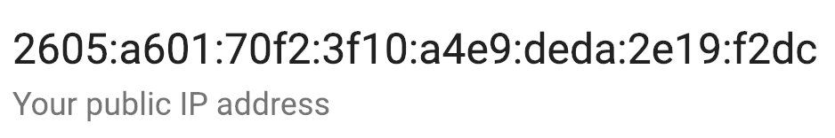

You can do some further troubleshooting by visiting: https://www.whatismyip.com

If you see no IPv4 address, and a public IPv6 address identical to the one from the Google search result earlier, it means your tunnel is not processing any IPv4 traffic, and you are going out to the Internet over IPv6 directly.

This typically means you have a problem with your server configuration and client configuration files.

## Test for a DNS Leak

If DNS lookups are not happening exclusively over the VPN connection to the Pi-Hole server, then you have a DNS leak. A DNS leak will result in ads appearing.

In the Pi-Hole Web Interface at `http://your-external-ip/admin/settings.php?tab=dns` choose just one DNS provider. The two Google IPv4 DNS servers will give you the highest performance. For our test, we will deselect the Google IPv4 DNS servers and choose the 2 Cloudflare DNS servers.

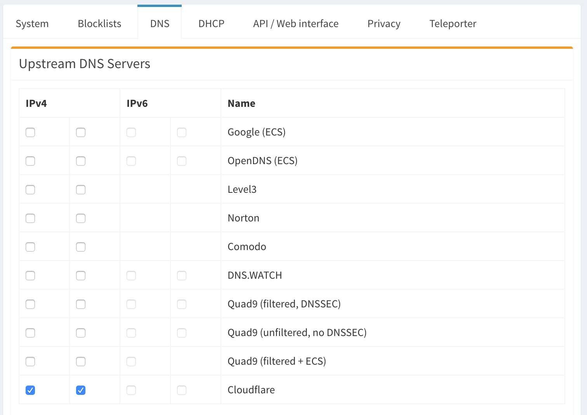

On your device, go to https://www.dnsleaktest.com/ and click the **Extended test** button. On the table in the next page, every single row must say "Cloudflare". If you see any IPs that do not belong to Cloudflare, you have a DNS leak. This typically means you have a problem with your server configuration and client configuration files.

Turn your VPN off and try the **Extended test** again, you will see your default DNS servers as defined by your Internet provider or your Router.

Once you are done testing, only use the Google IPv4 Upstream DNS Servers if you want the fastest DNS resolvers for your Pi-Hole. You can use any of the other Upstream DNS servers if speed is not your number one requirement.

## Test the Ad-blocking

A quick test page to verify if your ad blocking is working: https://blockads.fivefilters.org/?pihole

The Pi-Hole project also maintains a list of excellent advertising-littered pages that you can test:
https://pi-hole.net/pages-to-test-ad-blocking-performance/


# Firewall

You may not be comfortable leaving the Pi-Hole web interface accessible on a Public IP

If you do not wish for the Pi-Hole web interface to be accessible publicly, disable Port 80 in your Google Cloud Firewall.

1. Log into Google Cloud Console: https://console.cloud.google.com/
2. Ensure your Project is selected in the blue bar at the top (next to the words "Google Cloud Console); by default it should be
3. Click the Hamburger Menu at the top left, click **VPC Network** and click **Firewall Rules**
4. Click **default-allow-http** in the table
5. Click **Edit** at the top of the page
6. Click **Disable Rule** above the "Save" button to reveal a radio button group
7. Select **Disabled**
8. Click the **Save** button

To access your Pi-Hole web interface once you do this, you will have to connect via VPN, and then go to http://10.8.0.1 if you are using a UDP profile (desirable), or http://10.9.0.1 if you are using the TCP profile (less desirable).

Other Firewall rules you can safely disable:

- **default-allow-rdp** is not necessary, because your Pi-Hole is not running on a Windows server and there is no service running on Port 3389

Firewall rules that are inconvenient to disable:

- **default-allow-ssh** should really only be open to Google's private network, alas they leave it open to the whole world by default. Nobody can successfully brute force their way into your server on Port 22, because it's not secured with passwords. It is secured with keys. If you disable this rule, you will not be able to use the browser based SSH interface in the Google Cloud Console until you re-enable this rule.


# Configure automated Pi-Hole updates and scheduled reboots

PiVpn enables automated security updates of your Pi-Hole, but it won't restart the VM if the update requires it.  Restarting the VM would require SSH'ing into it and restarting it if required.  To remove that step, let's use a daily cron job to check to see if a restart is required and restart the VM as necessary.

To do that, let's add a new file to `/etc/cron.daily/` called `zz-restart-if-required` using the following command `sudo nano /etc/cron.daily/zz-restart-if-required`.  In nano, add the following lines of code which check to see if the reboot-required token file is present, restarting the VM if so:

    #!/bin/sh
    if [ -f /var/run/reboot-required ]; then
      /sbin/shutdown -r now
    fi

Files stored in `/etc/cron.daily/` will only run if the permissions are configured to allow that, so we need to change the permissions to allow that file to run.  To do that, execute `sudo chmod 755 /etc/cron.daily/zz-restart-if-required`.

Similarly, Pi-Hole gets updated from time to time.  Let's automate installing those updates as well.  To do that, let's create a file using `sudo nano /etc/cron.daily/update-pi-hole` and add in this one line of code `pihole -up`.  We need to change its permissions so it is executible `sudo chmod 755 /etc/cron.daily/update-pi-hole`.

If you're curious when they will run, [Stack Exchange has a great Q&A for you](https://serverfault.com/questions/135906/when-does-cron-daily-run).


# Cloud Console Mobile App

<a href="https://play.google.com/store/apps/details?id=com.google.android.apps.cloudconsole" target="_blank">
</a>
<a href="https://itunes.apple.com/us/app/google-cloud-console/id1005120814?mt=8#iTunes" target="_blank">
</a>

Install the "Cloud Console" app on your Android or iOS device.

Manage and monitor Google Cloud Platform services from your Android or iOS device.


# Contributions Welcome

If there is something that can be done better, or if this documentation can be improved in any way, please submit a Pull Request with your fixes or edits.

Contributors should be aware of [REASONS.md](./REASONS.md), which explain the factors behind choices made throughout this guide.

Please review the [Issues](https://github.com/rajannpatel/Pi-Hole-PiVPN-on-Google-Compute-Engine-Free-Tier-with-Full-Tunnel-and-Split-Tunnel-OpenVPN-Configs/issues) if you are in a position to help others, or participate in improving this project.
