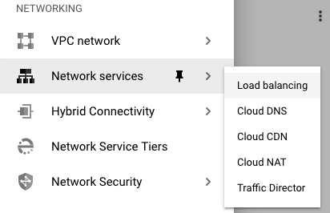
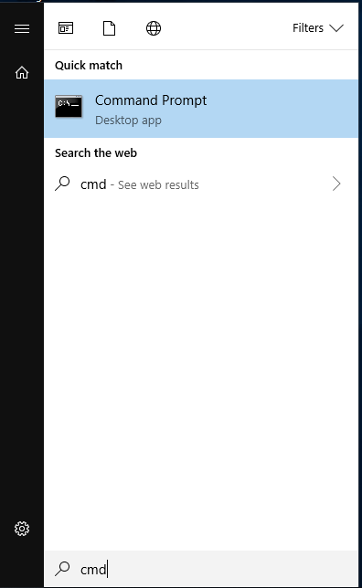
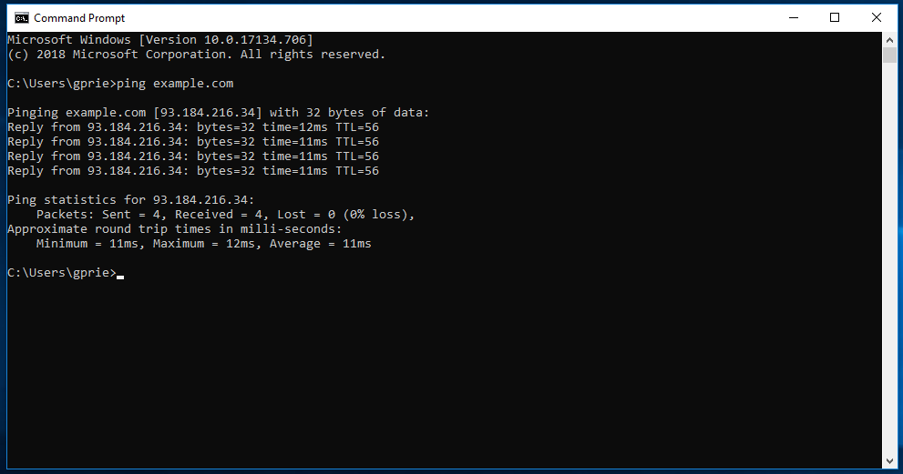
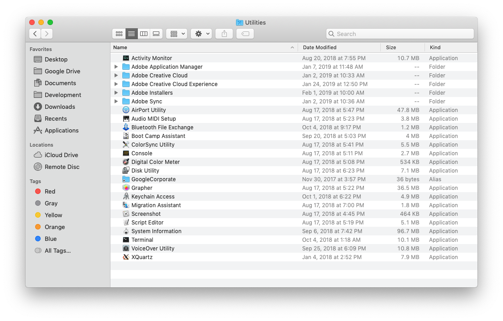
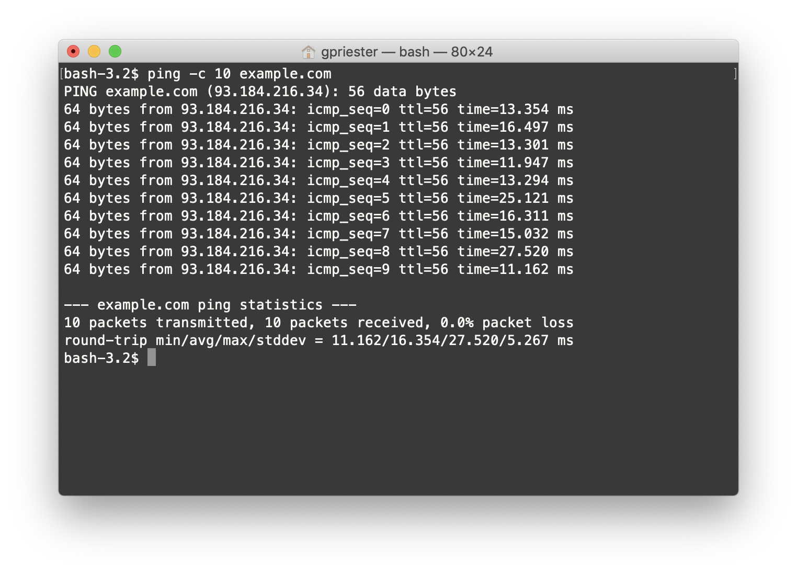

## Introduction

[Pinging](https://en.wikipedia.org/wiki/Ping_(networking_utility)) is a common method of testing the reachability of a host (like a virtual machine) from an external network.

Sending a 'ping' to a host entails sending an ICMP packet to the target and waiting for a response.  A ping will also provide a measure of the round-trip time between a client and host.

Pinging is also a handy utility to check the DNS resolution of a domain name you may have configured using Google Cloud DNS.

## Obtain your domain name or virtual machine IP address

### Locating a domain name

To locate a domain name (i.e. or hostname) that you've configured, open [Google Cloud DNS](https://console.cloud.google.com/net-services/dns/zones) within the **Cloud Console**.

1.  Navigate to Google Cloud DNS by clicking main navigation button in the top left.

2.  Under Network Services, select **Cloud DNS**.

3.  Select a zone that you have previously configured.  The zone's DNS name can be used for pinging/DNS resolution.

### Locating an IP address

To locate the external IP address of a virtual machine, open [Google Compute Engine](https://console.cloud.google.com/compute/instances) within the **Cloud Console**.

1.  Navigate to Google Compute Engine by clicking main navigation button in the top left.

2.  Looking at the table of virtual machine names, identify the virtual machine you want to ping.  Copy the IP address listed under the 'External IP' column.

## Pinging a domain name (from a Windows client)

All Microsoft Windows clients (e.g. a desktop running Windows 10) allow pinging via the **Terminal**.  To ping a **hostname** (e.g. *example.com*), perform the following steps:

1.  Click the **Start** menu at the bottom-left of your screen.

2.  Type **cmd** into the field and press **Enter**

3.  Once the **Command Prompt** (pictured below) opens, type `ping example.com`, replacing *example.com* with the domain name you configured.  Then, press **Enter**

The IP address associated with the domain name you enter will be written in brackets.

To ping an IP address instead, replace the domain name in the command with the IP address of interest, e.g. `ping 192.168.0.1`.

## Pinging a domain name (from a macOS client)

macOS clients (e.g. iMac, MacBook) allow pinging via the **Terminal**.  To ping a **hostname** (e.g. *example.com*), perform the following steps:

1.  Open **Finder** and navigate to your **Applications** folder.

2.  Open the **Utilities** folder, and double click the **Terminal** application

4.  Once the **Terminal** (pictured below) opens, type `ping -c 10 example.com`, replacing *example.com* with the domain name you configured.  Then, press **Enter**

The IP address associated with the domain name you enter will be written in parentheses.

To ping an IP address instead, replace the domain name in the command with the IP address of interest, e.g. `ping -c 10 192.168.0.1`.
