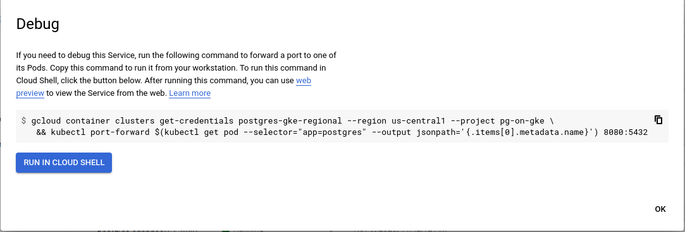

Shashank Agarwal | Database(s) Cloud Engineer | Google

<p style="background-color:#CAFACA;"><i>Contributed by Google employees.</i></p>

This document describes the deployment of the database engine PostgreSQL in a GKE cluster. In addition, it discusses the consideration in comparison to a conventional deployment of PostgreSQL on a virtual machine or in Cloud SQL.


## Objectives
*   Learn to install a PostgreSQL instance in GKE using a standard Docker image
*   Enable access from your laptop as well as public access to the database instance
*   Understand the architectural considerations of installing PostgreSQL in GKE compared to a virtual machine installation

## Costs

This tutorial uses billable components of Google Cloud Platform, including:


*   Compute Engine
*   GKE

Use the [Pricing Calculator](https://cloud.google.com/products/calculator) to generate a cost estimate based on your projected usage.


## Before you begin

For this reference guide, you need a GCP [project](https://cloud.google.com/resource-manager/docs/cloud-platform-resource-hierarchy#projects). You can create a new one, or select a project you already created:


1. Select or create a GCP project.

[GO TO THE PROJECT SELECTOR PAGE](https://console.cloud.google.com/projectselector2/home/dashboard)


2. Enable billing for your project.

[ENABLE BILLING](https://support.google.com/cloud/answer/6293499#enable-billing)

When you finish this tutorial, you can avoid continued billing by deleting the resources you created. See [Cleaning up](https://docs.google.com/document/d/1G8k6nHTmnrSyxrxqKWQleTzldETAQ02Di_pLW4OXYJ8/edit#heading=h.2fjojvpg205m) for more detail.


## Stateful Kubernetes database applications

### Stateful application

Microservice-based applications are implemented on Kubernetes using Docker containers. The business logic of the application is encoded in docker images that are deployed into Kubernetes. When starting up the application it is executed as containers in Kubernetes pods.

Applications can be stateful applications that rely on persistent state in order to provide their business logic. The application stores state into a persistence layer that ensures that data is available even if the application is restarted (e.g. when it is upgraded or after an outage).

The most predominant persistence mechanism is local disk storage. Databases are one such application which relies heavily on local disk for persistence. This document shows how you can deploy a PostgreSQL instance into GKE as a container based on standard PostgreSQL images. Furthermore, based on regional persistent disks, it shows how Highly Available PostgreSQL can be deployed on GKE.

While various Kubernetes operators are available to install a PostgreSQL instance like for example [Zalando](https://www.postgresql.org/about/news/postgres-operator-v150-2036/) or [CrunchyData](https://github.com/CrunchyData/postgres-operator) (and many more), this document focuses on the basic installation solely relying on standard PostgreSQL Docker images.

Deploying a database instance as a container is not the only option and not necessarily the correct approach. It is possible to run the database instance within a GCE instance or in Cloud SQL for PostgreSQL. There are pros and cons to the various approaches and those are discussed [here](https://docs.google.com/document/d/1G8k6nHTmnrSyxrxqKWQleTzldETAQ02Di_pLW4OXYJ8/edit#heading=h.mkvc7fiq5mga) at the end of this tutorial.


### Database deployment in Kubernetes

On a high level, a database instance can run within a Kubernetes container. A database instance stores data in files and those reside in persistent volume claims. A persistent volume claim has to be created and made available to a PostgreSQL instance. In this tutorial a regional persistent disk is used as the underlying storage class in order to implement PostgreSQL with high availability.

A deployment configuration is used to create the database instance as a container. In order to provide an access interface that is independent of the particular container a service is created that provides access. The service remains unchanged even if a container (or POD) is moved to a different node.

A database running as a service in a Kubernetes cluster and that stores its database files in persistent volume claims is bound to the life cycle of the cluster. If the cluster is for example deleted, the database will be deleted as well.

## PostgreSQL deployment

The following steps show you how to install a high available PostgreSQL database instance executing in GKE as a service. The configuration values that you will use are example values and you can adjust those as you like or as they fit your particular workload.

All commands are executed in the Cloud Shell. Since you will create configuration files it is best to create a subdirectory to hold these.


### Create GKE regional cluster

The following instructions will enable you to install a [regional GKE cluster](https://cloud.google.com/kubernetes-engine/docs/concepts/regional-clusters). The benefit of a regional cluster is increased availability of the cluster since its control plan is replicated into several zones. Therefore, a zone outage will not affect the availability of a cluster.


1. Check if kubectl is installed by running

    ```sh
    kubectl version
    ```


    If it is installed a client version is returned and you can skip the next step.

2. Install kubectl it into your local environment if it is not present

    ```sh
    gcloud components install kubectl
    ```


3. Create a regional GKE Cluster in us-central1 with one node each in 2 different zones.

    ```sh
    gcloud container clusters create "postgres-gke-regional" \
    --region "us-central1" \
    --machine-type "e2-standard-2" --image-type "COS" --disk-type "pd-standard" --disk-size "100" \
    --num-nodes "1" --node-locations "us-central1-b","us-central1-c"
    ```


4. Get the GKE cluster credentials

    ```sh
    gcloud container clusters get-credentials postgres-gke-regional --region us-central1

    ```


At this point you have a regional cluster installed and available for installing PostgreSQL into the cluster. Below screenshot shows the regional cluster.


### Deploy PostgreSQL to regional GKE cluster

Create the Volume and Persistent Volume Claim (PVC). This will be a blank regional persistent disk across two zones (`us-central1-b` and `us-central1-c`).


1. Optionally, create a subdirectory that will hold all configuration files in one location.
2. Create file postgres-pv.yaml and apply it to the GKE cluster. This creates the required persistent volume claim based on a [regional persistent disk](https://cloud.google.com/compute/docs/disks#repds).

    ```sh
    cat > postgres-pv.yaml << EOF
    kind: StorageClass
    apiVersion: storage.k8s.io/v1
    metadata:
      name: regionalpd-storageclass
    provisioner: kubernetes.io/gce-pd
    parameters:
      type: pd-standard
      replication-type: regional-pd
    allowedTopologies:
      - matchLabelExpressions:
          - key: failure-domain.beta.kubernetes.io/zone
            values:
              - us-central1-b
              - us-central1-c
    ---
    kind: PersistentVolumeClaim
    apiVersion: v1
    metadata:
      name: postgresql-pv
    spec:
      storageClassName: regionalpd-storageclass
      accessModes:
        - ReadWriteOnce
      resources:
        requests:
          storage: 300Gi
    EOF

    kubectl apply -f postgres-pv.yaml
    ```


3. Create The PostgreSQL deployment with the following deployment file:

    ```sh
    cat > postgres-deployment.yaml << EOF
    apiVersion: apps/v1
    kind: Deployment
    metadata:
     name: postgres
    spec:
     strategy:
       rollingUpdate:
         maxSurge: 1
         maxUnavailable: 1
       type: RollingUpdate
     replicas: 1
     selector:
       matchLabels:
         app: postgres
     template:
       metadata:
         labels:
           app: postgres
       spec:
         containers:
           - name: postgres
             image: postgres:10
             resources:
               limits:
                 cpu: "1"
                 memory: "4Gi"
               requests:
                 cpu: "1"
                 memory: "4Gi"
             ports:
               - containerPort: 5432
             env:
               - name: POSTGRES_PASSWORD
                 value: password
               - name: PGDATA
                 value: /var/lib/postgresql/data/pgdata
             volumeMounts:
               - mountPath: /var/lib/postgresql/data
                 name: postgredb
         volumes:
           - name: postgredb
             persistentVolumeClaim:
               claimName: postgresql-pv
    EOF

    kubectl apply -f postgres-deployment.yaml
    ```


    In a production environment a clear text password would not be included in a configuration file that ultimately resides in a code repository. Instead, using secret management is the best practice as shown [here](https://cloud.google.com/config-connector/docs/how-to/secrets).

4. Create the PostgreSQL service with the following yaml file.

    ```sh
    cat > postgres-service.yaml << EOF
    apiVersion: v1
    kind: Service
    metadata:
      name: postgres
    spec:
      ports:
        - port: 5432
      selector:
        app: postgres
      clusterIP: None
    EOF

    kubectl apply -f postgres-service.yaml

    ```


After you applied this configuration file the PostgreSQL database instance is running in GKE as a service.


Next you will create a sample data set and execute a simulated failover to test the high availability setup of the PostgreSQL service.


## Create test dataset

The following steps create a database, a table and insert a few rows as a test dataset for the failover process that you will exercise later on.


1. Connect to PostgreSQL instance

    ```sh
    POD=`kubectl get pods -l app=postgres -o wide | grep -v NAME | awk '{print $1}'`

    kubectl exec -it $POD -- psql -U postgres
    ```


2. Create database, table and insert few rows


```sql
create database gke_test_regional;

\c gke_test_regional;

    CREATE TABLE test(
       data VARCHAR (255) NULL
    );

    insert into test values 
      ('Learning GKE is fun'),
      ('Databases on GKE is easy');

```


3. Select all rows to ensure that the insert was successful 


```sql
select * from test;

```


4. Exit out of the PostgreSQL shell

    ```sql
    \q

    ```


At this point the database instance has a test data set. After a failover based on a regional persistent disk the same dataset must be available after the failover.


## Simulate database instance failover

To simulate failover, we will take out the node which is hosting PostgreSQL pod. Then delete the existing pod, thus forcing GKE Cluster to move PostgreSQL into a different zone.


1. Identify the node currently hosting PostgreSQL

    ```sh
    CORDONED_NODE=`kubectl get pods -l app=postgres -o wide | grep -v NAME | awk '{print $7}'`

    echo ${CORDONED_NODE}

    gcloud compute instances list --filter="name=${CORDONED_NODE}"
    ```
    Notice the zone where this node has been created.
    Also note that this node has two disks attached (see the VM Instance Details in the Compute Engine cloud console):


2. Disable scheduling of any new pods on this node.

    ```sh
    kubectl cordon ${CORDONED_NODE}

    kubectl get nodes
    ```


    Observe that scheduling is disabled on the node where the database instance resides.

3. Delete the existing PostgreSQL pod.

    ```sh
    POD=`kubectl get pods -l app=postgres -o wide | grep -v NAME | awk '{print $1}'`

    kubectl delete pod ${POD}
    ```


4. Verify that a new pod has been created on the other node. It might take a while for it to be ready (usually around 30 seconds).

    ```sh
    kubectl get pods -l app=postgres -o wide
    ```


5. Verify the node’s zone. Notice that now it is deployed in the other zone (different zone that step 1 determined).

    ```sh
    NODE=`kubectl get pods -l app=postgres -o wide | grep -v NAME | awk '{print $7}'`

    echo ${NODE}

    gcloud compute instances list --filter="name=${NODE}"
    ```


    Verify that the regional persistent disk is now attached to this VM instance (go to  Compute Engine and then VM Instance Details):


6. Verify data consistency next. Connect to the database instance.

    ```sh
    POD=`kubectl get pods -l app=postgres -o wide | grep -v NAME | awk '{print $1}'`

    kubectl exec -it $POD -- psql -U postgres
    ```


7. Execute the following commands to verify that the test data set exists and is the same as created.

    ```sql
    \c gke_test_regional;

    select * from test;

    \q

    ```


At this point you exercised a simulated failover proving that based on the regional disk PostgreSQL can failover without loss of data.

In order to make the cordoned node schedulable again, execute the following commands:


1. Uncordon the node for which scheduling was disabled

    ```sh
    kubectl uncordon $CORDONED_NODE
    ```


2. Check that the node is ready again


```sh
kubectl get nodes
```


At this point the regional cluster is fully functional again.


## Create public access to PostgreSQL service

At this point the database is not accessible over a public IP address. Execute the following command to see that no public IP address is available:


```sh
kubectl get services postgres
```


Make the service publicly accessible by executing the following commands.


1. Remove the current non-public service

    ```sh
    kubectl delete -f postgres-service.yaml
    ```


2. Create a new service configuration file that will create a public IP address and deploy it.

    ```sh
    cat > postgres-service.yaml << EOF
    apiVersion: v1
    kind: Service
    metadata:
      name: postgres
    spec:
      ports:
        - port: 5432
      selector:
        app: postgres
      type: LoadBalancer
    EOF

    kubectl apply -f postgres-service.yaml
    ```


3. Run the following command to see that a public IP (`EXTERNAL-IP`) address will be assigned (it might be pending for a while):


```sh
kubectl get services postgres
```


Once the public IP address is available you can connect to the database for example using your favorite IDE for database development.

Please note that it is a public IP address accessible to everybody who knows it. Ensure minimal access surface by restricting any ingress to your work environment.


## Access PostgreSQL by port forwarding

Instead of opening up the database service and provide a public IP address, you can access the database from your laptop using port forwarding as follows:


1. Reset the service so that no public IP address is created

    ```sh
    kubectl delete -f postgres-service.yaml

    cat > postgres-service.yaml << EOF
    apiVersion: v1
    kind: Service
    metadata:
      name: postgres
    spec:
      ports:
        - port: 5432
      selector:
        app: postgres
      clusterIP: None
    EOF

    kubectl apply -f postgres-service.yaml
    ```


2. Verify that `EXTERNAL-IP` has the value `&lt;none>`


```sh
kubectl get services postgres

```


3. In the Cloud Console, go to “Kubernetes Engine”, and select “Services & Ingress”
4. Click on the service name `postgres`
5. Scroll down and click on the button “PORT FORWARDING”. You should see the following dialog





6. Copy the command and change the port 8080 to 5432 resulting in


```sh
gcloud container clusters get-credentials postgres-gke-regional \
--region us-central1 --project pg-on-gke \
&& kubectl port-forward $(kubectl get pod --selector="app=postgres" \ 
--output jsonpath='{.items[0].metadata.name}') 5432:5432
```


    The change from 8080 to 5432 means that you will be able to access the database using the port 5432.


7. Open a terminal window on your laptop and run the port forwarding command that you modified above


```sh
gcloud container clusters get-credentials postgres-gke-regional \
--region us-central1 --project pg-on-gke \
&& kubectl port-forward $(kubectl get pod --selector="app=postgres" \ 
--output jsonpath='{.items[0].metadata.name}') 5432:5432

```


8. If you are not already logged in you might be asked for authentication


```sh
gcloud auth login
```


In this case run the port forwarding command again after the authentication succeeded.


9. Start the PostgreSQL client (or use your favorite IDE) and verify that you can access the database


```sh
psql --host 127.0.0.1 -U postgres -p 5432
```

```sql

    \c gke_test_regional;

    select * from test;

    \q
```


Port forwarding supports your access to the database without having to create a public IP address for that use case.


## Considerations of database instance deployment in a Kubernetes cluster

Assuming a microservices-based application running in GKE, there are three deployment options for database instances in context of GKE:


*   **Kubernetes pod**. As this tutorial has shown, a PostgreSQL instance can be deployed and running in a container.
*   **GCE instance**. A PostgreSQL instance can be installed and managed in a [GCE](https://cloud.google.com/compute) instance.
*   **Cloud SQL**. For a more managed option, PostgreSQL can be launched in [Cloud SQL for PostgreSQL](https://cloud.google.com/sql/docs/postgres).

Each of these options has different considerations and some of those are discussed in the following table. There is no one-size-fits-all deployment option and you have to decide which of the above options are the best for your workload and requirements.

The following table shows some of the considerations and a brief discussion for each. The considerations are not necessarily hard technical facts and might involve trade-offs during the decision process.


<table>
  <tr>
   <td><strong>Consideration</strong>
   </td>
   <td><strong>Discussion</strong>
   </td>
  </tr>
  <tr>
   <td>Move to cloud provider managed database
   </td>
   <td>A database like Cloud SQL or Cloud Spanner is a managed database. Such a database provides reduced operational overhead and is optimized for the Google Cloud infrastructure. It might be easier to manage and to operate than a database deployed in Kubernetes.
   </td>
  </tr>
  <tr>
   <td>Stay with current database deployment
   </td>
   <td>If your current database deployment is stable and reliable, and if there is no real requirement or reason to change it, it might be best to keep it for the time being. This is important to consider if new application development takes place on Kubernetes. In this case a change in the database deployment might be considered as a second phase once the application is in production.
   </td>
  </tr>
  <tr>
   <td>Database independence
   </td>
   <td>As mentioned earlier, the persistent volume claim’s life cycle is tied to the corresponding GKE cluster. If it is important for you to maintain the database and have its life cycle independent of GKE clusters, the preferred option is to keep it separate from GKE in a compute instance or as a managed database.
   </td>
  </tr>
  <tr>
   <td>Scaling with GKE
   </td>
   <td><strong>Vertical Scaling. </strong>While GKE offers automatic vertical scaling if configured, it is not recommended for databases. This is because it will redeploy the pod upon vertical scaling causing brief outage.
<p>
<strong> \
Horizontal Scaling. </strong>Horizontal scaling cannot be done for singleton services such as PostgreSQL.
   </td>
  </tr>
  <tr>
   <td>GKE Overhead
   </td>
   <td>GKE <a href="https://cloud.google.com/kubernetes-engine/docs/concepts/cluster-architecture#memory_cpu">reserves resources</a> for its own operations. As databases are not scaled automatically, overhead might feel high for small pods.
   </td>
  </tr>
  <tr>
   <td>Number of database instances
   </td>
   <td>In the context of Kubernetes each database instance is running in its own pod and on its own persistent volume claim. If you have a high number of instances, this will require to operate and to manage a large set of pods, nodes and volume claims. It might be worth considering to run on a managed database instead as a lot of management functionality is taken care of by Google Cloud.
   </td>
  </tr>
  <tr>
   <td>Database backup in GKE
   </td>
   <td>Typically database backups are made on a separate volume (or sometimes on shared location). However, with GKE you may deploy a separate pod running pg_dump (psql) and respective volumes to create database backup.
   </td>
  </tr>
  <tr>
   <td>Kubernetes specific recovery behavior
   </td>
   <td>Kubernetes has a built-in assumption and design that any failed pod is re-created, not restarted. From a database instance perspective this means that any configuration that is not persistent within a database itself or on stable storage outside pods has to be recreated upon re-creation.
   </td>
  </tr>
  <tr>
   <td>Kubernetes configuration
   </td>
   <td>Configuration controls have to be created that carefully ensure that only one master pod is created. Configuration files will have to be verified to ensure that no incorrect configuration accidentally takes place.
   </td>
  </tr>
  <tr>
   <td>Persistent volume claim scope
   </td>
   <td>A persistent volume claim is GKE cluster scoped. This means that when a GKE cluster is deleted, the volume claim is deleted. Any database files would be deleted as well. In order to guard against accidental loss of the database files replication or frequent backup is recommended.
   </td>
  </tr>
  <tr>
   <td>Database migration
   </td>
   <td>Unless you continue to use an existing database system you need to plan for database migration so that the databases in your current system are migrated to the databases running in GKE. This is a complex process and is outlined <a href="https://cloud.google.com/solutions/database-migration-concepts-principles-part-1">here</a> and <a href="https://cloud.google.com/solutions/database-migration-concepts-principles-part-2">here</a>.
   </td>
  </tr>
  <tr>
   <td>Re-training
   </td>
   <td>If moving from a self-managed or managed deployment to a Kubernetes database deployment, retraining of DBAs is required in order to operate the new environment as reliably as they operate the current environment. Application developers may have to learn about differences as well, but to a lesser extent.
   </td>
  </tr>
</table>


The table provides a discussion of some of the considerations, however, these are not all possible considerations. Additional considerations are in the area of disaster recovery, connection pooling or monitoring. We will discuss those and other details in an upcoming document.


## Cluster deployment configuration alternatives

In the above example a regional GKE cluster with one node each in two zones was deployed. A regional disk was created in the exact same zones. This enables failover on a database instance level since if one of the zones fails, the other zone provides the consistent state on the regional disk and a PostgreSQL container will be started up in the zone that remains available.

From a database instance perspective PostgreSQL runs in one zone only at any given point in time. From an application perspective this might be different. If an application runs (as containers) in two zones at the same time, it assumes the capacity of nodes in two zones. A zone failure would cut the capacity available for the application in half.

From an application perspective it might make sense to create a cluster across three zones with planning the outage of one zone from a capacity perspective so that a zone failure does not impact the application performance.

## Cleaning up

To avoid incurring charges to your Google Cloud Platform account for the resources used in this tutorial:


### Deleting the project

The easiest way to eliminate billing is to delete the project you created for
the tutorial. To do so using `gcloud`, run:

    gcloud projects delete [PROJECT_ID]

where `[PROJECT_ID]` is your Google Cloud project ID.

**Warning**: Deleting a project has the following consequences:

If you used an existing project, you'll also delete any other work you've done
in the project. You can't reuse the project ID of a deleted project. If you
created a custom project ID that you plan to use in the future, you should
delete the resources inside the project instead. This ensures that URLs that
use the project ID, such as an appspot.com URL, remain available.

## What's next   
*   Creating a primary database with replicas is described in this page: [Run a Replicated Stateful Application](https://kubernetes.io/docs/tasks/run-application/run-replicated-stateful-application/) (based on MySQL)
*   Try out other Google Cloud Platform features for yourself. Have a look at our [tutorials](https://cloud.google.com/docs/tutorials).
