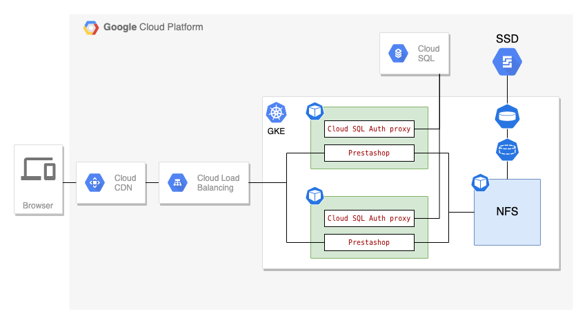

Gabriel Hodoroaga | Software developer | hodo.dev

<p style="background-color:#D9EFFC;"><i>Contributed by the Google Cloud community. Not official Google documentation.</i></p>

Prestashop is one of the popular platform for e-commerce, it's open-source and has more then 300,000 online stores according their website.

This tutorial will walk you through the steps required to deploy Prestashop on GKE in a way to be able to scale up during peaks and scale down when needed to save resources.

This entire tutorial can be completed in the Cloud Shell in the Cloud Console.

The following diagram illustrates the components and interactions that are part of this tutorial:



## Objectives

* Create a custom Prestashop docker image
* Create a Cloud SQL instance
* Create a GKE cluster
* Deploy a NFS server
* Deploy and scale Prestashop on GKE
* Use GCE Ingress, Cloud Load Balancer and Cloud CDN

## Costs

This tutorial uses billable components of Google Cloud, including the following:

*   [Compute Engine](https://cloud.google.com/compute)
*   [Cloud SQL](https://cloud.google.com/sql)
*   [Google Kubernetes Engine](https://cloud.google.com/kubernetes-engine)
*   [Cloud Load Balancing](https://cloud.google.com/load-balancing)
*   [Cloud CDN](https://cloud.google.com/cdn) 

Use the [pricing calculator](https://cloud.google.com/products/calculator) to generate a cost estimate based on your projected usage.

## Before you begin

1.  In the Cloud Console, on the project selector page,
    [select or create a Google Cloud project](https://console.cloud.google.com/projectselector2/home/dashboard).

    **Note**: If you don't plan to keep the resources that you create in this procedure, create a project instead of selecting
    an existing project. After you finish these steps, you can delete the project, removing all resources associated with 
    the project.

1.  Make sure that billing is enabled for your Google Cloud project.
    [Learn how to confirm that billing is enabled](https://cloud.google.com/billing/docs/how-to/modify-project).

1.  [Open Cloud Shell](https://console.cloud.google.com/?cloudshell=true).

1.  Enable the APIs for the services:

        gcloud services enable container.googleapis.com
        gcloud services enable containerregistry.googleapis.com
        gcloud services enable sqladmin.googleapis.com

1.  Clone the repository:

        git clone https://github.com/GoogleCloudPlatform/community
        
1.  Go to the directory for this tutorial:

        cd community/tutorials/prestashop-gke/

1.  Setup the environment variables

        MYSQL_NAME=demo-ps-mysql-2
        MYSQL_ROOT_PASS=admin
        REGION=us-central1
        ZONE=us-central1-a
        CLUSTER_NAME=demo-ps-cluster
        PROJECT_ID=$(gcloud config list project --format='value(core.project)')


## Prepare the Prestashop image

Prestashop uses file system to persists some of the user information like product images and attachments, also uses cached smarty templates and all these files need to be shared across all instances.

For this step we will use the official prestashop docker image and we will extract all the required files.

1.  Deploy Prestashop inside Cloud Shell VM (this is just temporary)

    ```bash
    # create a docker network
    docker network create prestashop-net
    # deploy mysql
    docker run -ti -p 3307:3306 --network prestashop-net \
            --name some-mysql -e MYSQL_ROOT_PASSWORD=admin -d mysql \
            --character-set-server=utf8 \
            --default-authentication-plugin=mysql_native_password \
            --sql-mode=ERROR_FOR_DIVISION_BY_ZERO,NO_ENGINE_SUBSTITUTION
    # create a database - wait a few seconds before
    docker exec -it some-mysql mysql -u root -p$MYSQL_ROOT_PASS \
                -e "CREATE DATABASE prestashop"
    # deploy prestashop
    docker run -ti --name some-prestashop --network prestashop-net \
            -e DB_SERVER=some-mysql \
            -e PS_DOMAIN=ps.example.com \
            -e PS_INSTALL_AUTO=1 \
            -p 8080:80 -d prestashop/prestashop:latest
    ```

1. Extract all the information that we need from the running docker containers

    ```bash
    # backup database
    mkdir database
    docker exec some-mysql mysqldump -u root -p$MYSQL_ROOT_PASS \
                prestashop > database/prestashop.sql
    # extract the files out from docker image 
    docker cp some-prestashop:/var/www/html prestashop/
    mv prestashop/html/admin prestashop/html/admin942
    chmod a+rw -R prestashop/html/var 
    mkdir prestashop/nfs
    mv prestashop/html/img prestashop/nfs
    mv prestashop/html/download prestashop/nfs
    mv prestashop/html/cache prestashop/nfs
    mkdir -p prestashop/nfs/themes/classic/cache
    mkdir -p prestashop/nfs/themes/classic/assets/cache
    mkdir -p prestashop/nfs/var/log 
    mkdir prestashop/nfs/config
    mv prestashop/html/config/xml prestashop/nfs/config
    chmod a+rw -R prestashop/nfs
    ```

## Create a new Prestashop image

1.  Create a base image for php:7.3-fpm-alpine with nginx

    ```bash
    docker build -t php-nginx:7.3-fpm-alpine php-nginx/7.3-fpm-alpine/
    ```

1.  Create the new image and push it to the container registry

    ```bash
    # build the image
    docker build -t mypresta prestashop/
    # tag the image
    docker tag mypresta gcr.io/$PROJECT_ID/mypresta:1.0.1
    # push the image to container registry
    docker push gcr.io/$PROJECT_ID/mypresta:1.0.1
    ```

## Prepare the database

1.  Create the Cloud SQL instance

    ```bash
    gcloud sql instances create $MYSQL_NAME  --database-version=MYSQL_8_0 \
        --tier=db-g1-small  --region=$REGION --root-password=admin \
        --database-flags=^+^character-set-server=utf8+default-authentication-plugin=mysql_native_password+sql-mode=ERROR_FOR_DIVISION_BY_ZERO,NO_ENGINE_SUBSTITUTION
    ```

1.  Connect to the Cloud SQL instance using [Cloud SQL Auth proxy](https://cloud.google.com/sql/docs/mysql/sql-proxy)

    ```bash 
    cloud_sql_proxy -instances=$PROJECT_ID:$REGION:$MYSQL_NAME=tcp:3306
    ```

1.  On a **separate** cloud shell terminal window, run the following commands create the database

    ```bash 
    MYSQL_ROOT_PASS=admin
    cd gke-prestashop-deployment
    mysql -u root -p$MYSQL_ROOT_PASS -h 127.0.0.1 \
          -e "CREATE DATABASE prestashop;"
    mysql -u root -p$MYSQL_ROOT_PASS -h 127.0.0.1 \
            prestashop < database/prestashop.sql
    ```

1.  Return to initial the terminal window and press CTRL+C to terminate the cloud_sql_proxy process


## Create the GKE cluster and deploy the services

1.  Create the cluster 

    We need to add a special scope ***sql-admin*** to the default scopes in order to allow access from the Google Compute VM to Cloud SQL API.

    ```bash
    gcloud container clusters create $CLUSTER_NAME \
            --zone $ZONE --machine-type "e2-medium" \
            --num-nodes=3 --scopes=gke-default,sql-admin
    ```

1.  Deploy the NFS server

    NFS Server is required here because Prestashop persist some of the user information to disk, like product images and attachments, cached smarty templates and all these files need to be shared across all instances.

    ```bash
    # create a persistent disk
    gcloud compute disks create nfs-pv-disk --size=10GB \
            --type=pd-ssd --zone=$ZONE
    # create a persistent volume 
    kubectl apply -f gke/nfs/nfs-persistent-volume.yaml
    # create a persistent volume claim
    kubectl apply -f gke/nfs/nfs-persistent-volume-claim.yaml
    # create the deployment 
    kubectl apply -f gke/nfs/nfs-deployment.yaml
    # expose the deployment service 
    kubectl apply -f gke/nfs/nfs-service.yaml 
    ```

1.  Copy the required files to the NFS volume

    In order to transfer the Prestashop user files we need to mount the nfs volume to Cloud Shell machine

    ```bash
    # get the required information
    NFS_NODE_PORT=$(kubectl get service service-nfs \
        -o jsonpath='{.spec.ports[?(@.name=="nfs")].nodePort}')
    NFS_NODE_ADDRESS=$(kubectl get nodes \
        -o jsonpath='{.items[0].status.addresses[?(@.type=="ExternalIP")].address}')
    GKE_NETWORK_TAG=$(gcloud compute instances describe $(kubectl get nodes \
        -o jsonpath='{.items[0].metadata.name}') --zone=$ZONE \
        --format="value(tags.items[0])")
    SHELL_IP_ADDRESS=$(curl http://ifconfig.me)
    # update firewall - never expose more than is required
    gcloud compute firewall-rules create ps-demo-nfs \
        --direction=INGRESS --priority=1000 --network=default \
        --action=ALLOW --rules=tcp:$NFS_NODE_PORT \
        --source-ranges=$SHELL_IP_ADDRESS \
        --target-tags=$GKE_NETWORK_TAG
    # copy files
    sudo mkdir -p /mnt/nfs/ps
    sudo chmod a+rw /mnt/nfs/ps
    sudo apt-get -y install nfs-common
    sudo mount -t nfs4 -o port=$NFS_NODE_PORT $NFS_NODE_ADDRESS:/ /mnt/nfs/ps
    sudo mkdir /mnt/nfs/ps/psdata
    sudo cp -r prestashop/nfs/* /mnt/nfs/ps/psdata
    # wait for the files to copy, it might take a while, I don't know why
    sudo chmod a+rw -R /mnt/nfs/ps/psdata
    # cleanup
    sudo umount /mnt/nfs/ps
    gcloud -q compute firewall-rules delete ps-demo-nfs
    ```

1.  Create the required service account and kubernetes secrets

    In order to connect from GKE to Cloud SQL we will use Cloud SQL Auth proxy deployed as a sidecar to our Prestashop deployment. The next steps are taken form this [GCP guide](https://cloud.google.com/sql/docs/mysql/connect-kubernetes-engine)

    ```bash
    # create the service account
    gcloud iam service-accounts create ps-mysql-user-2 \
        --description="A service account to access mysql" \
        --display-name="ps-mysql-user-2"
    # get the service account email address
    SQL_SERVICE_ACCOUNT=$(gcloud iam service-accounts list --format="value(email)" --filter="displayName=ps-mysql-user-2")
    # add the require roles
    gcloud projects add-iam-policy-binding ${PROJECT_ID} \
        --member=serviceAccount:${SQL_SERVICE_ACCOUNT} \
        --role=roles/cloudsql.client
    # create the service account key
    gcloud iam service-accounts keys create gke/presta/key.json \
    --iam-account ${SQL_SERVICE_ACCOUNT}
    # save key the key as k8s secret
    kubectl create secret generic ps-mysql-credentials \
    --from-file=service_account.json=gke/presta/key.json
    # save the root password as k8s secret too
    kubectl create secret generic mysql-pass \
            --from-literal=password=$MYSQL_ROOT_PASS
    ```

1.  Deploy the Prestashop application

    The persistent volume and the persistent volume claim that connects to the NFS server and we will use it to map folders inside the Prestashop container. The backend config is required here in order to enable Cloud CDN.

    ```bash
    # create the persistent volume
    kubectl apply -f gke/presta/ps-persistent-volume.yaml
    # create the persistent volume claim
    kubectl apply -f gke/presta/ps-persistent-volume-claim.yaml
    # export the instance name as environment variable
    export INSTANCE_CONNECTION_NAME=$PROJECT_ID:$REGION:$MYSQL_NAME
    export PROJECT_ID=$PROJECT_ID
    # create the deployment
    cat gke/presta/ps-deployment.yaml | envsubst | kubectl apply -f -
    # create the service and the backend config
    kubectl apply -f gke/presta/ps-backend-config.yaml
    kubectl apply -f gke/presta/ps-service.yaml
    ```

1.  Create the ingress controller

    In GKE, the Ingress object defines rules for routing HTTP(S) traffic to applications running in a cluster. You can read more about this on page [GKE Ingress for HTTP(S) Load Balancing](https://cloud.google.com/kubernetes-engine/docs/concepts/ingress)

    ```bash
    kubectl apply -f gke/ingress/ps-ingress.yaml
    ```

1.  Wait for the controller to create the backend services and the load balancer

## Test

1.  Grab the external ip address of the ingress controller

    ```bash 
    IP_ADDRESS=$(kubectl get ingress ingress-psweb \
                -o jsonpath='{.status.loadBalancer.ingress[0].ip}') \
                && echo $IP_ADDRESS
    ```

1.  Test it using curl

    ```bash
    curl --head http://ps.example.com/ \
            --resolve ps.example.com:80:$IP_ADDRESS
    ```

    you should see a result similar to this

    ```text
    HTTP/1.1 200 OK
    Server: nginx
    Date: Tue, 25 May 2021 12:36:49 GMT
    Content-Type: text/html; charset=utf-8
    Vary: Accept-Encoding
    X-Powered-By: PHP/7.3.28
    Expires: Thu, 19 Nov 1981 08:52:00 GMT
    Cache-Control: no-store, no-cache, must-revalidate
    Pragma: no-cache
    X-Backend-Server: server-psweb-79df96f6f5-abc
    Via: 1.1 google
    Transfer-Encoding: chunked
    ```

    and if you execute the command multiple times you should be able to see that the header value ```X-Backend-Server``` header is changing, and this means that multiple backend are serving the request.

    If you setup you /etc/hosts file to point to ps.example.com you can view the online shop in your browser. For the admin page you must access **ps.example.com/admin942** and the user is **demo@prestashop.com** with password **prestashop_demo**.


## Cleaning up

1.  To remove all the resources you can either delete the project or run the clean-up script.

    ```bash
    # delete the cluster 
    gcloud -q container clusters delete $CLUSTER_NAME --zone=$ZONE
    # delete the sql instance
    gcloud -q sql instances delete $MYSQL_NAME
    # delete the service account
    gcloud -q iam service-accounts delete ps-mysql-user-2 --zone=$ZONE
    # delete the disc
    gcloud -q compute disks delete nfs-pv-disk --zone=$ZONE
    # delete container registry images
    gcloud -q container images delete gcr.io/$PROJECT_ID/mypresta:1.0.1
    ```

## What's next

- Learn more about [Google Kubernetes Engine](https://cloud.google.com/kubernetes-engine).
- Learn more about [Cloud SQL](https://cloud.google.com/sql).
- Try out other Google Cloud features for yourself. Have a look at our [tutorials](https://cloud.google.com/docs/tutorials).
