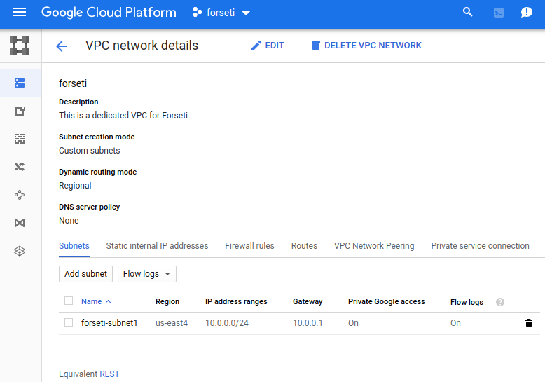
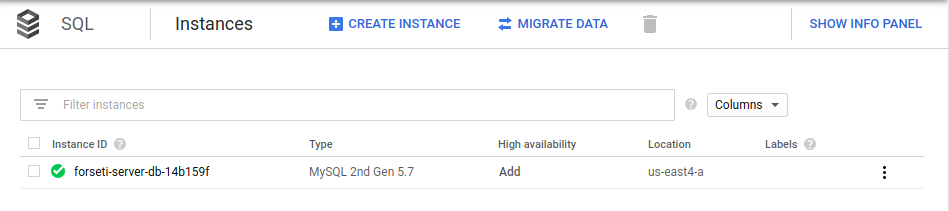
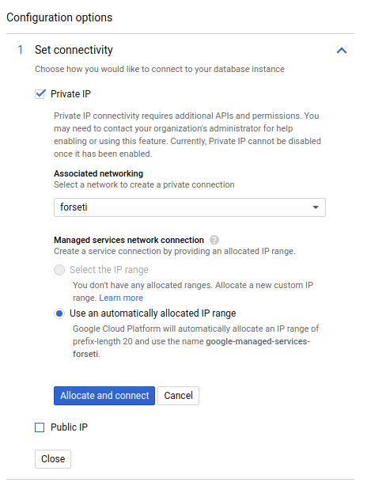
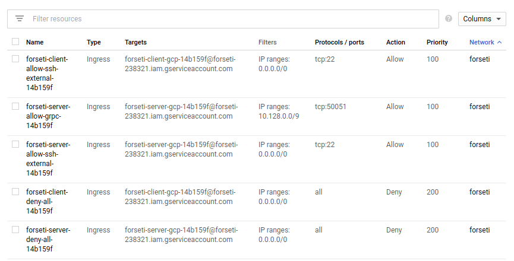
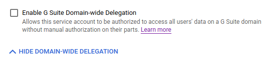
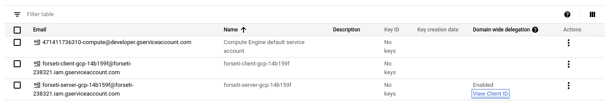
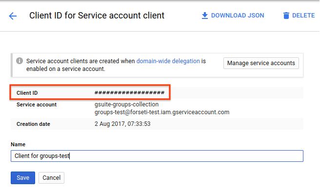
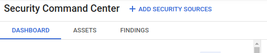
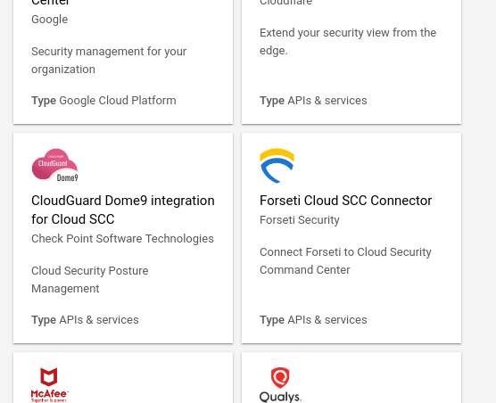
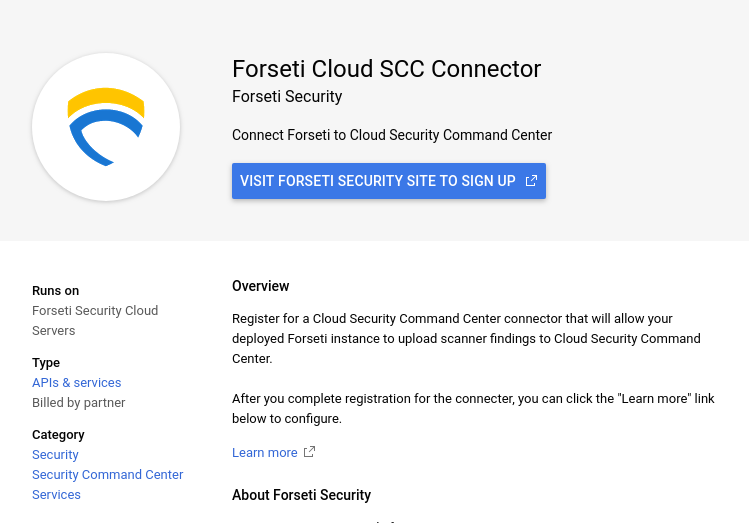

# Private Forseti with SCC integration

This guide will guide you on through a private Forseti installation, following production best practices. This means you will:
- Deploy Forseti in it's own VPC (not the default VPC).
- Restrict the firewall rules that are pre-configured.
- Optionally, remove the public IP from the GCE instances.
- Configure Cloud SQL to be private.
- Configure Forseti to send violations to Cloud Security Command Center (SCC).

What this guide will **not** do:
- will not teach you how to customize Forseti.
- will not teach you how to configure Forseti beyond the basic setup.
- Will not teach you how to configure Forseti enforcer.

This guide was developed using Forseti version 2.14.1.

### Pre-requisites

For executing the process below you will need:
- Access to a G Suite or Cloud Identity Super Admin account.
- Access to the Admin Console (https://admin.google.com) security page.
- Access to the Web Console (https://console.cloud.google.com).
- Access to rights to modify IAM permissions at the Organization level.
- A project where you will deploy Forseti, which will be referred to `forseti` in this guide
- Editor or owner to the `forseti` project.
- Define the `Region` where you want to install Forseti.
- Define the `Zone` you want to install Forseti.

There is a [bug](https://github.com/forseti-security/forseti-security/issues/2759) on the Forseti installer, so ensure you choose a "-c" zone until it's fixed.


### Installing Forseti

In the `forseti` project:
1. Navigate to the "VPC Networks" Pages on the Cloud Console
2. Create a VPC for Forseti with one subnet. Configure it as follows:
   - Private access enabled
   - Flow logs enabled [optional]
   - Regional dynamic routing mode



In the example above VPC was created with the name `forseti` and the subnet with the name `forseti-subnet1`. The chosen region is `us-east4`, the chosen zone is `us-east4-c`.
During this step make a point to note down the `network`, `subnet` and `region` names as it will be required in the next steps.

3. Remove the default network, unless it's being used by other resources.
4. Open Cloud Shell and configure the gcloud session sa follows:

```
gcloud config set project [PROJECT_ID]
gcloud config set compute/region [REGION_NAME]
gcloud config set compute/zone [ZONE_NAME]
```

In our example this will be:
```
gcloud config set project forseti-pj-id
gcloud config set compute/region us-east4
gcloud config set compute/zone us-east4-c
```
Ensure you are configuring the above since these are implicity used by the Forseti installer.


4. Clone Forseti Repository, this contains the installer we will use
```
git clone https://github.com/GoogleCloudPlatform/forseti-security.git`
```

5. Install Forseti and make it use the correct network we created

> If you plan to use SendGrid email service ensure you obtain an API Key before proceeding as it will ask you during this step.

```
cd forseti-security
python install/gcp_installer.py /
--vpc-host-network [NETWORK_NAME] /
--vpc-host-subnetwork [SUBNETWORK_NAME] /
--gsuite-superadmin-email [SUPER_ADMIN_ACCOUNT] /
--cloudsql-region [REGION_NAME] /
--gcs-location [REGION_NAME]
```

Where the `[REGION_NAME]` should be the same region you created the subnetwork on. Matching the network screenshot above this command would look like the following:

```
cd forseti-security
python install/gcp_installer.py /
--vpc-host-network forseti /
--vpc-host-subnetwork forseti-subnet1 /
--gsuite-superadmin-email [SUPER_ADMIN_ACCOUNT] /
--cloudsql-region us-east4 /
--gcs-location us-east4
```

This step we are essentially running deployment manager to create the components necessary to install Forseti and you can follow the installation in deployment page as well as the command line.

*Note:** that in this step Forseti installer will still try to remove the default firewall rules, as we removed the default VPC this step will error out in the installation.


### Making Forsei private

At this stage we have Forseti installed, however it is not yet configured as private, below are the necessary steps to make it private.

In Cloud Console ensure you have the `forseti` project selected, then do the following:
1. Navigate to Cloud SQL page.
2. Find the `forseti-server-db` instance.



3. Click on Edit.
4. Add the Private IP.
5. Remove the Public IP.



Note: This is also a good time to ensure the database is in the same zone as the server VM (optional).

4. Navigate to "VCP Network > Firewall Rules" page and edit the rules of both `forseti-client-allow-ssh-external` and `forseti-server-allow-ssh-external` to restrict the `Source IP Ranges` to that of the locaton (on-premise) you will be connecting from:



5. (Optional) Navigate to the "Compute Engine" > "VM Instances" page and remove the public IP of both the server and client VMs.
   - This will require you to access the instances through IAP proxy or NAT gateway

6. (Optional) Set up a [NAT gatway](https://cloud.google.com/nat/docs/using-nat#gce-setup) for internet access.


### Configuring Forseti

In this section you will perform the base configuration to get Forseti up and running.

#### Enable Domain Wide Delegation (DWD)

*Important:* ensure you are logged in with the Super Admin account for the next steps

[Forseti Documentaton > G Suite](https://forsetisecurity.org/docs/v2.2/configure/inventory/gsuite.html)

1. Navigate to the Service account page on the `forseti` project.
2. Find the `Forseti Server` service acount and click on the more icon (3 dots) and then click on edit.
   - Note the service account address for use in the next section.


3. Enable domain wide delegation.



4. Click on `View Client ID`.


Copy the value from Client ID and save it for the next steps.
Note: you may also copy it from the Edit page if you are unable to copy it from the popover that display the info.




5. Navigate to the Google Admin page and go to [Manage API client access] (https://admin.google.com/ManageOauthClients) in the Security Settings.
6. Paste the Client ID in the client name box.
7. Authorize the following scopes
```
https://www.googleapis.com/auth/admin.directory.group.readonly,https://www.googleapis.com/auth/admin.directory.user.readonly,https://www.googleapis.com/auth/cloudplatformprojects.readonly,https://www.googleapis.com/auth/apps.groups.settings
```

#### Enable SCC with Forseti plugin

1. On the Forseti project navigate to "API & Services > Library" and search for the following APIs and enable it:
   - securitycenter.googleapis.com

2. Navigate to the Organiztion level.
3. Navigate to "Security > Security Command Center" menu.
4. Enable the service.
5. Click on "Add Security Sources".



6. Select the Forseti plugin.



7. Click on Sign-up button to get started.


8. Follow the steps in the screen to enable the extension.
9. When asked for a sevice account use the Forseti Server service account, chose the `forseti` project.
10. Copy the `source_id` for later use. The `source_id` is in the fomat: `organizations/[ORGANIZATION_ID]/sources/[SOURCE_ID]`
11. Navigate to the Organization IAM page and ensure the service account was granteed the `Security Center Findings Editor` role, if not then grant it.

Note: if you did not re-use the Forseti Server service account you need to grant `Security Center Findings Editor` role to it as well as the Service Account used by SCC.


#### Editing Forseti configuration file & running Forseti


Go back to Cloud Shell, ensure you are in the `forseti` project and execute the following steps:

1. List all the buckets:
```
gsutil ls
```

2. Find the forseti-server bucket.

2. Copy the configuraiton file to Cloud Shell:
```
gsutil cp gs://forseti-server-[id]/configs/forseti_conf_server.yaml .
```

3. Click on the pencil icon to open in the editor 

4. On `notifier > violations > cscc` element configure it as follows:

```
        enabled: false
        # Cloud SCC uses a source_id. It is unique per
        # organization and must be generated via a self-registration process.
        # The format is: organizations/ORG_ID/sources/SOURCE_ID
        source_id: [paste_value_from_prior_step]
```

 5. Upload the modified file to the bucket:
 ```
 gsutil cp forseti_conf_server.yaml gs://forseti-server-[id]/configs/forseti_conf_server.yaml
 ```

6. SSH into the forseti-server-vm.
7. Reload the server configuration:
```
forseti server configuration reload gs://forseti-server-[id]/configs/forseti_conf_server.yaml
```

8. Create an inventory:
```
forseti inventory create
```

At the end of this step the output should give us an `Inventory ID` - copy it for the next step:
```
{
  "errors": 0,
  "warnings": 31,
  "step": "bucket/test-function-http-tpc6nm6zh2",
  "finalMessage": false,
  "lastError": "",
  "id": "1556128018126591", # <== THIS!
  "lastWarning": ""
}
```

9. Create a model based on the inventory & tell Forseti to use it:
```
forseti model create --inventory_index_id [INVENTORY_ID] [MODEL_NAME]
forseti model use [MODEL_NAME]
```

10. Run forseti scanner:
```
forseti scanner run
```

11. Run forseti notifier:
```
forseti notifier run
```

13. Check the output for Violations.
12. Validate the Forseti Violations are shown as Findings in the Security COmmand Center page.

## Conclusion

This gives you a production ready base intall of Forseti, however it's important to note that you still need to create Organizaton specific configuration;
Typically you will need to refine the base rules to remove the noise and catch specific use-cases that are specific to your organization (for example traffic coming from on-premise IP range is allowed).

See the Forseti documentation on [how to create your own rules](https://forsetisecurity.org/docs/latest/configure/scanner/rules.html).


