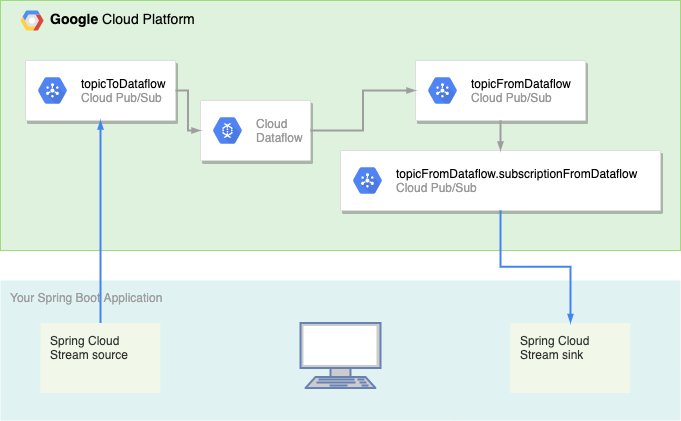
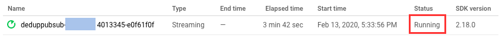
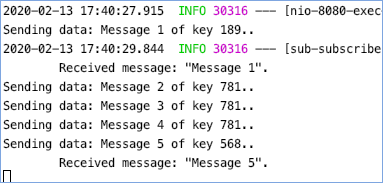

Tianzi Cai | Developer Programs Engineer | Google Cloud


This tutorial demonstrates how to use Pub/Sub and Dataflow to deduplicate messages in a Spring Boot application.

Many enterprise-level Java applications with distributed systems on the backend are built with [Spring Boot] and [Spring Cloud]. [Spring Cloud GCP] are libraries that enable Spring Boot applications to use GCP managed services such as [Pub/Sub] for added scalability and separation of concern. 

[Pub/Sub] and [Dataflow] together can meet many different stream processing needs. In this tutorial, you will learn how to set up a simple Dataflow pipeline to process data out of a Spring Boot application before sending it back via Pub/Sub, but you will see that the same setup also applies to more complex and demanding stream processing needs.

## Objectives
- Configure a Spring Boot application to use [Pub/Sub] as a message broker.
- Use [Dataflow] to deduplicate messages.

## Architecture


## Before You Begin

1. Install the [Cloud SDK].

1. Create a new Google Cloud project via the
   [*New Project* page],
   or via the `gcloud` command line tool.

   ```shell script
   export PROJECT_NAME=your-google-cloud-project-id
   gcloud projects create $PROJECT_NAME
   ```

1. [Enable billing].

1. Setup the Cloud SDK to your GCP project.

   ```shell script
   gcloud init
   ```

1. [Enable the APIs](https://console.cloud.google.com/flows/enableapi?apiid=dataflow,compute_component,pubsub,storage_component,storage_api): Dataflow, Compute Engine, Pub/Sub, Cloud Storage.

1. Create a service account JSON key via the
   [*Create service account key* page],
   or via the `gcloud` command line tool.
   Here is how to do it through the *Create service account key* page.

   * From the **Service account** list, select **New service account**.
   * In the **Service account name** field, enter a name.
   * From the **Role** list, select **Project > Owner**.
   * Click **Create**. Save this JSON file to a location on your computer.

   Alternatively, you can use `gcloud` through the command line.

   ```shell script
   export PROJECT_NAME=$(gcloud config get-value project)
   export SA_NAME=spring-app
   export IAM_ACCOUNT=$SA_NAME@$PROJECT_NAME.iam.gserviceaccount.com

   # Create the service account.
   gcloud iam service-accounts create $SA_NAME --display-name $SA_NAME

   # Set the role to Project Owner (*).
   gcloud projects add-iam-policy-binding $PROJECT_NAME \
     --member serviceAccount:$IAM_ACCOUNT \
     --role roles/owner

   # Create a JSON file with the service account credentials.
   gcloud iam service-accounts keys create path/to/your/credentials.json \
     --iam-account=$IAM_ACCOUNT
   ```

   > *Note:* The **Role** field authorizes your service account to access resources.
   > You can view and change this field later by using the
   > [GCP Console IAM page].
   > If you are developing a production app, specify more granular permissions like **PubSub > Admin** and **Dataflow > Admin** than **Project > Owner**.
   > For more information, see
   > [Granting roles to service accounts].

   For more information, see
   [Creating and managing service accounts].

1. Set `GOOGLE_APPLICATION_CREDENTIALS` to your service account key file.

   ```shell script
   export GOOGLE_APPLICATION_CREDENTIALS=path/to/your/credentials.json
   ```
   If you have not done it, set your `PROJECT_NAME` environment variable to your GCP project.
   ```shell script
   export PROJECT_NAME=$(gcloud config get-value project)
   ```

1. Clone this repository and navigate to the sample code:

   ```shell script
   git clone https://github.com.GoogleCloudPlatform/pubsub-spring-dedup-messages.git
   cd community/tutorials/pubsub-spring-dedup-messages
   ```

## Bind Pub/Sub to Your Spring Boot Application

Spring Cloud Stream makes use of [binders] to send data to a Pub/Sub topic and receive data from a Pub/Sub subscription.

Your application can send data from an internal queue to a Pub/Sub topic if you provide both of the following:
1. a Spring Cloud Stream source
1. a Pub/Sub topic

### Specify a Spring Cloud Stream source
Spring can recognize a Spring Cloud Stream source as a Supplier bean.

In [App.java](pubsub-spring/src/main/java/com/google/example/App.java):

[embedmd]:# (pubsub-spring/src/main/java/com/google/example/App.java java /  \/\/ The Supplier Bean/ /}/)
```java
  // The Supplier Bean makes the function a valid Spring Cloud Stream source. It
  // sends messages to a Pub/Sub topic configured with the binding name
  // `sendMessagesForDeduplication-out-0` in application.properties.
  @Bean
  Supplier<Flux<Message<String>>> sendMessagesForDeduplication(
    final EmitterProcessor<Message<String>> frontEndListener) {
    return () -> frontEndListener;
  }
```

### Specify a Pub/Sub topic for the source
To specify a Pub/Sub topic for the source, you can assign a topic name to the output binding destination of your source in `application.properties`. Here, the topic name is `topicToDataflow`. The output binding destination is indicated by `-out-` in the binding name `sendMessagesForDeduplication-out-0` and binding property `destination`. Spring takes input to the function `sendMessagesForDeduplication` and sends it to the Pub/Sub topic `topicToDataflow`. Spring will create this topic if it does not exist. For more information, see [Binding and Binding Names].

In [application.properties](pubsub-spring/src/main/resources/application.properties):

[embedmd]:# (pubsub-spring/src/main/resources/application.properties /.*Data going/ /=topicToDataflow/)
```properties
# Data going to Pub/Sub from a Spring Cloud Stream source defined in the
# Supplier bean `sendMessagesForDeduplication`. The application will
# create the Pub/Sub topic `topicToDataflow` if it does not exist.
spring.cloud.stream.bindings.sendMessagesForDeduplication-out-0.destination=topicToDataflow
```

Similarly, your application can receive data from a Pub/Sub subscription if you specify both of the following: 
1. a Spring Cloud Stream sink
1. a pair of Pub/Sub topic and subscription

### Specify a Spring Cloud Stream sink
Spring can recognize a Spring Cloud Stream sink as a Consumer bean.

In [App.java](pubsub-spring/src/main/java/com/google/example/App.java):

[embedmd]:# (pubsub-spring/src/main/java/com/google/example/App.java java /  \/\/ The Consumer Bean/ /}/)
```java
  // The Consumer Bean makes the function a valid Spring Cloud Stream sink. It
  // receives messages from a Pub/Sub subscription configured with the binding
  // name `receiveDedupedMessagesFromDataflow-in-0` in application.properties.
  @Bean
  Consumer<Message<String>> receiveDedupedMessagesFromDataflow() {
    return msg -> {
      System.out.println("\tReceived message: \"" + msg.getPayload() + "\".");
    }
```

### Specify a Pub/Sub topic and subscription for the sink
To specify a Pub/Sub topic and subscription for your sink, you can assign a topic name and a subscription name to the input binding destination and consumer group of your sink in `application.properties`. Here, the topic name is `topicFromDataflow` and the subscription name is a concatenation of the user-provided topic name and subscription name, i.e. `topicFromDataflow.subscriptionFromDataflow`. The input binding destination and consumer group are indicated by `-in-` in the binding name `receiveDedupedMessagesFromDataflow-in-0` and binding properties `destination` and `group` respectively. Spring receives messages from the subscription and use them as input to the function `receiveDedupedMessagesFromDataflow`. Only input bindings have consumer groups. For more information, see [Common Binding Properties].

In [application.properties](pubsub-spring/src/main/resources/application.properties):

[embedmd]:# (pubsub-spring/src/main/resources/application.properties /.*Data coming/ /=subscriptionFromDataflow/)
```properties
# Data coming from Pub/Sub to a Spring Cloud Stream sink defined in the
# Consumer bean `receiveDedupedMessagesFromDataflow`. The application
# will create the Pub/Sub topic `topicFromDataflow` and subscription
# `topicFromDataflow.subscriptionFromDataflow` if they do not exist.
spring.cloud.stream.bindings.receiveDedupedMessagesFromDataflow-in-0.destination=topicFromDataflow
spring.cloud.stream.bindings.receiveDedupedMessagesFromDataflow-in-0.group=subscriptionFromDataflow
```

### Construct a Pub/Sub message with custom attributes

Pub/Sub lets you publish messages with custom attributes, which are key value pairs. To construct such a message in your Spring Boot application, you can specify the attributes as headers. 

In [DataEntryController.java](pubsub-spring/src/main/java/com/google/example/DataEntryController.java):

[embedmd]:# (pubsub-spring/src/main/java/com/google/example/DataEntryController.java java /  \/\/ Headers/ /;/)
```java
  // Headers become Pub/Sub message attributes.
    Message<String> message = MessageBuilder
      .withPayload(data)
      .setHeader("key", key)
      .build();
```

### Run the application
1. To start your application, navigate to `pubsub-spring/` and run: 

    ```shell script
    mvn spring-boot:run
    ```
1. Point your browser to `localhost:8080`.
1. Send a message using the form. 
1. View Publish Message Request Count and Publish Message Operation Count in the topic details in [Cloud Console for Pub/Sub Topic] to verify that publishing to Pub/Sub is successful. 

## Create a Dataflow Pipeline to Deduplicate Pub/Sub Messages

To deduplicate Pub/Sub messages in a Dataflow pipeline, all you need to do is asking the input stream for an `idAttribute`. Here, the input stream is a Pub/Sub topic, its `idAttribute` can be any Pub/Sub message attribute. Dataflow can achieve exactly once processing on messages with the same attribute values.

In [DedupPubSub.java](pubsubio-dedup/src/main/java/com/google/example/DedupPubSub.java):

[embedmd]:# (pubsubio-dedup/src/main/java/com/google/example/DedupPubSub.java java /  pipeline\n.*1\)./ /;/)
```java
  pipeline
        // 1) Read string messages with attributes from a Pub/Sub topic.
        .apply(
            "Read from PubSub",
            PubsubIO.readStrings()
                .fromTopic(options.getInputTopic())
                .withIdAttribute(options.getIdAttribute()))
        // 2) Write string messages to another Pub/Sub topic.
        .apply("Write to PubSub", PubsubIO.writeStrings().to(options.getOutputTopic()));
```

### Run the Dataflow job

1. To start the Dataflow job,  navigate to `pubsubio-dedup/` and run: 
    ```shell script
      mvn compile exec:java \
       -Dexec.mainClass=com.google.example.DedupPubSub \
       -Dexec.args="\
         --project=$PROJECT_NAME \
         --inputTopic=projects/$PROJECT_NAME/topics/topicToDataflow \
         --outputTopic=projects/$PROJECT_NAME/topics/topicFromDataflow \
         --idAttribute=key \
         --runner=DataflowRunner"
    ```
1. Check the job's progress in the [Cloud Console for Dataflow]. Wait a few minutes for the job status to become **Running**. You should also see `INFO: ... Workers have started successfully` in the terminal at this point.

1. Issue `Ctrl+C` to stop the program locally. Stopping the program locally does not affect the Dataflow job running on GCP.

## Observe the Results
Publish a few more messages of different keys via the web host and observe messages of the same key arrive only once in your terminal.



## Cleanup
1. Use `Ctrl+C` to stop the Spring Boot application and the Dataflow.
1. In the [Cloud Console for Dataflow], select the Dataflow job and stop it. Cancel the pipeline instead of draining it. Dataflow will automatically delete the subscription to the topic `topicFromDataflow` during this process.
1. Delete the subscription followed by the topics in the [Cloud Console for Pub/Sub] or via the command line.
```shell script
gcloud pubsub subscriptions delete topicFromDataflow.subscriptionFromDataflow
gcloud pubsub topics delete topicFromDataflow topicToDataflow
```
## Next Steps
1. Learn more about [Pub/Sub].
1. [Google Cloud Platform services that integrate with Spring].
1. Using [Dataflow templates] for stream processing.

[Spring Boot]: https://spring.io/projects/spring-boot
[Spring Cloud]: https://spring.io/projects/spring-cloud
[Spring Cloud GCP]: https://spring.io/projects/spring-cloud-gcp
[Pub/Sub]: https://cloud.google.com/pubsub/docs/overview
[Dataflow]: https://cloud.google.com/dataflow/docs/
[Cloud SDK]: https://cloud.google.com/sdk/docs/
[Cloud Shell]: https://console.cloud.google.com/cloudshell/editor/
[*New Project* page]: https://console.cloud.google.com/projectcreate
[Enable billing]: https://cloud.google.com/billing/docs/how-to/modify-project/
[*Create service account key* page]: https://console.cloud.google.com/apis/credentials/serviceaccountkey/
[GCP Console IAM page]: https://console.cloud.google.com/iam-admin/iam/
[Granting roles to service accounts]: https://cloud.google.com/iam/docs/granting-roles-to-service-accounts/
[Creating and managing service accounts]: https://cloud.google.com/iam/docs/creating-managing-service-accounts/
[Cloud Console for Pub/Sub Topic]: https://console.cloud.google.com/cloudpubsub/topic/
[Cloud Console for Dataflow]: http://console.cloud.google.com/dataflow/
[Cloud Console for Pub/Sub]: https://console.cloud.google.com/cloudpubsub/

[Binding and Binding Names]: https://github.com/spring-cloud/spring-cloud-stream/blob/master/docs/src/main/asciidoc/spring-cloud-stream.adoc#binding-and-binding-names
[Common Binding Properties]: https://github.com/spring-cloud/spring-cloud-stream/blob/master/docs/src/main/asciidoc/spring-cloud-stream.adoc#common-binding-properties
[Google Cloud Platform services that integrate with Spring]: https://spring.io/projects/spring-cloud-gcp/
[Dataflow templates]: https://cloud.google.com/dataflow/docs/guides/templates/overview/
[binders]: https://github.com/spring-cloud/spring-cloud-stream/blob/master/docs/src/main/asciidoc/spring-cloud-stream.adoc#the-binder-abstraction
