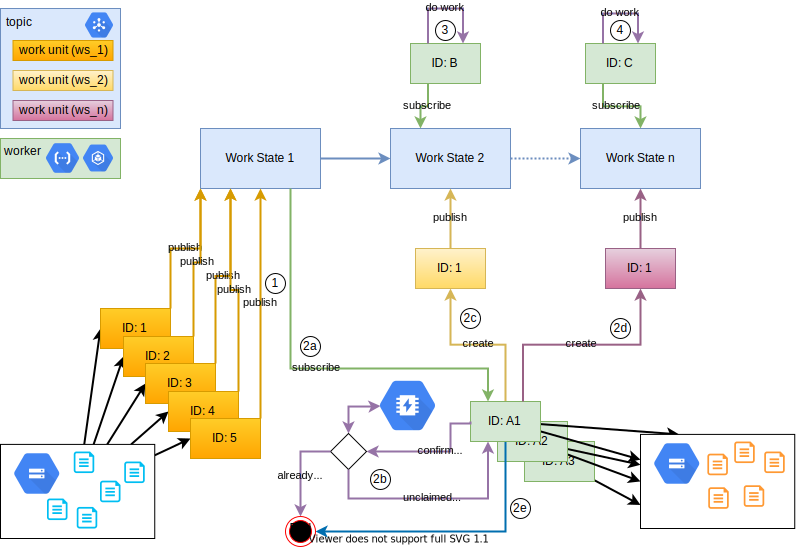

Daniel Watrous | Customer Engineer | Google LLC

<p style="background-color:#CAFACA;"><i>Contributed by Google employees.</i></p>

Queues provide an effective and robust mechanism for distributing work. This tutorial introduces Redis to prevent duplicate work and make the process as efficient as possible. Some key design considerations when building a workflow include

 * Design work outputs to be idempotent. This way if a unit of work is unintentionally processed twice, the end result is the same
 * A queue is useful anytime multiple workers need to respond to new ‘work available’ events
 * In the event that a unit of work is delivered to multiple workers, there needs to be a way to decide which worker drops the unit of work, and which one claims it

This tutorial is for anyone building a distributed workflow using Pub/Sub. It covers the creation of topics, subscriptions and a containerized application (in Python). This also uses Cloud Storage to synthesize work and generate notifications.

This entire tutorial can be completed in the cloud shell within the Google Cloud Console, or locally using Docker.

The following diagram illustrates the components and interactions that are part of this tutorial.



## Objectives

 * Create new topics in Pub/Sub
 * Create new subscriptions in Pub/Sub
 * Generate units of work along with corresponding messages
 * Start a new Python container and run an app to subscribe and publish messages

## Costs

This tutorial uses billable components of Google Cloud, including the following:

*   [Cloud Pub/Sub](https://cloud.google.com/Pub/Sub/)
*   [Cloud Storage](https://cloud.google.com/storage/)
*   [Memorystore](https://cloud.google.com/memorystore/) (not used in the "local development" scenario)

Use the [pricing calculator](https://cloud.google.com/products/calculator) to generate a cost estimate based on your projected usage.

## Before you begin

Enable the APIs for the services mentioned above. This can be done in the Console or using the following gcloud commands.

```
gcloud services enable redis.googleapis.com
gcloud services enable pubsub.googleapis.com
gcloud services enable storage-api.googleapis.com
```

### Docker images used
 * Python 3: https://hub.docker.com/_/python
 * gcloud: https://hub.docker.com/r/google/cloud-sdk (you can also install gcloud locally)

### Set environment variables

```
export PROJECT_ID=project-name
gcloud config set project $PROJECT_ID
export WORKBUCKET=workbucket01_$PROJECT_ID
export PROCESSEDBUCKET=processedbucket01_$PROJECT_ID
export SERVICE_ACCOUNT=pubsub-access
export KEYFILE=$SERVICE_ACCOUNT-key.json
export GOOGLE_APPLICATION_CREDENTIALS=$KEYFILE
export DEMOSOURCE=~/path/to/this/repo
```

### Where to run this tutorial
This tutorial can be executed in any environment that provides gcloud and Docker. Some options include:

 * [Cloud Shell](https://cloud.google.com/shell) includes Docker and has gcloud built in and ready to go.
 * If you prefer to develop on your own host, install [Docker](https://www.docker.com/) and run the commands locally
 * You can also create a small instance to follow this tutorial with the following command.

```
gcloud compute instances create pubsub-tutorial \
   --project=$PROJECT_ID \
   --zone=us-central1-a \
   --machine-type=e2-micro \
   --image=cos-stable-85-13310-1041-9 \
   --image-project=cos-cloud \
   --boot-disk-size=15GB
```

## Tutorial body

## Create three pubsub topics
```
gcloud pubsub topics create available processing complete --labels source=tgsdemo
gcloud pubsub topics list
```

## Create worker and auditor subscriptions
```
gcloud pubsub subscriptions create worker --topic=available
gcloud pubsub subscriptions create auditor --topic=processing
gcloud pubsub subscriptions list
```

## Establish a redis instance
Depending on whether the tutorial is being run locally or in the cloud, use one of the following options
### Local
```
docker run --rm -p 6379:6379 --name some-redis -d redis
```

### Cloud
```
gcloud redis instances create workavailability --size=1 --region=us-central1 --redis-version=redis_5_0
```

## Create a service account and add roles for publish/subscribe
The scripts that interact with Pub/Sub and Cloud Storage will require a Service Account and specific permissions. Create the Service Account and generate a credential file for this tutorial

```
gcloud iam service-accounts create $SERVICE_ACCOUNT --display-name "PubSub Access Account" --description "access for pubsub workflow"
gcloud iam service-accounts keys create $KEYFILE --iam-account=$SERVICE_ACCOUNT@$PROJECT_ID.iam.gserviceaccount.com
# note the location where $SERVICE_ACCOUNT-key.json key was downloaded
```

The following roles/permissions are required by the script for this tutorial.

```
gcloud projects add-iam-policy-binding $PROJECT_ID --member=serviceAccount:$SERVICE_ACCOUNT@$PROJECT_ID.iam.gserviceaccount.com --role=roles/pubsub.publisher
gcloud projects add-iam-policy-binding $PROJECT_ID --member=serviceAccount:$SERVICE_ACCOUNT@$PROJECT_ID.iam.gserviceaccount.com --role=roles/pubsub.subscriber
gcloud projects add-iam-policy-binding $PROJECT_ID --member=serviceAccount:$SERVICE_ACCOUNT@$PROJECT_ID.iam.gserviceaccount.com --role=roles/storage.objectAdmin
gcloud projects add-iam-policy-binding $PROJECT_ID --member=serviceAccount:$SERVICE_ACCOUNT@$PROJECT_ID.iam.gserviceaccount.com --role=roles/serviceusage.serviceUsageConsumer
```

## Create some work files
The following commands will create a folder and fill it with 99 work files. Each file will containe up to 2048 bytes and will include specific tokens that we want to replace as part of our workflow.
```
mkdir workfiles
for n in {1..9}; do touch workfiles/work00$n ; done
for n in {10..99}; do touch workfiles/work0$n ; done
# Fill those work files with content
for f in workfiles/*; do base64 /dev/urandom | head -c 1024000 | grep -i svn | sed  's/svn/---SVN---/gI' | head -c 2048 > $f; done
```

## Create a buckets for work and processed files
```
gsutil mb -p $PROJECT_ID -l US-CENTRAL1 gs://$WORKBUCKET
gsutil mb -p $PROJECT_ID -l US-CENTRAL1 gs://$PROCESSEDBUCKET
```

## Create a notification for objects placed in the work bucket
This command will create a notification on the bucket above. The result is that any time an object is added to the bucket, a new message will be published to the topic, which is `available` in this case.
```
gsutil notification create -f json -t available gs://$WORKBUCKET
gsutil notification list gs://$WORKBUCKET
```

## Copy files to bucket
```
gsutil -m cp workfiles/* gs://$WORKBUCKET
```

## Explanation
At this point in the tutorial, there should be 99 files in `$WORKBUCKET`, no files in `$PROCESSEDBUCKET` and 99 messages in the `available` topic and ready to be pulled by the `worker` subscription. Those messages will continue to age until they are pulled and acked.

Next the `config` needs to be updated and a Python container started

## Update config file
The `config` file needs to be updated and looks like this

```
{
    "redis_host": "172.17.0.1",
    "redis_port": "6379",
    "processed_bucket": "PROCESSEDBUCKET",
    "processing_topic": "processing",
    "complete_topic": "complete"
}
```

In the above, the `redis_` values depend on whether the Local or Cloud option was chosen above. The `processed_bucket` was set in an environment variable at the beginning of this tutorial and needs to be updated in the config file.

## Start a python container (local development)
```
docker run --rm -it --entrypoint /bin/bash -v $DEMOSOURCE:/pubsub -e PROJECT_ID -e GOOGLE_APPLICATION_CREDENTIALS=/pubsub/$KEYFILE -w /pubsub python:3
```

Inside the container, run the following commands. This will install required libraries and run the `worker.py` script. When the script is done executing, use CTRL+C to exit the script. The temp directory will be cleaned up on exit.
```
pip install -r /pubsub/requirements.txt
python worker.py $PROJECT_ID worker
exit
```

## Cleaning up

Clean up generated files
```
rm -fR workfiles
```

Clean up Pub/Sub topics and subscriptions
```
gcloud pubsub topics delete available processing complete
gcloud pubsub subscriptions delete worker auditor
```

Remove roles/permissions
```
gcloud projects remove-iam-policy-binding $PROJECT_ID --member=serviceAccount:$SERVICE_ACCOUNT@$PROJECT_ID.iam.gserviceaccount.com --role=roles/pubsub.publisher
gcloud projects remove-iam-policy-binding $PROJECT_ID --member=serviceAccount:$SERVICE_ACCOUNT@$PROJECT_ID.iam.gserviceaccount.com --role=roles/pubsub.subscriber
gcloud projects remove-iam-policy-binding $PROJECT_ID --member=serviceAccount:$SERVICE_ACCOUNT@$PROJECT_ID.iam.gserviceaccount.com --role=roles/storage.objectAdmin
gcloud projects remove-iam-policy-binding $PROJECT_ID --member=serviceAccount:$SERVICE_ACCOUNT@$PROJECT_ID.iam.gserviceaccount.com --role=roles/serviceusage.serviceUsageConsumer
```

Delete the Service Account
```
gcloud iam service-accounts delete $SERVICE_ACCOUNT@$PROJECT_ID.iam.gserviceaccount.com
```

Clean up Storage buckets
```
gsutil -m rm gs://$WORKBUCKET/*
gsutil rb gs://$WORKBUCKET
gsutil -m rm gs://$PROCESSEDBUCKET/*
gsutil rb gs://$PROCESSEDBUCKET
```

If you created a cloud Memorystore instance, clean that up too
```
gcloud redis instances delete workavailability --region=us-central1
```

## What's next

### Useful References
 * Introduction to pubsub
    * https://cloud.google.com/pubsub/docs/building-pubsub-messaging-system
    * https://googleapis.dev/python/pubsub/latest/index.html
 * Introduction to Redis
    * https://redis-py.readthedocs.io/en/stable/
    * https://redislabs.com/lp/python-redis/
 * Automate pubsub message creation when an object is placed in a bucket
    * https://cloud.google.com/storage/docs/pubsub-notifications

### Alternatives
A simple alternative to this workflow management approach is to have a cloud function execute when an object in GCS experiences a specific event. https://cloud.google.com/functions/docs/tutorials/storage. This may have some scale benefits, but it also introduces concurrencty and assurance issues.

