Matt McLimans | Technical Engagement Manager | Palo Alto Networks

<p style="background-color:#D9EFFC;"><i>Contributed by the Google Cloud community. Not official Google documentation.</i></p>

# Secure Google Cloud Hub-and-Spoke with VM-Series

In this tutorial, you will use Terraform to build a Google Cloud [hub-and-spoke architecture](https://cloud.google.com/architecture/deploy-hub-spoke-vpc-network-topology), secured by Palo Alto Networks [VM-Series Next Generation Firewalls](https://www.paloaltonetworks.com/network-security/vm-series-virtual-next-generation-firewall). In addition, you will use [Instance Groups](https://cloud.google.com/compute/docs/instance-groups) and [Load Balancers](https://cloud.google.com/load-balancing) to provide autoscaling capabilities for the VM-Series firewalls. 

This tutorial is intended for network administrators, solution architects, and security professionals who are familiar with [Compute Engine](https://cloud.google.com/compute) and [Virtual Private Cloud (VPC) networking](https://cloud.google.com/vpc).

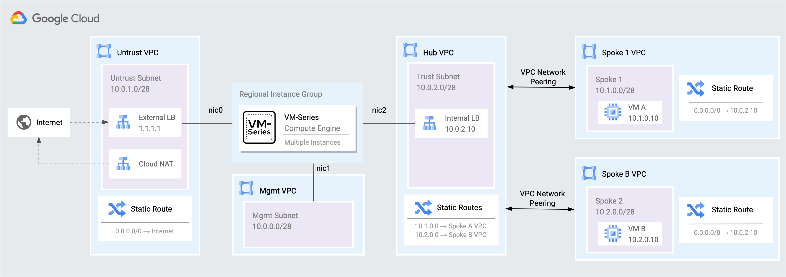

The following items are required for this tutorial:

* A Google Cloud project.
* A local machine with a [Terraform](https://developer.hashicorp.com/terraform/tutorials/aws-get-started/install-cli) installation or access to [Google Cloud Shell](https://ssh.cloud.google.com/cloudshell).

## Objectives

* Deploy the environment with Terraform.
* Secure internet inbound traffic.
* Secure outbound and east/west traffic.
* Enable applications with Palo Alto Networks [App-ID](https://www.paloaltonetworks.com/technologies/app-id).
* Autoscale the VM-Series.
  

## Costs

This tutorial uses billable components of Google Cloud, including the following:

* [Compute Engine](https://cloud.google.com/compute/vm-instance-pricing)
* [Cloud NAT](https://cloud.google.com/nat/pricing)
* [VPC Networks](https://cloud.google.com/vpc/pricing)
* [Load Balancing](https://cloud.google.com/vpc/network-pricing#lb)
* [VM-Series Pay-Go Bundle2](https://console.cloud.google.com/marketplace/product/paloaltonetworksgcp-public/vmseries-flex-bundle2)
  * The VM-Series also supports [BYOL](https://console.cloud.google.com/marketplace/product/paloaltonetworksgcp-public/vmseries-flex-byol) licensing. The process to change the license is explained later in the tutorial.  See [VM-Series Firewall Licensing](https://docs.paloaltonetworks.com/vm-series/10-2/vm-series-deployment/license-the-vm-series-firewall/vm-series-firewall-licensing.html#id8fea514c-0d85-457f-b53c-d6d6193df07c) for more information.

Use the [pricing calculator](https://cloud.google.com/products/calculator) to generate a cost estimate based on your projected usage.


## Before you begin

This tutorial assumes you are using Google Cloud Shell to deploy the cloud resources. 

1.  Sign into your [Google Cloud](https://console.cloud.google.com/) account.
2.  Create or select a Google Cloud project. 
3.  Verify that billing is enabled for your cloud project. [Learn how to check if billing is enabled on a project](https://cloud.google.com/billing/docs/how-to/verify-billing-enabled).
4.  Access [Cloud Shell](https://ssh.cloud.google.com/cloudshell) within the project.  
5.  (Optional) If using BYOL licensing for the VM-Series, register your license keys with the [Palo Alto Networks Support Portal](https://support.paloaltonetworks.com).

This tutorial deploys the VM-Series **without** [Panorama centralized management](https://docs.paloaltonetworks.com/panorama/10-2/panorama-admin/manage-firewalls).  However, in production environments, it is recommended to use Panorama to centrally manage the VM-Series firewalls.  Panorama enables you can manage the firewalls as a single entity, regardless of how many firewalls are deployed or scaled.


## Prepare for deployment

1. In [Cloud Shell](https://ssh.cloud.google.com/cloudshell), enable the required Google Cloud APIs.

    ```
    gcloud services enable compute.googleapis.com
    gcloud services enable iam.googleapis.com
    gcloud services enable cloudresourcemanager.googleapis.com
    ```

2. Clone the tutorial's repository and move to the build directory.  
   
    ```
    git clone https://github.com/PaloAltoNetworks/google-cloud-hub-spoke-tutorial
    cd google-cloud-hub-spoke-tutorial
    ```

3. Create a SSH key.  This key will be used to access all the VM instances post deployment.

    ```
    ssh-keygen -f ~/.ssh/vmseries-tutorial -t rsa
    ```

4. Create a `terraform.tfvars` file from `terraform.tfvars.example`.

    ```
    cp terraform.tfvars.example terraform.tfvars
    ```

5. Set values for the following variables inside `terraform.tfvars`.
   
   | Name                    | Description                                                                               | Default                          |
   | ----------------------- | ----------------------------------------------------------------------------------------- | -------------------------------- |
   | `project_id`            | The Google Cloud Project ID that will contain the tutorial's resources.                   | `null`                           |
   | `region`                | The Google Cloud region to deploy the resources.                                          | `us-central1`                    |
   | `public_key_path`       | The full path of the public key you previously created.                                   | `"~/.ssh/vmseries-tutorial.pub"` |
   | `mgmt_allow_ips`        | A list of external IPv4 addresses that have access to the VM-Series management interface. | `["0.0.0.0/0"] `                 |
    
    >The VM-Series is accessed via an external IP address attached to its management interface.  This is not recommended for production environments.
    
6. (Optional) `vmseries_image_name` can be modified within the `terraform.tfvars` to change the VM-Series PAN-OS version and license type.  A list of usable images can be generated with the following command. 

    ```
    gcloud compute images list \
        --project paloaltonetworksgcp-public \
        --filter='name ~ .*vmseries-flex.*' \
        --format='table(name,PROJECT,status)'
    ```

7. (Optional) If you are using a BYOL image (i.e. <code>vmseries-flex-<b>byol</b>-*</code>), the license can be applied during deployment or after deployment.  
   
   To bootstrap the license during deployment:
    1. [Contact](https://www.paloaltonetworks.com/company/contact-sales) your Palo Alto Networks sales representative to receive the licenses.
    2. [Create a Support Account](https://docs.paloaltonetworks.com/vm-series/10-2/vm-series-deployment/license-the-vm-series-firewall/create-a-support-account#id4032767e-a4a8-4f5a-9df2-48f5d63780ba) and [create a deployment profile](https://docs.paloaltonetworks.com/vm-series/10-2/vm-series-deployment/license-the-vm-series-firewall/software-ngfw/create-a-deployment-profile-vm-series). 
    3. Paste the **VM-Series Auth-Code** to `bootstrap_files/authcodes`. 

8. Save your `terraform.tfvars` file.


## Deployment

When no further changes are necessary in the configuration, deploy the resources.

1. Initialize and apply the Terraform plan.  

    ```
    terraform init
    terraform apply
    ```

2. After all the resources are created, Terraform displays the following output. 
   
   The `EXTERNAL_LB_IP` value is the IP address of the external load balancer’s forwarding rule. 

    ```
    Apply complete!

    Outputs:

    EXTERNAL_LB_IP = "35.68.75.133"
    ```


## Accessing the VM-Series

A password must be set for the `admin` user in order to access the VM-Series web interface.  Note, this step is not necessary if using Panorama to centrally manage the VM-Series firewalls.

1. Retrieve the `EXTERNAL_IP` attached to the VM-Series management interface.

    ```
    gcloud compute instances list \
        --filter='tags.items=(vmseries-tutorial)' \
        --format='value(EXTERNAL_IP)'
    ```


2. SSH to the VM-Series using the `EXTERNAL_IP` and your private SSH key. 
   
   >If your login attempt is refused, please wait for the cloud resources to finish booting.
    ```
    ssh admin@<EXTERNAL_IP> -i ~/.ssh/vmseries-tutorial
    ```

 
3. Set a password for the `admin` username. 

    ```
    configure
    set mgt-config users admin password
    ```


4. Commit the changes.

    ```
    commit
    ```


5. Enter `exit` twice to leave the configuration pane and to terminate the session.

    ```
    exit
    ```
   

6. Access the VM-Series web interface using a web browser.  Login with the user `admin` and the password you configured.

    ```
    https://<EXTERNAL_IP>
    ```


## Securing internet inbound traffic

In this tutorial, the workloads deployed within the spoke networks are preconfigured to run sample applications.  In spoke1, `VM A` (10.1.0.10) runs a Jenkins service on `TCP:8080` and a generic web-service on `TCP:80`.  In spoke2, `VM B` is a jump server which will be used to simulate outbound and east/west based threats.

Traffic from the internet to workloads in the spoke networks is distributed by the external TCP/UDP load balancer to the VM-Series untrust interfaces (`NIC0`).  The VM-Series is preconfigured to translate and allow `TCP:80` to `VM A` and `TCP:22` to `VM B` from the internet. 

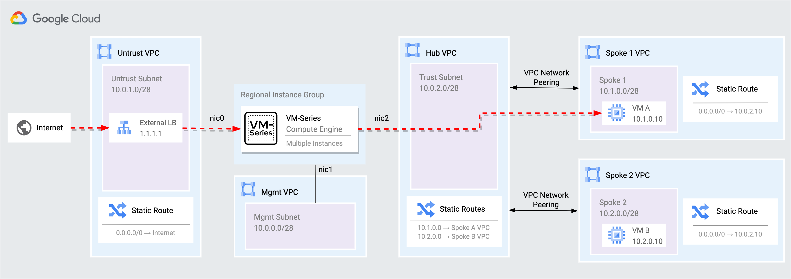

1. Open a HTTP connection to the generic web-service on `VM A` (10.1.0.10) by entering the `EXTERNAL_LB_IP` into a web browser.

    ```
    http://<EXTERNAL_LB_IP>
    ```

    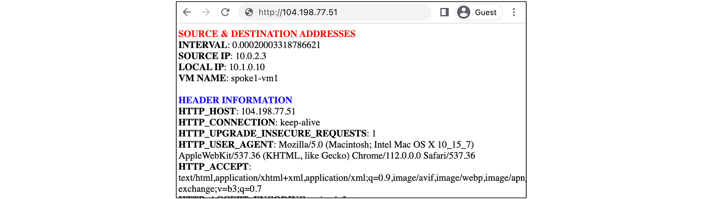

    >The web service displays header information about the request, including: VM-Series IP, `VM A` IP, and client source address.

2. Append port `8080` to the URL to open a session to the Jenkins service on `VM A` (10.1.0.10).

    ```
    http://<EXTERNAL_LB_IP>:8080
    ```

    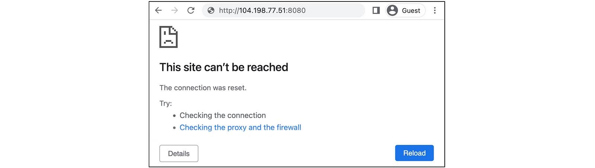


    >The request to the Jenkins service should fail.  This is because Jenkins has not been enabled within the VM-Series security policies.  Palo Alto Networks firewalls leverage [App-ID](https://www.paloaltonetworks.com/technologies/app-id) to identify and enable applications with layer-7 controls. 


### Enabling applications with App-ID

App-ID enables you to see applications on your network and learn their behavioral characteristics with their relative risk. 

Use App-ID to enable Jenkins through the VM-Series security policies.

1. On the VM-Series, go to **Policies → Security**. Click the **APPLICATION** column within the `inbound-web` security policy. 

    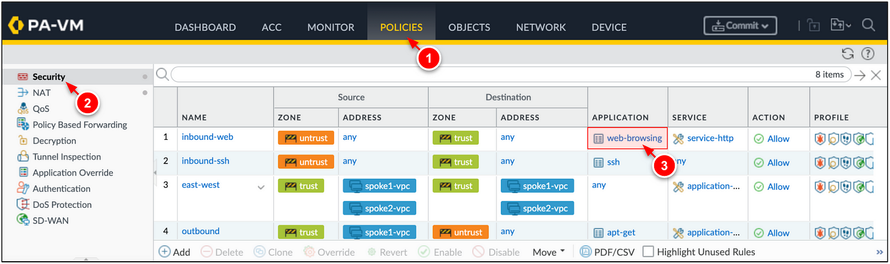

2. Click **ADD** and search for `jenkins`.  Click **OK**.

    

3. Click **Commit → Commit** to apply the changes to the VM-Series.

    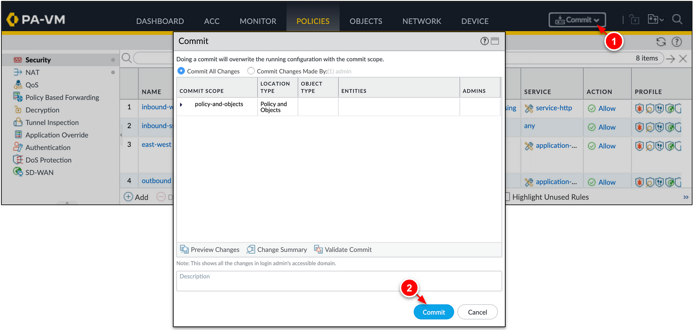

4. Access the Jenkins service again.  
   
    ```
    http://<EXTERNAL_LB_IP>:8080
    ```

    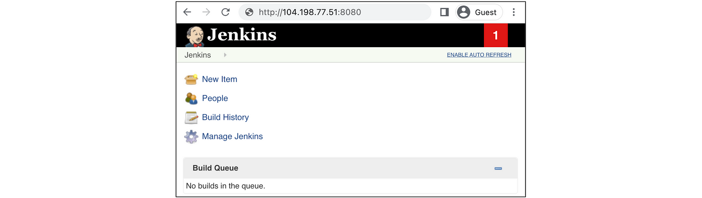

    >The Jenkins service should now resolve.  This is because the `jenkins` App-ID has been added to the `inbound-web` security policy.

5. On the VM-Series, go to **Monitor → Traffic** to view the traffic logs.  

6. Enter the query below to search for traffic matching the `jenkins` App-ID. 

    ```
    ( app eq jenkins )
    ```

    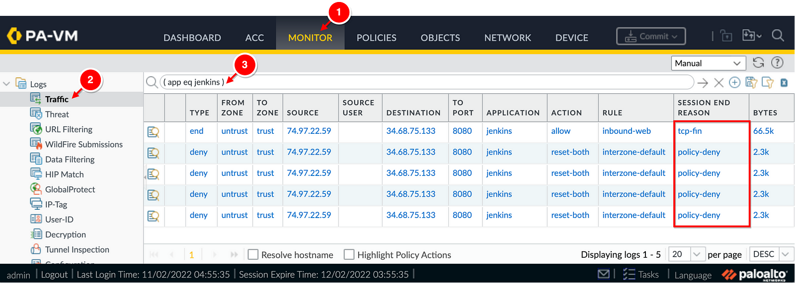

    >Notice, the `jenkins` application was denied until its App-ID was added to a security policy to allow the traffic.


## Securing internet outbound & east/west traffic 

The VM-Series secures outbound internet traffic from the spoke networks and east-west traffic traversing between spoke networks.  Static routes are defined in the spoke networks to route spoke traffic to an internal TCP/UDP load balancer within the hub VPC network.  Then, the load balancer distributes traffic to the VM-Series trust interfaces (`NIC2`) for inspection.  

If a request from a spoke network is an internet destination, the VM-Series inspects and translates the traffic through its untrust interface (`NIC0`).  If the request is destined to an adjacent spoke network (east-west), the VM-Series inspects and hairpins the traffic through its trust interface (`NIC2`) to the destination network.  


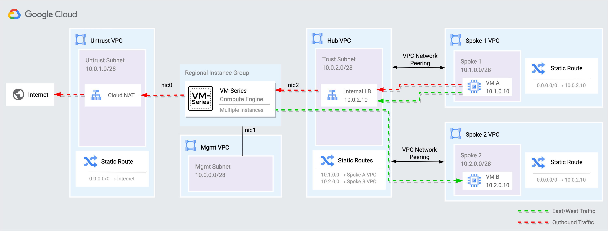


1. Using the external load balancer's forwarding rule, open an SSH session with `VM B` (10.2.0.10) within the spoke 2 network.
   
    ```
    ssh paloalto@<EXTERNAL_LB_IP> -i ~/.ssh/vmseries-tutorial
    ```


2. On `VM B`, attempt to download a pseudo-malicious file from the internet.  

    ```
    wget www.eicar.org/download/eicar.com.txt
    ```


3. Simulate pseudo-malicious east-west traffic between `VM B` (10.2.0.10) and `VM A` (10.1.0.10).

    ```
    curl http://10.1.0.10/cgi-bin/../../../..//bin/cat%20/etc/passwd

    curl -H 'User-Agent: () { :; }; 123.123.123.123:9999' http://10.1.0.10/cgi-bin/test-critical
    ```


4. On the VM-Series, go to **Monitor → Threats** to view the threat logs sourced from `VM B` (10.2.0.10).

    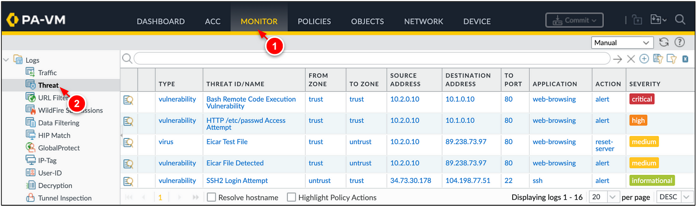 

    >The firewall's security policies enable you to allow or block traffic on your network based on the user, application, and device.  If traffic is allowed, security profiles attached to the rule provide further content inspection.


## Autoscaling VM-Series
This tutorial uses a regional managed instance group to deploy and scale VM-Series firewalls across zones within a region. This enables you to scale VM-Series protecting your cloud assets while providing high availability through cross-zone redundancy.


### Viewing VM-Series metrics in Cloud Monitoring

The VM-Series publishes [PAN-OS metrics](https://docs.paloaltonetworks.com/vm-series/10-2/vm-series-deployment/about-the-vm-series-firewall/custom-pan-os-metrics-published-for-monitoring) to [Google Cloud Monitoring](https://cloud.google.com/monitoring). The metrics can be used as scaling parameters within the managed instance group.

Perform the following to view VM-Series metrics in Cloud Monitoring:

1. In the Google Cloud console, go to **Monitoring → Dashboards**. 
2. Select the dashboard titled, **VM-Series Metrics**.

    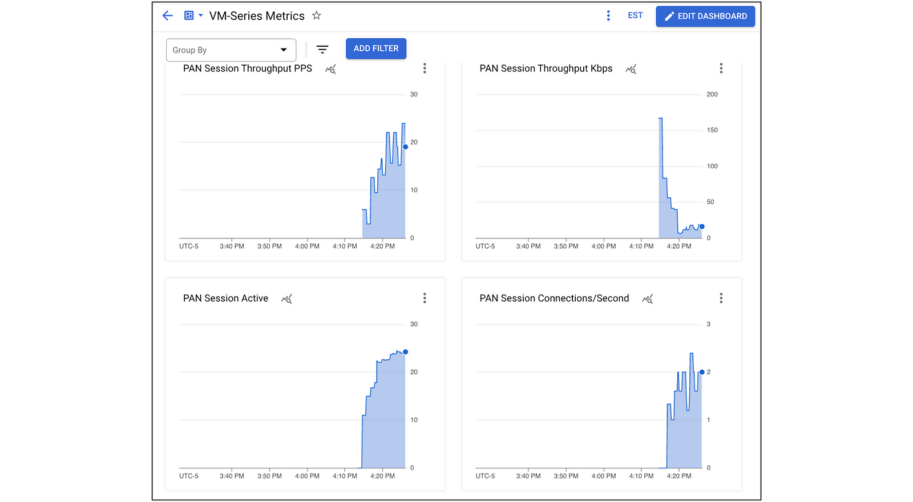


### Scaling VM-Series
The managed instance group created by Terraform sets the minimum and the maximum number of VM-Series replicas to `1`. 

You can simulate an autoscaling event by increasing the minimum and maximum number of VM-Series that run within the managed instance group. 

1. In Cloud Shell, add the following variables to your `terraform.tfvars`.
    
    ```
    vmseries_replica_minimum = 2
    vmseries_replica_maximum = 3
    ```

2. Apply the Terraform plan. 

    ```
    terraform apply
    ```

3. Once the apply completes, go to **Comnpute Engine → VM Instances**. A second VM-Series should now be deployed.


## Cleaning up

To avoid incurring charges to your Google Cloud account for the resources used in this tutorial, delete all of the resources with Terraform.

1. Destroy the cloud resources.
    ```
    terraform destroy
    ```
2. At the prompt, enter `yes`.
   
    After all resources are destroyed, Terraform displays the following message:
    ```
    Destroy Complete!
    ```

## What's next

* Learn about the[ VM-Series on Google Cloud](https://docs.paloaltonetworks.com/vm-series/10-2/vm-series-deployment/set-up-the-vm-series-firewall-on-google-cloud-platform/about-the-vm-series-firewall-on-google-cloud-platform).
* Getting started with [Palo Alto Networks PAN-OS](https://docs.paloaltonetworks.com/pan-os). 
* Read about [securing Google Cloud Networks with the VM-Series](https://cloud.google.com/architecture/partners/palo-alto-networks-ngfw).
* Learn about [VM-Series licensing on all platforms](https://docs.paloaltonetworks.com/vm-series/10-2/vm-series-deployment/license-the-vm-series-firewall/vm-series-firewall-licensing.html#id8fea514c-0d85-457f-b53c-d6d6193df07c).
* Use the [VM-Series Terraform modules for Google Cloud](https://registry.terraform.io/modules/PaloAltoNetworks/vmseries-modules/google/latest). 
