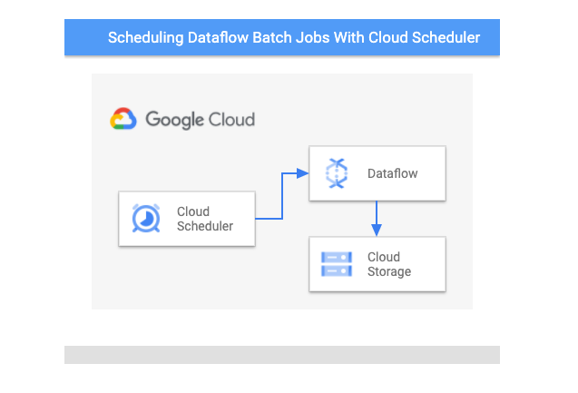
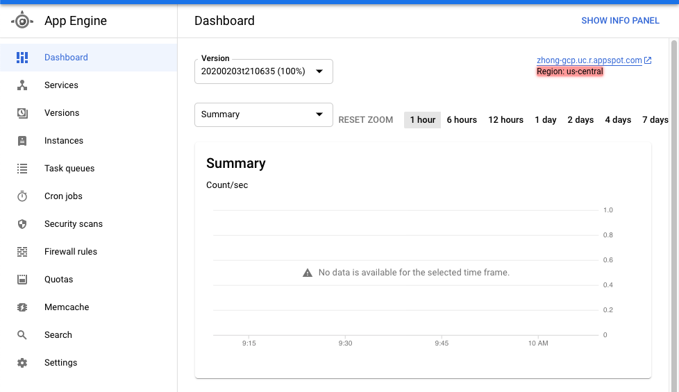
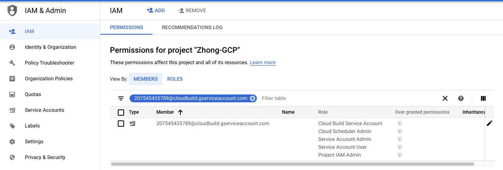

## Notes
- It is feasible to trigger a Dataflow batch job directly from the cloud scheduler directly. It is easy and fast. There is no need to use cloud function for that.
- Cloud schedulers need to be created in the same region of App engine. In your [Terraform script](https://www.terraform.io/docs/providers/google/r/cloud_scheduler_job.html#region), 
make sure assigning the right value for the region field. You need to use **us-central1** if your app engine lives in **us-central**.
- Use the [regional endpoint](https://cloud.google.com/dataflow/docs/reference/rest/v1b3/projects.locations.jobs/create) to specify the region of Dataflow job. 
If you don't explicitly set the location in the request, the jobs will be created in the default region (US-central).


In this tutorial, you will learn how to set up a [Cloud Scheduler](https://cloud.google.com/scheduler/) job to trigger to your 
Dataflow batch jobs.


Here is a high level architecture diagram, and you can find all the code [here](./scheduler-dataflow-demo)..
 

[Cloud Dataflow](https://cloud.google.com/dataflow) is a managed service for handling 
both streaming and batch jobs. For your streaming jobs, you just need to launch them once without worrying about operating them afterwards. 
However, for your batch jobs, you probably need to trigger them based on certain conditions.

First things first, to be able to run your Dataflow jobs on a regular basis, you need to build your Dataflow templates. 
Follow the [instructions](https://cloud.google.com/dataflow/docs/guides/templates/creating-templates) to create your templates and save them in a GCS bucket.


Once you have your templates ready, you can set up cloud schedulers to trigger Dataflow templates. 
Here is one example to define a scheduler using Terraform.


```hcl-terraform
resource "google_cloud_scheduler_job" "scheduler" {
  name = "scheduler-demo"
  schedule = "0 0 * * *"
  # This needs to be us-central1 even if the app engine is in us-central.
  # You will get a resource not found error if just using us-central.
  region = "us-central1"

  http_target {
    http_method = "POST"
    uri = "https://dataflow.googleapis.com/v1b3/projects/${var.project_id}/locations/${var.region}/templates:launch?gcsPath=gs://${var.bucket}/templates/dataflow-demo-template"
    oauth_token {
      service_account_email = google_service_account.cloud-scheduler-demo.email
    }

    # need to encode the string
    body = base64encode(<<-EOT
    {
      "jobName": "test-cloud-scheduler",
      "parameters": {
        "region": "${var.region}",
        "autoscalingAlgorithm": "THROUGHPUT_BASED",
      },
      "environment": {
        "maxWorkers": "10",
        "tempLocation": "gs://${var.bucket}/temp",
        "zone": "${var.region}-a"
      }
    }
EOT
    )
  }
}
```

## Instructions

The following step-by-step instructions can be used to create a sample Dataflow pipeline with Cloudbuild.

First, open Cloud Shell and clone the repository.

```
git clone https://github.com/GoogleCloudPlatform/community
cd community/tutorials/schedule-dataflow-jobs-with-cloud-scheduler/scheduler-dataflow-demo/
```

Create a bucket on Google Cloud Storage, which will be used to store terraform states and Dataflow templates.
Replace BUCKET with your own choice. ${GOOGLE_CLOUD_PROJECT} is predefined in Cloud Shell for the project ID.
You can skip this step if you already have one GCS bucket created.

```
export BUCKET=[BUCKET]
gsutil mb -p ${GOOGLE_CLOUD_PROJECT} gs://${BUCKET}
```

The next step is to create a backend for Terraform to store the states of 
GCP resources. Run the below command to create a remote backend service using GCS as the storage.
```
cd terraform
cat > backend.tf << EOF
terraform {
 backend "gcs" {
   bucket  = "${BUCKET}"
   prefix  = "terraform/state"
 }
}
EOF
```

Follow the [instruction](https://cloud.google.com/scheduler/docs/quickstart) to create a App Engine, which is needed to
set up Cloud Scheduler jobs.

Note: Cloud Scheduler jobs need to be created in the same region as the App engine. 
In addition, you need to set the region to be *us-central1* even when the region shows as
*us-central* on the UI.



```
export REGION=us-central1
```

Since we will be using Cloudbuild to execute GCP resource creation steps, it is
important to make sure the Cloudbuild service account has all the proper roles.
Follow the [link](https://cloud.google.com/cloud-build/docs/securing-builds/configure-access-for-cloud-build-service-account#granting_a_role_using_the_iam_page) 
to enable all the roles needed.

- Cloud Scheduler Admin
- Service Account Admin 
- Service Account User
- Project IAM Admin

Verify that all the roles are enabled in the UI.



Now you can submit a Cloudbuild job to create all the resources.


```
cd ..
gcloud builds submit --config=cloudbuild.yaml \
  --substitutions=_BUCKET=${BUCKET},_REGION=${REGION},_PROJECT_ID=${GOOGLE_CLOUD_PROJECT} .
```

The job will run based on the schedule you defined in the terraform script. 
In addition, you can manually run the scheduler through UI and watch it trigger your Dataflow batch job. 
You can check the status of jobs through the UI.


## Cleaning up

Since this tutorial uses multiple GCP components, please be sure to delete the associated resources once you are done.
