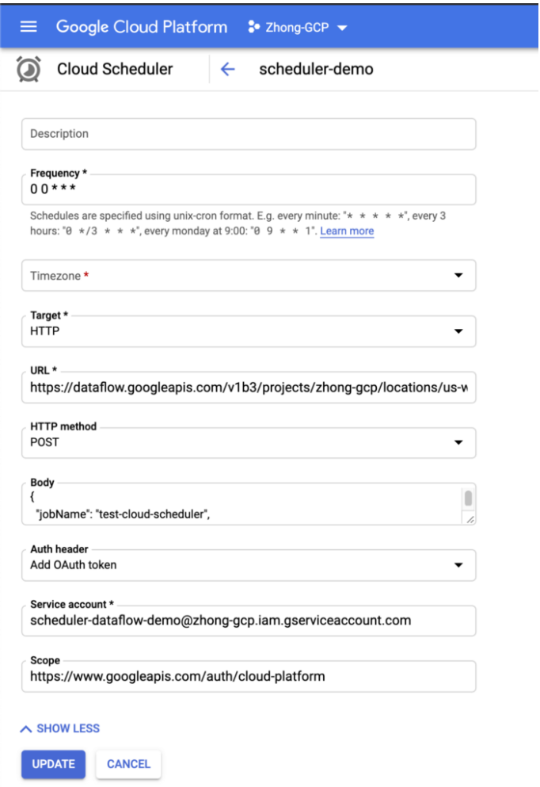

# Schedule Your Dataflow Batch Jobs With Cloud Scheduler

[Cloud Dataflow](https://cloud.google.com/dataflow) is a managed service for handling 
both streaming and batch jobs. For your streaming jobs, you just need to launch them once without worrying about operating them afterwards. 
However, for your batch jobs, you probably need to trigger them based on certain conditions.

In the post, I will show you how you can leverage [cloud scheduler](https://cloud.google.com/scheduler/) to schedule your Dataflow batch jobs. You can find all the code in this [repo](https://github.com/zhongchen/GCP-Demo/tree/master/demos/scheduler-dataflow-demo).

First things first, to be able to run your Dataflow jobs on a regular basis, you need to build your Dataflow templates. 
Follow the [instructions](https://cloud.google.com/dataflow/docs/guides/templates/creating-templates) to create your templates and save them in a GCS bucket.


Once you have your templates ready, you can set up cloud schedulers to trigger Dataflow templates.




If you use Terraform, here is one example to define a scheduler.

```hcl-terraform
data "google_project" "project" {}

resource "google_cloud_scheduler_job" "scheduler" {
  name = "scheduler-demo"
  schedule = "0 0 * * *"
  # This needs to be us-central1 even if the app engine is in us-central.
  # You will get a resource not found error if just using us-central.
  region = "us-central1"

  http_target {
    http_method = "POST"
    uri = "https://dataflow.googleapis.com/v1b3/projects/${var.project_id}/locations/${var.region}/templates:launch?gcsPath=gs://zhong-gcp/templates/dataflow-demo-template"
    oauth_token {
      service_account_email = google_service_account.cloud-scheduler-demo.email
    }

    # need to encode the string
    body = base64encode(<<-EOT
    {
      "jobName": "test-cloud-scheduler",
      "parameters": {
        "region": "${var.region}",
        "autoscalingAlgorithm": "THROUGHPUT_BASED",
      },
      "environment": {
        "maxWorkers": "10",
        "tempLocation": "gs://zhong-gcp/temp",
        "zone": "us-west1-a"
      }
    }
EOT
    )
  }
}
```

Afterwards you are all set up! 

Run the scheduler and watch it trigger your Dataflow job. 
You can check the status of jobs on the UI.


## Recap
- It is feasible to trigger a Dataflow batch job directly from the cloud scheduler directly. It is easy and fast. There is no need to use cloud function for that.
- Cloud schedulers need to be created in the same region of App engine. In your [Terraform script](https://www.terraform.io/docs/providers/google/r/cloud_scheduler_job.html#region), 
make sure assigning the right value for the region field. You need to use **us-central1** if your app engine lives in **us-central**.
- Use the [regional endpoint](https://cloud.google.com/dataflow/docs/reference/rest/v1b3/projects.locations.jobs/create) to specify the region of Dataflow job. 
If you don't explicitly set the location in the request, the jobs will be created in the default region (US-central).

## 
