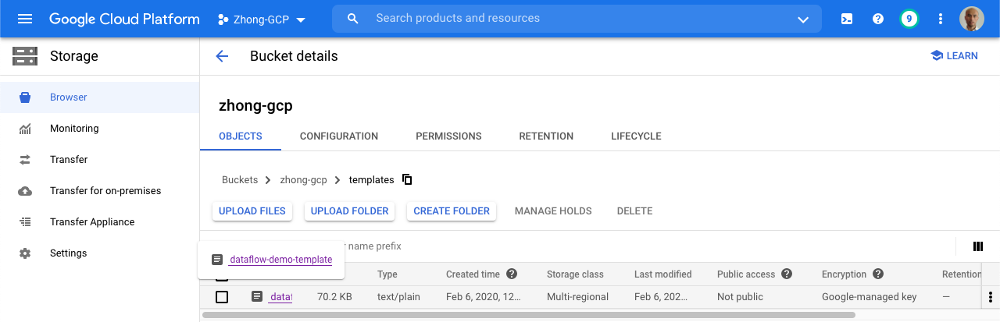
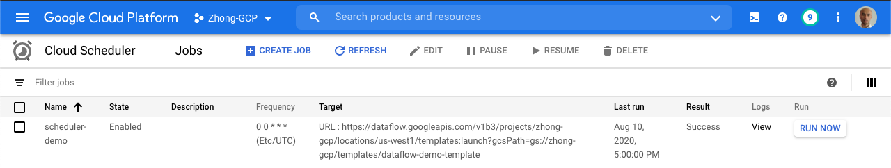

## Notes
- It is feasible to trigger a Dataflow batch job directly from the cloud scheduler directly. It is easy and fast. There is no need to use cloud function for that.
- Cloud schedulers need to be created in the same region of App engine. In your [Terraform script](https://www.terraform.io/docs/providers/google/r/cloud_scheduler_job.html#region), 
make sure assigning the right value for the region field. You need to use **us-central1** if your app engine lives in **us-central**.
- Use the [regional endpoint](https://cloud.google.com/dataflow/docs/reference/rest/v1b3/projects.locations.jobs/create) to specify the region of Dataflow job. 
If you don't explicitly set the location in the request, the jobs will be created in the default region (US-central).


In this tutorial, you will learn how to set up a [Cloud Scheduler](https://cloud.google.com/scheduler/) job to trigger to your 
Dataflow batch jobs.
You can find all the code [here](./scheduler-dataflow-demo).

[Cloud Dataflow](https://cloud.google.com/dataflow) is a managed service for handling 
both streaming and batch jobs. For your streaming jobs, you just need to launch them once without worrying about operating them afterwards. 
However, for your batch jobs, you probably need to trigger them based on certain conditions.

First things first, to be able to run your Dataflow jobs on a regular basis, you need to build your Dataflow templates. 
Follow the [instructions](https://cloud.google.com/dataflow/docs/guides/templates/creating-templates) to create your templates and save them in a GCS bucket.




Once you have your templates ready, you can set up cloud schedulers to trigger Dataflow templates. 
Here is one example to define a scheduler using Terraform.


```hcl-terraform
resource "google_cloud_scheduler_job" "scheduler" {
  name = "scheduler-demo"
  schedule = "0 0 * * *"
  # This needs to be us-central1 even if the app engine is in us-central.
  # You will get a resource not found error if just using us-central.
  region = "us-central1"

  http_target {
    http_method = "POST"
    uri = "https://dataflow.googleapis.com/v1b3/projects/${var.project_id}/locations/${var.region}/templates:launch?gcsPath=gs://${var.bucket}/templates/dataflow-demo-template"
    oauth_token {
      service_account_email = google_service_account.cloud-scheduler-demo.email
    }

    # need to encode the string
    body = base64encode(<<-EOT
    {
      "jobName": "test-cloud-scheduler",
      "parameters": {
        "region": "${var.region}",
        "autoscalingAlgorithm": "THROUGHPUT_BASED",
      },
      "environment": {
        "maxWorkers": "10",
        "tempLocation": "gs://${var.bucket}/temp",
        "zone": "us-west1-a"
      }
    }
EOT
    )
  }
}
```

## Instructions

The following step-by-step instructions can be used to create a sample Dataflow pipeline with Terraform.

First, open Cloud Shell and clone the repository.

```
git clone https://github.com/GoogleCloudPlatform/community
cd community/tutorials/schedule-dataflow-jobs-with-cloud-scheduler/
```

Set up Terraform's environment variables and a service account.

```
export TF_ADMIN=${USER}-terraform-admin
export TF_CREDS=~/.config/gcloud/${USER}-terraform-admin.json
export TF_VAR_bucket=${TF_ADMIN}
export TF_VAR_project_id=${GOOGLE_CLOUD_PROJECT}
gcloud iam service-accounts create terraform --display-name "Terraform admin account"
gcloud iam service-accounts keys create ${TF_CREDS} --iam-account terraform@${GOOGLE_CLOUD_PROJECT}.iam.gserviceaccount.com
export GOOGLE_APPLICATION_CREDENTIALS=${TF_CREDS}
```

Grant the service account access to your project.

```
gcloud projects add-iam-policy-binding ${GOOGLE_CLOUD_PROJECT} --member serviceAccount:terraform@${GOOGLE_CLOUD_PROJECT}.iam.gserviceaccount.com \
  --role roles/viewer
gcloud projects add-iam-policy-binding ${GOOGLE_CLOUD_PROJECT} --member serviceAccount:terraform@${GOOGLE_CLOUD_PROJECT}.iam.gserviceaccount.com \
  --role roles/storage.admin
```

Create a bucket on Google Cloud Stoeage, copy the Dataflow templates there and set up the Terraform backend.

```
gsutil mb -p ${GOOGLE_CLOUD_PROJECT} gs://${TF_ADMIN}
gsutil cp -R scheduler-dataflow-demo/dataflow/ gs://${TF_ADMIN}/templates/dataflow-demo-template/
cat > backend.tf << EOF
terraform {
 backend "gcs" {
   bucket  = "${TF_ADMIN}"
   prefix  = "terraform/state"
 }
}
EOF
```

You are now ready to initialize and run Terraform.

```
cd scheduler-dataflow-demo/terraform
terraform init
terraform apply
```

The job will run based on the schedule you defined in the terraform script. 
In addition, you can manually run the scheduler through UI and watch it trigger your Dataflow batch job. 
You can check the status of jobs through the UI.




## Cleaning up

Since this tutorial uses multiple GCP components, please be sure to delete the associated resources once you are done.
