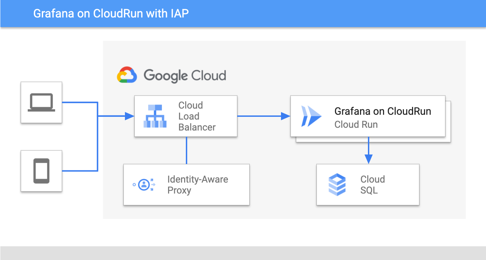
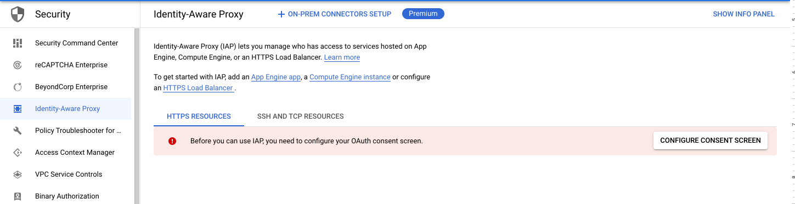
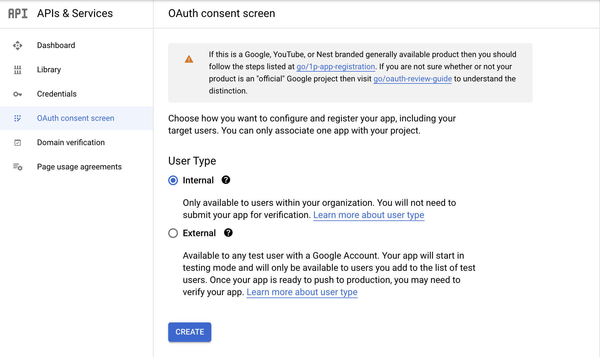
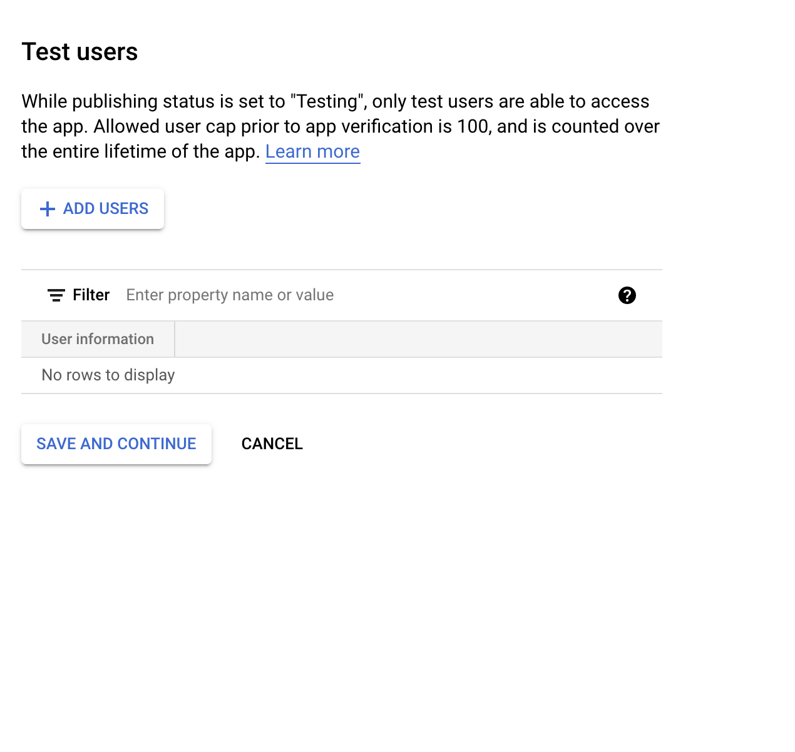
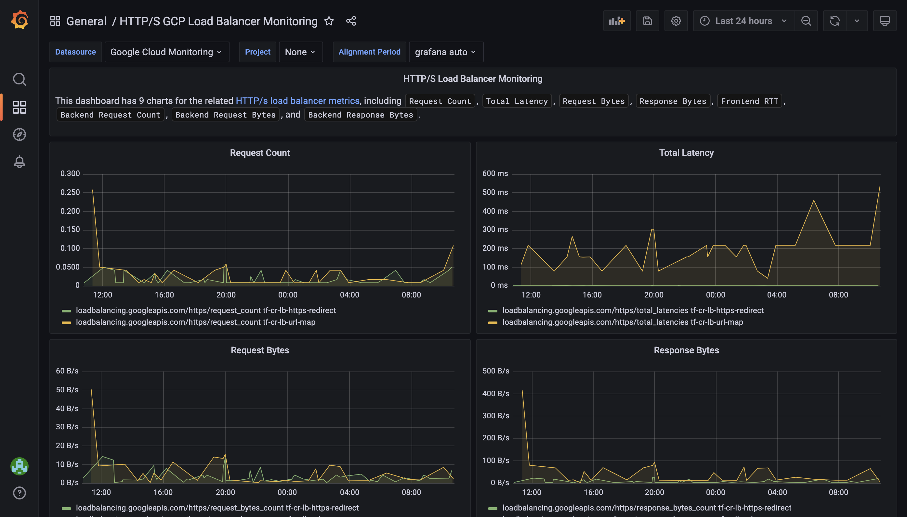

Christoph Grotz | Strategic Cloud Engineer | Google

Anna Muscarella | Strategic Cloud Engineer | Google

<p style="background-color:#CAFACA;"><i>Contributed by Google employees.</i></p>

In this tutorial, we'll be demonstrating how to deploy Grafana serverless and restrict access to the dashboard. If you're a developer, DevOps engineer, or simply interested in deploying applications serverless or restricting access to it, read on.

You should have basic knowledge of Google Cloud Platform, Grafana and Terraform, own a domain, and can modify its A record.




## Objectives

By the end of this tutorial, you'll have information to:

  * Run the Terraform script to deploy Grafana on Cloud Run with CloudSQL as database. and Identity Aware Proxy setup.
  * Create a new user for accessing the dashboard.
  * Explore and test the capabilities of Identity Aware Proxy (IAP) to restrict access to your Grafana dashboard.

## Costs

We'll be using billable components of Google Cloud, including the following:
  * [Cloud Run](https://cloud.google.com/run)
  * [CloudSQL](https://cloud.google.com/sql)
  * [Cloud Load Balancer](https://cloud.google.com/load-balancing)
  * [Identity-Aware Proxy](https://cloud.google.com/iap)
  * [Secret Manager](https://cloud.google.com/secret-manager)

Use the [pricing calculator](https://cloud.google.com/products/calculator) to generate a cost estimate based on your projected usage.

## What happens behind the scenes

You can easily deploy the setup with minimal effort; most of it is done through a Terraform script. Here is what happens in the background:

First, all required APIs are enabled, e.g., IAM, Cloud Run, Compute, IAP, SQL by the Terraform script. Hence you don't need to worry about this step.

Grafana requires a database for storing data. Therefore, a CloudSQL instance is created. The password for the database user is placed in Secret Manager, for secured access.

Then, the Cloud Run container is deployed using the GCR mirror of the Grafana container image and started. The script also passes required environment variables to the container, such as information about the database connection, and auth proxy. 

To make sure your Grafana dashboard is useful, a datasource for Google Cloud Monitoring is mounted. We use [Grafanas provisioning mechanism](https://grafana.com/docs/grafana/latest/administration/provisioning/) for that, which discovers data sources and dashboards from the disk. Since Cloud Run instances don't have persistent volumes at the moment, we can't just place the datasource and dashboard file into the filesystem. As a workaround, the file is added as a secret to Secret Manager and then copied to the required location so Grafana can pick up the data source correctly. Et voila, you now have mock data in your dashboard! An alternative could be to use [GCS Fuse](https://cloud.google.com/run/docs/tutorials/network-filesystems-fuse), which allows mounting a GCS bucket into the filesystem, but this requires modifying the Docker image.

To access your Grafana dashboard, Cloud Load Balancer is configured to service HTTPS traffic from CloudRun using a Serverless Network Endpoint Group (NEG) as backend service. Identity-Aware Proxy (IAP) is integrated with the Load Balancer backend service. Client ID and secret are passed to the Load Balancer configuration. IAP provides headers containing the authorization information to applications secured with it ([link to documentation](https://cloud.google.com/iap/docs/signed-headers-howto)). Grafana provides the [functionality](https://grafana.com/docs/grafana/latest/auth/auth-proxy/) to receive exactly such header information for authentication. 


### Before you begin

You should have a Google Cloud Platform account and project setup, billing configured for your project, and Terraform installed and enabled.
  1. [Create or select a Google Cloud project.](https://console.cloud.google.com/project)
  1. [Enable billing for your project.](https://support.google.com/cloud/answer/6293499#enable-billing)
  1. Choose a region to host your project in, ideally one that’s close to you. You can find an overview of available regions [here](https://cloud.google.com/compute/docs/regions-zones).
  1. Make sure you know the domain name where you want to host your Grafana dashboard and are able to edit the A record for this domain.


### Configure the OAuth consent screen

Configure an OAuth consent screen for Identity-Aware Proxy. 
  1. Go to GCP Console > Security > Identity-Aware Proxy. 
  2. If you didn’t configure a consent screen before, there will be a red warning message prompting you to configure one. 
  
  Depending on your setup you can either enable the consent screen for internal or external users. Internal allows only users that are part of your Cloud Identity organisation to use Grafana, but requires you to have a Cloud Identity organisation. You can alternativley select external, which allows you to also add users that are outside your organisation. As long as your app wasn't publish, you will need to whitelist "testers" that can access your application (see optional step 4).
  3. Click Configure Consent Screen, choose User Type Internal or External depending on your needs. Add a name and support email addresses and click Create.
  
  4. (Optional, only applies if your selected external before) In this step you can add users as test users to your application. You will need to also grant those users the role "IAP-Secured Web App User " which we will do at a later stage.
  
  5. Enter the app name and user support email, then click Save and continue until the process is complete.

### Set up your Environment

Next, you’re going to set up the environment in order for the project to deploy.
  1. [Open a new Cloud Shell session.](https://console.cloud.google.com/?cloudshell=true)
  1. *Run* `git clone https://github.com/GoogleCloudPlatform/community.git` to download the sources to your cloud shell.
  1. `cd ./community/tutorials/serverless-grafana-with-iap/code` change directory to the *code* folder.
  1. *Set* required environment variables. Replace [YOUR_DOMAIN] with the domain on which you want to host your Grafana dashboard.
  ```
  export TF_VAR_project_id=$GOOGLE_CLOUD_PROJECT
  export TF_VAR_domain=[YOUR_DOMAIN]
  ```
  1. *Run* `terraform init`


### Execute the Terraform script to create your Grafana Dashboard

  1. *Run* `terraform plan` and confirm that all steps are correct.
  2. *Run* `terraform apply`.
  3. Confirm the command has been executed successfully.
  4. *Copy* the external_ip from the console Outputs. *Add* an A record redirect from your domain to this IP address.
  5. Wait around 5 - 10 minutes for GCP Load Balancer to perform certificate checks.


### Access your Grafana Dashboard
In order to grant users access to your Grafana instance, you need to grant them the role "IAP-Secured Web App User" for the resource. You can do this with the following gcloud command. You should do this for your user account.
```
gcloud iap web add-iam-policy-binding \
            --resource-type=backend-services \
            --member='user:<your_user_email>' \
            --service='tf-cr-lb-backend-default' \
            --role='roles/iap.httpsResourceAccessor'
```
Afterwards you can open Grafana by visiting your-domain.com from the browser. Since the database is automatically provisioned your user will only have Viewer permissions in Grafana. If you want to elevate your user to an Admin, you will need to access the MySQL instance and modify the user table entry for your user.

## Conclusion
Congratulations, you now have a serverless deployment of Grafana up and running, connected with Google Cloud Monitoring and secured using Google's Identity-Aware Proxy. You can now access and login to Grafana using your browser and accessing your domain. There should already be a dashboard available monitoring GCLB for you. This provides you with reduced worries around properly hosting your Grafana dashboards, while also providing a very low cost solution to hosting Grafana. Please keep in mind that should you want to use the alerts feature from Grafana you should consider keeping some [CPU allocated](https://cloud.google.com/run/docs/configuring/cpu-allocation), otherwise alerts might not be triggered. 



## Cleaning up

To avoid incurring charges to your Google Cloud account for the resources used in this tutorial, you can delete most resources used with Terraform.

Alternatively, if you created a new peoject for deploying the resources, you may also delete the whole project.

Deleting a project has the following consequences:

- If you used an existing project, you'll also delete any other work that you've done in the project.
- You can't reuse the project ID of a deleted project. If you created a custom project ID that you plan to use in the
  future, delete the resources inside the project instead. This ensures that URLs that use the project ID, such as
  an `appspot.com` URL, remain available.
- If you want to avoid further cost, it's a good idea to delete the resources in the project before deleting the project

To delete a project, do the following:

1.  In the Cloud Console, go to the [Projects page](https://console.cloud.google.com/iam-admin/projects).
2.  In the project list, select the project you want to delete and click **Delete**.
3.  In the dialog, type the project ID, and then click **Shut down** to delete the project.


To delete resources only, do the following:

1. *Manually delete* your CloudSQL instance, as deletion protection is activated. Go to Google Cloud console, then open the [SQL page](https://console.cloud.google.com/sql/instances), click on the [**grafana** instance](https://console.cloud.google.com/sql/instances/grafana/overview) and click **Delete**
2. *Execute* `terraform destroy` to delete the remaining resources. 


## Troubleshooting

If you see the following error message while deploying, this means you have not configured the Consent Screen for your GCP project.

```
Error: Error creating Client: googleapi: Error 404: Requested entity was not found.
│ 
│   with google_iap_client.project_client,
│   on lb.tf line 62, in resource "google_iap_client" "project_client":
│   62: resource "google_iap_client" "project_client" {
│ 
```
