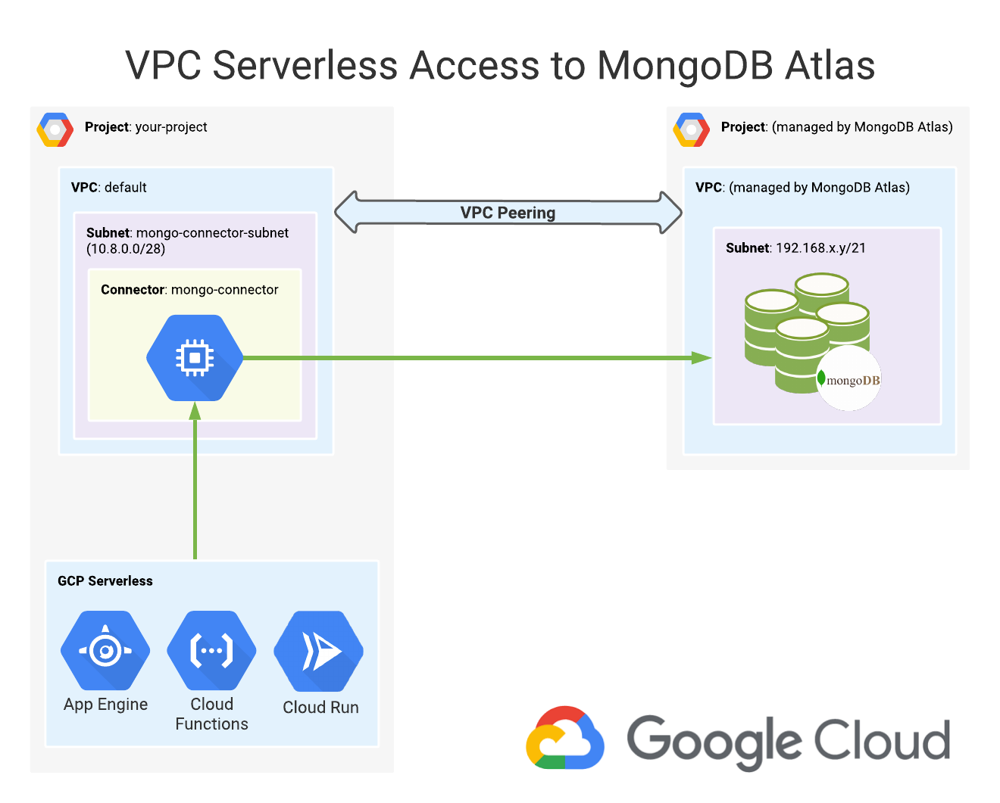
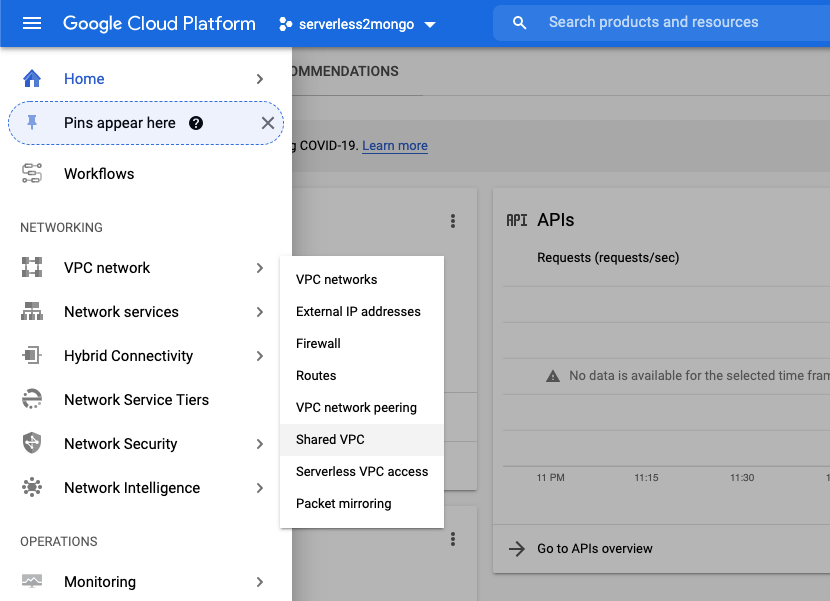
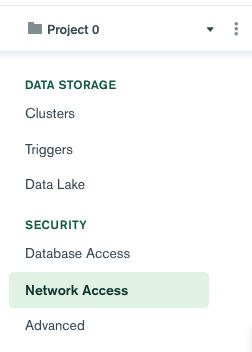
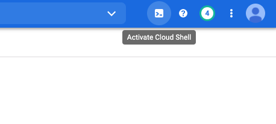
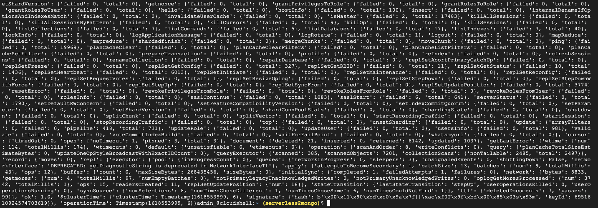

Russ Starr | Customer Engineer | Google

<p style="background-color:#CAFACA;"><i>Contributed by Google employees.</i></p>

This tutorial is for engineers of Google Cloud who wish to configure private IP access from serverless services such as App Engine, Cloud Functions, or Cloud Run to a MongoDB Atlas cluster.



Customers like having the option to keep their MongoDB connections scoped to private IP addresses only, instead of allowing public access from the Internet.

You will learn how to use Serverless VPC Access to create a connector that will route traffic from the Google Cloud serverless services to the MongoDB Atlas cluster. You will also learn how to establish VPC peering between your VPC and your MongoDB Atlas VPC.

While Cloud Functions is used in this tutorial, similar steps can be taken to configure [App Engine](https://cloud.google.com/appengine/docs/standard/python/connecting-vpc) or [Cloud Run](https://cloud.google.com/run/docs/configuring/connecting-vpc). Likewise, python is used for the language but it can be easily adapted to other Cloud Function [supported languages](https://cloud.google.com/functions/docs/writing).

As a prerequisite, users should have basic familiarity using the Google Cloud Console, Google Cloud Shell, the MongoDB Atlas console, and basic python/bash scripting.

## Objectives

*   Create a MongoDB Atlas cluster.
*   Create a VPC peering relationship between MongoDB Atlas and your VPC.
*   Create the Serverless VPC access connector.
*   Create a Cloud Function that triggers on HTTP and makes a connection to the MongoDB cluster.
*   Verify the Cloud Function is able to reach the MongoDB cluster.

## Costs

This tutorial uses billable components of Google Cloud, including the following:

*   [Cloud Functions](https://cloud.google.com/functions)
*   [Cloud Build](https://cloud.google.com/build)
*   [Virtual Private Cloud](https://cloud.google.com/vpc)
*   [Serverless VPC Access](https://cloud.google.com/vpc/docs/configure-serverless-vpc-access)

This tutorial also uses 3rd party billable components from MongoDB Atlas.

*   [MongoDB Atlas](https://www.mongodb.com/cloud/atlas) to create a dedicated cluster, which is required for this tutorial. (shared doesn't support VPC peering)

Use the [GCP pricing calculator](https://cloud.google.com/products/calculator) and [MongoDB Pricing page](https://www.mongodb.com/pricing) to generate a cost estimate based on your projected usage.

## Before you begin

The following prerequisites exist for this tutorial.

1.  Google Cloud
    - [Select or create a Google Cloud project.](https://console.cloud.google.com/projectselector2/home/dashboard)
    - [Enable billing for your project.](https://support.google.com/cloud/answer/6293499#enable-billing)
1.  MongoDB Atlas
    - [Create a MongoDB Atlas account](https://docs.atlas.mongodb.com/tutorial/create-atlas-account/).
    - [Create a MongoDB Organization](https://docs.atlas.mongodb.com/tutorial/manage-organizations/)
    - [Create a MongoDB Project](https://docs.atlas.mongodb.com/tutorial/manage-projects/)
    - [Enable billing for your MongoDB Atlas organization](https://docs.atlas.mongodb.com/billing/).
    - [Create a MongoDB Atlas user account](https://docs.atlas.mongodb.com/security-add-mongodb-users/) that will be used by Cloud Functions to connect to the MongoDB database.

## Enable VPC Serverless Access API

1.  Login to the [Google Cloud Console](https://console.cloud.google.com) and select the project you want to use for this tutorial.

1.  Click the navigation menu, scroll down to VPC network, then click **Serverless VPC access**.

    

1.  Click **Enable** to enable the Serverless VPC Access API.

Wait for the API to be enabled prior to advancing.

## Create VPC Serverless Access connector.

1.  Once the API is enabled, click **Create Connector**.

1.  Enter an appropriate name. This tutorial will use `mongo-connector`.

1.  Select the appropriate region.

1.  Keep the `default` network selected.

1.  Click **Custom IP Range** under Subnet and enter a private IP range that fits your IP scheme. This tutorial will use `10.8.0.0`. 

    > **Note:** You only have the option to use a /28 mask for this step so don't include the mask in the field.

    > **Remember:** This subnet will be referenced in a later step for the MongoDB Atlas whitelist.

## Create MongoDB Atlas cluster

1.  Login to [MongoDB Atlas](https://cloud.mongodb.com) and select the project you want for your cluster.

1.  Click **Build a Cluster** located on the Data Storage, Clusters menu.

1.  Click **Create a Cluster** under Dedicated Clusters.

    > **Note:** You can also select **Dedicated Multi-Cloud & Multi-Region Clusters** if needed but the steps in this tutorial assume you are using a Dedicated Cluster because it is the minimum for VPC Peering.

1.  Click **Google Cloud** and your desired region.

1.  Select your desired Cluster Tier. **M10** will be used for our tutorial but any of them will work.

1.  Provide your cluster a name. We'll use the default `Cluster0`.

1.  Click **Create Cluster**.

It will take a few minutes to create the cluster but you move on to the next section right away.

## Configure MongoDB Atlas whitelist

1.  In the MongoDB Atlas console, click the **Network Access** under the Security section.

    

1.  Click **Add IP Address** under the IP Access List section.

1.  For Access List Entry, enter the /28 network you created for the Serverless VPC Access Connector. `10.8.0.0/28` was used for this tutorial.

1.  Under Comment, use `mongo-connector` so you remember the relationship with the GCP resource name.

Your MongoDB Atlas cluster will now be secured and restricted to only the `10.8.0.0/28` subnet.

## Configure MongoDB Atlas VPC Peering

1.  Click **Peering** while in the Network Access screen in the MongoDB Atlas console.

1.  Click **Add Peering Connection**.

1.  Click **Google Cloud** and **Next**.

1.  Enter the Project ID of your GCP project. 

1.  Enter the VPC Name. The tutorial will use **default** here.

1.  Click **Initiate Peering**.

    > **Note:** The status will remain in Pending until you configure peering on the GCP side in later steps.

    > **Remember:** The project ID and VPC name will be referenced in future step, so keep this browser tab open.

## Configure VPC Peering on GCP

1.  In the Google Cloud Console, click the navigation menu, select VPC Network, then click **VPC network peering**.

1.  Click **create connection** and **continue**.

1.  Enter an appropriate name like `gcp2mongo`.

1.  Select **default** under Your VPC network.

1.  Click **in another project** under Peered VPC Network

1.  Enter the Project ID and VPC network name that were provided at the end of **Configure MongoDB Atlas VPC Peering** section.

1.  Click **Create**.

    > **Note:** These steps are successful when you see **Active** status for the peering connection. The MongoDB Atlas screen should show **Available** status once connected.

## Retrieve the connection string for your cluster

1.  Login to the MongoDB Atlas console.

1.  Click **Connect** under the Cluster screen for your newly created cluster.

1.  Click **Private IP for Peering** under Choose Connection Type.

1.  Click **Choose a connection method**.

1.  Click **Connect your application**.

1.  Select Python, 3.11 or later.

1.  Copy the connection string to be referenced later in our Cloud Function. Click **Close** when finished. The connection string will be in the following format:

        mongodb+srv://<user>:<password>@<cluster_name>.<subdomain>.mongodb.net/

## Create an empty database

1.  Login to the MongoDB Atlas console.

1.  Click **Collections** under the Cluster screen.

1.  Click **Add Your First Database**

1.  Enter `empty_db` for the Database Name.

1.  Enter `empty_collection` for the Collection Name.

1.  Click **Create**.

## Create a Cloud Function (Configuration)

1.  On the Google Cloud nagivation menu, scroll down to Serverless and click **Cloud Functions**.

1.  Click **Create Function**.

1.  Keep all the default settings and click **Save**.

1.  Scroll to the bottom and click **Runtime, Build and Connection Settings.** then **Connections**.

1.  Select `mongo-connector` under Egress settings in the VPC connector field.

1.  Click **Next**.

    > **Note:** These steps were split, please continue in the next section.

## Create a Cloud Function (requirements.txt Code)

1.  Select **Python 3.9** for the Runtime.

1.  Click **Enable API** if warned about Cloud Build API being required.

    > **Note:** A new tab will open.

1.  Click **Enable** then close that newly opened tab once completed.

1.  Click **requirements.txt** on the left hand side and paste the following code:

    ```
    # Function dependencies, for example:
    # package>=version
    pymongo
    dnspython
    ```

1.  Click **Deploy**.

    > **Note:** This will install the required dependencies, which is required before adding more python code. Once deployed, the Cloud Function should turn green.

The status should turn green for the Cloud Function before proceeding.

## Create a Cloud Function (main.py Code)

1.  Click the previously created Cloud Function, `function-1`.

1.  Click **Edit**, **Next**.

1.  Click **main.py** and paste the following code, replacing all existing python code:


    ```python
    from pymongo import MongoClient
    from flask import make_response

    connection_string = "mongodb+srv://<user>:<password>@<cluster_name>.<subdomain>.mongodb.net/"

    def hello_world(request):
        request_json = request.get_json()
        if request.args and 'message' in request.args:
            return request.args.get('message')
        elif request_json and 'message' in request_json:
            return request_json['message']
        else:
            client = MongoClient(connection_string)
            db = client.empty_db
            response = make_response()
            response.data = str(db.command("serverStatus"))
            response.headers["Content-Type"] = "application/json"
            return response
    ```

1.  Update the `connection_string` variable to reflect your user account, password, and subdomain.

1.  Click **Deploy**.

## Verify the Cloud Function connects to the MongoDB Atlas cluster

1.  Click the previously created Cloud Function, `function-1`.

1.  Click **Trigger** and copy the Trigger URL to your clipboard.

1.  In the Google Cloud console, open Cloud Shell in the top right corner.

    

1.  Enter the following command in Cloud Shell, updating the CFURL variable with the URL in the clipboard.

    ```bash
    export CFURL="<insert URL here>"
    curl -H "Authorization: Bearer $(gcloud auth print-identity-token)" $CFURL
    ```
    > **Success!** You should see a JSON dump of the Server Status information from your MongoDB Atlas cluster, which proves you have connectivity.

    

## Cleaning up

To avoid incurring charges to your Google Cloud account for the resources used in this tutorial, you can delete the project.

Deleting a project has the following consequences:

- If you used an existing project, you'll also delete any other work that you've done in the project.
- You can't reuse the project ID of a deleted project. If you created a custom project ID that you plan to use in the
  future, delete the resources inside the project instead. This ensures that URLs that use the project ID, such as
  an `appspot.com` URL, remain available.

To delete a project, do the following:

1.  In the Cloud Console, go to the [Projects page](https://console.cloud.google.com/iam-admin/projects).
1.  In the project list, select the project you want to delete and click **Delete**.
1.  In the dialog, type the project ID, and then click **Shut down** to delete the project.

You will also want to delete your MongoDB Atlas cluster if you no longer need it.

## What's next

- [Serverless VPC Access documentation](https://cloud.google.com/vpc/docs/configure-serverless-vpc-access).
- [MongoDB Connection String URI Format](https://docs.mongodb.com/manual/reference/connection-string/)
- Try out other Google Cloud features for yourself. Have a look at our [tutorials](https://cloud.google.com/docs/tutorials).