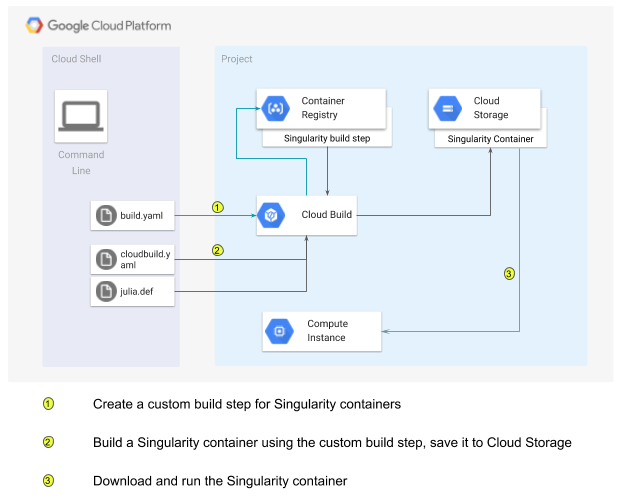

This tutorial shows you how to use [Cloud Build](https://cloud.google.com/cloud-build/) to build [Singularity](https://www.sylabs.io/singularity/) containers. 
In constrast to [Docker](https://www.docker.com/), the Singularity container binary is designed specifically for High Performance Computing (HPC) workloads.

This diagram illustrates the process the tutorial takes you through.



[](https://console.cloud.google.com/cloudshell/open?git_repo=https://github.com/GoogleCloudPlatform/community&page=editor&tutorial=tutorials/singularity-containers-with-cloud-build/index.md)

## Before you begin

### Install the [Google Cloud SDK](https://cloud.google.com/sdk/install)

The Cloud SDK installs commands and libs for interacting with Google Cloud Platform from the command line. This
tutorial makes extensive use of the ```gcloud``` and ```gsutil``` commands to create and manage Google Cloud Platform
resources.

Even if you alread have the Cloud SDK installed it is a good idea to update to the lastest version using this command:
```bash
gcloud components update
```

### Set the required environment variables

Edit the file env.sh and replace

* [YOUR_ORG] with the name of the organization that will own your project
* [YOUR_BILLING_ACCOUNT_NAME] with the name of the account responsible for any costs associated with your project
* [NAME_FOR_THE_PROJECT_YOU_WILL_CREATE] with the name of your project
* [COMPUTE_ZONE_YOU_WANT_TO_USE] with the name of the Cloud Platform compute zone that will contain your project

The Organization and billing account should already exist (if you need to create an organization,
see the [documentation here](https://cloud.google.com/resource-manager/docs/creating-managing-organization)).

Use these ```gcloud``` commands to retrieve the values required by ```env.sh```.

```bash
# List organizations - you can use the name or the id
gcloud organizations list

# List billing accounts
gcloud alpha billing accounts list

# List projects
gcloud projects list

# List zones
gcloud compute zones list

```

If you are creating a new project use the name you intend to give it.

Source ```env.sh``` to define the environment variables in your current shell session.

```bash
source ./env.sh
```

### (Optional) Create a new project

To use a brand new project rather than an existing one, create the new project with the commands:

```bash
gcloud projects create $PROJECT --organization=$ORG
gcloud beta billing projects link $PROJECT --billing-account=$(gcloud beta billing accounts list | grep $BILLING_ACCOUNT | awk '{print $1}')
gcloud config configurations create -- activate $PROJECT
```

### Use the desired project and zone

```bash
gcloud config set core/project $PROJECT
gcloud config set compute/zone $ZONE
```

### Enable the necessary Cloud Platform APIs

The following commands will enable Google Compute Engine, Google Cloud Builder,
and Google Container Registry:

```bash
gcloud services enable compute.googleapis.com
gcloud services enable cloudbuild.googleapis.com
gcloud services enable containerregistry.googleapis.com
```

## Build a Singularity container

Cloud Build supports the definition and use of _custom build steps_ to extend the range of tasks it can handle. In the first step of this section
you create a Singularity custom build step. In the third step you use the Singularity custom build step to build a Singularity container and save
it in Cloud Storage. Once the Singuarlity custom build step has been created in your project you can use it to create as many Singularity containers
as you like.

### 1. Create a Singularity builder

The ```singularity-buildstep``` directory contains the files you use to create the Singularity custom build step.

* ```builder.yaml``` is the recipe to create the Singularity builder. Specifically, it's a configuration file you will submit to build the custom build step
* ```Dockerfile``` contains the steps required to download and build Singularity in a ```go``` container

Move to that directory

```bash
cd singularity-buildstep
```

Then use this command to build the custom build step.

```bash
gcloud builds submit --config=builder.yaml --substitutions=_SINGULARITY_VERSION="3.0.2" .
```

At the time of this writing the latest stable version of Singularity is 3.0.2. To use a different, possibly newer, version modify the value of the
\_SINGULARITY_VERSION substitute accordingly. What does this verison coincide with? It should match a [release tag](https://github.com/sylabs/singularity/releases)
on the [sylabs/singularity](https://github.com/sylabs/singularity) repository.

### 2. Create a Bucket

You need a place to store the containers the Singularity build step creates. In this tutorial you will use a Cloud Storage bucket to hold your Singularity
containers. You can use an existing bucket you have access to or use this command to create a new one:

```bash
gsutil mb gs://${PROJECT}-singularity
```

### 3: Build a Singularity container

Singularity uses a [Singularity Definition File](https://github.com/sylabs/singularity-userdocs/blob/master/definition_files.rst) as a blueprint for building
a container. The definition file contains a number of sections which control how the ```singularity build``` command constructs a container. 

Go back up one directory to look at [julia.def](../julia.def)

```bash
cd ..
```
```bash
cat julia.def
```
```
Bootstrap: library
From: centos:7

%runscript
# run your script here.

# check if there any arguments,
if [ -z "$@" ]; then
    # if there are none, test julia:
    echo 'println("hello world from julia container!!!")' | julia
else
    # if there is an argument, then run it! and hope its a julia script :)
    julia "$@"
fi


%environment
    PATH=/julia-1.0.1/bin:$PATH
    LD_LIBRARY_PATH=/julia-1.0.1/lib:/julia-1.0.1/lib/julia:$LD_LIBRARY_PATH
    LC_ALL=C
    export PATH LD_LIBRARY_PATH LC_ALL

%post
    yum -y update

    # install some basic tools
    yum -y install curl tar gzip

    # now, download and install julia
    curl -sSL "https://julialang-s3.julialang.org/bin/linux/x64/1.0/julia-1.0.1-linux-x86_64.tar.gz" > julia.tgz
    tar -C / -zxf julia.tgz
    rm -f julia.tgz
```

The julia.def file is a simple example of a Singularity definition file. It creates a [CentOS](https://www.centos.org) 7 container with the
[Julia](https://julialang.org) programming language installed. When you run the container, the entrypoint is the Julia executable. This means that
if the user provides a script, Julia will execute it. If not Julia will print a "hello world" message. The file has three sections.

 * %post: is a section of commands that are executed after the base operating system has been installed at build time
 * %environment: this section defines environment variables that will be set at runtime (shell, run, exec)
 * %runscript: the contents of this section are written to a file within the container and executed when the container is run

To create a Singularity container from the ```julia.def``` definition file you use the custom Singularity build step created above. The ```cloudbuild.yaml```
file specifies the steps required to build the container and store the result in a Cloud Storage bucket.

```bash
cat cloudbuild.yaml
```
```
# In this directory, run the following command to build this builder.
# $ gcloud builds submit . --config=cloudbuild.yaml --substitutions=_SINGULARITY_VERSION=3.0.0."

steps:
- name: gcr.io/$PROJECT_ID/singularity-${_SINGULARITY_VERSION}
  args: ['build', 'julia-centos.sif', 'julia.def']
artifacts:
  objects:
    location: 'gs://${PROJECT_ID}-singularity'
    paths: ['julia-centos.sif']
```

The first, and only in this example, step runs the ```singularity``` command to build the ```julia-centos.sif``` container from the ```julia.def```
definition file. The ```artifacts``` section directs Cloud Build to store the resulting container in the Cloud Storage bucket you created above.

Use this command to execute the build:
```bash
gcloud builds submit --config=cloudbuild.yaml --substitutions=_SINGULARITY_VERSION="3.0.2" .
```

Once the build completes verify that the container with created using the list (ls) command.

```bash
gsutil ls gs://${PROJECT}-singularity/julia-centos.sif
```

If the build was successful you should see a response similar to:

```
gs://my-project-singularity/julia-centos.sif
```

### Test the container

Verify that your container is working properly by downloading and executing it. You will need a compute instance with singularity installed. This means
that you have two options. If you are familiar with Singularity and have it installed locally, you can download the container and execute it. If you
don't have Singularity and want to bring up a cloud instance with Singularity ready to go, you can launch a Google Cloud Compute Instance.

#### Run the container locally

You can do the equivalent of a ```singularity pull``` by using gsutil to copy the container from storageback down to your local machine:
 
```bash
gsutil cp gs://${PROJECT}-singularity/julia-centos.sif .
```

Now run the container:

```bash
singularity run julia-centos.sif
```

The response should be:

```bash
hello world from julia container!!!
```

#### Run the container on a Cloud Instance

This command will create the compute required instance.

```bash
gcloud compute instances create singularity-test \
  --machine-type=n1-standard-1 \
  --scopes=https://www.googleapis.com/auth/cloud-platform \
  --metadata-from-file startup-script=startup.sh
```

When the new instance is running, download the ```julia-centos.sif``` container using the command:

```bash
gcloud compute ssh singularity-test --command "gsutil cp gs://${PROJECT}-singularity/julia-centos.sif ."
```

The ```startup.sh``` startup script downloads and builds the Singularity binary from scratch. This can take several minutes. Use the following command
to determine if the build is complte:

```bash
gcloud compute ssh singularity-test --command "which singularity"
```

When the response is ```/usr/local/bin/singularity``` you are ready to proceed. Now you run the container with the command:

```bash
gcloud compute ssh singularity-test --command "singularity run julia-centos.sif"
```

The response should be:

```bash
hello world from julia container!!!
```

If you prefer you can also log into the Cloud Instance and verify the container you built
from the command line there:

```bash
gcloud compute ssh singularity-test
```

```bash
singularity run julia-centos.sif
```
```bash
exit
```

### Clean up

Delete the test compute instance.

```bash
gcloud compute instances delete singularity-test
```

Delete the container bucket.
```bash
gsutil rm -r gs://${PROJECT}-singularity
```
