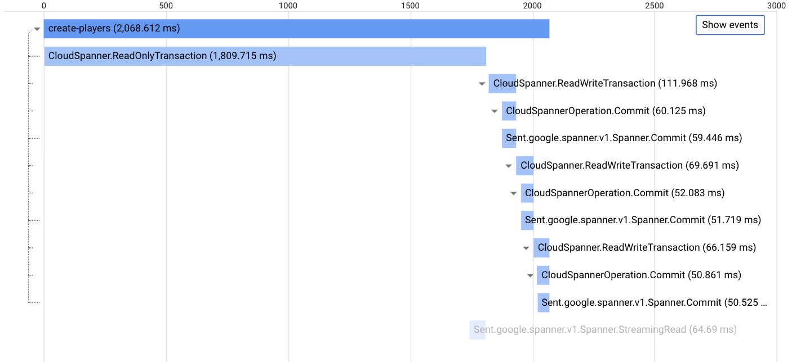
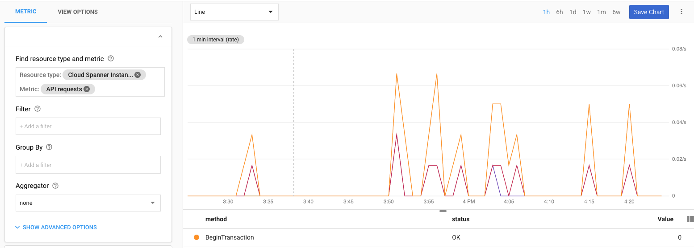

This tutorial shows how to implement client-side tracing in your Cloud Spanner workloads 
using OpenCensus and Stackdriver. While Cloud Spanner surfaces a number of helpful server-side 
metrics with Stackdriver, applications can realize added benefits from implementing client-side tracing.
For example, server-side metrics do not give you a window into the round-trip latency of calls made to your 
Cloud Spanner endpoint, which can only be surfaced using client-side tracing.

[Cloud Spanner](https://cloud.google.com/spanner/) is the first scalable, enterprise-grade, globally-distributed, and strongly consistent database service built for the cloud specifically to combine the benefits of relational database structure with non-relational horizontal scale.

[OpenCensus](https://opencensus.io) is an open source library that can be used to provide observability in your applications. It is vendor-agnostic and integrates with a number of backends such as Prometheus and Zipkin. In this tutorial, we use Stackdriver as the tracing backend.

## Costs

This tutorial uses the following billable components of Google Cloud Platform (GCP):

*   Google Compute Engine
*   Cloud Spanner
*   Stackdriver

You can use the [Pricing Calculator](https://cloud.google.com/products/calculator/) to generate a cost
estimate based on your projected usage.

New GCP users might be eligible for a [free trial](https://cloud.google.com/free/).

We recommend that you deploy this tutorial into an ephemeral project, which can then be deleted once you’re done.

## Before you begin

### Create a new project

1.  In the GCP Console, go to the [Manage resources page](https://console.cloud.google.com/cloud-resource-manager).
2.  Select a project, or click **Create Project** to create a new GCP project.
3.  In the dialog, name your project. Make a note of your generated project ID.
4.  Click **Create** to create a new project.    

## Creating a Cloud Spanner instance

In this section, you will create a new Cloud Spanner instance that will be used later by our Java application.

In Cloud Shell, create a Cloud Spanner instance in the region us-central1 with 1 node:

    gcloud spanner instances create test-instance 
      --config=regional-us-central1 \
      --description="Test Instance" 
      --nodes=1

This command might take a few minutes to complete.
      
Note that this creates an instance with the following characteristics:
1. Instance ID `test-instance`
2. Display name `Test Instance`
3. Instance configuration `regional-us-central1`
4. Node count of 1 (`node_count` corresponds to the amount of serving and storage resources available to databases in the instance.)

## Create and configure a Compute Engine VM

Create a Compute Engine VM with the necessary security scopes by running the following commands from Cloud Shell. 

    gcloud compute instances create trace-client  --zone=us-central1-c \
    --scopes="https://www.googleapis.com/auth/spanner.admin.table,\
    https://www.googleapis.com/auth/spanner.data,\
    https://www.googleapis.com/auth/logging.write,\
    https://www.googleapis.com/auth/monitoring.write,\
    https://www.googleapis.com/auth/trace.append"

## Deploying the Java application

In this section, you download the Java application containing the instrumented code, make the necessary modifications to reflect your environment and then run it.

1.  Log in to the VM

        gcloud compute ssh trace-client --zone=us-central1-c
        
1.  Run the following command to install Git, the Java 8 JDK, and Maven:

        sudo apt-get install git openjdk-8-jdk maven -y

1.  Clone the source repository for this tutorial:

        git clone https://github.com/GoogleCloudPlatform/community.git
        
Update the Java application with some configuration specific to your project.

1.  Navigate to the folder containing the Java source:

        cd community/tutorials/spanner-oc/java/

1.  Configure the environment variable for the application code to use the `spanner-oc` Spanner instance and `demo-1` as database id:

        export INSTANCE_ID=spanner-oc
        export DATABASE_ID=demo-1
        
1.  Run the following maven commands to build and run the program:

        mvn package -DskipTests --quiet
        mvn exec:java -Dexec.mainClass=com.example.spanner.App --quiet

## Viewing traces in Stackdriver Trace UI

As soon as the code ran, it started exporting to Stackdriver.

1.  Go to the [Stackdriver Trace console](https://cloud.google.com/console/traces).

1.  If you select **create-players**, you'll be taken to a view 
that shows more information about the call chain, along with other useful 
information such as lower-level tracing and operation-level call latencies.

    Drilling down to a particular data point in time yields a trace with a root span and children spans shown below:

    

1.  The power of visualization helps teams perform root cause analyses, post-mortems, bisect bad changes, figure out what needs to be optimized.

1.  Please note that for this demo we are always sampling and that is very high. More realistically perhaps tracing 1 in 10,000 might suffice.

## Viewing metrics in Stackdriver Metrics Explorer UI

The tutorial also demonstrates the recording of application metrics. Transaction Latency and Transaction Count will be measured by the application code and recorded.

1.  Go to the [Stackdriver Monitoring console](https://cloud.google.com/console/monitoring).
    
1.  For metrics, there is no sampling. Every recorded value is included in the metric representations.

    

## Cleaning up

Since this tutorial uses multiple GCP components, please be sure to delete the associated resources once you are done.

## Next steps

What you saw in this tutorial is just the tip of the iceberg when it comes to the instrumentation possibilities with OpenCensus. For more details on how to implement observability in your applications, visit [https://opencensus.io](https://opencensus.io).
