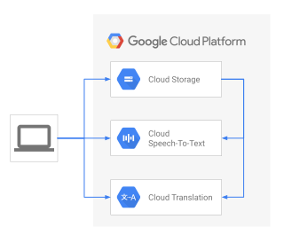

Markku Lepisto | Solutions Architect | Google Cloud

## Objectives

This tutorial shows you how to use the Google Cloud AI services [Speech-to-Text API](https://cloud.google.com/speech-to-text/) and [Translation API](https://cloud.google.com/translation/), to add subtitles to videos, and to provide localized subtitles in other languages.

The main functionalities demonstrated are the following:

- [Transcribe](https://en.wiktionary.org/wiki/transcribe) audio files with spoken dialog into text and [SRT subtitle](https://en.wikipedia.org/wiki/SubRip) files
- Get accurate timings of spoken sentences for subtitles
- Translate subtitles to subtitles in other languages

## Architecture diagram

## Costs

This tutorial uses billable components of GCP, including the following:

- Cloud Storage
- Cloud Speech-to-text
- Cloud Translation

This tutorial should not generate any usage that would not be covered by the [free tier](https://cloud.google.com/free/),
but you can use the [Pricing Calculator](https://cloud.google.com/products/calculator/) to generate a cost estimate based
on your projected production usage.

## Watch the companion video

If you wish to see this tutorial in action, you can watch the [GCP Level Up episode](https://youtu.be/uBzp5xGSZ6o) first, and then follow the steps below yourself.

## Before you begin

This tutorial assumes that you already have a [GCP account](https://console.cloud.google.com/freetrial) set up.

## Create a GCP project

1. Go to the [GCP Console](https://console.cloud.google.com).
1. Click the project selector in the upper-left corner and select **New Project**.
1. Give the project a name and click **Create**.
1. Click the project selector again and select your new project.

## Prerequisites

1. On your local development machine, install the following tools:
    - [Google Cloud SDK](https://cloud.google.com/sdk/install) (gcloud command line tool)
    - git
    - python3
    - pip

1. Configure `gcloud` to use your new GCP project:

        gcloud init

1. Export an environment variable with your current GCP project ID with:

        PROJECT_ID=$(gcloud info --format='value(config.project)')

1. Enable the services used in this tutorial with the following command:

        gcloud services enable speech.googleapis.com texttospeech.googleapis.com translate.googleapis.com storage-component.googleapis.com

1. Clone the GitHub repository associated with the community tutorials:

        git clone https://github.com/GoogleCloudPlatform/community.git

1. Change to the tutorial directory:

        cd community/tutorials/speech2srt

1. Create a new Python 3 virtual environment:

        python3 -m venv venv

1. Activate the virtual environment:

        source venv/bin/activate

1. Install the required Python modules:

        pip3 install -r requirements.txt

1. Create two Google Cloud Storage (GCS) buckets - one for input, one for output. **Note**: the bucket names are a global namespace so you have to use unique bucket names.

  First export the two bucket names into environment variables. Replace here `<your_first_bucket>` and `<your_second_bucket>` with your custom bucket names:

        BUCKET_IN=<your_first_bucket>
        BUCKET_OUT=<your_second_bucket>

  Then execute the following commands to create your two buckets:

        gsutil mb gs://$BUCKET_IN
        gsutil mb gs://$BUCKET_OUT

## Create a Service Account and JSON key

Next we will create a Service Account in your GCP project, and grant sufficient permissions to it, so that it can use the AI services. We will also need to download a JSON key for the Service Account. The JSON key will be used by the Python utilities to authenticate with the Cloud services.

1. Create a new Service Account with the following command:

        gcloud iam service-accounts create ml-dev --description="ML APIs developer access" --display-name="ML Developer Service Account"

1. Grant the `ML Developer` role to the Service Account:

        gcloud projects add-iam-policy-binding $PROJECT_ID --member serviceAccount:ml-dev@$PROJECT_ID.iam.gserviceaccount.com --role roles/ml.developer

1. Grant also the Project Viewer role to the Service Account:

        gcloud projects add-iam-policy-binding $PROJECT_ID --member serviceAccount:ml-dev@$PROJECT_ID.iam.gserviceaccount.com --role roles/viewer

1. Finally, grant the Storage Object Admin role to the Service Account, so that it can upload and download objects to and from GCS:

        gcloud projects add-iam-policy-binding $PROJECT_ID --member serviceAccount:ml-dev@$PROJECT_ID.iam.gserviceaccount.com --role roles/storage.objectAdmin

1. Create a JSON key for the Service Account. The key file will be downloaded to the current working directory:

        gcloud iam service-accounts keys create ./ml-dev.json --iam-account ml-dev@$PROJECT_ID.iam.gserviceaccount.com

1. Export your service account JSON key to the shell environment variables, so that the utilities can authenticate with the Cloud AI services. Execute the following command:

        export GOOGLE_APPLICATION_CREDENTIALS=ml-dev.json

## The Subrip SRT format

The goal of this tutorial is to generate [Subrip](https://en.wikipedia.org/wiki/SubRip) (SRT, .srt) subtitle files that you can use in your video player, or upload to platforms such as [YouTube](http://www.youtube.com). The SRT format is described in its [Wikipedia article](https://en.wikipedia.org/wiki/SubRip).

Example SRT subtitle file with two subtitle entries:

      1
      00:00:00,000 --> 00:00:01,800
      This is an example text file.

      2
      00:00:01,800 --> 00:00:04,300
      It can be used to test the artificial intelligence

There, each entry contains the following items:

1. an incrementing index number, starting from 1
2. the start and stop times when to display the subtitle, in format: hh:mm:ss,ms
3. the subtitle body text in one or more lines of text

## Preparing the dialog audio

The input data for the solution is an audio file that contains spoken dialog. The first step is to transcribe the audio file's speech to text.

### Extracting the dialog track and optimizing the audio for Speech-to-Text

Your starting point may be any of these or more:

- a new video in post-production, being edited before publishing
- an existing video encoded as a playback-optimized video file
- an existing multichannel audio file where one track contains the dialog
- an audio recording of just the spoken dialog

Regardless of the source data type, we need to prepare an audio file for transcribing that contains only the spoken dialog. And if possible it should not contain any other audio (such as music), or video tracks. The audio file should be in a format supported by the [Cloud Speech-to-Text API](https://cloud.google.com/speech-to-text/). Please follow the steps in the article [Optimizing audio files for Speech-to-Text](https://cloud.google.com/solutions/media-entertainment/optimizing-audio-files-for-speech-to-text) to help you prepare an optimized audio file. The quality of the audio input can greatly affect the quality of the AI transcribing output.

This tutorial includes a pre-created audio file `example.wav` which we will use in the next steps to demonstrate the functionalities.

## Transcribing dialog to plain text and SRT subtitles

To transcribe audio files, we will use the example utility: `speech2srt.py`. The utility will perform the following steps:

-   Configure the API request and set the following parameters:
  - `"enable_word_time_offsets": True`
      - This will give us millisecond-accurate start and stop timings of each spoken word
  - `"enable_automatic_punctuation": True`
      - This will add punctuation marks such as comma or dot, to the end of detected sentences
-   Call the [Cloud Speech-to-Text API](https://cloud.google.com/speech-to-text/) and pass the input parameters to the service, including:
  - URI of the source audio file in [Google Cloud storage](https://cloud.google.com/storage/) (example: `gs://$BUCKET_IN/example.wav`)
  - Sample rate of the audio in Hertz (default: `16000`)
  - Language code of the spoken dialog (default: `en-us`)
  - Max characters per line, before breaking to the next line (default: `40`)
-   Receive the transcribed text from the service, including metadata with e.g the timing of each spoken word
-   Write two output files:
  - a plain text file, with each sentence on a separate line. Breaking to the next sentence with either a punctuation mark, or if the sentence exceeds the configured maximum characters per line limit
  - an SRT formatted subtitle file, with each sentence as a separate subtitle entry

1. Upload your dialog audio file to the GCS bucket with for example:

        gsutil cp example.wav gs://$BUCKET_IN/

1. You can see the command line options for the transcribing utility by executing the following command:

        python3 speech2srt.py -h

1. To transcribe the file `example.wav`, execute the following command:

        python3 speech2srt.py --storage_uri gs://$BUCKET_IN/example.wav --sample_rate_hertz 24000

    If successful, the command should output the following:

        Transcribing gs://<your_first_bucket>/example.wav ...
        Transcribing finished
        Writing en-US subtitles to: en.srt
        Writing text to: en.txt

    Example plain text output `en.txt`:

        This is an example text file.
        It can be used to test the artificial intelligence
        solution the solution can transcribe spoken dialogue
        in to text.
        It can convert text into subtitles and it can translate
        subtitles to multiple Target languages.

    Example SRT subtitles output `en.srt`:

        1
        00:00:00,000 --> 00:00:01,800
        This is an example text file.

        2
        00:00:01,800 --> 00:00:04,300
        It can be used to test the artificial intelligence

        3
        00:00:04,300 --> 00:00:08,300
        solution the solution can transcribe spoken dialogue

        4
        00:00:08,300 --> 00:00:08,900
        in to text.

        5
        00:00:08,900 --> 00:00:12,100
        It can convert text into subtitles and it can translate

        6
        00:00:12,100 --> 00:00:14,500
        subtitles to multiple Target languages.

1. Open both output files `en.txt` and `en.srt` in a text editor and fix any transcribing mistakes where necessary.

  **Note**: the file `en.txt` is used as the *translation input file* in later steps, if you wish to have translated subtitles in other languages. And the file `en.srt` is the original language subtitles file for your video.

1. Load the .srt subtitles file in your video player, enable subtitles, and verify that the subtitles are displayed correctly. Refer to the [Level Up YouTube episode](https://youtu.be/uBzp5xGSZ6o?t=589) for an example on how to load the subtitles to [YouTube Studio](https://studio.youtube.com).

## Translating subtitles to other languages

Now that we have created subtitles in the original language, we can use the [Cloud Translation API](https://cloud.google.com/translation/) to generate subtitles in other languages. To achieve this, we can use the included utilities: `translate_txt.py` and `txt2srt.py`. The utilities perform the following steps:

`translate_txt.py`:

- Query and print the list of [languages supported](https://cloud.google.com/translate/docs/languages) by the Translation API
- Call the API with the `batch_translate` method
  - Use the source text file in GCS as the input
  - Specify the source text file's original language
  - Specify the target language(s) for the translation operation
  - Specify the output bucket for the translation text files and descriptive `index.csv` file

`txt2srt.py`:

- Read the translation output file `index.csv` to identify the translated output text files
- Open the original language SRT subtitle file to read the timings for each subtitle entry
- For each translated text file, in turn:
  - Replace the original language subtitle's body text with the translated sentence
  - Write the translated subtitles as an SRT output files

**Note**: The tools match the sentences in the plain text files, and SRT subtitle files, by their line and index number. For example, line 1 in the plain text file has the same content as the SRT subtitle at index 1. For this reason, the current versions of the utilities only support 1 line of text per subtitle entry.

To generate subtitles for multiple target languages, execute the following steps:

1. Upload the transcribed original language text to GCS with the following command:

        gsutil cp en.txt gs://$BUCKET_IN/

2. Study the command line options for the utility `translate_txt.py` by executing:

        python3 translate_txt.py -h

3. Call the Translation API service and specify the list of target languages, by executing for example:

        python3 translate_txt.py --project_id $PROJECT_ID --source_lang en --target_lang ko,hi --input_uri gs://$BUCKET_IN/en.txt --output_uri gs://$BUCKET_OUT/

      Here, we specify that we wish to translate the plain text file gs://$BUCKET_IN/en.txt to Korean and Finnish, and store the output files in the GCS bucket: gs://$BUCKET_OUT. **Note**: the output bucket has to be empty before executing this step! You can empty the bucket first by executing: `(venv) $ gsutil rm gs://$BUCKET_OUT/*`

      If everything went well, the command should output:

        Supported Languages: af am ar az be bg bn bs ca ceb co cs cy da de el en eo es et eu fa fi fr fy ga gd gl gu ha haw hi hmn hr ht hu hy id ig is it iw ja jw ka kk km kn ko ku ky la lb lo lt lv mg mi mk ml mn mr ms mt my ne nl no ny or pa pl ps pt ro ru rw sd si sk sl sm sn so sq sr st su sv sw ta te tg th tk tl tr tt ug uk ur uz vi xh yi yo zh-CN zh-TW zu

        Waiting for operation to complete...
        Total Characters: 484
        Translated Characters: 484

4. Copy the output files to your local machine with:

        gsutil cp gs://$BUCKET_OUT/* .

      The file `index.csv` contains information on the Translation operation output files. Here we can see that the service translated the source file `en.txt` and wrote two output files, in Finnish and Korean, respectively:

        cat index.csv
        gs://<your_first_bucket>/en.txt,fi,gs://<your_second_bucket>/en_fi_translations.txt,,,
        gs://<your_first_bucket>/en.txt,ko,gs://<your_second_bucket>/en_ko_translations.txt,,,

5. To create SRT subtitles from the Finnish and Korean plain text files, execute the following step:

        python3 txt2srt.py --srt en.srt --index index.csv

      You should see the following command output:

        Loading en.srt
        Updating subtitles for each translated language
        Wrote SRT file fi.srt
        Wrote SRT file ko.srt

      The utility `txt2srt.py` generated the translated subtitles by loading the original `en.srt` English subtitles for the timing information, and replaced each subtitle entry's body text with the corresponding line of text, from the Finnish and Korean translated files.

6. Check the translated subtitles by executing for example:

        head -8 fi.srt
        1
        00:00:00,000 --> 00:00:01,800
        Tämä on esimerkki tekstitiedostosta.

        2
        00:00:01,800 --> 00:00:04,300
        Sitä voidaan käyttää tekoälyn testaamiseen

7. Again, as with the original language speech to text transcribing result, check the output files and fix any mistakes using a text editor.
  Now you should have subtitles for your video in multiple languages.

## Cleaning up

### Delete the GCP project

To avoid incurring charges to your GCP account for the resources used in this tutorial, you can delete the project.

**Caution**: Deleting a project has the following consequences:

- If you used an existing project, you'll also delete any other work you've done in the project.
- You can't reuse the project ID of a deleted project. If you created a custom project ID that you plan to use in the
future, delete the resources inside the project instead. This ensures that URLs that use the project ID, such as
an `appspot.com` URL, remain available.

To delete a project, do the following:

1. In the GCP Console, go to the [Projects page](https://console.cloud.google.com/iam-admin/projects).
1. In the project list, select the project you want to delete and click **Delete project**.
1. In the dialog, type the project ID, and then click **Shut down** to delete the project.

[delete-project]: https://storage.googleapis.com/gcp-community/tutorials/sigfox-gw/delete-project.png
![deleting the project][delete-project]

## What's next

- Watch this tutorial's [GCP Level Up episode on YouTube](https://youtu.be/uBzp5xGSZ6o)
- Learn more about [AI on GCP](https://cloud.google.com/solutions/ai/)
- Learn more about [Cloud developer tools](https://cloud.google.com/products/tools)
- Try out other GCP features for yourself. Have a look at our [tutorials](https://cloud.google.com/docs/tutorials).
