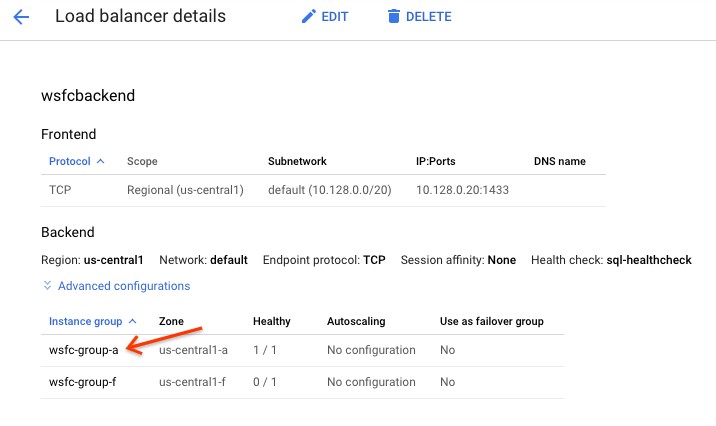

Shashank Agarwal | Database(s) Cloud Engineer | Google

<p style="background-color:#CAFACA;"><i>Contributed by Google employees.</i></p>

This document describes the deployment of the database engine PostgreSQL in a GKE cluster. In addition, it discusses the consideration in comparison to a conventional deployment of PostgreSQL on a virtual machine or in Cloud SQL.


## Objectives
*   Learn to install a Microsoft SQL Server in AO AG configuration using only one subnet
*   Understand the architectural considerations of single subnet and multi subnet deployments

## Costs

This tutorial uses billable components of Google Cloud Platform, including:

*   Compute Engine
*   SQL Server Licensing via Premium Images

Use the [Pricing Calculator](https://cloud.google.com/products/calculator) to generate a cost estimate based on your projected usage.


## Before you begin

For this reference guide, you need a GCP [project](https://cloud.google.com/resource-manager/docs/cloud-platform-resource-hierarchy#projects). You can create a new one, or select a project you already created:

1. Select or create a GCP project.
[GO TO THE PROJECT SELECTOR PAGE](https://console.cloud.google.com/projectselector2/home/dashboard)

2. Enable billing for your project.
[ENABLE BILLING](https://support.google.com/cloud/answer/6293499#enable-billing)

When you finish this tutorial, you can avoid continued billing by deleting the resources you created. See [Cleaning up](https://docs.google.com/document/d/1G8k6nHTmnrSyxrxqKWQleTzldETAQ02Di_pLW4OXYJ8/edit#heading=h.2fjojvpg205m) for more detail.

## Overview
SQL Server Always On Availability Groups (AOAG) allows users to deploy highly available and automated failover with SQL Server databases. 
It is commonly deployed using multi-subnets in Google Cloud. However, sometimes it might be desirable to deploy it in a single subnet configuration. 
This could be because network design was planned only to have one subnet per region and adding new subnets might be difficult. 
Whatever might be reason for a single subnet, this solution can be used in that scenario.   

This solution in based on combination of [SQL Server FCI Setup](https://cloud.google.com/compute/docs/instances/sql-server/configure-failover-cluster-instance) 
and [SQL Server multi subnet AO](https://cloud.google.com/solutions/deploy-multi-subnet-sql-server) in GCP.

...............<diagram here>.................

## Setting up the VPC network
We are going to use exisiting **default** network.

## Creating and configuring a Windows domain controller
An Active Directory domain is used for domain name services, Windows Failover Clustering which is used under the hood by Always On in Windows. 
Having the AD domain controller in the same VPC is not a requirement but a simplification for the purpose of this tutorial. 
It is possible to [Managed Active Directory](https://cloud.google.com/managed-microsoft-ad) but as it takes 1hr to initialize, we will use VM for AD.   

In this tutorial, the domain is ```gontoso.com``` The domain controller VM name is ```dc-windows``` (and, by default, 
the Windows computer name matches the VM name, dc-windows). The VM is created in us-central1 default subnet, with IP ```10.128.0.3```

1. Create a VM to use as the domain controller. 
While you can specify any machine type and Windows server that you need, for this example use the following parameters.
```sh
gcloud compute instances create "dc-windows" \
    --zone "us-central1-a" \
    --machine-type "n1-standard-2" \
    --private-network-ip "10.128.0.3" \
    --can-ip-forward \
    --image-family "windows-2016" \
    --image-project "windows-cloud" \
    --boot-disk-size "200" \
    --boot-disk-type "pd-standard" \
    --boot-disk-device-name "dc-windows" \
    --metadata sysprep-specialize-script-ps1="Install-WindowsFeature -Name AD-Domain-Services -IncludeManagementTools;"
```

2. [Generate a password](https://cloud.google.com/compute/docs/instances/windows/creating-passwords-for-windows-instances#generating_a_password) 
so that you can connect to the domain controller VM using a local account. Note the username and password for future use.

3. [Using RDP](https://cloud.google.com/compute/docs/instances/connecting-to-instance#windows), connect to the domain controller VM with 
your local account username and password.

4. In an [PowerShell as admin](https://docs.microsoft.com/en-us/powershell/scripting/windows-powershell/starting-windows-powershell?view=powershell-7.1#with-administrative-privileges-run-as-administrator),
set the following variables, which will be used to configure the Active Directory forest.
```powershell
$DomainName = "gontoso.com";
$DomainMode = "Win2012R2";
$ForestMode = "Win2012R2";
$DatabasePath = "C:\Windows\NTDS";
$LogPath = "C:\Windows\NTDS";
$SysvolPath = "C:\Windows\SYSVOL";
```

5. Set local ```Administrator``` account password.
```powershell
net user Administrator *
```

6. Install and configure the Active Directory forest. This command will prompt you for credentials. 
Use the ```Administrator``` username and password that you created in a previous step.
```powershell
net user Administrator /active:yes
Install-ADDSForest -CreateDnsDelegation:$false -DatabasePath $DatabasePath -LogPath $LogPath -SysvolPath $SysvolPath -DomainName $DomainName -DomainMode $DomainMode -ForestMode $ForestMode -InstallDNS:$true -NoRebootOnCompletion:$false -SafeModeAdministratorPassword ((Get-Credential Administrator).Password) -Force:$true;
```

7. After the VM restarts, reconnect to the it using RDP. Use your local account credentials, which match your original credentials.

## Creating the Always On cluster's VMs 

1. From Cloud Shell, create two SQL Server VMs.
```sh
gcloud compute instances create "node-1" \
    --zone "us-central1-f" \
    --machine-type "n1-standard-2" \
    --subnet "default" \
    --private-network-ip "10.128.0.4" \
    --image-family "sql-ent-2016-win-2016" \
    --image-project "windows-sql-cloud" \
    --boot-disk-size "200" \
    --boot-disk-type "pd-ssd" \
    --boot-disk-device-name "node-1" \
    --metadata enable-wsfc=true,sysprep-specialize-script-ps1="Install-WindowsFeature Failover-Clustering -IncludeManagementTools;"
```

```sh
gcloud compute instances create "node-2" \
    --zone "us-central1-a" \
    --machine-type "n1-standard-2" \
    --subnet "default" \
    --private-network-ip "10.128.0.5" \
    --image-family "sql-ent-2016-win-2016" \
    --image-project "windows-sql-cloud" \
    --boot-disk-size "200" \
    --boot-disk-type "pd-ssd" \
    --boot-disk-device-name "node-2" \
    --metadata enable-wsfc=true,sysprep-specialize-script-ps1="Install-WindowsFeature Failover-Clustering -IncludeManagementTools;"
```

## Creating a file share witness
To provide a tie-breaking vote and achieve a [quorum](https://docs.microsoft.com/en-us/previous-versions/windows/it-pro/windows-server-2012-R2-and-2012/jj612870(v=ws.11))
for the failover scenario, create a file share that will act as a witness. For the purposes of this tutorial, you will create the file share witness on the domain controller VM. 
In a production environment, you would create it elsewhere.

1. Using RDP, connect to the domain controller VM, ```dc-windows```, with the gontoso.com\Administrator account.  
*If you are using Chrome RDP for Google Cloud, in the Options menu, under the Certificates list, 
delete the existing RDP certificates for these addresses.*. 
2. Open PowerShell as administrator
3. Create the witness folder.
```powershell
New-Item "C:\QWitness" –type directory
```
4. Share the folder.
```powershell
New-SmbShare -Name "QWitness" -Path "C:\QWitness" -Description "SQL File Share Witness" -FullAccess "Authenticated Users"
```


## Configuring the cluster VMs

1. Configure the first node.   
  a. Generate a password for ``node-1``. Note the username and password for future use.   
  b. Connect to ```node-1``` using RDP.   
  c. Open an PowerShell as admin.   
  d. Add a firewall rule to open a port for the health check service. This tutorial will use ```tcp:59997```. You can change this to a different port, 
  but it must match the health checker port that you will define later. 
  The health check process periodically pings the agent on each cluster node to determine its availability.
  ```powershell
  netsh advfirewall firewall add rule name="Open port for Health Check" dir=in action=allow protocol=TCP localport=59997
  ```
  e. Set the DNS to the Domain Controller
  ```powershell
  netsh interface ip set dns Ethernet static 10.128.0.3
  ```
  f. Open Windows firewall ports for the SQL Server availability group.
  ```powershell
  netsh advfirewall firewall add rule name="5022 for Avail Groups" dir=in action=allow protocol=TCP localport=5022
  netsh advfirewall firewall add rule name="1433 for SQL Server" dir=in action=allow protocol=TCP localport=1433
  ```
  g. Add the node to the Active Directory domain that you created earlier.
  ```powershell
  Add-Computer -DomainName gontoso.com -Restart -Force -Credential gontoso.com\Administrator
  ```
  You will be prompted for credentials. Use the Administrator username and password that you set when you configured 
  the domain controller VM in a previous step.  
  The machine will reboot.  
  h. Use RDP to connect to the SQL Server instance by using the credentials for the gontoso.com\Administrator account.
  i. Create a new folder for database backups and share it.
  ```
  New-Item -ItemType directory -Path C:\SQLBackup
  New-SMBShare -Name SQLBackup -Path C:\SQLBackup -FullAccess "Authenticated Users"
  ```

2. Configure the second node.   
  a. Generate a password for ``node-2``. Note the username and password for future use.   
  b. Connect to ```node-2``` using RDP.   
  c. Open an PowerShell as admin.   
  d. Add a firewall rule to open a port for the health check service.
  ```powershell
  netsh advfirewall firewall add rule name="Open port for Health Check" dir=in action=allow protocol=TCP localport=59997
  ```
  e. Set the DNS to the Domain Controller
  ```powershell
  netsh interface ip set dns Ethernet static 10.128.0.3
  ```
  f. Open Windows firewall ports for the SQL Server availability group.
  ```powershell
  netsh advfirewall firewall add rule name="5022 for Avail Groups" dir=in action=allow protocol=TCP localport=5022
  netsh advfirewall firewall add rule name="1433 for SQL Server" dir=in action=allow protocol=TCP localport=1433
  ```
  g. Add the node to the Active Directory domain that you created earlier.
  ```powershell
  Add-Computer -DomainName gontoso.com -Restart -Force -Credential gontoso.com\Administrator
  ```
  You will be prompted for credentials. Use the Administrator username and password that you set when you configured 
  the domain controller VM in a previous step.  
  The machine will reboot.  

## Configuring the Failover Cluster Manager
Enable failover clustering on the instances in your availability group, and configure one instance 
to act as the Failover Cluster Manager. Enable AlwaysOn High Availability on all instances in the group.

1. Reconnect to ```node-1``` using RDP using ```gontoso.com\Administrator```.   

2. Open PowerShell as an administrator and create wsfc
```powershell
$node1 = "node-1"
$node2 = "node-2"
$nameWSFC = "cluster-dbclus" #Name of cluster
$ipWSFC = "10.128.0.10" #This should un-utilized / free ip
New-Cluster -Name $nameWSFC -Node $node1, $node2 -NoStorage -StaticAddress $ipWSFC
```

3. Enable AlwaysOn High Availability for both nodes in the cluster.
```powershell
Enable-SqlAlwaysOn -ServerInstance $node1 -Force
Enable-SqlAlwaysOn -ServerInstance $node2 -Force
```

4. Add file share witness
```powershell
Set-ClusterQuorum -FileShareWitness \\dc-windows\QWitness
```

## Creating the availability group
Create a test database and configure it to work with a new availability group. Alternatively, you can instead specify 
an existing database for the availability group.

1. Reconnect to ```node-1``` using RDP using ```gontoso.com\Administrator```.   

2. If you do not have a database configured already, create a test database. Execute below powershell
```powershell
osql -E -Q "CREATE DATABASE TestDB"
osql -E -Q "ALTER DATABASE [TestDB] SET RECOVERY FULL"
osql -E -Q "BACKUP DATABASE [TestDB] to disk = 'C:\SQLBackup\TestDB.bak' with INIT"
```

3. Create database mirrioring endpoint (required for AO AG) in SQL Server Nodes. Execute below powershell   

```powershell
osql -S node-1 -E -Q "CREATE ENDPOINT [aodns-hadr] 
    STATE=STARTED
    AS TCP (LISTENER_PORT = 5022, LISTENER_IP = ALL)
FOR DATA_MIRRORING (
   ROLE = ALL, 
   AUTHENTICATION = WINDOWS NEGOTIATE,
   ENCRYPTION = REQUIRED ALGORITHM AES
);”
```
```powershell
osql -S node-2 -E -Q "CREATE ENDPOINT [aodns-hadr] 
    STATE=STARTED
    AS TCP (LISTENER_PORT = 5022, LISTENER_IP = ALL)
FOR DATA_MIRRORING (
   ROLE = ALL, 
   AUTHENTICATION = WINDOWS NEGOTIATE,
   ENCRYPTION = REQUIRED ALGORITHM AES
);”
```

4. Create Availability Group. Execute below powershell.  
```powershell
osql -S node-1 -E -Q "CREATE AVAILABILITY GROUP [sql-ag]   
FOR DATABASE TestDB   
REPLICA ON N'node-1' WITH (ENDPOINT_URL = N'TCP://node-1.gontoso.com:5022',  
    FAILOVER_MODE = AUTOMATIC,  
    AVAILABILITY_MODE = SYNCHRONOUS_COMMIT,   
    BACKUP_PRIORITY = 50,   
    SECONDARY_ROLE(ALLOW_CONNECTIONS = NO),   
    SEEDING_MODE = AUTOMATIC),   
N'node-2' WITH (ENDPOINT_URL = N'TCP://node-2.gontoso.com:5022',   
    FAILOVER_MODE = AUTOMATIC,   
    AVAILABILITY_MODE = SYNCHRONOUS_COMMIT,   
    BACKUP_PRIORITY = 50,   
    SECONDARY_ROLE(ALLOW_CONNECTIONS = NO),   
    SEEDING_MODE = AUTOMATIC);”
```

5. Join secondary node ```node-2``` to Availability Group. Execute below powershell.
```powershell
osql -S node-2 -E -Q "ALTER AVAILABILITY GROUP [sql-ag] JOIN"
osql -S node-2 -E -Q "ALTER AVAILABILITY GROUP [sql-ag] GRANT CREATE ANY DATABASE”
```

6. Create AG Listener. Execute below powershell.
```powershell
osql -S node-1 -E -Q “USE [master] ALTER AVAILABILITY GROUP [sql-ag] 
ADD LISTENER N'sql-listner' (WITH IP ((N'10.128.0.20', N'255.255.252.0')) , PORT=1433);”
```

**NOTE** Listner must be created with an unused IP. Later same IP shall be allocated to ILB as you will read below.

7. Create wsfc cluster health check. It will make primary node to accept connections on port ```59997``` which would be used by ILB for health check.
Execute below powershell.   
```powershell
$cluster_network_name = 'Cluster Network 1'
$ip_resource_name = 'sql-ag_10.128.0.20'
$load_balancer_ip = '10.128.0.20'
[int]$health_check_port = 59997
Get-ClusterResource $ip_resource_name |
  Set-ClusterParameter -Multiple @{ 'Address'=$load_balancer_ip;
                                    'ProbePort'=$health_check_port;
                                    'SubnetMask'='255.255.240.0';
                                    'Network'=$cluster_network_name;
                                    'EnableDhcp'=0; }
#restart cluster resource group  
Stop-ClusterGroup 'sql-ag'
Start-ClusterGroup 'sql-ag'
```

## Creating an internal load balancer

An [internal load balancer](https://cloud.google.com/compute/docs/load-balancing/internal#deploying_internal_load_balancing) 
provides a single IP for the SQL Server. The load balancer listens for requests and routes network 
traffic to the active cluster node. It knows which is the active node because a health checker is running against each node. 
Only the active node responds as healthy. If the active node goes down, then the other AO/AG node activates. The health checker 
receives the signal, and traffic is redirected there.

1. Create two instance groups, and add one SQL Server node to each group. These instance groups act as backends 
that the load balancer can direct traffic to.
```sh
gcloud compute instance-groups unmanaged create wsfc-group-f --zone us-central1-f
gcloud compute instance-groups unmanaged add-instances wsfc-group-f --instances node-1 --zone us-central1-f

gcloud compute instance-groups unmanaged create wsfc-group-a --zone us-central1-a
gcloud compute instance-groups unmanaged add-instances wsfc-group-a --instances node-2 --zone us-central1-a
```

2. Create a health check that the load balancer can use to determine which is the active node.
```sh
gcloud compute health-checks create tcp sql-healthcheck \
    --check-interval="2s" \
    --healthy-threshold=1 \
    --unhealthy-threshold=2 \
    --port=59997 \
    --request=10.128.0.20 \
    --timeout="1s"
```

3. Add a firewall rule to allow the health check.
```sh
gcloud compute firewall-rules create allow-health-check \
    --source-ranges 130.211.0.0/22,35.191.0.0/16 \
    --allow tcp
```

4. Create one backend service and add the two backend instance groups.
```sh
gcloud compute backend-services create wsfcbackend \
    --load-balancing-scheme internal \
    --region us-central1 \
    --health-checks sql-healthcheck \
    --protocol tcp
    
gcloud compute backend-services add-backend wsfcbackend \
    --instance-group wsfc-group-a \
    --instance-group-zone us-central1-a \
    --region us-central1
    
gcloud compute backend-services add-backend wsfcbackend \
    --instance-group wsfc-group-f \
    --instance-group-zone us-central1-f \
    --region us-central1    
```

5. Create an internal load balancer (ILB) to forward requests to the active node in the AG listner's IP. 

```sh
gcloud compute forwarding-rules create wsfc-forwarding-rule \
    --load-balancing-scheme internal \
    --ports 1433 \
    --region us-central1 \
    --backend-service wsfcbackend \
    --address 10.128.0.20
```

**NOTE** ILB will show only instance group healthy at any given point in time. This is ok and by design.
-----<screenshot>--------

## Simulating Failover

In-order to simulate failure execute below SQL Query on the scondary node (to make it primary).
```powershell
osql -S node-2 -E -Q "ALTER AVAILABILITY GROUP [sql-ag] FORCE_FAILOVER_ALLOW_DATA_LOSS;”
```

You will observe that autoamtically ILB will also start pointing to this node automatically.



## Cleaning up
To avoid incurring charges to your Google Cloud Platform account for the resources used in this tutorial.
### Deleting the project
The easiest way to eliminate billing is to delete the project you created for
the tutorial. To do so using `gcloud`, run:
```gcloud projects delete [PROJECT_ID]```
where `[PROJECT_ID]` is your Google Cloud project ID.  
**Warning**: Deleting a project has the following consequences:  
If you used an existing project, you'll also delete any other work you've done
in the project. You can't reuse the project ID of a deleted project. If you
created a custom project ID that you plan to use in the future, you should
delete the resources inside the project instead. This ensures that URLs that
use the project ID, such as an appspot.com URL, remain available.

## What's next   
*   [Deploying Microsoft SQL Server for multi-regional disaster recovery](https://cloud.google.com/solutions/deploying-microsoft-sql-server-multi-regional-disaster-recovery)
*   Try out other Google Cloud Platform features for yourself. Have a look at our [tutorials](https://cloud.google.com/docs/tutorials).

