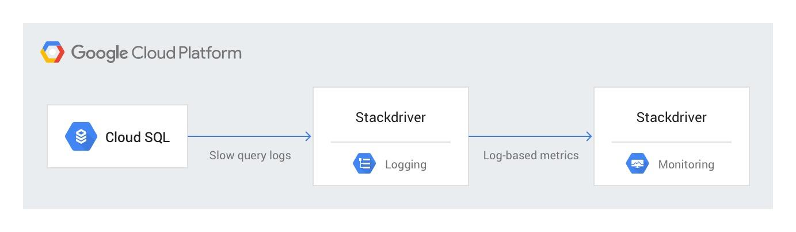
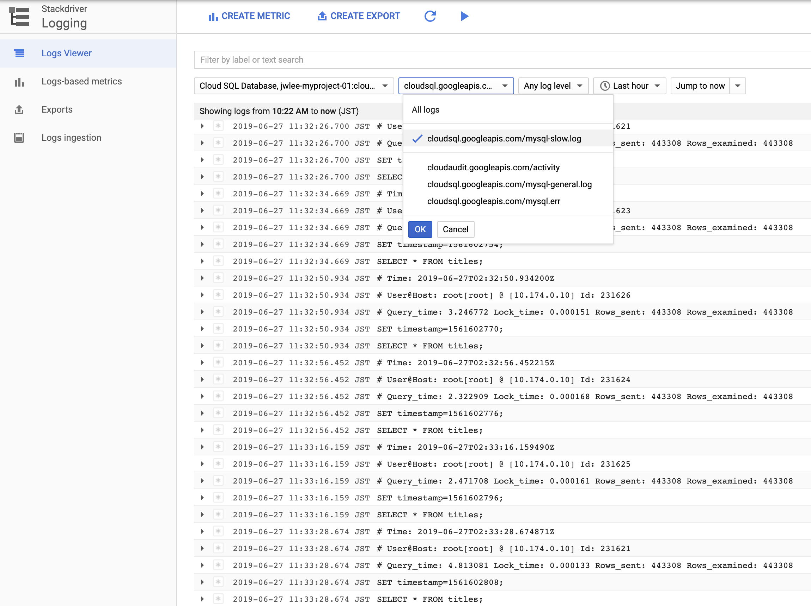
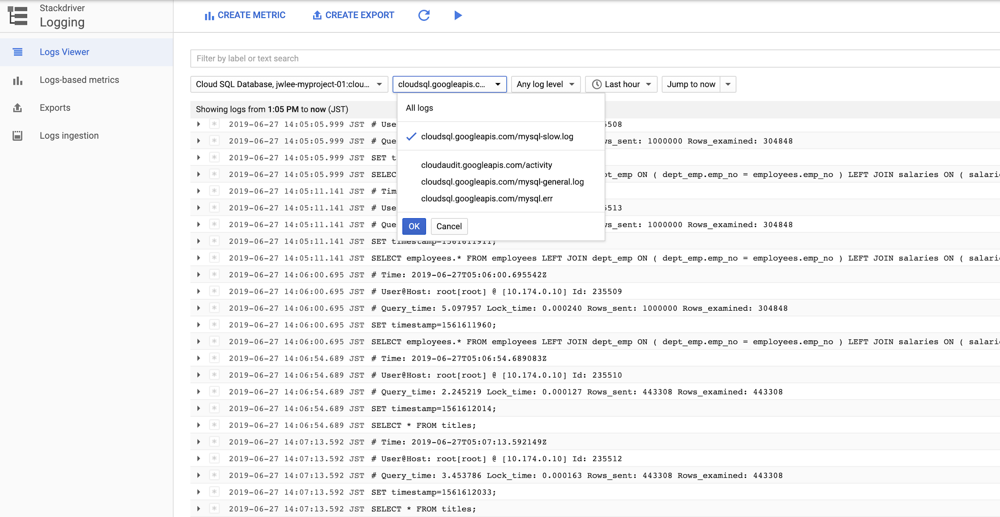
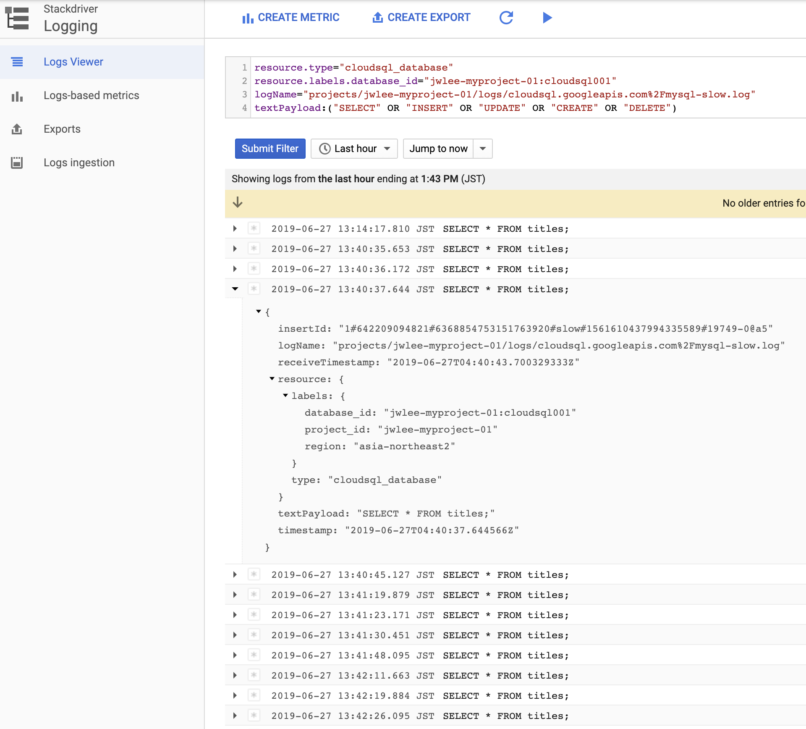
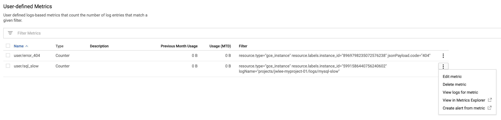
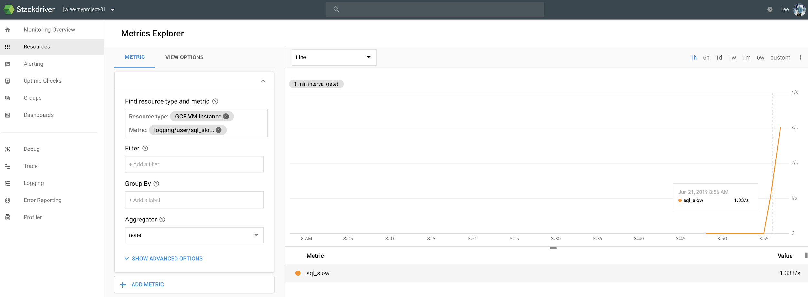
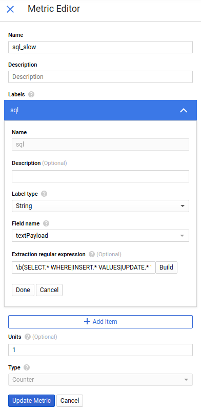
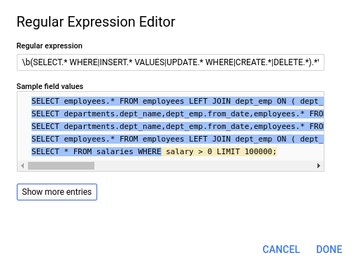
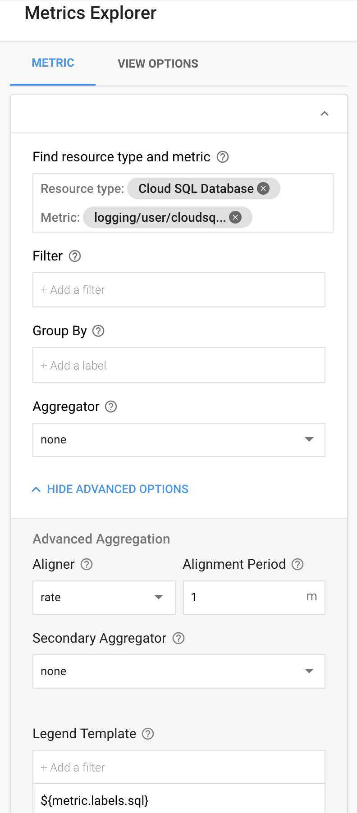
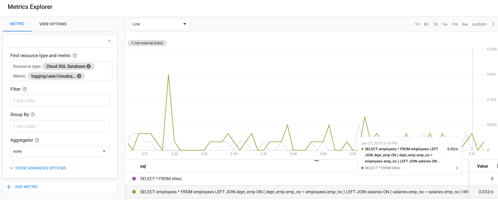

## Monitoring slow queries in MySQL with Stackdriver

<p style="text-align: right">
jungwoonlee@, jani@ \
<a href="https://jira.gcp.solutions/browse/PUB-1130">https://jira.gcp.solutions/browse/PUB-1130</a></p>


This solution describes how to log and monitor [Cloud SQL for MySQL](https://cloud.google.com/sql/) slow queries using [Stackdriver](https://cloud.google.com/monitoring/). It is intended for database administrators and DevOps personnel responsible for monitoring and maintaining MySQL databases.

The slow query log feature in [MySQL](http://mysql.com) enables you to log queries that exceed a predefined time limit. This greatly simplifies the task of finding inefficient or time-consuming queries. By integrating these logs with Stackdriver, you can keep an eye on database performance, allowing you to identify which queries need optimization and, optionally, be alerted when there are too many slow queries.





This solution can also be used with self-managed MySQL instances running on Compute Engine. See 

See [Appendix A](#appendixa) for instructions on how to configure a self-managed instance to send slow query logs to Stackdriver.

&nbsp;

### Objectives


*   Learn how to enable slow query logs in Cloud SQL.
*   Learn how to access slow query logs in Stackdriver Logging.
*   Learn how to create log-based metrics for alerting and troubleshooting.


&nbsp;


### Costs

This tutorial uses the following billable components of Google Cloud Platform: \


*   Cloud SQL for MySQL
*   Stackdriver Logging
*   Stackdriver Monitoring

You can use the [pricing calculator](https://cloud.google.com/products/calculator/#id=817ac158-90f0-4e79-90f6-3e52c7b28a9c) to generate a cost estimate based on your projected usage. For example, if your slow query log contains 10 distinct SQL statements every minute, so they generate 0.033 MB of metrics per month, your total monthly cost is $0.00 if within the 150 MB free quota, or $0.78 if you have already exceeded 150 MB. For details, see this [pricing estimate](https://cloud.google.com/products/calculator/#id=6e6f8223-cbac-4ca4-8213-1778f8b35fb0).


&nbsp;

### Turn on slow query logs for Cloud SQL for MySQL 

Cloud SQL for MySQL is a fully-managed database service that makes it easy to set up, maintain, manage, and administer your MySQL databases on Google Cloud Platform. Cloud SQL comes with [built-in Stackdriver Logging integration](https://cloud.google.com/sql/docs/mysql/diagnose-issues), so MySQL logs are available in the Logs Viewer.

[Open Cloud Shell](https://console.cloud.google.com/home/dashboard?cloudshell=true) and set a default [zone](https://cloud.google.com/compute/docs/regions-zones/).


```
gcloud config set compute/zone us-central1-a
```


Enable the SQL Admin API.


```
gcloud services enable sqladmin.googleapis.com
```


Create a test instance of Cloud SQL, with the appropriate MySQL [configuration flags](https://cloud.google.com/sql/docs/mysql/flags) to enable [slow query logs](https://dev.mysql.com/doc/refman/8.0/en/slow-query-log.html). Replace `<var>password</var>` with a secure password of your choice.


```
gcloud sql instances create cloudsql001 --zone us-central1-a --root-password=<var>password</var> --database-flags=log_output='FILE',slow_query_log=on,long_query_time=2
```


The slow query log defaults to logging SQL statements that took more than two seconds. You can control this filtering by adjusting the value of the `long_query_time` flag.

Note: By default, slow query logs are not enabled in MySQL. If you are using an existing database instance that does not have slow queries enabled, you can use `gcloud sql instances patch` to set the flags:


```
gcloud sql instances patch cloudsql001 --database-flags=log_output='FILE',slow_query_log=on,long_query_time=2
```


The slow query log is now visible in the Stackdriver Logging viewer. 


1.  Browse to [Logs Viewer](https://console.cloud.google.com/logs/viewer).
1.  From the leftmost dropdown, select **Cloud SQL** and the cloudsql001 database.
1.  From the **All logs** dropdown, select **cloudsql.googleapis.com/mysql-slow.log**.





&nbsp;

### <a name="generatesample">Generate sample data with a load test</as>

You now have slow query logs enabled, but your new database does not have any slow logs yet. In this step, you run a load test to create a test database and some slow queries to monitor. 

_Note: If you are using an existing database that already has slow queries visible in the Logs Viewer, you can skip this and proceed directly to the next section._

In Cloud Shell, clone a open-source Git repository containing sample data [provided by MySQL](https://dev.mysql.com/doc/employee/en/).


```
git clone https://github.com/datacharmer/test_db
cd test_db
```


Import the "employees" database to your MySQL instance. Enter the root password you selected earlier when prompted to do so.


```
gcloud sql connect cloudsql001 --user=root < employees.sql
```


Expected output:


```
Connecting to database with SQL user [root]. Enter password:
INFO
CREATING DATABASE STRUCTURE
INFO
storage engine: InnoDB
INFO
LOADING departments
INFO
LOADING employees
INFO
LOADING dept_emp
INFO
LOADING dept_manager
INFO
LOADING titles
INFO
LOADING salaries
data_load_time_diff
00:01:00
```


MySQL comes with a diagnostic tool called [mysqlslap](https://dev.mysql.com/doc/refman/8.0/en/mysqlslap.html). The highly configurable tool is designed for benchmarking database performance and can perform a load test by simulating simultaneous connections to the database server.

First, create a file with a list of resource-intensive SQL queries.


```
cat <<EOF >select_query.sql
use employees;
SELECT * FROM salaries WHERE salary > 0 LIMIT 100000;
SELECT departments.dept_name,dept_emp.from_date,employees.* FROM departments LEFT JOIN dept_emp ON (departments.dept_no = dept_emp.dept_no) LEFT JOIN employees ON (dept_emp.emp_no = employees.emp_no) WHERE to_date = '9999-01-01' LIMIT 100000;
SELECT employees.* FROM employees LEFT JOIN dept_emp ON ( dept_emp.emp_no = employees.emp_no ) LEFT JOIN salaries ON ( salaries.emp_no = salaries.emp_no ) WHERE employees.first_name LIKE '%Jo%' AND salaries.from_date > '1993-01-21' AND salaries.to_date < '1998-01-01' limit 1000000;
EOF
```


Grant the public IP address of your Cloud Shell instance access to your Cloud SQL instance:


```
gcloud sql instances patch cloudsql001 --authorized-networks=$(dig +short myip.opendns.com @resolver1.opendns.com)
```


Note: This command will overwrite and deauthorize any previously authorized networks.  If you are using an existing Cloud SQL instance, add include any other networks or IP addresses that need access.

Note: If your Cloud Shell instance times out and you reconnect, it may have a new public IP. Run this command again to re-enable access.

Extract the public IP address of your Cloud SQL instance into an environment variable.


```
MYSQL_IP=$(gcloud sql instances list --filter="name:cloudsql001" --format="value(PRIMARY_ADDRESS)")
```


Then start the load test, with mysqlslap performing 50 runs of the queries (option `--number-of-queries`) above using 5 concurrent connections (option `--concurrency`). Replace `<var>password</var>` with your database root password.


```
mysqlslap --no-defaults --user=root --password=<var>password</var> --host=${MYSQL_IP} --concurrency=5 --number-of-queries=50 --create-schema=employees --query="./select_query.sql" --delimiter=";" --verbose --iterations=1
```


Sample output:


```
Benchmark
    Average number of seconds to run all queries: 103.712 seconds
    Minimum number of seconds to run all queries: 103.712 seconds
    Maximum number of seconds to run all queries: 103.712 seconds
    Number of clients running queries: 10
    Average number of queries per client: 50
```


The test may take several minutes. Once it has completed, return to the Stackdriver Logging Cloud SQL view at https://console.cloud.google.com/logs/viewer. 





Slow queries from the load test starting with "`SELECT"` should now be visible.

&nbsp;

### Create log-based metrics with Stackdriver Monitoring

[Logs-based metrics](https://cloud.google.com/logging/docs/logs-based-metrics/) are Stackdriver Monitoring metrics that are based on the content of log entries. For example, metrics can record the number of log entries containing particular messages, or they can extract latency information reported in log entries. In this step, you create a metric that measures the number of MySQL slow queries.

To create a logs-based metric, start by filtering your Stackdriver Logging view to match the logs you want to measure.

Click the small triangle at the far right side of the "Filter by label or text search" search box and choose **Convert to advanced filter**. Add the following row to further limit to slow logs with SQL statements, then click **Submit Filter**.

`textPayload:("SELECT" OR "INSERT" OR "UPDATE" OR "CREATE" OR "DELETE"`) 





Note: If you are targeting MySQL on Compute Engine, the log format is different, so add “`textPayload:"# User@Host"`” instead.

Click the **Create Metric** button at the top left to create a logs-based metric. Enter "slow_sql" for **Name** and leave the rest as defaults. Click **Create Metric**.

Metrics only start recording data after they have been created. In Cloud Shell, rerun the earlier `mysqlslap` command to generate some new data. \


```
mysqlslap --no-defaults --user=root --password=<var>password</var> --host=${MYSQL_IP} --concurrency=5 --number-of-queries=50 --create-schema=employees --query="./select_query.sql" --delimiter=";" --verbose --iterations=1
```


The new metric is now visible under [User-defined metrics](https://console.cloud.google.com/logs/metrics). Click the three dots icon to the left of the `user/sql_slow` metric to open the menu, then click **View in Metrics Explorer** to see the new metric in Stackdriver Monitoring.





Note: It may take several minutes for the resulting data to appear in Stackdriver. 





You now have a metric that measures the number of slow query logs. You can use this to, for example, [trigger an alert](https://cloud.google.com/monitoring/alerts) if the number of slow queries exceeds a given threshold.

The y-axis of the chart measures the number_ _of slow queries, not how long the slow queries took. To check the execution time of a single slow query, see the `Query_time` parameter in the slow log via Stackdriver Logging.  You can also create a [distribution metric](https://cloud.google.com/logging/docs/logs-based-metrics/distribution-metrics) on the regular expression `Query_time: ([0-9]+\.[0-9])`, which can be [visualized as a heatmap](https://cloud.google.com/logging/docs/logs-based-metrics/charts-and-alerts#create-chart).


&nbsp;


### Visualize slow query logs with Stackdriver monitoring

The previously created metric measures the number of slow queries, but it does not show their content. You can make this metric more useful by parsing the slow SQL statements to be [metric labels](https://cloud.google.com/logging/docs/logs-based-metrics/labels), which are visible in the dashboard legend in Stackdriver.

Return to the **User-Defined Metrics** view. Click the three dots icon to the left to open the menu, then select **Edit metric**. Choose **Add item** under **Labels** and enter the following values:

Name: sql<br/>
Label type: String<br/>
Field name: textPayload<br/>
Extraction regular expression: \b(SELECT.* WHERE|INSERT.* VALUES|UPDATE.* WHERE|CREATE.*|DELETE.*).*\z<br/>




This [regular expression](https://github.com/google/re2/wiki/Syntax) instructs Stackdriver to find strings beginning with the common SQL operations SELECT, INSERT, UPDATE, CREATE or DELETE. For CREATE and DELETE, text is extracted until the end of the line. For SELECT, INSERT and UPDATE, text is extracted until a keyword (WHERE or VALUES) that is typically followed by values that are likely to change in every execution. This groups together similar queries.

To test the expression, click on **Build** to open the Regular Expression Editor, which shows what will be extracted from the log. Matching parts of SQL statements are highlighted in blue, while discarded parts are highlighted in yellow.





Click **Done** and then **Update metric**.

Note: With this regular expression, every distinct SQL statement in the slow query log will create a new label value and a corresponding time series. The time series are sparse, meaning you will be charged for non-zero values once you exceed your free quota. In addition, having [too many time series for a single metric](https://cloud.google.com/logging/docs/logs-based-metrics/#too-many-time-series) can cause throttling. You can adjust the MySQL's `long_query_time` configuration setting or the content of the regular expression to reduce the number of labels created.

Click the three dots icon to the left to open the menu, then click **View in Metrics Explorer** to see the updated metric in Stackdriver Monitoring.

Click **Show Advanced Options** and add “sql” in Legend Template:


{: width=500 height=800 }


Rerun the earlier `mysqlslap` command once more to generate some new data with labels. \


```
mysqlslap --no-defaults --user=root --password=<var>password</var> --host=${MYSQL_IP} --concurrency=5 --number-of-queries=50 --create-schema=employees --query="./select_query.sql" --delimiter=";" --verbose --iterations=1
```


The dashboard now shows you slow MySQL queries, broken down by SQL statement. You can also hover over the graph to see queries per second rates for each statement. This allows you to quickly identify the culprit when alerted about database slowness. 





&nbsp;
&nbsp;

### Cleaning up

To avoid incurring charges to your GCP accounts for the resources used in this tutorial, run the following commands in Cloud Shell to delete the test database instance, the log-based metrics and the test repository when you are finished.


```
gcloud sql instances delete cloudsql001
gcloud logging metrics delete slow_sql
rm -r ~/test_db
```


&nbsp;
&nbsp;


## <a name="appendixa">[Appendix A]</a>: Configuring self-managed MySQL on Compute Engine to send slow query logs to Stackdriver

The following instructions let you send slow query logs from a previously deployed self-managed MySQL instance running on Compute Engine to Stackdriver Logging.

Note: The commands below assume that you already have a VM containing a self-managed MySQL database, and that the VM is running Debian/Ubuntu. Commands and file locations may vary in other Linux distributions. You can quickly deploy a new VM for test purposes by launching a [MySQL Google Click to Deploy instance](https://console.cloud.google.com/marketplace/details/click-to-deploy-images/mysql) from Marketplace.

&nbsp;

### Enable Stackdriver Logging

Capturing MySQL slow query logs in Stackdriver requires [installing the Stackdriver logging agent](https://cloud.google.com/logging/docs/agent/installation). Log into the VM running MySQL and check if the agent is already installed:


```
sudo service google-fluentd status
```


Sample output if already running:


```
● google-fluentd.service - LSB: data collector for Treasure Data
  Loaded: loaded (/etc/init.d/google-fluentd; generated; vendor preset: enabled)
  Active: active (running) since Mon 2019-07-01 06:01:14 UTC; 2min 38s ago
```


If yes, skip to the next section. Otherwise run the following commands:


```
curl -sSO https://dl.google.com/cloudagents/install-logging-agent.sh
sudo bash install-logging-agent.sh
```


Confirm that the google-fluentd process is now be active:


```
sudo service google-fluentd status
```


The Stackdriver log collection agent, which is based on fluentd, comes with a collection of predefined configuration files for collecting the logs of various third-party applications, including MySQL. To start collecting MySQL logs, move the configuration into the /etc/google-fluentd folder:


```
cd /etc/google-fluentd
sudo cp config.d/mysql.conf mysql.conf
```


Restart the google-fluentd agent to read the updated config:


```
sudo service google-fluentd restart
```

&nbsp;

### Turn on MySQL slow query logs

By default, MySQL does not log [slow queries](https://dev.mysql.com/doc/refman/8.0/en/slow-query-log.html). To enable them, connect to MySQL as root and enter the root password.


```
mysql -u root -p
```


Type the following command at the mysql> prompt.


```
SET GLOBAL slow_query_log_file = '/var/log/mysql/mysql-slow.log';
SET GLOBAL long_query_time = 2;
SET GLOBAL slow_query_log = 'ON';
```


MySQL will now log all queries that take longer than 2 seconds. You can change this threshold by adjusting the value of `long_query_time`.

Confirm that slow query logs are now being written to the location where google-fluentd expects them:


```
sudo cat /var/log/mysql/mysql-slow.log
```


Expected output:


```
/usr/sbin/mysqld, Version: 5.7.26-log (MySQL Community Server (GPL)). started with:
Tcp port: 0 Unix socket: /var/run/mysqld/mysqld.sock
Time         Id Command  Argument
```


These settings are temporary and will be lost if MySQL is restarted. To persist them, locate your [MySQL option file](https://dev.mysql.com/doc/refman/8.0/en/option-files.html) (typically at `/etc/mysql/mysql.conf.d/mysqld.cnf`), edit the file as root and add or uncomment the following lines:


```
slow_query_log = 1
slow_query_log_file = /var/log/mysql/mysql-slow.log
long_query_time = 2
```


You have now configured MySQL and Stackdriver Logging for slow query logs. Proceed to 


[Generate sample data with a load test](#generatesample).

&nbsp;
&nbsp;


