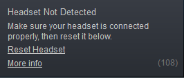
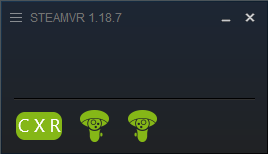
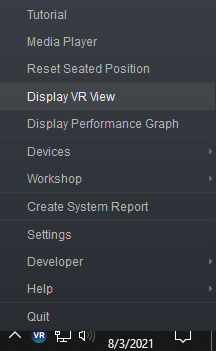
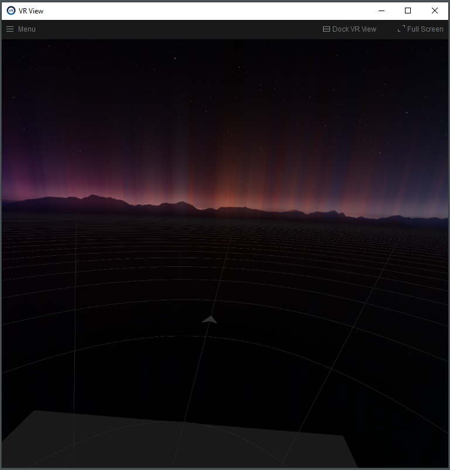

Adrian Graham | Cloud Solutions Architect | Google

<p style="background-color:#CAFACA;"><i>Contributed by Google employees.</i></p>

# Streaming VR content from a Virtual Workstation using NVIDIA CloudXR

This tutorial shows you how to stream Virtual Reality (VR) content from a virtual workstation on Google Cloud to a tetherless Head Mounted Display (HMD) such as the Oculus Quest 2.

## Objectives

+ Create a virtual workstation running Windows Server 2019.
+ Install SteamVR and NVIDIA CloudXR on the workstation.
+ Load the CloudXR client on a virtual reality Head Mounted Display (HMD).
+ Connect to the virtual workstation through the CloudXR client


> **Note:** NVIDIA CloudXR is supported on a variety of [natively supported HMDs](https://developer.nvidia.com/nvidia-cloudxr-sdk#:~:text=NATIVELY%20SUPPORTED%20HMDs). This tutorial provides instructions only for the [Oculus Quest 2](https://www.oculus.com/quest-2/). Where indicated, refer to the CloudXR SDK [documentation](https://docs.nvidia.com/cloudxr-sdk/index.html) for instructions on other HMDs and devices.

## Costs

This tutorial uses billable components of Google Cloud, including the
following:

+   [Compute Engine](https://cloud.google.com/compute), including vCPUs, memory, disk, and GPUs.
+   [Internet Egress](https://cloud.google.com/vpc/network-pricing) for
    streaming data to your HMD.

Use the [pricing calculator](https://cloud.google.com/products/calculator) to generate a cost estimate based on your projected usage.

## Before you begin

This tutorial depends on you having some basic resources set up in Google Cloud.

+   [Select or create a Google Cloud project.](https://console.cloud.google.com/projectselector2/home/dashboard)
+   [Enable billing for your project.](https://support.google.com/cloud/answer/6293499#enable-billing)
+   [Enable Compute Engine API.](https://console.cloud.google.com/flows/enableapi?apiid=compute_component)
+   Install the [Google Cloud SDK](https://cloud.google.com/sdk/docs) or use
    [Cloud Shell](https://cloud.google.com/shell/docs/starting-cloud-shell).

In addition, make sure you have the following:

+   A Google Cloud project with quota for [virtual workstation GPUs](https://cloud.google.com/compute/docs/gpus#gpu-virtual-workstations) in your selected [zone](https://cloud.google.com/compute/docs/gpus#gpus-list). You can get a list of GPU availability by using the `gcloud compute accelerator-types list` command.
+   Access to the [NVIDIA CloudXR SDK](https://developer.nvidia.com/nvidia-cloudxr-sdk). Register for a free account at [developer.nvidia.com](https://developer.nvidia.com/) for access.
+   Access to [Steam](https://store.steampowered.com/) and [SteamVR](https://store.steampowered.com/steamvr). Both are free to download and install.

> **Note:** This tutorial assumes that your project contains a [default network](https://cloud.google.com/vpc/docs/vpc#default-network). If you've [disabled the creation of default networks](https://cloud.google.com/resource-manager/docs/organization-policy/org-policy-constraints) in your organization, you must manually create an auto-mode VPC network named _default._

## Creating the workstation

In the Google Cloud Marketplace, create a virtual workstation using the solution [NVIDIA RTX Virtual Workstation - Windows Server 2019](https://console.cloud.google.com/marketplace/product/nvidia/nvidia-quadro-vws-win2019).  By default, this will create an instance with 8 vCPUs, 30 GB RAM, and a 50 GB boot disk. Prior to creation, change these values to better accommodate the CloudXR workload.

1.  In a browser, navigate to the Marketplace solution [NVIDIA RTX Virtual Workstation - Windows Server 2019](https://console.cloud.google.com/marketplace/product/nvidia/nvidia-quadro-vws-win2019).
1.  Click **LAUNCH** to configure your virtual workstation.

For this tutorial, change the default values:

1.  Choose a **zone** with the lowest latency to your location.
    1.  Go to [gcping.com](gcping.com) to get the median latency to all GCP regions.
    1.  GPU availability is limited to certain zones. Google Cloud Marketplace will only list zones where the NVIDIA T4 GPU is available.
1.  Increase **Cores** to 12.
1.  Increase **Memory** to 64 GB.
1.  For faster disk performance, change the **Boot disk type** to **SSD Persistent Disk**.
1.  Change the **Boot disk size in GB** to **200** to increase disk performance and allow for more downloaded content.

### Add a firewall rule

Create a firewall rule to allow access to this instance from your local workstation. CloudXR also requires a number of other ports for remote access. This firewall rule allows access only from your public IP address.

1.  Determine your public IP address by navigating to [ifconfig.me](https://ifconfig.me/) in a web browser.
1.  In Cloud Shell create a firewall rule:  

```
gcloud compute firewall-rules create allow-cloudxr \  
  --direction=INGRESS \  
  --priority=1000 \  
  --network=default \  
  --action=ALLOW \  
  --rules=tcp:3389,tcp:5900,tcp:47998-48000,\  
tcp:48002,tcp:48005,tcp:48010,udp:47998-48000,\  
udp:48002,udp:48005,udp:48010 \  
  --source-ranges=[PUBLIC-IP] \  
  --target-tags=allow-cloudxr
```

Where `[PUBLIC-IP]` is your local workstation's public IP address.

### Add network tags

Allow traffic to your workstation by adding a network tag to the instance:  

```
gcloud compute instances add-tags [NAME] \  
  --tags=allow-cloudxr \  
  --zone=[ZONE]  
```
 
Where `[NAME]` is the name of your instance, and `[ZONE]` is your workstation's zone.

## Logging into your workstation

> **Note on accessing your virtual workstation:** To perform the initial setup of your virtual workstation, access your instance using Microsoft Remote Desktop Protocol (RDP). Once connected, install an alternate remote desktop software, such as TightVNC. Once installed, disconnect from the RDP session and reconnect using the alternate remote desktop software. Due to a [limitation](https://steamcommunity.com/app/250820/discussions/0/3264459260617027967/) in SteamVR, CloudXR connections will show a solid green display, if connected via RDP.

### Create a default Windows password

1.  Create a Windows password for your user using either the [Google Cloud Console](https://cloud.google.com/compute/docs/instances/windows/creating-passwords-for-windows-instances#console), or the [gcloud](https://cloud.google.com/compute/docs/instances/windows/creating-passwords-for-windows-instances#gcloud) command line:  
  
```
gcloud compute reset-windows-password [NAME] --zone=[ZONE]
```
  
Where `[NAME]` is the name of your workstation, and `[ZONE]` is your workstation's zone.

- Using an RDP client, log into your workstation using the credentials returned by the previous command.

### Install Chrome

Install Google Chrome on the VM instance.

1.  In your RDP session, launch PowerShell.
1.  At the prompt, enable HTTPS requests:  

```
[Net.ServicePointManager]::SecurityProtocol = "tls12, tls11, tls"  
```

3. Download the Chrome installer:  
  
```
$Installer = $env:TEMP + "\chrome_installer.exe";  
    Invoke-WebRequest
    "http://dl.google.com/chrome/install/latest/chrome_installer.exe" -OutFile
    $Installer  
```

4. Run the Google Chrome installer:  
  
```
Start-Process -FilePath $Installer -Args "/silent /install" -Verb RunAs -Wait  
```

When prompted, allow the installer to make changes.

5. Finally, remove the installer:  
  
```
Remove-Item $Installer
```

### Install VNC

CloudXR is incompatible with RDP, so you connect to your workstation using different remote desktop software such as Chrome Remote Desktop, Teradici PCoIP, or any variant of VNC.  For this tutorial, use [TightVNC](https://www.tightvnc.com/), which is freely available and open source.

1.  Launch Google Chrome on your virtual workstation.
1.  Download and install [TightVNC](https://www.tightvnc.com/).
1.  Select **Typical** setup type. Accept the default configuration settings.  1.  When prompted to set passwords, choose a strong password for **Remote Access**.
1.  Do not change the **Administrative Password**.

### Install Steam and SteamVR

1.  On your virtual workstation, download, install, and launch [Steam](https://store.steampowered.com/about/).
1.  To install SteamVR, right-click on the Steam icon on the taskbar and select **SteamVR**. The application will download and install.
1.  Once installed, launch SteamVR to initialize the software.
1.  Quit both Steam and SteamVR.

## Installing the CloudXR Server

On your virtual workstation, download and install [NVIDIA CloudXR SDK](https://developer.nvidia.com/nvidia-cloudxr-sdk). To install CloudXR, extract the downloaded archive and run `CloudXR-Setup.exe`, located under the subdirectory `Installer`.

> **Note:** The CloudXR installer may not be recognized by Microsoft Windows, so you may be presented with a 'Windows protected your PC' warning, click **More Info** then **Run anyway**.

When prompted, choose components for the server installation only:

1.  Select **CloudXR Server**.
1.  Deselect **CloudXR Client Program**.
1.  Ensure the **Redistributables** checkbox is checked (required only for first time installation).

## Installing the Android Studio SDK

To load files onto your HMD, you use [Android Debug Bridge (ADB)](https://developer.android.com/studio/command-line/adb), which is part of the [Android Studio SDK](https://developer.android.com/studio).  On your local workstation, download and install the [Android Studio SDK Platform Tools](https://developer.android.com/studio/releases/platform-tools) for your operating system.

## Connecting your workstation to your HMD

1.  On your local workstation, download and extract _but do not install_ the [NVIDIA CloudXR SDK](https://developer.nvidia.com/nvidia-cloudxr-sdk).
1.  If required, enable Developer Mode on your device (typically only required on the [Oculus Quest 2](https://developer.oculus.com/documentation/native/android/mobile-device-setup#enable-developer-mode)).
1.  Connect your HMD to your workstation using the appropriate cable (typically USB 3.0).
    1.  You can also
        [connect over WiFi](https://developer.android.com/studio/command-line/adb#connect-to-a-device-over-wi-fi-android-11+).
1.  If prompted, select **Allow USB Debugging** on the HMD.
1.  Verify your HMD is connected. Using a terminal (Linux or Mac OS) or PowerShell (Windows) run the command:  
  
```
adb devices -l
```
  
You should see your HMD listed, along with the status of the device, for example:

```
$ adb devices -l
List of devices attached
1WMHHXXXXDXXXX         device usb:1-4.3 product:hollywood model:Quest_2 device:hollywood transport_id:1
```

> **Note:** If your HMD isn't listed, check your cable connections, verify your USB port is USB 3.0, and repeat steps 1-5.

### Install the sample application

Install the sample application on your HMD. Sample apps for all supported HMDs are provided with the CloudXR SDK.  

> **Note:** this section covers client installation only for the Oculus Quest 2.  For other HMDs, consult the NVIDIA CloudXR [documentation](https://docs.nvidia.com/cloudxr-sdk/index.html).

1.  In a terminal on your local workstation, navigate to where you extracted the NVIDIA CloudXR SDK. The sample app for the Oculus Quest 2 is located in the subdirectory:  
  
    `Sample/Android/OculusVR`

1.  Install the sample application on your Oculus Quest 2:  
  
    `adb install -r ovr-sample.apk`  
  
    On the Oculus Quest 2, the CloudXR Client is located under **Apps > Unknown Sources**.

### Install the configuration file

1.  On your local workstation, create a plain-text file named `CloudXRLaunchOptions.txt` containing the following:  
  
```
-s [VM-EXTERNAL-IP]
```
  
Where `[VM-EXTERNAL-IP]` is the external IP address of your virtual workstation. You can find the external IP address of your VM using the [Google Cloud Console](https://cloud.google.com/compute/docs/instances/view-ip-address#console), the [`gcloud`](https://cloud.google.com/compute/docs/instances/view-ip-address#gcloud) command-line tool, or the [API](https://cloud.google.com/compute/docs/instances/view-ip-address#api).  
  
For example, if your virtual workstation external IP address is **`1.2.3.4`**, you would enter:  
  
```
-s 1.2.3.4
```

1.  Save the file in an accessible location on your local workstation.
1.  In a terminal on your local workstation, load the configuration file onto your Oculus Quest 2:  

```
adb push CloudXRLaunchOptions.txt /sdcard/CloudXRLaunchOptions.txt
```

3.  Disconnect the cable from the HMD.

## Launching the CloudXR Client

Connect to your virtual workstation using the CloudXR client on your HMD.

1.  On your local workstation, connect to your virtual workstation using a VNC client.
1.  Once logged in, launch SteamVR. You will see the message *Headset Not Detected*:  

    

1.  On your HMD, start the **CloudXR Client**.
1.  The first time you launch the application, you will be prompted on your HMD to allow access permissions. Accept the permissions to continue.

Once connected, the SteamVR app shows the connection status of your HMD and controllers:



The default CloudXR environment appears in your HMD display. You can preview this display on your virtual workstation by right-clicking on the SteamVR icon on the taskbar and selecting Display VR View:



A window will open showing a preview of the CloudXR environment:



You can now launch SteamVR games or experiences on your virtual workstation, where they will be streamed to your HMD.

## Cleaning up

To avoid incurring charges to your Google Cloud account for the resources used in this tutorial, you can delete the project.

Deleting a project has the following consequences:

- If you used an existing project, you'll also delete any other work that you've done in the project.
- You can't reuse the project ID of a deleted project. If you created a custom project ID that you plan to use in the future, delete the resources inside the project instead. This ensures that URLs that use the project ID, such as an `appspot.com` URL, remain available.

To delete a project, do the following:

1.  In the Cloud Console, go to the [Projects page](https://console.cloud.google.com/iam-admin/projects).
1.  In the project list, select the project you want to delete and click **Delete**.
1.  In the dialog, type the project ID, and then click **Shut down** to delete the project.

## What's next

+   Install SteamVR games and experiences and play them through your HMD.
    + Any application that uses the [OpenVR SDK](https://en.wikipedia.org/wiki/OpenVR) will play over CloudXR, even ones not launched from SteamVR.
+   Learn more about [NVIDIA CloudXR SDK](https://developer.nvidia.com/nvidia-cloudxr-sdk).
+   Read the CloudXR [documentation](https://docs.nvidia.com/cloudxr-sdk/index.html).
+   Learn more about [Creating a Virtual Workstation](https://cloud.google.com/architecture/creating-a-virtual-workstation).