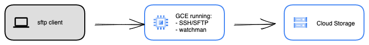

Karim Elatov | Strategic Cloud Engineer | Google

<p style="background-color:#CAFACA;"><i>Contributed by Google employees.</i></p>

[Google Cloud Storage](https://cloud.google.com/storage)  is object based storage which can be used for web based file tranfers and storing lots of data. However some times  other storage protocols need to be utilized to transfer data for example: FTP, SFTP, or HTTPs.

This solution provides an example on how to configure an SFTP server and also to sync any files that are uploaded to the SFTP server to a Cloud Storage bucket. The solution utilizes an open source software called [watchman](https://github.com/facebook/watchman) which can monitor a directory and if it detects a change it can trigger an action (like running a command)

## Objectives

*   Createa  Debian VM
*   Install and Configure SFTP Service on Debian VM
*   Configure SSH keys for authentication
*   Install and configure `watchman` to run `gsutil`
*   Upload a file using SFTP and confirm sync

## Architecture


The architecture is pretty simple, a client uploads a file to an SFTP server and then the SFTP server uploads the file to a Storage Bucket.

## Costs
This tutorial uses billable components of Google Cloud, including the following:

* [Google Compute Engine](https://cloud.google.com/compute)
* [Google Cloud Storage](https://cloud.google.com/storage)

Use the [pricing calculator](https://cloud.google.com/products/calculator) to generate a cost estimate based on your projected usage.

## Before you begin

1. In the Google Cloud console, on the [project selector page](https://console.cloud.google.com/projectselector2/home/dashboard), select or [create a Google Cloud project](https://cloud.google.com/resource-manager/docs/creating-managing-projects).

> Note: If you don't plan to keep the resources that you create in this procedure, create a project instead of selecting an existing project. After you finish these steps, you can delete the project, removing all resources associated with the project.


2. Make sure that billing is enabled for your Cloud project. Learn how to [check if billing is enabled on a project](https://cloud.google.com/billing/docs/how-to/verify-billing-enabled).

3. In the Cloud console, activate [Cloud Shell](https://console.cloud.google.com/?cloudshell=true) or install `gcloud` on local machine.

4. Configure  the environment variables:
```bash
export PROJECT_ID=elatov-demo
export GCS_BUCKET=${PROJECT_ID}-sync
export GCE_NAME=sftp-server
```

5. Set the Project ID, enable the required APIs, and create the Cloud Storage bucket
```bash
gcloud config set project ${PROJECT_ID}
gcloud services enable storage.googleapis.com compute.googleapis.com
gsutil mb gs://${GCS_BUCKET}
```

## Create SFTP Server

1. Create the debian 10 VM:

```bash
$ gcloud compute instances create ${GCE_NAME} --scopes cloud-platform --tags sftp-server --image-family debian-10 --image-project debian-cloud
```

2. SSH to Debian Machine:

```bash
$ gcloud compute ssh ${GCE_NAME}
```

## Configure SFTP on Debian
Now let's enable `sftp` on our server and set the home directory as the jail for  that user. This is actually covered in a couple of sites:

* [SFTP chroot](https://wiki.archlinux.org/index.php/SFTP_chroot)
* [How to set up an SFTP server on Linux](https://www.techrepublic.com/article/how-to-set-up-an-sftp-server-on-linux/)
* [How to Configure SFTP Server with Chroot in Debian 10](https://www.linuxtechi.com/configure-sftp-chroot-debian10/)

### Configure User Configuration
1. Create a group and user for our testing:

```bash
sftp-server:~$ sudo groupadd sftp_users
sftp-server:~$ sudo useradd -G sftp_users -s /bin/bash -d /home/user/ user
sftp-server:~$ sudo mkdir -p /home/user/upload
sftp-server:~$ sudo chown -R root:sftp_users /home/user
sftp-server:~$ sudo chown -R user:sftp_users /home/user/upload
sftp-server:~$ sudo passwd user
New password:
Retype new password:
passwd: password updated successfully
```

2. Enable SFTP for all users that are part of the `sftp_users` group.

```bash
sftp-server:~$ sudo vi /etc/ssh/sshd_config
---
PasswordAuthentication yes
...
...
...
Match Group sftponly
  ChrootDirectory %h
  ForceCommand internal-sftp
  AllowTcpForwarding no
  X11Forwarding no
---
sftp-server:~$ sudo systemctl restart ssh
```

3. Get the public IP of the Debian VM::

```bash
## Get the Public IP from the VM it self
sftp-server:~$ curl ifconfig.me
34.86.149.211
## Get the IP using gcloud
$ gcloud compute instances describe utilities --format 'value(networkInterfaces[0].accessConfigs[0].natIP)'
34.86.149.211
```

4. Test SFTP from a remote machine:

```bash
$ sftp user@34.86.149.211
user@34.86.149.211's password:
Connected to 34.86.149.211.
sftp> ls -la
drwxr-xr-x    3 0        1002         4096 Mar 31 22:42 .
drwxr-xr-x    3 0        1002         4096 Mar 31 22:42 ..
drwxr-xr-x    3 1002     1002         4096 Mar 31 23:39 upload
```

### Configure Authorized Keys
Since we are only allowing `sftp` connection for our chroot jails we have to follow instructions laid out in [Fixing path for authorized_keys](https://wiki.archlinux.org/index.php/SFTP_chroot#Fixing_path_for_authorized_keys) to allow SSH key authentication. 

1. Create a directory which we are going to use to store our **authorized_keys**:

```bash
sftp-server:~$ sudo mkdir /etc/ssh/authorized_keys
sftp-server:~$ sudo chown root:root /etc/ssh/authorized_keys
sftp-server:~$ sudo chmod 755 /etc/ssh/authorized_keys
```

2. Generate SSH key pair on your local machine:

```bash
$ ssh-keygen -t ed25519
$ cat .ssh/id_ed25519.pub
ssh-ed25519 AAAA
```

3. Copy the public SSH certificate to the `authorized_key` file for that user:

```bash
# copy the key from the local machine
$ gcloud compute scp .ssh/id_ed25519.pub ${GCE_NAME}:/tmp/.
# ssh to SFTP server
$ gcloud compute ssh ${GCE_NAME}
# copy the ssh public key to the authorized_key folder
sftp-server:~$ sudo mv /tmp/id_ed25519.pub /etc/ssh/authorized_keys/user
```

4. Configure **sshd** to read from the custom `authorized_keys` directory:

```bash
$ sudo vi /etc/ssh/sshd_config
---
AuthorizedKeysFile /etc/ssh/authorized_keys/%u .ssh/authorized_keys
---
```

5. Restart the service:

```bash
sftp-server:~$ sudo systemctl restart ssh
```

6. Confirm you can `sftp` to the server without using a password:

```bash
$ sftp -i .ssh/id_ed25519.pub user@34.86.149.211
Connected to 34.86.149.211.
sftp>
```

## Upload a file to SFTP server
We can just use `sftp` to upload a file:

```bash
$ sftp -i .ssh/id_ed25519.pub user@34.86.149.211:/upload/ <<< $'put sample.txt'
Connected to 34.86.149.211.
Changing to: /upload/
sftp> put sample.txt
Uploading sample.txt to /upload/cool.txt
sample.txt
```

### Install curl from brew for MacOS (Optional)
Or we can use `curl` to upload a file, the one from Mac OS doesn't support `sftp` by default.

1. Use `brew` to install a version of `curl` that supports `sftp`:

```bash
$ brew install curl
$ /usr/local/opt/curl/bin/curl -V | grep sftp
Protocols: dict file ftp ftps gopher gophers http https imap imaps ldap ldaps mqtt pop3 pop3s rtmp rtsp scp sftp smb smbs smtp smtps telnet tftp
```

2. Upload a file with `curl`:

```bash
> /usr/local/opt/curl/bin/curl -u user: --key ~/.ssh/id_ed25519.pub  -T sample.txt sftp://34.86.149.211/upload/
  % Total    % Received % Xferd  Average Speed   Time    Time     Time  Current
                                 Dload  Upload   Total   Spent    Left  Speed
100    16    0     0  100    16      0     47 --:--:-- --:--:-- --:--:--    47
100    16    0     0  100    16      0     47 --:--:-- --:--:-- --:--:--    47
```

3. Confirm the file is there:

```bash
> sftp -i .ssh/id_ed25519.pub user@34.86.149.211
Connected to 34.86.149.211.
sftp> ls upload
upload/sample.txt
```


## Sync Files to Cloud Storage Bucket
Now let's use `watchman` to trigger a command when a file is updated in the **upload** directory. Most of the instructions are laid out in: [Watchman – A File and Directory Watching Tool for Changes](https://www.tecmint.com/watchman-monitor-file-changes-in-linux/). 

1. Get all the necessary tools to compile the software:

```bash
sftp-server:~$ sudo apt update
sftp-server:~$ sudo apt install autoconf automake build-essential python-setuptools python-dev libssl-dev libtool git pkg-config
```

2. Download the software:

```bash
sftp-server:~$ git clone https://github.com/facebook/watchman.git
sftp-server:~$ cd watchman
sftp-server:~$ git checkout v4.9.0
sftp-server:~$ ./autogen.sh
```

3. Compile `watchman` (initially ran into a compile issue desribed at [v4.9.0 compile failure on Debian unstable](https://github.com/facebook/watchman/issues/638) and fixed it by using the suggestion listed in the bug) :

```bash
sftp-server:~$ sudo mkdir /usr/local/watchman
sftp-server:~$ sudo chown user /usr/local/watchman/
sftp-server:~$ ./configure --prefix /usr/local/watchman --enable-lenient
sftp-server:~$ make
sftp-server:~$ make install
```

4. Create a custom `watchman` configuration (for example  the `settle` option helped out with preventing double triggers on uploads):

```bash
echo '{ "settle": 100 }' | sudo tee -a /etc/watchman.json
```

5. Start `watchman` to monitor our **upload** directory:

```bash
sftp-server:~$ /usr/local/watchman/bin/watchman watch ~user/upload/
{
    "version": "4.9.0",
    "warning": "opendir(/home/user/upload/.gnupg/private-keys-v1.d) -> Permission denied. Marking this portion of the tree deleted\nTo clear this warning, run:\n`watchman watch-del /home/user/upload ; watchman watch-project /home/user/upload`\n",
    "watch": "/home/user/upload",
    "watcher": "inotify"
}
```

6. Confirm the directory is monitored:

```bash
sftp-server:~$ /usr/local/watchman/bin/watchman watch-list
{
    "version": "4.9.0",
    "roots": [
        "/home/user/upload"
    ]
}
```

### Syncing to a Cloud Storage Bucket
Now let's create a script to use `gsutil` to sync the contents of the **upload** directory to our bucket. 

1. Perform a `gsutil` sync manually:

```bash
sftp-server:~$ gsutil rsync -rdc /home/user/upload gs://${GCS_BUCKET}/
Building synchronization state...
Starting synchronization...
Copying file:///home/user/upload/cool.txt [Content-Type=text/plain]...
Copying file:///home/user/upload/coolj.txt [Content-Type=text/plain]...
- [2 files][  1.8 KiB/  1.8 KiB]
Operation completed over 2 objects/1.8 KiB.
````

2. Create a scipt to  run that command:

```bash
sftp-server:~$ cat gsutil-rsync.sh
#!/usr/bin/env bash
PROJECT_ID=elatov-demo
GCS_BUCKET=${PROJECT_ID}-sync
/usr/bin/gsutil rsync -rdc /home/user/upload gs://${GCS_BUCKET}/
sftp-server:~$ chmod +x gsutil-rsync.sh
sftp-server:~$ sudo mv gsutil-rsync.sh /usr/local/bin/
```

3. Run the script manually:

```bash
sftp-server:~$ gsutil-rsync.sh
Building synchronization state...
Starting synchronization...
```

4. Create a trigger to run this script to upload any changes on the monitoried directory:

```bash
sftp-server:~$ /usr/local/watchman/bin/watchman -- trigger /home/user/upload 'sftp-trigger' -- /usr/local/bin/gsutil-rsync.sh
{
    "version": "4.9.0",
    "triggerid": "sftp-trigger",
    "disposition": "created"
}
```


5. Upload a new file:

```bash
> /usr/local/opt/curl/bin/curl -u user: --key ~/.ssh/id_ed25519.pub  -T c.txt sftp://34.86.149.211/upload/
  % Total    % Received % Xferd  Average Speed   Time    Time     Time  Current
                                 Dload  Upload   Total   Spent    Left  Speed
100    16    0     0  100    16      0     51 --:--:-- --:--:-- --:--:--    51
100    16    0     0  100    16      0     51 --:--:-- --:--:-- --:--:--    51
```

6. Check out the logs for `watchman`:

```bash
sftp-server:~$ tail /usr/local/watchman/var/run/watchman/user-state/log
2021-04-01T00:18:28,318: [client=0x55bc72bef770:stm=0x55bc72bef720:pid=27540] root /home/user/upload using watcher mechanism inotify (auto was requested)
2021-04-01T00:18:28,319: [io 0x55bc72df10b0 /home/user/upload] opendir(/home/user/upload/.gnupg/private-keys-v1.d) -> Permission denied. Marking this portion of the tree deleted
2021-04-01T00:18:28,320: [io 0x55bc72df10b0 /home/user/upload] PERF: {"ru_nvcsw": 2, "ru_oublock": 0, "ru_inblock": 0, "ru_msgsnd": 0, "ru_nswap": 0, "ru_majflt": 0, "ru_nivcsw": 2, "ru_minflt": 5, "ru_idrss": 0, "ru_msgrcv": 0, "version": "4.9.0", "start_time": 1617236308.319422, "meta": {"root": {"watcher": "inotify", "ticks": 2, "path": "/home/user/upload", "recrawl_count": 0, "case_sensitive": true, "number": 1}}, "description": "full-crawl", "elapsed_time": 0.0010120000000000001, "user_time": 0.00027399999999999999, "ru_maxrss": 252, "system_time": 0.0, "ru_nsignals": 0, "pid": 27542, "ru_ixrss": 0}
2021-04-01T00:18:28,320: [io 0x55bc72df10b0 /home/user/upload] crawl complete
2021-04-01T00:32:03,802: [trigger sftp-trigger /home/user/upload] input_json: sending json object to stm
Building synchronization state...
Starting synchronization...
Copying file:///home/user/upload/c.txt [Content-Type=text/plain]...
/ [1 files][   16.0 B/   16.0 B]
Operation completed over 1 objects/16.0 B.
```

7. Confirm the file has been synced with `gsutil`:

```bash
sftp-server:~$ gsutil ls gs://${GCS_BUCKET}
gs://elatov-demo-sync/c.txt
gs://elatov-demo-sync/cool.txt
gs://elatov-demo-sync/sample.txt
```
## Cleaning up

To avoid incurring charges to your Google Cloud account for the resources used in this document, you can delete the resources that you created:

1. Delete the bucket:
```bash
gsutil rm -r gs://${GCS_BUCKET}
```
2. Delete the Cloud Engine VM:
```bash
gcloud compute instances delete ${GCE_NAME}
```
3. Delete the entire project:
```bash
gcloud projects delete ${PROJECT_ID}
```