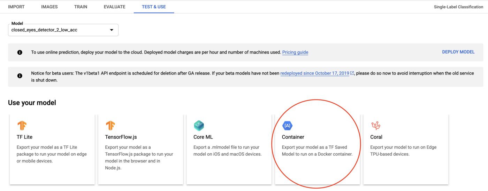
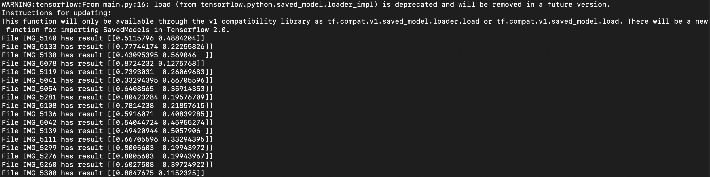
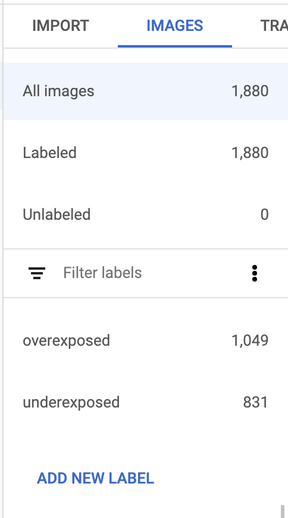
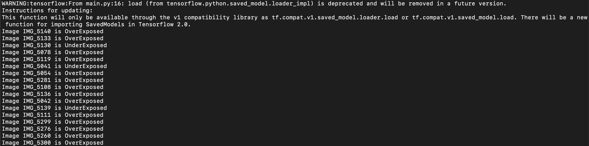

This tutorial describes how to use a TensorFlow model trained with Google Cloud AutoML to classify images into different labels.

The ability to load and run the models in a python environment is extremely useful considering that most of the Machine Learning applications are built in Python due to its rich tool support.

This tutorial assumes you have a TensorFlow Image Classification saved model trained on Cloud AutoML and a machine runnig Python3.
If you don’t have access to a saved classification model, you can train a new Image Classification model from Google Cloud AutoML.


## Challenges solved

TensorFlow models can be served via AI Platform Prediction, TensorFlow Serving API, tf.contrib.predictor library or loading them directly in Python. Since we aim for local prediction without dependency of a connection to the internet, we have discarded the first option.

This solution can be useful for use in desktop applications where the predictions are to be ran locally on a user's machine.


## Objectives

- Install TensorFlow and its dependencies.
- Download a TensorFlow saved model.
- Reading images from a local folder.
- Write a script to deploy the saved model and run predictions.
- Understanding the output and mapping it to the resulting labels.
- Implementing batching for increased performance.


## Costs

If you decide to train your own model, you will incur costs of training a Cloud AutoML Edge Image Classification model. Otherwise, there are no billable costs involved in this tutorial.
Use the Pricing Calculator to generate a cost estimate based on your projected usage.


## Before you begin

1. Install pip. We recommend using the pip installer. You can install it with the following command:
    
        sudo apt-get install python-pip


## Installing TensorFlow and its dependencies

1. Install TensorFlow:

        pip install tensorflow


## Downloading a trained saved model

1.  Create a directory where to deploy the model, such as `/saved_model`:
	
        mkdir /tf_python/saved_model/1
    

1.  Download the model:

    You can download the model by going to the corresponding dataset in the Vision Dashboard and exporting the model.  
    

    Doing this should export the resulting `.pb` file in the specified Google Cloud Storage bucket that you can download for use locally.

## Create starter script to load the saved model

Now that we have the model and our development environment ready, the next step is to create a Python snippet that allows us to load this model and perform inference with it.

Create a new python file in the project directory and add the following code snippet to it:

```py
# we want to run the inference on Tf 1.x instead of 2.x
import tensorflow.compat.v1 as tf
tf.disable_v2_behavior()

# path to the folder containing our downloaded .pb file.
# you can change this if you downloaded the model to a different location
model_path = '/tf_python/saved_model/1'

# creating a tensorflow session (we will be using this to make our predictions later)
session = tf.Session(graph=tf.Graph())

# loading the model into our session created above
tf.saved_model.loader.load(session, ['serve'], model_path)
```
Run the script above with the command `python main.py`, and if you don’t get any errors, you’re good to go!

## Reading the images and providing input to the ML model

To test if the model works as expected, place some images on which you need to run the prediction on in a folder; say `test_images`. We will now be iterating through this folder and passing each image to our loaded model.

```py
# we want to run the inference on Tf 1.x instead of 2.x
import tensorflow.compat.v1 as tf
tf.disable_v2_behavior()

import pathlib

# path to the folder containing our downloaded .pb file
model_path = "/tf_python/saved_model/1"

# path to the folder containing test images
image_path = "test_images"

# creating a tensorflow session (we will be using this to make our predictions later)
session = tf.Session(graph=tf.Graph())

# loading the model into our session created above
tf.saved_model.loader.load(session, ['serve'], model_path)

for file in pathlib.Path(image_path).iterdir():
  # get the current image path
  current_image_path = str(file.resolve())
  
  # get the image byte-array since this is what the ML model needs as its input
  img_bytes = open(current_image_path, 'rb').read()
  
  # pass the image as input to the ML model and get the result
  result = session.run('scores:0', feed_dict={
            'Placeholder:0': [img_bytes]})
  
  print("File {} has result {}".format(file.stem, result))
```

The code might look complex, but it’s actually not! Let’s break down it to see what’s happening here:

- Lines 1–14: Initialization—discussed earlier.
- Line 16: Here, we’re iterating through the directory in which the images are placed using PathLib.
- Line 18–21: For each image, we convert it to a byte array, which is a format TensorFlow understands.
- Line 24–27: For each byte array, we pass it to the session variable and get the output. `scores:0` is the node in the model that stores the prediction scores; i.e. the output. Whereas the `Placeholder:0` node is what stores the input.

Upon running the code above and printing the result, the output should look something as follows:



While we can see that TensorFlow does spew out some numbers, which look like probabilities—it's a bit hard to make sense out of them at first glance.

## Formatting the results obtained with TensorFlow
Since the image classification model being used here was trained to detect 2 labels (under and overexposed images), it’s not a surprise that the resulting output array also has only 2 elements.
And naturally, each one of them belongs to either of the two labels.

To know which one is which, head over to the Dataset in the GCP console and navigate to the `Images` tab this time around.



Overexposed is the first entry, followed by the underexposed entry; in our output array, the first entry is the probability that the given image is overexposed, and the second entry is the probability that the given image is underexposed.

To convert this output into human-readable labels, we’ll get the largest value from the array (which corresponds to the highest probability) and map it to a label: 

```py
# we want to run the inference on Tf 1.x instead of 2.x
import tensorflow.compat.v1 as tf
tf.disable_v2_behavior()

import pathlib

# path to the folder containing our downloaded .pb file
model_path = "/tf_python/saved_model/1"

# path to the folder containing images
image_path = "test_images"

# creating a tensorflow session (we will be using this to make our predictions later)
session = tf.Session(graph=tf.Graph())

# loading the model into our session created above
tf.saved_model.loader.load(session, ['serve'], model_path)

for file in pathlib.Path(image_path).iterdir():
  # get the current image path
  current_image_path = str(file.resolve())
  
  # image bytes since this is what the ML model needs as its input
  img_bytes = open(current_image_path, 'rb').read()
  
  # pass the image as input to the ML model and get the result
  result = session.run('scores:0', feed_dict={
            'Placeholder:0': [img_bytes]})
  
  probabilities = result[0]
  
  if probabilities[0] > probabilities[1]:
    # the first element in the array is largest
    print("Image {} is OverExposed".format(file.stem))
  else: 
    # the second element in the array is largest
    print("Image {} is UnderExposed".format(file.stem))
```

Running the code snippet above again should provide the following result: 



Notice how the output is now formatted to human-readable labels instead.

## Batching the images for better performance

While the code snippet outlined above works well, it might not be the most ideal or performant when it comes to dealing with a large number of images.
Batching can help in reducing the prediction latency in such scenarios.

Here's an extension on the code snippet above that collects all the images from the folder in an array and then runs the session on all of them at once: 

```py
# we want to run the inference on Tf 1.x instead of 2.x
import tensorflow.compat.v1 as tf
tf.disable_v2_behavior()

import pathlib

# path to the folder containing our downloaded .pb file
model_path = "/tf_python/saved_model/1"

# path to the folder containing images
image_path = "test_images"

# creating a tensorflow session (we will be using this to make our predictions later)
session = tf.Session(graph=tf.Graph())

# loading the model into our session created above
tf.saved_model.loader.load(session, ['serve'], model_path)

# arrays to maintaining the images and their names for batching purpose
images = []
image_names = []

for file in pathlib.Path(image_path).iterdir():
  # get the current image path
  current_image_path = str(file.resolve())
  
  # image bytes since this is what the ML model needs as its input
  img_bytes = open(current_image_path, 'rb').read()
  
  images.append(img_bytes)
  image_names.append(file.stem)

# pass the image as input to the ML model and get the result
batch_results = session.run('scores:0', feed_dict={'Placeholder:0': images})
  
# iterate through the results
for index, result in enumerate(batch_results):
  if result[0] > result[1]:
    # the first element in the array is largest
    print("Image {} is OverExposed".format(image_names[index]))
  else: 
    # the second element in the array is largest
    print("Image {} is UnderExposed".format(image_names[index]))

```

Testing this code on my local machine (a MacBook pro) with 50 images, batching made the overall inferencing process around 30% faster when compared to a non-batched code.
However, do note that setting a very large batch size might cause out of memory errors and your app might crash! 
So keep this in mind while batching your requests and be conservative with your batch sizes.


## Cleaning up

The easiest way to avoid incurring charges to your Google Cloud Platform account for the resources used in this tutorial is to delete the project you created.

To delete the project, follow the steps below:
1. In the Cloud Platform Console, [go to the Projects page](https://console.cloud.google.com/iam-admin/projects).

1. In the project list, select the project you want to delete and click **Delete project**.
 
1. In the dialog, type the project ID, and then click **Shut down** to delete the project.