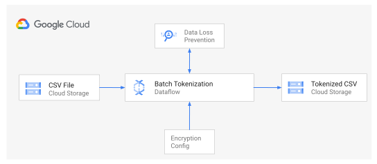
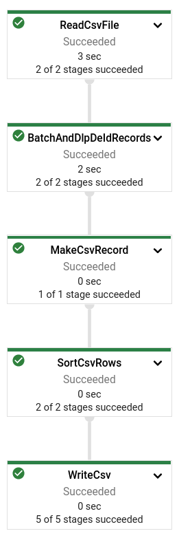

Anant Damle | Solutions Architect | Google

Paul Thomas | Customer Engineer | Google

<i>Contributed by Google employees.</i>

Organizations are increasingly leveraging data, analytics and machine learning 
to better understand and support their customers in order to ensure that 
products and services are meeting their needs and expectations. 
However whilst doing so we must ensure that customers data is protected and 
treated with great care with the high levels of privacy that it deserves.

One business area in particular that deals with sensitive customer data is in 
the Customer Care Contact Center. Data collected in the contact center has huge 
importance to an organization and can be used as a barometer of customer 
satisfaction which will help guide them to create new offerings to better 
service their customers. For instance a few areas of interest may be:

*   To leverage [Natural Language Processing](https://cloud.google.com/natural-language) (NLP) to understand the sentiment of a customer's interaction, was the customer happy, sad or angry.
*   To use machine learning tools such as[ Auto ML - NLP](https://cloud.google.com/natural-language#how-automl-works) to extract key entities discussed during the interaction, such as product names, locations, types of faults, and so on.
*   Or to analyze the data using [Topic Modeling API ](https://cloud.google.com/contact-center/insights/docs/topic-modeling-basics)in order to group together similar conversations, identify the top call drivers and use these to prioritize the building of virtual agents in [DialogFlow](https://cloud.google.com/dialogflow) in order to automate these types of requests in the future.

Customers can contact an organization's call center for a wide variety of topics including the following:

*   Recent product purchases
*   Attempt to resolve product or service issues
*   Discuss their account details
*   Make billing or payment arrangements
*   And many more

In doing so they often need to relay private information such as name, address 
and credit card details. Therefore we must always ensure to take great care in 
handling such sensitive data. One way to achieve this is to leverage 
[Data Loss Prevention API](https://cloud.google.com/dlp) - a Fully managed 
service designed to help you discover, classify, and protect your most 
sensitive data. However in order to process this data we must first make sure 
it is in the right format.

Customers interact with contact centers through two main channels, through the 
voice channel - such as mobile and fixed line, or through digital channels such 
as through text messaging, whatsapp, facebook, or other text based services. If 
the customer has used a digital channel it is already possible to collect this 
information for processing, however if they are using the voice channel it is 
necessary to [transcribe the conversation](https://cloud.google.com/speech-to-text/docs/basics) 
using Google Cloud [Speech-to-Text API](https://cloud.google.com/speech-to-text).

The voice calls received by the contact centers are not usually recorded with 
the highest quality audio and often contain background noise or static. 
However by using the latest  [enhanced machine learning models](https://cloud.google.com/speech-to-text/docs/phone-model)
which were created specifically for phone calls it is possible to still 
transcribe them accurately.

Once the data has been formatted into a structure that allows for analysis, the 
sensitive and/or Personally Identifiable information (PII) in the transcripts 
needs to be de-identified using [Cloud DLP](https://cloud.google.com/dlp) to 
enable safely using this data for required analytics.

This document discusses how to inspect and de-identify data by using a Dataflow 
pipeline. The pipeline uses [Cloud Data Loss Prevention (Cloud DLP)](https://cloud.google.com/dlp) 
to detect sensitive data like personally identifiable information (PII), with 
their Info-types.

This document is intended for a technical audience whose responsibilities 
include data security, data processing, or data analytics. This document 
assumes that you're familiar with data processing and data privacy, without the 
need to be an expert. This document assumes some familiarity with shell scripts 
and basic knowledge of Google Cloud.

## Costs

This tutorial uses billable components of Google Cloud, including the following:

* [Dataflow](https://cloud.google.com/dataflow/pricing)
* [Cloud Storage](https://cloud.google.com/storage/pricing)
* [Cloud Data Loss Prevention](https://cloud.google.com/dlp/pricing)
* [Cloud Key Management Service](https://cloud.google.com/kms/pricing)

Use the [pricing calculator](https://cloud.google.com/products/calculator) to generate a cost estimate based on your projected usage.

## Architecture

The system is built using a Dataflow pipeline that reads the CSV file records 
and processes them using Cloud Data Loss Prevention (DLP) service for tokenizing 
sensitive text using following steps:

1. Batches CSV data into required DLP batch sizes
1. Tokenize the CSV columns using  Cloud Data Loss Prevention (DLP) service based on configuration passed through the ``dlpEncryptConfigJson`` parameter
1. Group and order rows to ensure chats from one conversation stay together and in-order
1. Writes the CSV file output

The solution uses [Envelope encryption](https://cloud.google.com/kms/docs/envelope-encryption) technique to safaguard storing encryption/tokenization keys.

## Before you begin

For this tutorial, you need a Google Cloud [project](https://cloud.google.com/resource-manager/docs/cloud-platform-resource-hierarchy#projects). To make cleanup easiest at the end of the tutorial, we recommend that you create a new project for this tutorial.

1.  [Create a Google Cloud project](https://console.cloud.google.com/projectselector2/home/dashboard).
1.  Make sure that [billing is enabled](https://support.google.com/cloud/answer/6293499#enable-billing) for your Google Cloud project.
1.  [Open Cloud Shell](https://console.cloud.google.com/?cloudshell=true): 

    At the bottom of the Cloud Console, a [Cloud Shell](https://cloud.google.com/shell/docs/features) session opens and displays a command-line  prompt. Cloud Shell is a shell environment with the Cloud SDK already installed, including the [gcloud](https://cloud.google.com/sdk/gcloud)  command-line tool, and with values already set for your current project. It can take a few seconds for the session to initialize.

1.  Enable required Google Cloud services: Compute Engine, Dataflow and Cloud Storage:

        gcloud services enable \
        compute.googleapis.com \
        dataflow.googleapis.com \
        dlp.googleapis.com \
        storage.googleapis.com \

## Setting up your environment

1.  In Cloud Shell, clone the source repository and go to the directory for this tutorial:

        git clone https://github.com/GoogleCloudPlatform/auto-data-tokenize.git
        cd auto-data-tokenize/    

1.  Use a text editor to modify the `set_variables.sh` file to set the required environment variables:

        # The Google Cloud project to use for this tutorial
        export PROJECT_ID="[YOUR_PROJECT_ID]"
        
        # The Compute Engine region to use for running Dataflow jobs and create a
         # temporary storage bucket
        export REGION_ID="[YOUR_COMPUTE_ENGINE_REGION]"
        
        # The Cloud Storage bucket to use as a temporary bucket for Dataflow
        export TEMP_GCS_BUCKET="[CLOUD_STORAGE_BUCKET_NAME]"
        
        # Name of the service account to use (not the email address)
        export DLP_RUNNER_SERVICE_ACCOUNT_NAME="[SERVICE_ACCOUNT_NAME_FOR_RUNNER]"

1.  Run the script to set the environment variables:
        
        source set_variables.sh

## Creating resources

The tutorial uses following resources:

*  A service account to run Dataflow pipelines, enabling fine-grained access control
*  A Key-encryption-key maintenained in Cloud KMS
*  A Cloud Storage bucket for temporary data storage and test data

### Create service accounts

We recommend that you run pipelines with fine-grained access control to improve access partitioning. If your project doesn't have a user-created service account, create one using the following instructions.

You can use your browser by going to the **[Service accounts](https://console.cloud.google.com/projectselector/iam-admin/serviceaccounts?supportedpurview=project)** page in the Cloud Console.

1.  Create a service account to use as the user-managed controller service account for Dataflow:

        gcloud iam service-accounts create  ${DLP_RUNNER_SERVICE_ACCOUNT_NAME} \
        --project="${PROJECT_ID}" \
        --description="Service Account for Tokenizing pipelines." \
        --display-name="Tokenizing pipelines"

1.  Create a custom role with required permissions for accessing Cloud DLP, Dataflow, and Cloud KMS:

        export TOKENIZING_ROLE_NAME="tokenizing_runner"
        gcloud iam roles create ${TOKENIZING_ROLE_NAME} \
        --project=${PROJECT_ID} \
        --file=tokenizing_runner_permissions.yaml

1.  Apply the custom role to the service account:

        `gcloud projects add-iam-policy-binding ${PROJECT_ID} \
        `--member="serviceAccount:${DLP_RUNNER_SERVICE_ACCOUNT_EMAIL}" \
        --role=projects/${PROJECT_ID}/roles/${TOKENIZING_ROLE_NAME

1.  Assign the `dataflow.worker` role to allow the service account to allow it to run as a Dataflow worker:

        gcloud projects add-iam-policy-binding ${PROJECT_ID} \
        --member="serviceAccount:${DLP_RUNNER_SERVICE_ACCOUNT_EMAIL}" \
        --role=roles/dataflow.worker

### Create the key encryption key (KEK)

The data is encrypted using a data encryption key (DEK). You use [envelope encryption](https://cloud.google.com/kms/docs/envelope-encryption) to encrypt the DEK using a key encryption key (KEK) in [Cloud KMS](https://cloud.google.com/kms). This helps to ensure that the DEK can be stored without compromising it.

1.  Create a Cloud KMS key ring:

        gcloud kms keyrings create --project ${PROJECT_ID} --location ${REGION_ID} ${KMS_KEYRING_ID}

1.  Create a Cloud KMS symmetric key to use for encrypting your data encryption key:

       gcloud kms keys create --project ${PROJECT_ID} --keyring=${KMS_KEYRING_ID} --location=${REGION_ID} --purpose="encryption" ${KMS_KEY_ID}

1.  Create a Wrapped encryption-key:

        `echo "RTTo7Lx+UP+OaMQ42c4/dw==" | base64 -d | \
        gcloud kms encrypt \
        --plaintext-file=- \
        --ciphertext-file=- \
        --key="projects/${PROJECT_ID}/locations/${REGION_ID}/keyRings/${KMS_KEYRING_ID}/cryptoKeys/${KMS_KEY_ID}" | base64`

    > **Note:** The text in green is the plain-text encryption key, as per best practice you should safe-guard this key. This solution uses a random key only for demonstration purposes.

1. Using your preferred text editor, update placeholder values, specified using square brackets in the `csv_dlp_tokenize_config.json` file.

### Create the Cloud Storage bucket

Create a Cloud Storage bucket for storing test data and Dataflow staging location:

        gsutil mb -p ${PROJECT_ID} -l ${REGION_ID} "gs://${TEMP_GCS_BUCKET}"

### Copy test data to Cloud Storage

You can use your own file datasets or copy the included demonstration dataset (`userdata.avro` or `userdata.parquet`).

        gsutil cp sample-data-chats.csv gs://${TEMP_GCS_BUCKET}/csv/

## Compile modules

You need to compile all of the modules to build executables for deploying the tokenize pipeline:

        ./gradlew buildNeeded shadowJar

**Tip:** To skip running the tests, you can add the `-x test` flag.

## Run the tokenize pipeline

Launch the CSV tokenization pipeline using the following command:

        csv_tokenize_sorted --project="${PROJECT_ID}" \
        --region="${REGION_ID}" \
        --runner="DataflowRunner" \
        --serviceAccount="${DLP_RUNNER_SERVICE_ACCOUNT_EMAIL}" \
        --stagingLocation="gs://${TEMP_GCS_BUCKET}/staging" \
        --tempLocation="gs://${TEMP_GCS_BUCKET}/temp" \
        --workerMachineType="n1-standard-1" \
        --sourceType="CSV_FILE" \
        --csvHeaders="chatId,userType,transcript,segmentId,segmentTimestamp" \
        --inputPattern="gs://${TEMP_GCS_BUCKET}/csv/sample-data-chats.csv" \
        --outputDirectory="gs://${TEMP_GCS_BUCKET}/encrypted/" \
        --dlpEncryptConfigJson="$(<csv_dlp_tokenize_config.json)" \
        --orderingColumnNames="chatId" \
        --orderingColumnNames="segmentTimestamp"

You can use your own DLP transformation configuration by passing the values for `"transform"` section for each of the columns in `csv_dlp_tokenize_config.json` file. Read more about available[Primitive Transforms](https://cloud.google.com/dlp/docs/transformations-reference).

The pipeline executes asynchronously on Dataflow. You can check the progress by following the job link printed in the following format:

        INFO: JobLink: https://console.cloud.google.com/dataflow/jobs/[YOUR_DATAFLOW_JOB_ID]>?project=[YOUR_PROJECT_ID]

The tokenize pipeline's DAG looks like the following:

### Verify tokenized results

Download the processed CSV files locally to verify tokenization:

        gsutil cp gs://${TEMP_GCS_BUCKET}/encrypted/*.csv ./

You can use your preferred text editor to view files named `output-xxxx-of-xxxx.csv`.

Observe that records belonging to the same chat are in a single file, as well as the records are in ascending order by timestamp. 
The records will contain parts with `TOKENIZED_DATA(zz)` where `zz` refers to the number of tokenized characters.

## Cleaning up

To avoid incurring charges to your Google Cloud account for the resources used in this tutorial, you can delete the project:

1.  In the Cloud Console, go to the [**Manage resources** page](https://console.cloud.google.com/iam-admin/projects).
1.  In the project list, select the project that you want to delete and then click **Delete**.
1.  In the dialog, type the project ID and then click **Shut down** to delete the project.

## What's next

* Watch the YouTube video to understand the code: [Level Up - Automatically tokenize sensitive data with DLP and Dataflow](https://www.youtube.com/watch?v=S6fYkWvUBDo).
* Read the companion document about a similar solution that uses BigQuery tables or queries as input: [Automatically tokenize sensitive BigQuery data with Cloud Data Loss Prevention, Cloud Key Management Service, and Dataflow](https://cloud.google.com/community/tutorials/auto-bigquery-tokenize).
* Learn more about [Cloud DLP](https://cloud.google.com/dlp).
* Learn more about [Cloud KMS](https://cloud.google.com/kms).
* Learn about [inspecting storage and databases for sensitive data](https://cloud.google.com/dlp/docs/inspecting-storage).
* Learn about handling [de-identification and re-identification of PII in large-scale datasets using Cloud DLP](https://cloud.google.com/solutions/de-identification-re-identification-pii-using-cloud-dlp).