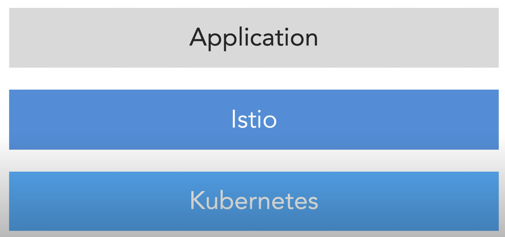
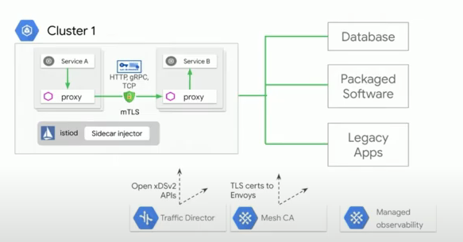
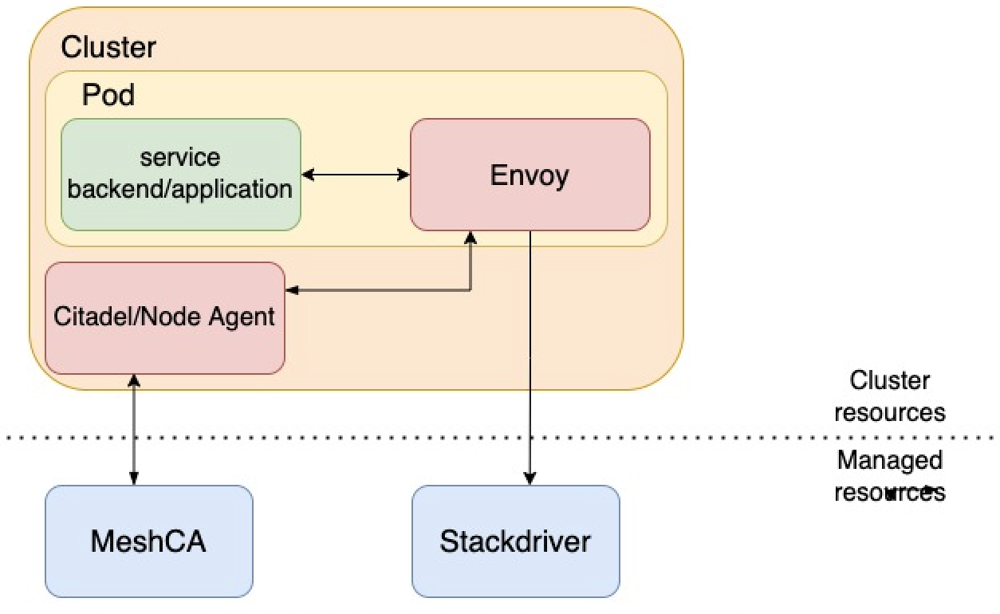
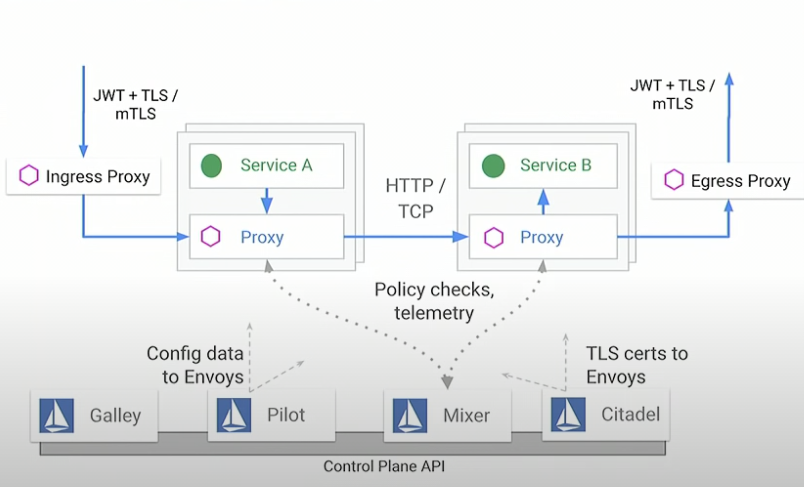
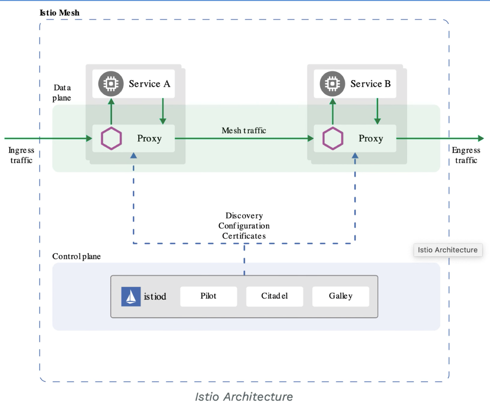
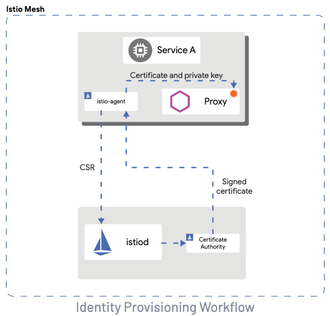

Paras Mamgain | Community Editor | Google

<i>Contributed by the Google Cloud community. Not official Google documentation.</i>

<i>Contributed by Google employees.</i>

# Understanding Certificate Authority for ASM(Anthos Service Mesh)

## Objectives
To describe the different available options for configuring certificate authority while installing ASM.

## Introduction

Encrypting the traffic and the communication between different components of our infrastructure or deployed services is of uttermost important. One such way to acheive this in the ASM or Istio is with the help of a certificate authority.

There are couple of options available from the list of available certificate authority. Some of them are completely managed offering, some of them are managed by the customer themself while there are some that tries to deliever best out of the both the approaches i.e. utilising the google managed infrastructure but still providing more control and visibility to customer for handling there certificate.
The later approach which provides best of both the other approaches(i.e. google managed and customer managed) is mostly useful when customer wants more flexibility from a Managed CA.

Ever since Anthos has been released by google, it has gained lot of attention by different customer as it provides the single pane of visbility and allows them to easily manage the clusters running onpremise and oncloud. This also helps to leverage various features like ASM, Binay Authorization etc to ensure that the security and the trust of the end users is never compromised.

Anthos service mesh is google's implementation of the powerful Istio open-source project which enables you to manage your workloads, observe the traffic via telemetry and secure your services running in your clusters without having to change your application logic. Anthos service mesh(ASM) is to Istio what Google Kubernetes Engine(GKE) is to Kubernetes.

ASM/Istio does not distrub the kubernetes components and nether does it requires any modification on the application code but rather it provides additional features on top of the kuberentes cluster and your existing application. All the traffic/communication goes through these Istio components.

  ASM being the Google fully managed service mesh offering lets you easily manage your complex environment by reducing the burden from your development and operations team and leveraging the benefits provided by ASM.

One such benefit provided by the ASM is securing the communication between workloads by encrypting them which reduces the risk of data leak. Before we talk about how this works, lets first try to understand what is a certificate authority.

As per wiki's definition, *a certificate authority or certification authority (CA) is an entity that issues digital certificates. A digital certificate certifies the ownership of a public key by the named subject of the certificate. This allows others (relying parties) to rely upon signatures or on assertions made about the private key that corresponds to the certified public key. A CA acts as a trusted third party—trusted both by the subject (owner) of the certificate and by the party relying upon the certificate.*

### Available Option for Certificate Authority in ASM

Choosing the appropriate certificate authority will most of the times depend on your usecase, compliance requirements. You can select one of the following as the certificate authority that can be used while installing ASM.

<ol>
<li>Anthos Service Mesh Certificate Authority (Mesh CA)</li>
<li>Certificate Authority Service (CAS)</li>
<li>Istio CA (Citadel)</li>
</ol>

Each of the above option has there own advantages and disadvantages. Lets talk about each of them with some more details.   

### Mesh CA(Anthos service mesh certificate authority)

Mesh CA is a google managed multi-regional private certificate authority service. Mesh CA is a highly scalable and a reliable service that is optimized to manage highly scalable environment on cloud platforms.
 
Mesh CA is responsible for generating and issuing the certificates for mTLS. Certificates are generated in the google managed environment and these certificates are then shared with the application/workload running in the cluster with the help of various ASM components.

Certificates from the Mesh CA include the following data about your application services:
- Google cloud project ID
- GKE namespace
- GKE service account name
Mesh CA lets you rely on a single root of trust across all Anthos Clusters. 

In the diagram above, we have a cluster running with istio control plane components (istiod) as a sidecar injector which intercepts the communication. 
At the bottom we have a managed control plane components handling logging and metrics, traffic director and meshca for the certificates.
This control plane runs in google managed infrastructure and is highly reliable and scalable.

Mesh CA is responsible for the generation of certificates. Istio agent communicates with Mesh CA whenever there is a new workload(or application pod) being deployed in the cluster.
This Agent acts as a proxy and it runs a secret discovery service to which envoy(proxy-sidecar injector) can connect to and it then proxies this to Mesh CA where the actual certificate are being genereted.   

### Certificate Authority Service

CAS is a highly scalable and available certificate service which is hosted by google and it allows the users to simplify, automate and customize the deployment, management and security of private certificate authorities.

CAS enables you to set up a private CA very quickly. With the help of descriptive RESTful APIs, one can easily automate the acquisition and management of certificates without being a PKI expert. These API's enable you to manage, automate and intergrate the private CAs in the ways you are comfortable with.
CAS is a customer managed CA while Mesh CA is a google managed CA.The Private CA is a general-purpose Google Private CA API which will offer Google Cloud customers the ability to dynamically create private Certificate Authorities (CAs).

CAS provides two teirs which one can use based on the lifetime and the frequncy of use of the certificates. More details at [link](https://cloud.google.com/certificate-authority-service/docs/tiers).

ASM Mesh CA uses a globally shared CA and some customers may have a need to use a HSM's and there own roots. Also, due to its limited visibility on the issuance of the certificates in the Mesh CA some usecases may prefer the use of CA Service. CA Service enables customers to use customer-specific CAs with optional HSM. It also provides better visbility in terms of tracking the certificate issuance.

Following the instructions suggested [here](https://cloud.google.com/service-mesh/docs/unified-install/install-anthos-service-mesh#install_ca_service) you can enable CA Service as the certificate Authority while installing ASM.   

### Istio CA(Citadel)

Citadel is Opensource managed certificate authority service managed by the user themselves which runs in the user's GKE cluster.

Diagram attached below gives a high level overview of the different components like ingress proxy, proxy(sidecar containers), control plane components and egress proxy. All of them work together to ensure the secure communication.

In the diagram attached below we have two control planes.
- Data Plane
- Control Plane  

**Control plane :**
we have istiod which basically is a pod running various istio components like pilot, citadel and galley.

**Data plane :**
whenever the istio is installed, the control plane talks to the sidecar container(i.e. proxy) running inside the each application/workload pod. Every traffic go through this sidecar container(proxy).
As shown in the diagram, each *Service A* and *Service B* has there own respective sidecar and whenever these services want to communicate with each other then they go through these proxies which is referred as the mesh traffic. These proxies altogether forms the data plane.

Inside **Control plane**, Pilot provides service discovery and pushes the configuration changes to all the envoy sidecars running in the application workloads.

Citadel is responsible for managing the tls certificate to proxies. Basically, citadel acts as the backbone for ensuring that all the communication between the proxies is secured and encrypted. It manages certificates by enabling mtls across our entire cluster.

We will now try to cover a short summary of the workflow for provisioning the keys and certificates. More detailed information is available at [link](https://istio.io/latest/docs/concepts/security/).

we will try to cover with the help of the following diagram.

<ol>
<li>Istiod offers a gRPC service to take certificate signing requests (CSRs).</li>
<li>When started, the Istio agent creates the private key and CSR, and then sends the CSR with its credentials to istiod for signing.</li>
<li>The CA in istiod validates the credentials carried in the CSR. Upon successful validation, it signs the CSR to generate the certificate.</li>
<li>When a workload is started, Envoy requests the certificate and key from the Istio agent in the same container via the Envoy secret discovery service (SDS) API.</li>
<li>The Istio agent sends the certificates received from istiod and the private key to Envoy via the Envoy SDS API.</li>
<li>Istio agent monitors the expiration of the workload certificate. The above process repeats periodically for certificate and key rotation.</li>
</ol>

To summarise the available options for certificate authority that can be used while installing the Anthos service mesh.

In situations where user is looking for a fully managed certificate authority then a **Mesh CA(Managed CA)** can be used. However, in situations where due to various compliance needs the user is looking for the custom root with HSM support and full control over the CA lifecycle is required then **CAS(Certificate authority service)** can be used. In situation where a managed CA service in not acceptable and user is willing to manage and run the unmanaged CA service in there GKE cluster, then the **Istio CA(Citadel)** i.e. unmanaged CA can be used.

---

### References:
  - Mesh CA  : [link](https://cloud.google.com/service-mesh/docs/security/security-overview#mesh_ca)
  - CAS      : [link](https://cloud.google.com/certificate-authority-service/docs)
  - Istio CA : [link](https://istio.io/latest/docs/tasks/security/cert-management/plugin-ca-cert/)
  - Improving security with Istio : [link](https://www.youtube.com/watch?v=E0h1rS2D86k)
  - watch on-demand security talks 2021 : [link](https://cloudonair.withgoogle.com/events/security-talks-december-2021)
