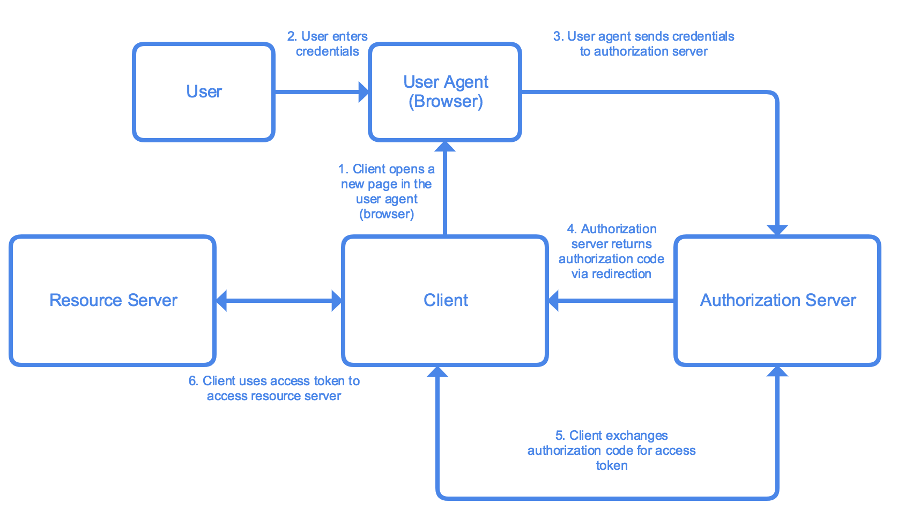

# Understanding OAuth2 and Deploy a Basic OAuth2 Authorization Service to Cloud Functions

This tutorial explains the basics of OAuth 2.0 and how to deploy an OAuth2 authorization service in [Node.js](https://nodejs.org/en/) to [Google Cloud Functions](https://cloud.google.com/functions/).

Google Cloud Functions is an event-driven serverless compute platform. It offers one of the simplest ways to run code in the cloud and provides developers with automatic scaling, high availability and fault tolerance. As a part of the computing solutions on Google Cloud Platform, your Cloud Functions can easily integrate with other Google Cloud services.

## Objectives

* Understand the basics of OAuth 2 and the architecture of the project
* Deploy the code to Cloud Functions

## Costs

This tutorial uses billable components of Google Cloud Platform, including

* Google Cloud Functions
* Google Cloud Datastore

Use the [Pricing Calculator](https://cloud.google.com/products/calculator/) to generate a cost estimate based on your projected usage. Depending on the actual usage, you might be eligible for [Google Cloud Free Tier](https://cloud.google.com/free/).

## Before You Begin

1. Select a project from [Google Cloud Console](https://console.cloud.google.com/). If you have never used Google Cloud Platform before, sign up or log in with your existing Google account, then follow the on-screen instructions to start using Google Cloud Platform.
1. [Enable billing](https://cloud.google.com/billing/docs/how-to/modify-project#enable_billing_for_a_project) for your account.
1. [Enable the Cloud Functions API](https://console.cloud.google.com/flows/enableapi?apiid=cloudfunctions&redirect=https://cloud.google.com/functions/quickstart).
1. [Install the Google Cloud SDK](https://cloud.google.com/sdk/).
1. Windows Developers Only: Install [cURL](https://curl.haxx.se/download.html).
1. Create the following entities in Cloud Datastore:

    a. Go to [Cloud Datastore Entities Page](https://console.cloud.google.com/datastore) in Google Cloud Console.
    b. Click **Create Entity**. Cloud Datastore may ask you to pick a location to store your data; select one of the locations and click **Next**.
    c. Type `user` for **Kind**.
    d. Click **Add Property**.
    e. Add a `String` type property `username` with the value `sample-user`. Click **Done**.
    f. Add a `String` type property `password` with the value `sample-password`. Click **Done**.
    g. Click **Create**.
    h. Repeat the steps above and create **5** `client` kind entities, with the following properties:

    | Property Name      | Property Type | Property Value           |
    |--------------------|---------------|--------------------------|
    | `client-id`        | `String`      | `sample-implicit-client` |
    | `implicit-enabled` | `Boolean`     | `true`                   |
    | `redirect-url`     | `String`      | `https://www.google.com` |

    | Property Name   | Property Type | Property Value         |
    |-----------------|---------------|------------------------|
    | `client-id`     | `String`      | `sample-ropc-client`   |
    | `ropc-enabled`  | `Boolean`     | `true`                 |
    | `client-secret` | `String`      | `sample-client-secret` |

    | Property Name   | Property Type | Property Value           |
    |-----------------|---------------|--------------------------|
    | `client-id`     | `String`      | `sample-ropc-client`     |
    | `ac-enabled`    | `Boolean`     | `true`                   |
    | `redirect-url`  | `String`      | `https://www.google.com` |

    | Property Name     | Property Type | Property Value          |
    |-------------------|---------------|-------------------------|
    | `client-id`       | `String`      | `sample-acpkce-client`  |
    | `acpkce-enabled`  | `Boolean`     | `true`                  |
    | `client-secret`   | `String`      | `https://www.google.com`|

    | Property Name   | Property Type | Property Value         |
    |-----------------|---------------|------------------------|
    | `client-id`     | `String`      | `sample-cc-client`     |
    | `cc-enabled`    | `Boolean`     | `true`                 |
    | `client-secret` | `String`      | `sample-client-secret` |

## Concepts

### OAuth 2.0

OAuth 2.0 ([RFC 6479](https://tools.ietf.org/html/rfc6479)) is a widely used authorization framework enabling applications to access resources in all kinds of services. More specifically, OAuth 2.0 allows arbitrary **clients** (for example, a highly trusted first-party mobile app or a less trusted third-party web app) to access user’s (**resource owner**’s) resources on **resource servers** via **authorization servers** in a secure, reliable, and efficient manner.

### Authorization Flows

OAuth 2.0 specification defines 4 types of authorization flows:

* Authorization Code
* Resource Owner Password Credentials
* Implicit
* Client Credentials

**Implicit** and **Client Credentials** are flows typically reserved for special types of clients:

| Client Type                                                                                                   | Flow               |
|---------------------------------------------------------------------------------------------------------------|--------------------|
| Single-page Javascript Web Applications (for example, [Google Fonts](https://fonts.google.com/))              | Implicit           |
| Non-interactive programs for machine-to-machine communications, such as background services and daemons | Client Credentials |

As for other clients, depending on their trustworthiness, they can use the following flows:

| Client Type         | Flow               |
|---------------------|--------------------|
| Highly trusted apps | Implicit           |
| Less trusted apps   | Client Credentials |

This tutorial deploys a basic authorization server supporting all of the four flows; you can, however, tailor the code and drop the support for some of them based on your use case.

#### Authorization Code

