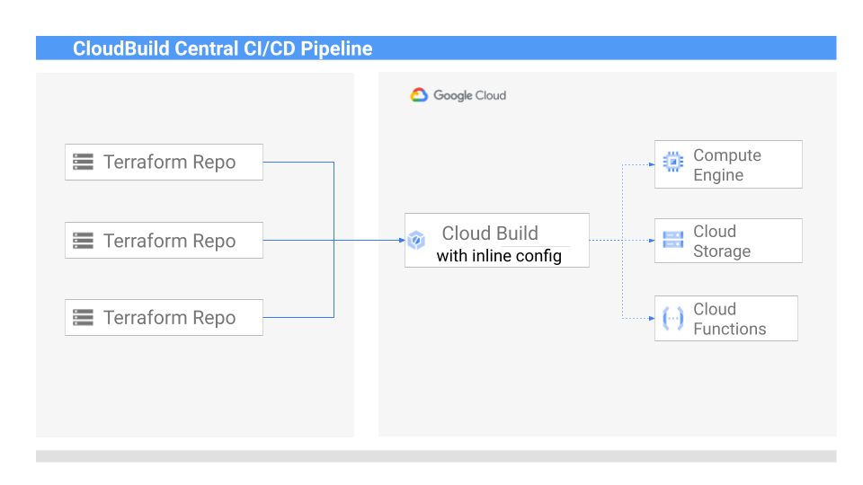

Grigory Movsesyan | Cloud Engineer | Google

Théo Chamley | Cloud Solutions Architect | Google

<p style="background-color:#CAFACA;"><i>Contributed by Google employees.</i></p>

### Objectives
In this tutorial, you build a centrally managed Cloud Build pipeline step by step. Using webhook triggers, you also trigger builds from a source code repository which is not natively supported by Cloud Build. You use GitLab in this tutorial, but you can apply the same principles to other source code repositories. \
One example of why a setup like this one is useful is a Terraform automation pipeline. Terraform typically uses powerful service accounts to apply changes to the infrastructure. In this scenario, you might want to control exactly which commands are executed in the pipeline, and therefore to keep the automation pipeline code separate from the Terraform code.

To achieve this result, you need a pipeline that follows these 4 steps:
1. When a developer pushes a code change to the repository, it triggers the build pipeline via a webhook.
2. The build pipeline receives the Git repo URL from the webhook event.
3. The build pipeline clones the Git repository.
4. The build pipeline applies the code changes.



### Costs
This tutorial uses the following billable components of Google Cloud:
*   Cloud Build
*   Cloud Storage
*   Secret Manager

To generate a cost estimate based on your projected usage, use the [pricing calculator](https://cloud.google.com/products/calculator).

When you finish this tutorial, you can avoid continued billing by deleting the resources that you created. For more details, see the [Cleaning up](https://docs.google.com/document/d/13y0xiRAJw0khwNcB7zQf66v5IERoZ7M-g8WmOBDLoxs/edit#heading=h.vzhuti8j369) section.

### Prerequisites
This tutorial uses a sample Git repository on gitlab.com. If you don’t already have an account on gitlab.com, create one for free: [GitLab.com Sign up](https://gitlab.com/users/sign_up).
If not already done, [Sign in GitLab.com](https://gitlab.com/users/sign_in).

### Before you begin
1. Select or create a Google Cloud project. In the Google Cloud Console, go to the [Manage resources page](https://console.cloud.google.com/cloud-resource-manager).
2. [Enable billing for your project](https://cloud.google.com/billing/docs/how-to/modify-project).
3. Open [Cloud Shell](https://console.cloud.google.com/?cloudshell=true).
4. In Cloud Shell, configure your project ID with the following command. Replace `[PROJECT_ID]` by your project ID. \
`gcloud config set project [PROJECT_ID]`
5. Enable the APIs needed for this tutorial.
    ```
    gcloud services enable \
        cloudbuild.googleapis.com \
        secretmanager.googleapis.com 
    ```
6. On GitLab.com, fork this [sample repository](https://gitlab.com/mogr/cloudbuild-webhooks) by clicking the **Fork** button.
    1. Select your personal namespace in the **Project URL** field.
    2. Select **Private** as Visibility level.
    3. Click **Fork project**.

### Create a webhook cloud build trigger
1. In the Google Cloud console, go to the [Triggers](https://console.cloud.google.com/cloud-build/triggers) page.
2. Click **Create Trigger.**
3. Enter “webhook-trigger” in the **Name** field.
4. Choose “Webhook event” for the **Event** field.
5. Choose “Create new” in the **Secret** field and click **Create Secret**.
6. Enter “webhook-trigger-secret” in the **Secret name** field and click **Create Secret**.
7. Click **Create**.

### Configure GitLab repository webhook
1. Go to the [Triggers](https://console.cloud.google.com/cloud-build/triggers) page.
2. Click on the “webhook-trigger” trigger.
3. Click on the **Show URL preview** link and copy the webhook URL.
4. On GitLab.com, click on **Settings** in your forked GitLab repository.
5. Click on **webhooks**.
6. Insert the URL copied on step 3 to the **URL** field.
7. Click on **Add webhook**.

You can learn more about creating webhooks in the official GitLab [documentation](https://docs.gitlab.com/ee/user/project/integrations/webhooks.html).

### Test the webhook
To test the new webhook, follow these steps:
1. In your GitLab repository, click **settings** then click **webhooks**.
2. At the bottom of the page, find **Project Hooks** block with the new webhook.
3. Next to your webhook, click on **Test** and choose **Push events**. \
This triggers the Cloud Build job.
4. Go to the [Cloud Build history page](https://console.cloud.google.com/cloud-build/builds) to see it running.
5. Find the build with “webhook-trigger” as **Trigger name** which is running or ran recently and click on it. You should see “hello world” in the build log.


### Get the repository URL from the push event
To be able to fetch the source code from the repository, you first need to get the repository URL from the [event payload](https://cloud.google.com/build/docs/configuring-builds/use-bash-and-bindings-in-substitutions#creating_substitutions_using_payload_bindings).
1. Go to the [Triggers](https://console.cloud.google.com/cloud-build/triggers) page in your gcp project.
2. Click on the “webhook-trigger” trigger.
3. In the **Configuration** block click on **Open editor**.
4. In the right panel modify the inline build config like this:
    ```
    steps:
      - name: ubuntu
        args:
          - echo
          - ${_GIT_REPO}
    substitutions:
      _GIT_REPO: $(body)
    ```
5. Click **Done** and then **Save**.
6. Trigger the Test push event from the GitLab repository again.
7. Go to the [Cloud Build history page](https://console.cloud.google.com/cloud-build/builds) to see your new job running.
8. Click on the new job. \
Instead of the “hello world” line, you should  see a json object with the content of the event payload. There are 2 fields of particular interest: **project.git\_http\_url** and **project.git\_ssh\_url**. In this tutorial we use a token for the authorisation, so we focus on the **project.git\_http\_url** field.
9. In the Cloud Build trigger configuration, modify the inline build config once again to display only the necessary field from the event payload:
    ```
    steps: 
      - name: ubuntu 
        args: 
          - echo 
          - '${_GIT_REPO}' 
    substitutions: 
      _GIT_REPO: $(body.project.git_http_url)
    ```
10. Trigger the Test push event from GitLab again. In the [Cloud Build history page](https://console.cloud.google.com/cloud-build/builds) you should see the line with the GitLab http url.  

### Cloning the GitLb repository
There are 2 ways to clone a GitLab repository. The first is to use an SSH key and the other is to use tokens. In this tutorial, we focus on cloning the repository using a token. You can find the implementation using SSH [here](https://cloud.google.com/build/docs/automating-builds/build-hosted-repos-gitlab).

To be able to clone the GitLab repository, you first need to create the GitLab deploy token. 
1. In GitLab, click on **settings** and then choose **Repository**.
2. Click on the **Expand** button next to **Deploy tokens**.
3. Type “cloudbuild” in the **Name** field.
4. Type “gitlab-token” in the **Username** field.
5. Select “read\_repository” in **Scopes**.
6. Click on the **Create deploy token** button.
7. Copy the token value. \
You can read more on creation of deploy tokens in GitLab [here](https://docs.gitlab.com/ee/user/project/deploy_tokens/). \
You can use the token to clone the repository with the following command: \
`git clone https://gitlab-token:<gitlab_token>@<git_url>`
8. Modify the Cloud Build Trigger inline config again, replacing `[GITLAB_TOKEN]` with actual value.
    ```
    steps: 
      - name: gcr.io/cloud-builders/git 
        args: 
          - '-c' 
          - 'git clone https://gitlab-token:[GITLAB_TOKEN]@${_REPO_URL}'
        entrypoint: bash 
    substitutions: 
      _GIT_REPO: $(body.project.git_http_url) 
      _REPO_URL: '${_GIT_REPO##https://}'
    ```
   The parameter **project.git\_http\_url** from the event payload already contains the protocol: **https://**<git\_url>. You need to insert the token after the protocol but before the actual URL. To achieve this, you remove the protocol from the string and then build the URL again using [bash parameter extension](https://cloud.google.com/build/docs/configuring-builds/use-bash-and-bindings-in-substitutions#bash_parameter_expansions).

9. Test the new Trigger config, trigger the test push event from GitLab. \
You should see the repository successfully cloned in the Build logs on the Build history page.

### Moving the GitLab token to Secret Manager
Storing the GitLab token in plain text in the inline Build config is against best practices. In this section, you move it to Google Cloud Secret Manager.
1. Go to the [Secret Manager page](https://console.cloud.google.com/security/secret-manager).
2. Click **Create secret**.
3. Type ”gitlab-token” in the **Name** field.
4. Copy the GitLab token in the **Secret value** field.
5. Click on the **Create secret** button to create the secret.

To access the secret value, the Cloud Build service account needs the secretmanager.versions.access permission. To give it:
1. Go to the [IAM & Admin page](https://console.cloud.google.com/iam-admin/iam).
2. Find the Cloud Build service account with the name <project\_number>@cloudbuild.gserviceaccount.com and click on **edit member** button.
3. Click on **Add another role** button.
4. Add the “Secret Manager Secret Accessor” role.
5. Click **save**.
6. Modify once again the Build inline config to read the token value from Secret Manager:
    ```
    steps: 
      - name: gcr.io/cloud-builders/git 
        args: 
          - '-c' 
          - 'git clone https://gitlab-token:$$GITLAB_TOKEN@${_REPO_URL} repo'
        entrypoint: bash
        secretEnv:
         - GITLAB_TOKEN
    substitutions:
      _GIT_REPO: $(body.project.git_http_url)
      _REPO_URL: '${_GIT_REPO##https://}'
    availableSecrets:
      secretManager:
        - versionName: 'projects/${PROJECT_ID}/secrets/gitlab-token/versions/latest'
          env: GITLAB_TOKEN
    ```
7. Test the new Build config by triggering a test push event from GitLab.

### Applying Terraform config

Up until now, you did not execute any code contained in the Git repository. In this section, you execute the repository’s Terraform code.
1. Create a Storage Bucket to store terraform state.
    1. Go to the [Cloud Storage page](https://console.cloud.google.com/storage/browser).
    2. Click on **Create bucket**.
    3. In the Name your bucket field enter “tf-state-<project\_id>” replacing the <project\_id> with your actual project\_id.
    4. Click on the **create** button.
2. Modify the inline Build config as shown below. \
    ```
    steps:
      - name: gcr.io/cloud-builders/git
        args:
          - '-c'
          - 'git clone https://gitlab-token:$$GITLAB_TOKEN@${_REPO_URL} repo'
        entrypoint: bash
        secretEnv:
          - GITLAB_TOKEN
      - name: hashicorp/terraform
        args:
          - init
          - '-backend-config=bucket=${_TF_BACKEND_BAUCKET}'
          - '-backend-config=prefix=${_TF_BACKEND_PREFIX}'
        dir: repo
      - name: hashicorp/terraform
        args:
          - plan
          - '-var=project=${PROJECT_ID}'
          - '-out=/workspace/tfplan-$BUILD_ID'
        dir: repo
      - name: hashicorp/terraform
        args:
          - apply
          - '-auto-approve'
          - /workspace/tfplan-$BUILD_ID
        dir: repo
    substitutions:
      _GIT_REPO: $(body.project.git_http_url)
      _REPO_URL: '${_GIT_REPO##https://}'
      _TF_BACKEND_BAUCKET: 'tf-state-${PROJECT_ID}'
      _TF_BACKEND_PREFIX: tf-state-prefix
    availableSecrets:
      secretManager:
        - versionName: 'projects/${PROJECT_ID}/secrets/gitlab-token/versions/latest'
          env: GITLAB_TOKEN
    ```
3. Trigger a test push event in your GitLab repository.
4. Go to [Cloud Storage](https://console.cloud.google.com/storage/browser) and observe that there is a bucket called `test-bucket-[project_id]`.

Now, whenever you push changes to the Terraform repository, you also trigger the Cloud Build pipeline which deploys changes to your project. If you decide to add another Terraform project to the same pipeline, you only need  to add a webhook to the repository.

### Cleaning up
You can clean up all the resources created in this tutorial by [shutting down the project](https://cloud.google.com/resource-manager/docs/creating-managing-projects#shutting_down_projects). However, if you used an existing project that contains resources other than the one created in this tutorial, you should remove the resources one by one instead:

1. In Cloud Shell set the PROJECT_ID env variable: \
`export PROJECT_ID=$(gcloud config get-value project)` 
2. Delete the cloud build trigger: \
`gcloud beta builds triggers delete webhook-trigger`
3. Delete the Cloud Secrets manager: \
```gcloud secrets delete webhook-trigger-secret```
```gcloud secrets delete gitlab-token```
4. Delete the IAM policy: \
`gcloud projects remove-iam-policy-binding ${PROJECT_ID} --member=serviceAccount:${PROJECT_ID}@cloudbuild.gserviceaccount.com --role=roles/secretmanager.secretAccessor`
5. Delete the Storage Buckets \
```gsutil rm -r gs://test-bucket-${PROJECT_ID}```
```gsutil rm -r gs://tf-state-${PROJECT_ID}```

##### Delete the Deploy token key from your repository
1. In GitLab, click on **settings** and then choose **Repository**.
2. Click on the **Expand** button next to **Deploy tokens**.
3. In the **Active deploy tokens** block find the “cloudbuild” and click on **Revoke**.

##### Delete the GitLab repository
1. In your GitLab repository, click **settings** then click **general**.
2. Click on the **Expand** button next to **Advanced**.
3. At the bottom of the page, click on **Delete project**.
4. Confirm deletion by typing the repoository name and clicking **Yes, delete project**.
