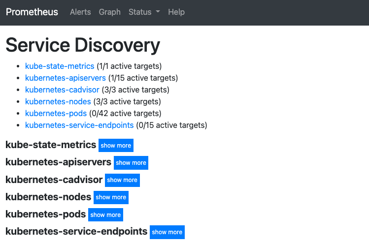
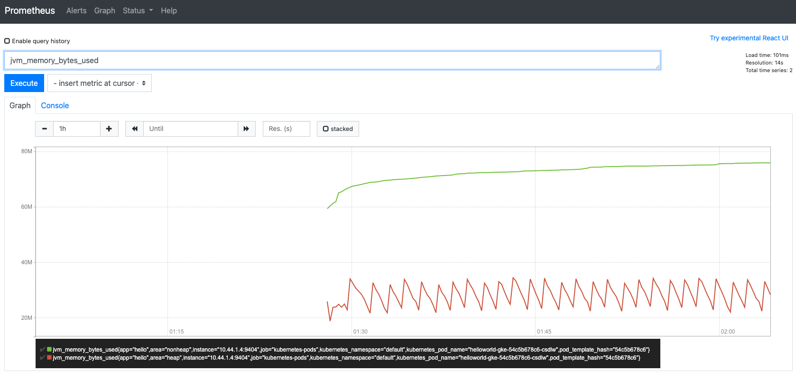
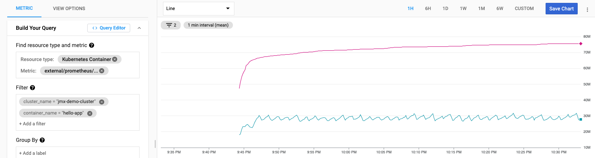

Xiang Shen | Solutions Architect | Google

<i>Contributed by Google employees.</i>

This tutorial describes how to use [Prometheus](https://prometheus.io/) and [Java Management Extensions(JMX](https://en.wikipedia.org/wiki/Java_Management_Extensions)) to monitor a Java application running on a [Google Kubernetes Engine](https://cloud.google.com/kubernetes-engine) cluster. You'll learn how to deploy Prometheus, enable JMX monitoring and view metric data in Google [Cloud Monitoring](https://cloud.google.com/monitoring). The tutorial is for developers and operators who want to have better observability of the Java metrics exposed by JMX.

## Objectives 

+   Deploy Prometheus on a Google Kubernetes Engine cluster.
+   Deploy a Java application with JMX enabled.
+   Configure the Cloud Monitoring Prometheus sidecar.
+   Visualize JVM metrics in Cloud Monitoring.

## Costs

This tutorial uses billable components of Google Cloud, including:

+   A [Google Kubernetes Engine](https://cloud.google.com/kubernetes-engine/pricing) cluster.
+   A [Cloud Load balancer](https://cloud.google.com/vpc/network-pricing#lb)
+   [Compute Engine](https://cloud.google.com/compute/pricing)
+   Chargeable [external metrics](https://cloud.google.com/stackdriver/pricing#metrics-chargeable)

To generate a cost estimate based on your projected usage, use the [Pricing Calculator](https://cloud.google.com/products/calculator#id=38ec76f1-971f-41b5-8aec-a04e732129cc).

## Before you begin

For this tutorial, you need a Google Cloud [project](https://cloud.google.com/resource-manager/docs/cloud-platform-resource-hierarchy#projects). You can create a new project or select a project that you have already created. When you finish this tutorial, you can avoid continued billing by deleting the resources that you created. To make cleanup easiest, you may want to create a new project for this tutorial, so that you can delete the project when you're done. For details, see the "Cleaning up" section at the end of the tutorial.

1.  [Select or create a Google Cloud project.](https://cloud.console.google.com/projectselector2/home/dashboard)
1.  [Enable billing for your project.](https://support.google.com/cloud/answer/6293499#enable-billing)
1.  [Enable the Kubernetes Engine, Container Registry, and Cloud Monitoring APIs.](https://console.cloud.google.com/flows/enableapi?apiid=containerregistry.googleapis.com,container.googleapis.com,monitoring.googleapis.com,cloudbuild.googleapis.com)
1.  Make sure that you have either a project [owner or editor role](https://cloud.google.com/iam/docs/understanding-roles#primitive_roles), or sufficient permissions to use the services listed above.

When you finish this tutorial, you can avoid continued billing by deleting the resources you created. See [Cleaning up](#heading=h.e6uzvad6vamz) for more detail.  

## Initializing common variables  
You need to define several variables that control where elements of the infrastructure are deployed.

1.  Open Cloud Shell that has **gcloud** installed and configured.
1.  Set the variables used in this tutorial. The tutorial sets the region to `us-east-1`. If you want to change the region, ensure that the zone values reference the region you specify.

        region=us-east1
        zone=${region}-b
        project_id=[YOUR_PROJECT_ID] 

1.  Run the following commands to set the default zone and project ID so you don't have to specify these values in every subsequent command:

        gcloud config set project ${project_id}
        gcloud config set compute/zone ${zone}

## Creating the GKE cluster

1. In Cloud Shell, create the GKE cluster:

        gcloud container clusters create jmx-demo-cluster \
        --zone ${zone} \
        --tags=gke-cluster-with-jmx-monitoring

2. Wait a few minutes until the cluster is successfully created. Ensure that the cluster's status is **RUNNING**. You can also run the following command to view the status:

        gcloud container clusters list

## Installing and configuring the Prometheus server

1. Clone the sample repository. The sample repository includes the Kubernetes manifests for Prometheus and the demo app that you will deploy:

        git clone https://github.com/xiangshen-dk/gke-prometheus-jmx.git

1. Change your working directory to the cloned repository:</li>

        cd gke-prometheus-jmx

1.  Create a dedicated namespace in the cluster for Prometheus:

        kubectl create namespace prometheus

1.  Create a Prometheus Kubernetes service account, a `ClusterRole` role, and a cluster role binding:

        kubectl apply -f clusterRole.yaml

1.  Create the Prometheus `configmap` to scrape metrics from apps running in the `GKE` cluster:

        kubectl apply -f config-map.yaml

Next task is to create the Prometheus server deployment. The manifest in the next step creates the Prometheus deployment with a single pod. The pod is composed of two containers: the Prometheus server container and Google's [Monitoring sidecar](https://github.com/Stackdriver/stackdriver-prometheus-sidecar). The Prometheus server container collects metrics from pods in the GKE cluster that are exporting Prometheus metrics. The server uses the Monitoring sidecar container to push metrics to Monitoring.

1.  Define environment variables used in the Prometheus deployment manifest:

        export KUBE_NAMESPACE=prometheus
        export KUBE_CLUSTER=jmx-demo-cluster
        export GCP_LOCATION=$zone
        export GCP_PROJECT=$(gcloud info --format='value(config.project)')
        export DATA_DIR=/prometheus
        export DATA_VOLUME=prometheus-storage-volume
        export SIDECAR_IMAGE_TAG=0.8.2
        export PROMETHEUS_VER_TAG=v2.19.3

1.  Apply the Prometheus deployment manifest by using the environment variables you defined:

        envsubst < prometheus-deployment.yaml | kubectl apply -f -

1.  Wait a few moments and confirm that the Prometheus pod is **Running**:

        kubectl get pods -n prometheus

> The output looks similar to the following:

    NAME                                     READY   STATUS    RESTARTS   AGE
    prometheus-deployment-6d76c4f447-cbdlr   2/2     Running   0          38s

## Inspect Prometheus on the GKE cluster

Using the Prometheus Kubernetes service account, Prometheus discovers resources that are running inside a GKE cluster. Some of these resources are already configured to export Prometheus metrics.

1. Set up port forwarding to the Prometheus server UI that's running in the GKE cluster:

        export PROMETHEUS_POD_GKE=$(kubectl get pods --namespace prometheus -l "app=prometheus-server" \
            -o jsonpath="{.items[0].metadata.name}")
        kubectl port-forward --namespace prometheus $PROMETHEUS_POD_GKE 8080:9090 >> /dev/null &

2. In Cloud Shell, click Web Preview at the top-right corner. Click Preview on port 8080. If the port is not 8080, click Change port, change the port to 8080, and then click Change and Preview. The Prometheus server UI is displayed.

3. In the Prometheus UI, click Status > Service Discovery. 

4. Click Status > Targets.

Targets are the HTTP(S) endpoints defined in resources that are exporting Prometheus metrics at regular intervals. You see various Kubernetes resources that are exporting metrics, for example, the Kubernetes API server exporting metrics from the /metrics HTTPS endpoint.

## Creating the test Java application

In this tutorial, you will create a Spring Boot HelloWorld application to test the configuration. If you want to learn more about the application, you can read the [quickstart for Java](https://cloud.google.com/kubernetes-engine/docs/quickstarts/deploying-a-language-specific-app#java_1).

1.  In Cloud Shell, create a new empty web project:

        curl https://start.spring.io/starter.zip \
            -d dependencies=web \
            -d javaVersion=11 \
            -d bootVersion=2.4.4.RELEASE \
            -d name=helloworld \
            -d artifactId=helloworld \
            -d baseDir=helloworld-gke \
            -o helloworld-gke.zip
        unzip helloworld-gke.zip

    cd helloworld-gke

1.  Update the `HelloworldApplication` class by adding a `@RestController` to handle the `/` mapping and return the response we need.

        cp ../HelloworldApplication.java src/main/java/com/example/helloworld/HelloworldApplication.java

1.  Create the Dockerfile. You can copy the example from the cloned repository:

        cp ../Dockerfile .

    If you open the Dockerfile, you can see we download the Prometheus [JMX_exporter ](https://github.com/prometheus/jmx_exporter)and run it as a java agent on port **9404**:

        # Run the web service on container startup.
        CMD ["java", "-javaagent:./jmx_prometheus_javaagent-0.15.0.jar=9404:config.yaml", \
            "-Djava.security.egd=file:/dev/./urandom", \
            "-Dcom.sun.management.jmxremote.ssl=false", \
            "-Dcom.sun.management.jmxremote.authenticate=false", \
            "-Dcom.sun.management.jmxremote.port=5555", \
            "-Dserver.port=${PORT}","-jar", \
            "/helloworld.jar"]

1.  Copy the config file for the JMX_exporter

        cp ../config.yaml .

    > In the JMX_exporter repository, there are more [configuration examples](https://github.com/prometheus/jmx_exporter/tree/master/example_configs) for common applications such as Tomcat, Spark, and Kafka. 

    > Also note, JMX is configured to use port 5555 and disabled authentication and SSL. If you need to change the setup, refer to the [JMX documentation](https://docs.oracle.com/en/java/javase/11/management/monitoring-and-management-using-jmx-technology.html).

1.  Build the container image using Cloud Build:

        gcloud builds submit --tag gcr.io/${project_id}/helloworld-gke .

1.  Deploy the `hellworld-gke` application to the GKE cluster:

        envsubst < ../helloworld-deployment.yaml | kubectl apply -f -

If you open the **helloworld-deployment.yaml** file, you can see that we use the annotations in the Deployment to let Prometheus know to scrape the metrics and on which port:

    # This file configures the hello-world app which serves public web traffic.
    apiVersion: apps/v1
    kind: Deployment
    metadata:
     name: helloworld-gke
    spec:
     replicas: 1
     selector:
       matchLabels:
         app: hello
     template:
       metadata:
         labels:
           app: hello
         annotations:
           prometheus.io/scrape: 'true'
           prometheus.io/port: '9404'
       spec:
         containers:
         - name: hello-app
           # Replace $GCLOUD_PROJECT with your project ID
           image: gcr.io/${GCP_PROJECT}/helloworld-gke:latest
           # This app listens on port 8080 for web traffic by default.
           ports:
           - containerPort: 8080
           env:
             - name: PORT
               value: "8080"
    ---
    apiVersion: v1
    kind: Service
    metadata:
     name: hello
    spec:
     type: LoadBalancer
     selector:
       app: hello
     ports:
     - port: 80
       targetPort: 8080

1.  View the status of the `helloworld-gke` pods:

    kubectl get pods

    Repeat this command until the output looks like the following, with the helloworld-gke pod running:

    NAME                              READY   STATUS    RESTARTS   AGE
    helloworld-gke-54c5b678c6-csdlw   1/1     Running   0          28s

1.  View the service is deployed:

    kubectl get services
    NAME         TYPE           CLUSTER-IP      EXTERNAL-IP    PORT(S)        AGE
    hello        LoadBalancer   10.47.242.246   34.73.69.237   80:31374/TCP   62s
    kubernetes   ClusterIP      10.47.240.1     <none>         443/TCP        37m

1.  When the external IP is provisioned, open a browser window using the external IP as the URL. For the above example you should use:

> [http://34.73.69.237](http://34.73.69.237)

> When the service is running, you will see the response `Hello World!`

## Viewing metrics in Prometheus UI

1.  In the Prometheus UI, view the exported JVM metrics. In the Expression field, type in the metric` jvm_memory_bytes_used` in the search field and click the **Graph** tab. You will see a graph similar to the following:

## Viewing metrics in Cloud Monitoring

Prometheus is configured to export metrics to Google Cloud's operations suite as [external metrics](https://cloud.google.com/monitoring/api/metrics_other#externalgoogleapiscom).  
To view these metrics:

1.  In the Cloud Console, select **[Monitoring**](https://console.cloud.google.com/monitoring).

    +   If it's your first time using Cloud Monitoring, you need to [create a workspace](https://cloud.google.com/monitoring/workspaces/create).

1.  In the Monitoring navigation pane, click **Metrics Explorer**.
1.  In the **Find resource type and metric menu**:

    +   Select **Kubernetes Container** (`k8s_container`) for the **Resource type**.
    +   For the **Metric** field, select one with the prefix `external/prometheus/`. For example, you might select `external.googleapis.com/prometheus/jvm_memory_bytes_used`

1.  In the following example, a filter was added to display the metrics for a specific cluster and a container. Filtering is useful when you have multiple clusters and many containers:

## Cleaning up

### Delete the project

The easiest way to eliminate billing is to delete the project you created for the tutorial.  
**Caution**: Deleting a project has the following effects:

+   **Everything in the project is deleted.** If you used an existing project for this tutorial, when you delete it, you also delete any other work you've done in the project.
+   **Custom project IDs are lost.** When you created this project, you might have created a custom project ID that you want to use in the future. To preserve the URLs that use the project ID, such as an **`appspot.com`** URL, delete selected resources inside the project instead of deleting the whole project.

If you plan to explore multiple tutorials and quickstarts, reusing projects can help you avoid exceeding project quota limits.

1.  In the Cloud Console, go to the **Manage resources** page.  
[Go to the Manage resources page](https://console.cloud.google.com/iam-admin/projects)
1.  In the project list, select the project that you want to delete and then click **Delete**     

1.  In the dialog, type the project ID and then click **Shut down** to delete the project.

### Delete the individual resources

If you don't want to delete the whole project, run the following command to delete the resources: 

    gcloud container clusters delete jmx-demo-cluster --zone us-east1-b

## You can delete the container images using the following steps:

1.  Go to the [Container Registry page](https://console.cloud.google.com/kubernetes/images/list).
1.  Click the **helloworld-gke** image, select all versions by marking the checkbox next to **Name**. 
1.  Click **DELETE** at the top of the page.

## What's next

+   Learn about [White-box app monitoring for GKE with Prometheus](https://cloud.google.com/solutions/white-box-app-monitoring-for-gke-with-prometheus).
+   Read about the [Cloud Monitoring integration with Prometheus](https://cloud.google.com/stackdriver/docs/solutions/gke/prometheus).
+   Learn about [Monitoring apps running on multiple GKE clusters using Prometheus and Cloud Monitoring](https://cloud.google.com/solutions/monitoring-apps-running-on-multiple-gke-clusters-using-prometheus-and-stackdriver).
+   Try out other Google Cloud features for yourself. Have a look at our [tutorials](https://cloud.google.com/docs/tutorials).