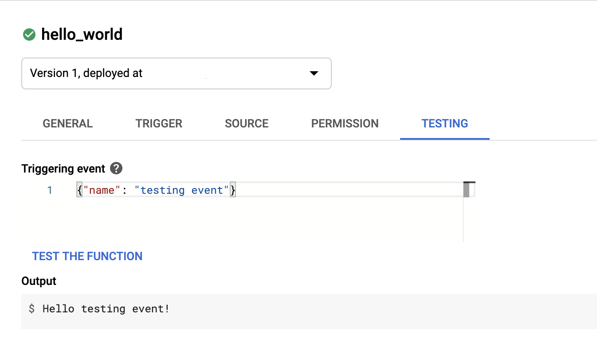

# Using Cloud Scheduler to invoke private Cloud Functions with OIDC

This tutorial shows you how to use Cloud Scheduler to invoke a private Cloud Function using HTTP targets and triggers and OIDC authentication.

Invoking a Cloud Function via authenticated HTTP that then performs an action is a common use case for Cloud Functions. Using Cloud Scheduler to schedule these invocations is a common use case for Cloud Scheduler. 

To use Cloud Pub/Sub as an intermediary, see the [Using Pub/Sub to trigger a Cloud Function tutorial](https://cloud.google.com/scheduler/docs/tut-pub-sub).  


## Objectives

You will:

*   create a Service Account with limited access,
*   create a Cloud Function that triggers on HTTP,
*   create a Cloud Scheduler job that targets a HTTP endpoint,
*   run the Cloud Scheduler job, and 
*   verify success of the job.

## Costs

This tutorial uses billable components of Cloud Platform, including:

*   [Cloud Functions](https://cloud.google.com/functions)
*   [Cloud Scheduler](https://cloud.google.com/scheduler)
*   [App Engine](https://cloud.google.com/appengine/docs/flexible/python)

Note: Cloud Scheduler is built on top of App Engine cron jobs. While the Scheduler UI and API decouples it from the App Engine product experience, it still requires App Engine enablement and configuration.

Use the [Pricing Calculator](https://cloud.google.com/products/calculator) to generate a cost estimate based on your projected usage.


## Before you begin

For the scope of this tutorial, it is recommended that you create a new project, so that all created resources can be easily deleted when the tutorial is complete. 

1. In the Cloud Console, on the project selector page, create a Cloud project. 
2. Make sure that billing is enabled for your Google Cloud project. [Learn how to confirm billing is enabled for your project.](https://cloud.google.com/billing/docs/how-to/modify-project)
3. Enable the Cloud Scheduler and Cloud Functions APIs: 
    *  [Enable the APIs](https://console.cloud.google.com/flows/enableapi?apiid=cloudscheduler.googleapis.com,cloudfunctions.googleapis.com)
4. Initialise an App Engine environment and choose its region:
    * `gcloud app create --project=[YOUR_PROJECT_ID]`
    * Follow the prompts

This tutorial can be completed using the Cloud Console, [Cloud Shell](https://cloud.google.com/shell/docs/launching-cloud-shell), or through a [local installation of gcloud](https://cloud.google.com/sdk/docs). 


## Get the source code

The function used in this tutorial prints “Hello world” in the function logs, and returns the formatted message.

This function is called from many different sources, so to ensure every type of invocation is handled, this example makes use of the [Flask's get_data() method](https://flask.palletsprojects.com/en/1.1.x/api/?highlight=get_data#flask.Request.get_data), decoding the data payload manually. If the data is valid JSON, the function returns a message using the value of the "name" given. If it is not available, it will default to “World”. If the payload is invalid, and error is returned.


### main.py

```python
import json

def hello_world(request):
    request = request.get_data()
    try: 
        request_json = json.loads(request.decode())
    except ValueError as e:
        print(f"Error decoding JSON: {e}")
        return "JSON Error", 400
    name = request_json.get("name") or "World"
    msg = f'Hello {name}!'
    print(msg)
    return msg
```


This example shows the Cloud Scheduler/Functions concepts in a simple proof-of-concept, but this architecture can be extended for more complex use cases, such as: 

*   [Sending Slack Notifications ](https://github.com/GoogleCloudPlatform/python-docs-samples/blob/62971f4b6263b42912a66be4ecb95800d8f7c78b/functions/billing/main.py#L54)
*   [Performing BigQuery batch processes](https://github.com/GoogleCloudPlatform/python-docs-samples/blob/6879d73123135459fa45a36211505d1ead37978a/bigquery/cloud-client/simple_app.py#L24)
*   [Run autoML jobs](https://github.com/GoogleCloudPlatform/python-docs-samples/blob/899cee82641d9ea6b97a7813283585ece2f8923d/automl/cloud-client/batch_predict.py)
*   [Running nightly tests](https://github.com/GoogleCloudPlatform/python-docs-samples/blob/master/functions/helloworld/sample_storage_test.py)
*   [Cleaning up GCS buckets ](https://github.com/GoogleCloudPlatform/python-docs-samples/blob/master/storage/cloud-client/storage_delete_file.py)


### Testing the function locally

This function can be tested on your local machine by using [Functions Framework](https://github.com/GoogleCloudPlatform/functions-framework-python). 

Install the package on your machine, then use it to target the `hello_world` method in your `main.py`: 

```shell
pip install functions-framework==1.5.0
functions-framework --target hello_world
```

The function will be made available at <code>[http://0.0.0.0:8080](http://0.0.0.0:8080).</code>

In a new terminal, use `curl` to send POST data to test the function: 

```shell
curl -d '{"name": "local function"}' http://0.0.0.0:8080
```

You should get the following result: 

```
Hello local function!
```

The terminal running functions-framework will show the logs for the invocation:

```
[2020-00-00 00:00:00 +0000] [23541] [INFO] Starting gunicorn 20.0.4
[2020-00-00 00:00:00 +0000] [23541] [INFO] Listening at: http://0.0.0.0:8080 (23451)
[2020-00-00 00:00:00 +0000] [23541] [INFO] Using worker: threads
[2020-00-00 00:00:00 +0000] [23543] [INFO] Booting worker with pid: 23456
Hello local function!
```

## Authentication architecture overview

In order to use a private Cloud Function, you need to send the request with sufficient authentication identification. Cloud Scheduler automates this for you by allowing you to specify multiple kinds of Auth Headers. An OpenID Connect (OIDC) token is the most general way to provide this.  By creating a service account that has the ability only to invoke functions, then assigning that as the identity of the function and as the OIDC service account, you can implement authentication scheduled invocation of your function.

See also 

*   [Authentication in Cloud Scheduler](https://cloud.google.com/scheduler/docs/http-target-auth#creating_a_scheduler_job_with_authentication)
*   [OpenID Connect (OIDC)](https://developers.google.com/identity/protocols/oauth2/openid-connect?_ga=2.188408680.1723942539.1591664285-164188851.1582751686)


## Deploying this example

To deploy this example, you will be creating a dedicated service account to serve as the identity for the function and scheduler, creating and testing a Cloud Function, and creating and testing a Cloud Scheduler job.


### Creating a Service Account

[Create a Service Account](https://cloud.google.com/iam/docs/creating-managing-service-accounts#creating), and assign the role to allow this service account to invoke Cloud Functions: 


```shell
gcloud iam service-accounts create myserviceaccount \
   --display-name "my service account"

gcloud projects add-iam-policy-binding ${PROJECT_ID} \
   --member serviceAccount:myserviceaccount@${PROJECT_ID}.iam.gserviceaccount.com \
   --role roles/cloudfunctions.invoker

```

### Creating a Cloud Function

Using the source code provided earlier, [deploy the Cloud Function](https://cloud.google.com/functions/docs/deploying/filesystem). 

Ensure that the previously recreated service account is [associated with this function](https://cloud.google.com/functions/docs/securing/function-identity#per-function_identity), and that unauthenticated access is disallowed:

```shell
gcloud functions deploy hello_world \
  --trigger-http \
  --region us-central1 \
  --runtime python37 \
  --service-account myserviceaccount@${PROJECT_ID}.iam.gserviceaccount.com \
  --no-allow-unauthenticated
```

### Testing the Function

Once the function is deployed it can be tested. Since the request must be authenticated, the most straightforward way of testing this function is in the Cloud Console. 

Go to the Cloud Console and navigate to the [Cloud Functions](https://console.cloud.google.com/functions) page. Find the [hello_world function](https://console.cloud.google.com/functions/details/us-central1/hello_world), and click on the [Testing tab](https://console.cloud.google.com/functions/details/us-central1/hello_world?tab=testing).

In the "Triggering event" field, enter valid JSON that contains a name key and a value: 

```
{"name": "testing event"}	
```

Press the "Test the function" button. Confirm the result is "Hello testing event!".



### Creating a scheduled job

[Create a scheduled job](https://cloud.google.com/scheduler/docs/creating#creating_jobs) to invoke the Cloud Function previously created, using the Service Account previously created. 

Based on the use case, you need to ensure the following settings are configured: 

*   Target: HTTP
*   URL: the URL of the cloud function deployed earlier
*   HTTP Method: POST
*   BODY:  `{"name": "Foo"}`
*   Auth Header: Add OIDC token
*   Service account: the service account created earlier.

This is an example invocation for an hourly job: 

```shell
gcloud scheduler jobs create http my-hourly-job \
  --description "Call my function hourly" \
  --schedule "0 * * * *" \
  --time-zone "Australia/Sydney" \
  --uri "https://${REGION}-${PROJECT_ID}.cloudfunctions.net/hello_world" \
  --http-method POST \
  --oidc-service-account-email myserviceaccount@${PROJECT_ID}.iam.gserviceaccount.com \
  --message-body '{"name": "Scheduler"}'
```

You can confirm the job was created by checking the Cloud Scheduler section of the Console, or by listing the active jobs: 

```shell
gcloud scheduler jobs list
```

### Invoking a Cloud Function from a scheduled job

In order to test the configurations made without having to wait for the next scheduled invocation, the Scheduled job can be triggered ad-hoc by clicking the "Run Trigger" button on the scheduled job listing in the Cloud Console, or in the terminal: 

```shell
gcloud scheduler jobs run my-hourly-job
```

This command will return no output. 


## Checking success

The Cloud Functions logs can be checked either in the Console in [Cloud Logging](https://console.cloud.google.com/logs/viewer?&resource=cloud_function%2Ffunction_name%2Fhello_world%2Fregion%2Fus-central1), or in the terminal: 

```shell
gcloud functions logs read hello_world
```

You should see something similar to the following: 

```
LEVEL  NAME         EXECUTION_ID  TIME_UTC                 LOG
D      hello_world  rndmid64qasr  2020-00-00 00:00:00.000  Function execution started
I      hello_world  rndmid64qasr  2020-00-00 00:00:00.000  Hello Scheduler!
D      hello_world  rndmid64qasr  2020-00-00 00:00:00.000  Function execution took 16 ms, finished with status code: 200
```

Checking the logs again on the hour should show the scheduled event occurred, and successfully ran. 

## Cleaning up

To avoid incurring charges to your Google Cloud Platform account for the resources used in this tutorial, delete the project created specifically for this tutorial. 

In the Cloud Console, go to the Manage resources page.

1. Go to the Manage resources page
2. In the project list, select the project that you want to delete and then click Delete delete.
3. In the dialog, type the project ID and then click Shut down to delete the project.


## What's next

*   [Writing Cloud Functions](https://cloud.google.com/functions/docs/writing)
*   [Configuring Scheduled jobs](https://cloud.google.com/scheduler/docs/configuring/cron-job-schedules)
*   [Scheduler authentication with HTTP Targets](https://cloud.google.com/scheduler/docs/http-target-auth)
