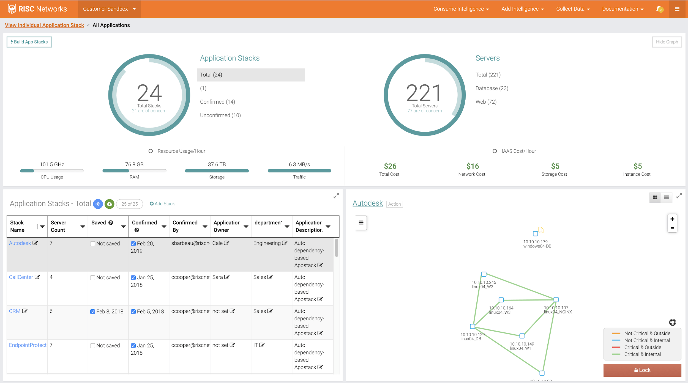
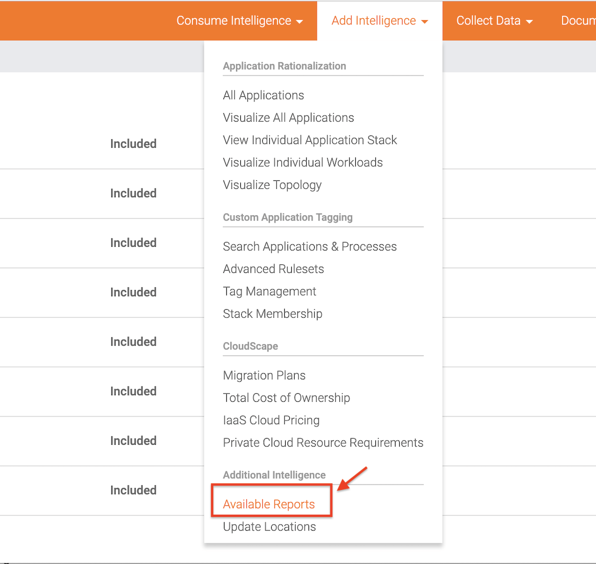
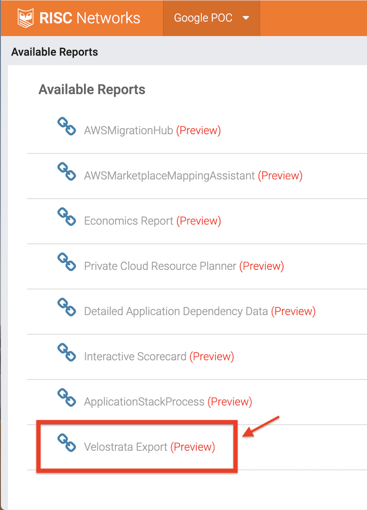

This article walks you through a VMware to Google Cloud Platform (GCP) migration
from planning to completion. Integrations between GCP, RISC Networks (now
[Flexera](https://www.flexera.com/about-us/press-center/flexera-acquires-risc-networks.html)),
and Migrate for Compute Engine (formerly Velostrata) enable you to export your
plans directly into the Migrate for Compute Engine UI.

## Prerequisites

This tutorial assumes that you have a Migrate for Compute Engine environment set
up on GCP. For more information, see
[Getting started with Migrate for Compute Engine (formerly Velostrata)](https://cloud.google.com/velostrata/docs/getting-started)
and
[Overview of on-premises to GCP migrations](https://cloud.google.com/velostrata/docs/how-to/migrate-on-premises-to-gcp/overview).

## Creating a RISC Networks

Please follow the steps below to get started:

### Sign up and register

Go to RISC networks to sign up and register at
[https://portal.riscnetworks.com/register.php](https://portal.riscnetworks.com/register.php)

### Create an Assessment

Once registered, login to the [RISC Networks Portal](https://portal.riscnetworks.com/)
and follow the directions to create an Assessment. Copy down the bootstrap code for later
use. For more information, see this _[video_](https://www.youtube.com/watch?v=GESZAjhjiJI).

## Discovery

In this section, you will install and configure the RN150 virtual appliance.

### Deploy the RN150 on-premises

The RISC Networks RN150 virtual appliance handles discovery. From the RISC
Network portal, download the zip file that contains the RN150. Unzip the file.
Next, install the OVF template extracted from the zip file using VMware Player
or vSphere vCenter. For more information, see this
_[video_](https://www.youtube.com/watch?v=GsunC6IaAq4)

### Sign In to the RN150

If you have not done so already, start the VM from the OVF template. Open your
web browser and open the IP of the RN150. Sign in with your RISC networks login
and accept the license.  For more information, see this
_[video_](https://www.youtube.com/watch?v=X8XjSPSlq48)  
Next, provide the bootstrap code from the RISC Networks portal. Click Verify
Key. When asked if you will use Flex Deploy, click No. Click the Dashboard
button to return to the dashboard. For more information, see this
_[video_](https://www.youtube.com/watch?v=wXYykCxrqbs)

### Enter Subnet Information

You are now ready to populate subnets that RISC Networks will scan for assets.
From the Dashboard, click **Subnets**. Here you can populate subnets manually,
from a routing table discovered using SNMP, or from a CSV file.

#### Adding Manually

To add subnets manually:

1. Enter the subnet information into the **Subnet** field
1. Select the **Subnet Mask.**
1. Click **Add**

#### Discovering subnets with SNMP

To discover subnets with SNMP:

1. Click **Populate from Routing Table**

1. Select if you will use SNMP v1/2 or v3
1. Enter the IP of the device that you will discover the routing table from.
1. Enter the **credentials** for your SNMP version

When the subnets have been added, enable them leftmost column in the list.  
For more information, see this
_[video_](https://www.youtube.com/watch?v=csF1dOtb4nE)

### Enter SNMP Information

RISC Networks can scan the routing tables of SNMP devices for their inclusion in
your migration. For more information, see this
_[video_](https://www.youtube.com/watch?v=uJPPZwxHLLY)

### Enter Windows credentials

To properly discover what workloads are running on Windows machines, you can
enter Windows Credentials. To enter the credentials:

1. From the Dashboard, click **Windows**.
1. Enter a **Domain**, **Username**, and **Password**.
1. Enable `netstat` do discover network dependencies from VMs
1. Click **Validate Credential** and enter an **IP address** of a Windows
   host. RISC Networks will connect and attempt to run `netstat`. A validation
   screen appears.
1. If the validation is successful, click **Add Credential.**

Note: After adding credentials, you must rescan to inventory your Windows
resources.  
For more information, see this
_[video_](https://www.youtube.com/watch?v=Lj7Op7xRyKI)

### Enter VMWare credentials

Adding VMware credentials enables RISC Networks to scan VMware for information
on your hosts:

1. From the Dashboard, click **VMware**.
1. Add the **vCenter IP**, **Port**, **Username**, and **Password**.
1. Click **Add.** A new dialog box appears asking if you would like to test
    the credentials. Click **Test.** If the test is successful, click **OK**.

For more information, see this
_[video_](https://www.youtube.com/watch?v=jzIrWKn6UOQ)

### Enter SSH credentials

Adding SSH credentials enables RISC Networks to scan Linux and Unix hosts for
information.

1. From the Dashboard, click **SSH**.
1. Enter a **Username**,
1. Choose an **Auth Type** (password or publickey),
1. If you are using password authentication, enter the user's **Password**.
1. If you are using publickey authentication, paste the **Public Key.**
1. Set **Priviledge Elevation** if you would like RISC networks to use
    `sudo` on the host.

For more information, see this
_[video_](https://www.youtube.com/watch?v=_FTOzaB9oqQ)

### Start Assessment

You are now ready to continue your assessment From the Dashboard, click the
**Start Assessment** or **Request Rescan** button. This step may take several
hours based on the number of assets or complexity of the environment. You will
receive an email when the discovery process is complete.

## Review Assets

When the assessment is completed, your results will be available on the [RISC
Networks Portal](https://portal.riscnetworks.com). Here you will be able to see
all the assets discovered in step #4.  For more information, see this
_[video_](https://www.youtube.com/watch?v=uPBsTa2F2Gc).

## Migrating

You are now ready to plan a migration using the information collected by the
RN150 on your network.

### License devices for data collection

In this step, you tag only those assets which you would like to collect additional data
from for planning. Select the servers you would like to collect data from, line by line, using the
check box.

For more information, see this
_[video_](https://www.youtube.com/watch?v=nYCEaXwvl1w)  
After you have collected data for two to four weeks, RISC Networks can
automatically determine the dependencies of your applications for planning your
migration.

### Build Application Stacks

Application Stacks are groups of servers that depend on one another. In this
section, you will build Application Stacks based on the information collected by
the RN150.  
A full description of the Application Stacks feature is available in this
_[video_](http://www.youtube.com/watch?v=2UHYGso_BKc).

## Export Application Stacks

To export an Application Stack  to Migrate for Compute Engine using  Run Book
Export

1. Sign in to the [RISC Portal](https://portal.riscnetworks.com),
1. Click the **Add Intelligence** dropdown, then click** Available Reports.**

1. Click **Velostrata Export**

1. Select the application stack from the dropdown.
1. Fill out any missing entries.
1. Once you are ready to download csv, click Save
1. Click Export CSV
1. The CSV is downloaded. Note the file location to upload it to Migrate
    for Compute Engine (formerly Velostrata).

### Next Steps

Continue with the
[Wave](https://cloud.google.com/velostrata/docs/how-to/organizing-migrations/overview) process
on your Velostrata (whose new name is Migrate for Compute Engine) Manager:

1. [Create a Wave](https://cloud.google.com/velostrata/docs/how-to/organizing-migrations/creating-new-waves)
   from the CSV.
1. [Add Jobs](https://cloud.google.com/velostrata/docs/how-to/organizing-migrations/creating-aborting-jobs)
    to that wave
1. [Monitor the progress](https://cloud.google.com/velostrata/docs/how-to/organizing-migrations/monitoring-waves-runbooks-jobs)
   of your waves.
