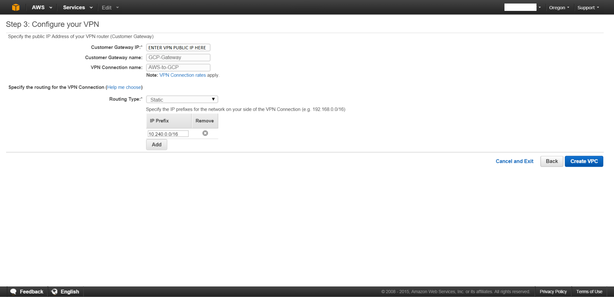

# Google Cloud VPN Interop Guide

Using Cloud VPN With Amazon Web ServicesTM Virtual Private Gateway

# 

#  


# 

_Disclaimer: This interoperability guide is intended to be informational in nature and are examples only. Customers should verify this information via testing._

Amazon Web Services, AWS, and the "Powered by Amazon Web Services" logo are trademarks of Amazon.com, Inc. or its affiliates in the United States and/or other countries.

# Contents

- [Contents](#contents)
- [Introduction](#introduction)
- [Topology](#topology)
- [Preparation](#preparation)
   - [Overview](#overview)
   - [Getting Started](#getting-started)
   - [IPsec Parameters ](#ipsec-parameters)
- [IPsec VPN Using Static Routes](#ipsec-vpn-using-static-routes)
   - [Reserve an external static IP address for GCP](#reserve-an-external-static-ip-address-for-gcp)
   - [Configuration - AWS](#configuration---aws)
      - [Creating the AWS VPC Network](#creating-the-aws-vpc-network)
      - [Configuring the AWS VPN](#configuring-the-aws-vpn)
   - [Configuration - GCP UI](#configuration---gcp-ui)
   - [Configuration - GCP gcloud CLI](#configuration---gcp-gcloud-cli)
      - [Reserving an External Static IP Address using the gcloud CLI](#reserving-an-external-static-ip-address-using-the-gcloud-cli)
      - [Creating the Cloud VPN Gateway](#creating-the-cloud-vpn-gateway)
      - [Creating Forwarding Rules](#creating-forwarding-rules)
      - [Creating the VPN Tunnels ](#creating-the-vpn-tunnels-)
- [IPsec VPN Using Cloud Router](#ipsec-vpn-using-cloud-router)
   - [Configuration - AWS](#configuration---aws)
      - [Creating the VPC Network](#creating-the-vpc-network)
      - [Configuring the VPN](#configuring-the-vpn)
   - [Configuration - GCP](#configuration---gcp)
      - [Configuring the VPN Tunnel](#configuring-the-vpn-tunnel)
      - [Configuring the Cloud Router](#configuring-the-cloud-router)
   - [Configuration - Google Cloud Router CLI](#configuration---google-cloud-router-cli)
      - [Reserving a static external IP address](#reserving-a-static-external-ip-address)
      - [Creating the VPN gateway](#creating-the-vpn-gateway)
      - [Creating the Cloud Router](#creating-the-cloud-router)
      - [Creating the VPN Tunnels ](#creating-the-vpn-tunnels)
      - [Adding the BGP Link Local Interface ](#adding-the-bgp-link-local-interface)
      - [Adding the BGP Peering Session](#adding-the-bgp-peering-session)
- [Testing the Site-to-Site VPN](#testing-the-site-to-site-vpn)
   - [Verifying Connectivity](#verifying-connectivity)
   - [Testing the VPN Tunnel](#testing-the-vpn-tunnel)
   - [Troubleshooting](#troubleshooting)

# Introduction

This guide walks you through the process of configuring the AWS Virtual Private Gateway for integration with the [Google Cloud VPN service](https://cloud.google.com/compute/docs/vpn/).  This information is provided as an example only.  If you are using this guide to configure your AWS implementation, be sure to substitute the correct IP information for your environment.

# Topology

This guide describes the following VPN topologies:  

-  A site-to-site Route based IPsec VPN tunnel configuration. 
-  A site-to-site IPsec VPN tunnel configuration using the Google Cloud Router and dynamic routing with the BGP protocol.


# Preparation

## Overview

NOTE: The configuration samples in this guide include numerous value substitutions provided only as examples.  When following this guide, replace any references to IP addresses, device IDs, shared secrets, keys, account information, or project names should be replaced with the appropriate values for your environment.

This guide assists you in the creation of IPsec connectivity from AWS to the Google Cloud. The following is a high-level overview of the configuration process:

1. Configure the Amazon Virtual Private Gateway
1. Configure the Amazon Customer Gateway
1. Configure the Google Cloud Platform VPN
1. Set up the VPN Connection
1. Connect to GCP
1. Test the tunnel

## Getting Started

The first step is to establish the base networking environment in AWS, which is called the Virtual Private Cloud (VPC).   Amazon provides [documentation](http://aws.amazon.com/documentation/vpc/) for getting started with AWS networking.  The basic concepts to understand are:

-  **Virtual Private Cloud **– a customer-defined private network space in AWS.  
-  **Virtual Private Gateway** – the VPN concentrator on the Amazon side of the VPN connection.
-  **Customer Gateway** – an AWS reference to the remote IPsec endpoint.  In this case, the Google Cloud Platform VPN gateway.

## IPsec Parameters 

This table covers IPsec parameters to use when configuring VPN gateways and tunnels as described in this document._ _The IPsec connectivity covered in this guide uses the** pre-shared key** generated by AWS for authentication. AWS only supports IKEv1. Detailed GCP-supported IKEv1 ciphers can be found [here.](https://cloud.google.com/vpn/docs/concepts/advanced#supported_ike_ciphers)

<table>
<thead>
<tr>
<th><strong>Parameter</strong></th>
<th><strong>Value</strong></th>
</tr>
</thead>
<tbody>
<tr>
<td>IPsec Mode</td>
<td>ESP+Auth Tunnel mode (Site-to-Site)</td>
</tr>
<tr>
<td>Authentication Protocol</td>
<td>Pre-shared Key</td>
</tr>
<tr>
<td>Key Exchange</td>
<td>IKEv1</td>
</tr>
<tr>
<td>Perfect Forward Secrecy (PFS)</td>
<td>on</td>
</tr>
</tbody>
</table>

# IPsec VPN Using Static Routes

## Reserve an external static IP address for GCP

The AWS VPN configuration requires a remote VPN gateway IP address in advance. Reserve a static external IP address by selecting **External IP addresses** option under the [VPC networks menu](https://console.cloud.google.com/networking/addresses/list) option as shown below.


## Configuration - AWS

For this exercise, create a new VPC network and subnet configuration using the AWS **VPC Wizard** to connect to Google Cloud Platform. The VPC Wizard steps through the creation and configuration of a new VPC network.

### Creating the AWS VPC Network

To get started, log in to the AWS Management Console and select **VPC** from the main services menu.  New AWS accounts all have a default VPC.  


### 

The first step is to select an IP subnet topology.  There are options for various combinations of private and public IP addressing, with or without VPN connectivity.  Once selected, this configuration cannot be changed.  For this test environment select **Private Subnet Only VPC with Hardware VPN Access**:


The next step is to configure the VPC settings:


Configure the following required settings:

-  **IP CIDR Block**: this is the CIDR block for the VPC.  It cannot be changed once set.  For this test configuration, enter **10.0.0.0/16.**
-  **VPC Name**: this is the name of the VPC network.  For this test, enter **GCP-Test**
-  **Private Subnet**: this is the first subnet allocated from the private IP CIDR block used for AWS services, including EC2.  Enter **10.0.1.0/24 **which is the network on the AWS side that we want to connect to GCP.
-  **Availability Zone**: this is the AWS Availability Zone into which the VPC will be deployed.  We will leave this set to **no preference.**
-  **Private Subnet Name**: this is a friendly name for the private subnet. Set this to **AWS-VPC.**
-  **S3 Endpoint(not required)**: EC2 to S3 connectivity requires a public network link.  This option deploys an S3 API gateway endpoint into the selected private subnet.  This exercise does not require an S3 endpoint.
-  **Enable DNS Hostnames**: this option enables an automatic DNS hostname assignment via DHCP for the private subnet.  We will leave DNS hostnames enabled.
-  **Hardware Tenancy**: this option allows you to select a dedicated instance type for the VPN gateway.  Use the default option.

After completing the form, click **Next** to proceed to Step 3.

### Configuring the AWS VPN

Enter the reserved GCP external IP address in the **Customer Gateway IP** field.


In addition to the Customer Gateway IP, enter a **Customer Gateway name** and a **VPN Connection name**.

Next, choose a **Routing Type** for the VPN connection.  This configuration uses a **Static route** type VPN so select **Static**.  Enter the Google Cloud Platform subnet CIDR block under **IP Prefix** and click **Add**: 



When all required configuration is completed, click **Create VPC** to create the new VPC and finish the Wizard.  VPC creation takes a minute or two to complete.  Once completed, the management console status is updated to show successful creation of the VPC.


Select the newly created VPC from the VPC Dashboard in order to collect the configuration detail required to complete the [GCP configuration](#heading=h.25npjme3proz):


The last step is to collect the IP addresses of the AWS Virtual Gateway and the pre-shared keys used for IKE authentication that are automatically generated by AWS.  This information is stored in the _configuration file_ which you can download by clicking **Download Configuration**.  Although several device-specific options are available for the file configuration format,for GCP, select **Generic**:


The configuration file is an ASCII text file.  Within the file, the auto-generated pre-shared key is listed under **Pre-Shared Key**.  

A sample configuration file is provided below for reference. 

NOTE:  AWS creates two VPN tunnels under "VPN connections" and there are two sets of VPN parameters listed in the sample configuration file, one set for each tunnel.  These parameters need to match the tunnel parameters on the GCP side that will be configured later in this document:

```
Amazon Web Services
Virtual Private Cloud

VPN Connection Configuration
================================================================================
AWS utilizes unique identifiers to manipulate the configuration of 
a VPN Connection. Each VPN Connection is assigned a VPN Connection Identifier 
and is associated with two other identifiers, namely the 
Customer Gateway Identifier and the Virtual Private Gateway Identifier.

Your VPN Connection ID		         : vpn-c1c6d9d3
Your Virtual Private Gateway ID          : vgw-f670afe8
Your Customer Gateway ID    		 : cgw-3548972b
		
A VPN Connection consists of a pair of IPSec tunnel security associations (SAs). 
It is important that both tunnel security associations be configured. 

IPSec Tunnel #1
================================================================================
#1: Internet Key Exchange Configuration
		
Configure the IKE SA as follows
  - Authentication Method    : Pre-Shared Key 
  - Pre-Shared Key           : auto-generated-pre-shared-key
  - Authentication Algorithm : sha1
  - Encryption Algorithm     : aes-128-cbc
  - Lifetime                 : 28800 seconds
  - Phase 1 Negotiation Mode : main
  - Perfect Forward Secrecy  : Diffie-Hellman Group 2
```

> 
## Configuration - GCP UI

In the Google Cloud Platform Console, either select the GCP project into which the VPN will be deployed, or create a new project.  More information on creating and managing projects can be found [here](https://cloud.google.com/compute/docs/projects).    
To create a new VPN , click on the main services menu located at the top left corner in the Console. Under **Networking**, select **[Hybrid Connectivity **and** VPN**](https://console.cloud.google.com/vpn/list):


In GCP, all projects start with a single auto mode network named _default_ at the time of project creation.  This default network is configured with a private IP address space and a set of base firewall rules.  This network provides a sufficient starting point for creating a site-to-site IPsec VPN as long as the CIDR address range on the AWS side doesn't overlap the GCP address range.  More information on networking within the Google Cloud Platform can be found in the [Networking section](https://cloud.google.com/compute/docs/networking) of Google Cloud Platform documentation.

To configure the AWS side of the VPN, two values are needed from GCP:

-  **Customer Gateway IP Address**: the public IP address of the VPN gateway in Google Cloud.
-  **Routing Type/IP Prefix**: the private IP address space associated with the Google Cloud Platform Network.

The address space is shown in the GCP console network overview. For this example configuration, the address space is 10.240.0.0/16:


To get the customer gateway IP address, create a Google Cloud VPN gateway.  From the **Hybrid Connectivity **menu, [select VPN and click Create:](https://console.cloud.google.com/vpn)


Configure the following options for the GCP VPN Gateway :

-  **Name**: a representative name for the VPN connection (must be lowercase)
-  **Description**: (optional) free form text describing the gateway
-  **Network**: the network to which the VPN gateway will be attached
-  **Region**: the region into which the VPN gateway will be deployed
-  **IP address**: a previously-reserved static public IP address to  assign to the VPN gateway.

Since each GCP VPN gateway can terminate multiple VPN tunnels, specify the parameters for each tunnel in the console fields.  

Enter the AWS Virtual Private Gateway IP in the a **Remote peer IP address** field and the pre-shared key in the **Shared Secret** field. Use the IP address collected from the [Configuration - AWS section](#heading=h.opqse2rmnkz6). Set the IKE version to IKEv1, since AWS is only supports this IKE version.

Under the section **Routing Options**, select the **Route-Based** tab, and enter the AWS network ranges as **Remote network IP ranges** . The Remote Network IP Ranges should include both the VPC CIDR block as well as any configured subnets.  

Since AWS requires two tunnels per VPN connection for redundancy, create an additional tunnel for the same GCP VPN gateway by clicking **Add Tunnel** to specify parameters for additional tunnels, including a different name and IP address than those used for Tunnel 1.  Click on **Create** to create the VPN gateway and tunnels that were specified.


Verify that the VPN gateway has been created and the connection to the AWS GCP-Test VPN has been established by looking at the tunnel status as shown below.


## Configuration - GCP gcloud CLI

Cloud VPN can also be configured using the [gcloud command line tool](https://cloud.google.com/sdk/gcloud/).  Command line configuration requires two steps. First, create the Cloud VPN gateway, then create the tunnels used by the gateway. 

### Reserving an External Static IP Address using the gcloud CLI

Reserve an external static IP address in the Google Cloud Platform network and region where the VPN gateway was created. Make a note of the address created for use in future steps.  
  
`gcloud compute addresses create vpn-static-ip --project **vpn-testing /** `

```
  --region us-central1

### Creating the Cloud VPN Gateway

To create a Cloud VPN gateway, enter the following command:
gcloud compute target-vpn-gateways create gcp-to-aws / 
  --network default --region us-central1
```

### Creating Forwarding Rules

To create the three forwarding rules for the project's network forwarded through the gateway, enter the following commands.

NOTE: the GCP console creates these rules automatically.
```
gcloud compute forwarding-rules create gcp-to-aws-rule-udp4500 / 
  --address gcp-static-ip  --ip-protocol UDP --ports 4500 / 
  --region us-central1 --target-vpn-gateway gcp-to-aws

gcloud compute forwarding-rules create gcp-to-aws-rule-udp500 / 
  --address gcp-static-ip --ip-protocol UDP --ports 500 / 
  --region us-central1 --target-vpn-gateway gcp-to-aws

gcloud compute forwarding-rules create gcp-to-aws-rule-esp / 
  --address gcp-static-ip --ip-protocol ESP / 
  --region us-central1 --target-vpn-gateway gcp-to-aws
```

### Creating the VPN Tunnels 

Since AWS requires two VPN tunnels for redundancy,  perform the following step for each tunnel. For tunnel 2, change the peer-address to a second on-premises IP address and the name to another unique name.  
  

```
gcloud compute vpn-tunnels create gcp-to-awstunnel1 / 
  --peer-address on-prem-IP-1 --ike-version 1 / 
  --shared-secret SharedSecretGeneratedbyAWS / 
  --target-vpn-gateway gcp-to-aws / 
  --local-traffic-selector gcp-CIDR / 
  --remote-traffic-selector on-prem-CIDR
```

# IPsec VPN Using Cloud Router

## Configuration - AWS

### Creating the VPC Network

Although new AWS accounts all have a default VPC network, for this exercise, create a new VPC network to connect to the Google Cloud Platform VPN gateway.  


### 

The first step is to select an IP subnet topology.  There are options for various combinations of private and public IP addressing, with or without VPN connectivity.  Once selected, the option cannot be changed.  For the test environment, **Select** a **Private Subnet Only VPC with Hardware VPN Access**:


The next step is to configure the VPC settings:


Configure the following required settings: 

-  **IP CIDR Block**: this is the CIDR block for the VPC network.  It cannot be changed once set.  For this test, enter **10.0.0.0/16**
-  **VPC Name**: this is the name of the VPC network.  For this test, enter **GCP-Test**
-  **Private Subnet**: this is the first subnet allocated from the private IP CIDR block used for AWS services, including EC2.  Enter **10.0.1.0/24 **which is the network on the AWS side that we want to connect to GCP.
-  **Availability Zone**: this is the AWS Availability Zone into which the VPC network will be deployed.  Leave this set to **no preference.**
-  **Private Subnet Name**: a friendly name for the private subnet. Set this to **AWS-VPC.**
-  **S3 Endpoint**: (not required) EC2-to-S3 connectivity requires a public network link.  This option deploys an S3 API gateway endpoint into the selected private subnet.  This exercise will not require an S3 endpoint.
-  **Enable DNS Hostnames**: this option enables automatic DNS hostname assignment by  DHCP for the private subnet.  Leave DNS hostnames enabled.
-  **Hardware Tenancy:** this option allows selection of a dedicated instance type for the VPN gateway.  Use the default option.

After completing the form, click **Next** to proceed to Step 3.

### Configuring the VPN

To configure the VPN, enter the **Customer Gateway IP, **which is the IP address assigned to the Google Cloud Platform VPN gateway created in the [Configuration - GCP section](https://docs.google.com/document/d/1lKwKy-Zx66ztS5s11llA1w2TmAteLCpqng3Lh5VzfCw/edit?ts=5ac3b3a7#heading=h.d6lxerw0qhtv):


In addition to the Customer Gateway IP, enter a **Customer Gateway name** and a **VPN Connection name**.

Next, choose a Routing Type for the VPN connection.  This section of the guide covers VPN with BGP route management, so select **Dynamic**.  Enter the Google Cloud Platform subnet CIDR block under **IP Prefix** and click **Add**: 


When all required configuration is completed, click **Create VPC** to create the new VPC network and finish the Wizard.  VPC network creation takes a minute or two to complete.  Once completed, the management console status is updated:


Select the newly-created VPC  network from the Dashboard to collect the configuration detail required to complete the [GCP configuration](https://docs.google.com/document/d/1lKwKy-Zx66ztS5s11llA1w2TmAteLCpqng3Lh5VzfCw/edit?ts=5ac3b3a7#heading=h.d6lxerw0qhtv):


AWS requires two tunnels for redundancy.  The last step is to collect the IP addresses of the AWS Virtual Gateway and the pre-shared keys used for IKE authentication that are automatically generated by AWS.  These configuration details can be downloaded by clicking **Download Configuration**.  Several device-specific options are available for the configuration format.  For GCP, select **Generic**:


The configuration file is an ASCII text file.  Note that the auto-generated pre-shared key is listed under **Pre-Shared Key **and can't be user defined.  The link local address for BGP peering islisted under **Inside Addresses** and also can't be user defined.  

## Configuration - GCP

Google Cloud Router enables dynamic [Border Gateway Protocol (BGP)](https://www.wikipedia.org/wiki/Border_Gateway_Protocol) route updates between your Google Cloud Platform network and your on-premise network. Cloud Router works with both legacy networks and [subnets](https://cloud.google.com/compute/docs/subnetworks).  

### Configuring the VPN Tunnel

Use  t[he VPN creation page](https://console.cloud.google.com/vpn) to create the Cloud VPN gateway and tunnels. AWS requires two tunnels for redundancy.

Use the following parameters to configure the Cloud VPN gateway:

-  **Name: **the name of the VPN gateway.
-  **Description: **a brief description of the VPN connection.
-  **Network: **the GCP network the VPN gateway will attach to.  **Note: **this is the network to which VPN connectivity will be made available.
-  **Region: **the home region of the VPN gateway.  _The VPN gateway must be located in the same region as the subnets it is passing traffic through the tunnels for. . _ In addition, Cloud Router only programs learned routes in the region it is configured in. It will not broadcast the other routes from different regions.
-  **IP address: **the static external public IP address used by the VPN gateway.  Either assign an existing, unused, external static public IP address within the project or create a new one.

Use the following parameters to configure each tunnel managed by the Cloud VPN gateway: For tunnel 2, change the tunnel name to another unique name and the Remote peer IP address to a second on-premises IP address.

-  **Name:  **the name of the tunnel.
-  **Remote peer IP address: **the public IP address of the on premises VPN appliance which will be used to connect to Cloud VPN.
-  **IKE version: **the IKE protocol version.  AWS requires **IKEv1**
-  **Shared secret: **a shared secret used for mutual authentication by the VPN gateways.   This is provided in the configuration file downloaded in the final step of the [Configuration - AWS](#heading=h.8wql6p11y7ld) section of this document.
-  **Routing options: **Cloud VPN supports multiple routing options for the exchange of route information between the VPN gateways.  For this example, use **Dynamic (BGP)** routing..  Static Routes were covered [earlier in this guide](#heading=h.kdjuqt9uui8l).
-  **Cloud Router: **the Cloud Router instance associated with this VPN tunnel created in the [Cloud Router section](https://docs.google.com/document/d/1lKwKy-Zx66ztS5s11llA1w2TmAteLCpqng3Lh5VzfCw/edit?ts=5ac3b3a7#heading=h.lxbnddi1j8rn).
-  **BGP session: **the BGP configuration to be used by the Cloud Router for this VPN tunnel.


### Configuring the Cloud Router

The next step in configuring the Google Cloud Platform for site-to-site VPN connectivity using dynamic BGP is to create a new Cloud Router. Clicking on the Cloud Router drop down menu within the VPN configuration screen gives you an option to create a new Cloud Router. 

Enter the all of the following required parameters :


-  **Name: **the name of the Cloud Router.
-  **Description: **a brief description of the Cloud Router.
-  **Google ASN**: the BGP Autonomous System Number assigned to the Cloud Router. Use the ASN assigned by the Amazon VPC Creation Wizard from the configuration file downloaded in the final step of the [Configuration - AWS](#heading=h.8wql6p11y7ld) section of this document:
```
BGP Configuration Options:
  - Customer Gateway ASN		: 65000 
  - Virtual Private  Gateway ASN	: 7224
  - Neighbor IP Address		: 169.254.45.245
  - Neighbor Hold Time			: 30
```

Create a New BGP Connection by clicking on the Pencil.  
Use the following required parameters to configure the BGP session:

-  **Name: **the name of the BGP session
-  **Peer ASN: **Provided in the configuration file downloaded in the final step of the [Configuration - AWS](#heading=h.8wql6p11y7ld) section of this document as the "Virtual Private Gateway ASN":

```
BGP Configuration Options:
  - Customer Gateway ASN		: 65000 
  - Virtual Private  Gateway ASN	: 7224
  - Neighbor IP Address		: 169.254.45.245
  - Neighbor Hold Time			: 30
```

-  **Google BGP IP address, Peer BGP IP address: **Provided in the configuration file downloaded in the final step of the [Configuration - AWS](#heading=h.8wql6p11y7ld) section of this document.  Please note that BGP peers on a set of 169.254.x.x link local addresses specified by the AWS configuration.  "Customer Gateway" refers to the GCP side.  

```
Inside IP Addresses
  - Customer Gateway			: 169.254.45.246/30
  - Virtual Private Gateway		: 169.254.45.245/30
```


Once all of the BGP session info has been entered, click **Save and continue** to complete the configuration. 

When all information for the tunnels has been entered successfully, click **Create** on the Create a VPN connection form to create the new dual tunnel VPN connection.


## Configuration - Google Cloud Router CLI

Cloud VPN can also be configured using the [gcloud command line tool](https://cloud.google.com/sdk/gcloud/).  Command line configuration requires multiple steps.

### Reserving a static external IP address

Reserve a static IP address in the Google Cloud Platform network and region where the VPN gateway was created. Make a note of the created address for use in future steps.  
  
`gcloud compute addresses create vpn-static-ip --project **my-project \** `

```
  --region my-region

### Creating the VPN gateway

Create the VPN gateway.  Make note of the chosen name (my-gateway), network, and region for use in future steps:

gcloud compute target-vpn-gateways create my-gateway \ 
  --project my-project --network my-network --region my-region
```

### Creating the Cloud Router

The Amazon VPC Creation Wizard automatically assigns a BGP ASN (65000) to the Customer Gateway.  Use this ASN for ** the --asn **option.
```
gcloud beta compute --project my-project routers create my-router --region my-region  --network my-network --asn AWS-provided-customer-gateway-asn

### Creating the VPN Tunnels 

Create the VPN tunnels referencing the VPN gateway and Cloud Router created earlier.  AWS utilizes two tunnels for redundancy. Make note of the chosen tunnel names for use in future steps.  Set the peer-address to the AWS Virtual Private Gateway IP and the shared-secret to the AWS assigned pre-shared key, both provided in the configuration file downloaded in the final step of the Configuration - AWS section of this document. For the second tunnel, use a unique tunnel name and change peer-address to the external IP address of the second AWS gateway.

gcloud compute --project my-project vpn-tunnels create my-tunnel 
  --region my-region --ike-version 1 --target-vpn-gateway my-gateway /  
  --peer-address my-AWS-virtual-private-gateway-IP / 
  --shared-secret my-AWS-provided-PSK --router my-router
```

### Adding the BGP Link Local Interface 

Update the configuration of the Cloud Router created earlier by adding a virtual interface (--interface-name) for the BGP peer referenced in  the VPN tunnel created above. The BGP interface IP address must be the link-local IP address provided by Amazon as the **Customer Gateway Inside IP** in the configuration file downloaded in the final step of the [Configuration - AWS](#heading=h.8wql6p11y7ld) section of this document. Repeat this command for the second VPN tunnel.  
  
`gcloud compute --project **my-project** routers add-interface **my-router** /`

```
  --interface-name my-if /
  --ip-address my-AWS-provided-Customer-Gateway-inside-IP /
  --mask-length 30 --vpn-tunnel my-tunnel --region my-region
```

### Adding the BGP Peering Session

Update the Cloud Router config by adding the BGP peer to the interface. Use the ASN and peer IP address provided by Amazon as the **Virtual Private Gateway ASN** and the **Virtual Private Gateway Inside IP** in the configuration file downloaded in the final step of the [Configuration - AWS](#heading=h.8wql6p11y7ld) section of this document.  Repeat this command for the second VPN tunnel.  
  
`gcloud compute --project **my-project** routers add-bgp-peer **my-router** /`

```
  --peer-name bgp-peer1 --interface my-if /
  --peer-ip-address AWS-provided-virtual-private-gateway-inside-IP 
  --peer-asn AWS-provided-virtual-private-gateway-ASN /
  --region my-region
```

# Testing the Site-to-Site VPN

## Verifying Connectivity

To verify that Cloud Router has successfully initiated BGP peering with AWS, check the Cloud Router status in the Developer Console for a green checkbox icon


To verify that the IPsec tunnel has been successfully initiated, check the VPN status in the Console:


Tunnels between GCP and AWS can take a couple minutes to establish.

On the AWS side, verify that the configured Tunnel is up.  Note that the unconfigured tunnel will remain Down unless a second tunnel was configured on the GCP side.  This is expected:


## 

## Testing the VPN Tunnel

With the site-to-site VPN online the tunnel is now ready for testing.  

To test, first create virtual machines (VMs) in both AWS EC2 and Google Compute Engine.  Make sure to configure the VMs on a subnet that will pass traffic through the VPN tunnel.

-  Instructions for creating EC2 virtual machines can be found [here](http://aws.amazon.com/documentation/ec2/).  
-  Instructions for creating virtual machines in Google Compute Engine can be found in this [Getting Started Guide](https://cloud.google.com/compute/docs/quickstart).

Once virtual machines have been deployed on both platforms an ICMP echo test can ensure network connectivity.  Note that on AWS **Security Groups** provide firewall capabilities for EC2 instances.  The default security group for a new instance does not allow ICMP.  A security group rule for ICMP must be added in order for this test to work. 

On the GCP side, you can SSH into a virtual machine (VM) instance and test the connection to another machine behind the on-premises gateway. 

1. From the Cloud console's [Compute Engine, VM Instances tab](https://cloud.google.com/compute/instances), find the GCP virtual machine you created. 
1. In the **Connect** column, click **SSH**.
1. A browser window opens at the VM's command line.
1. Ping a machine behind the on-premises gateway to test connectivity through the VPN tunnel from the GCP side.

A demonstration of a functional tunnel is below.

GCE virtual machine pinging the virtual machine in EC2:


EC2 virtual machine pinging the virtual machine in GCE:


Hint:  the local certification used to ssh into AWS EC2 instance need to have restrictive access rights;  "chmod 400 certfile".

## Troubleshooting

Suggested troubleshooting steps:

1. Verify that tunnels are shown as up on both GCP and AWS side.  If not, revisit configuration steps to make sure parameters in GCP configuration and AWS configuration are matching and mirroring.  Make sure parameters are taken from the correct section in the downloaded AWS configuration file.
1. Verify that routes are correct on the AWS side.  This can be done by checking entries in the route table associated with the VPC in question.  Make sure the CIDR range for GCP is routed towards the AWS VPN gateway "vgw-xxxxxx".
1. Verify that routes are correct on the GCP side.  This can be done by checking the routes configured for the network in question.  Traffic destined to AWS CIDR ranges should be routed towards the VPN gateway.
1. Verify ICMP/traffic is not being blocked.  This can be done by checking the security group settings on the AWS side and firewall rules on the GCP side.
1. Useful debugging tool: tcpdump can be run on the compute instance that is the ping target to find out which direction is not working for the ping.  Sample command to capture ping packets:  "sudo tcpdump -i eth0 icmp".
1. More troubleshooting steps can be found [here](https://cloud.google.com/vpn/docs/resources/troubleshooting).
